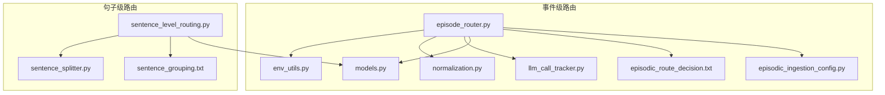
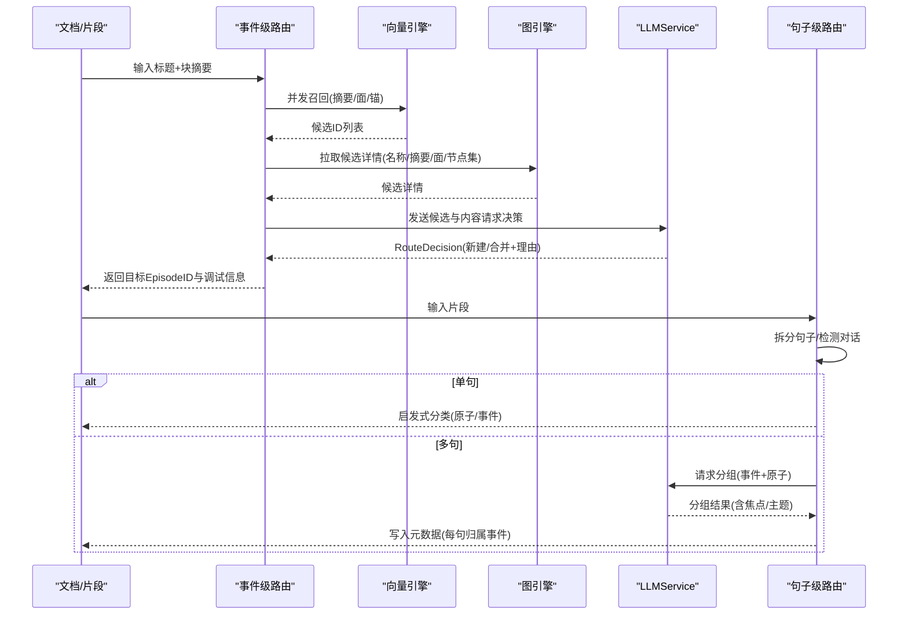
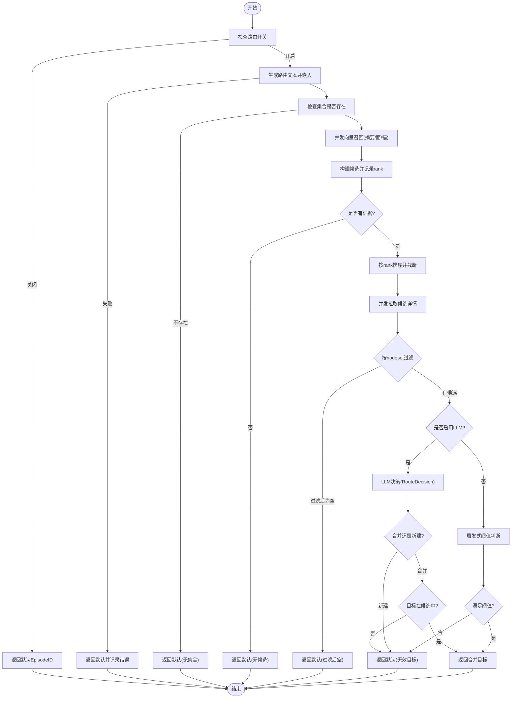
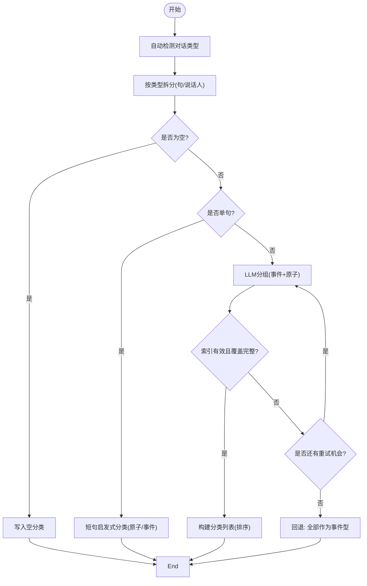
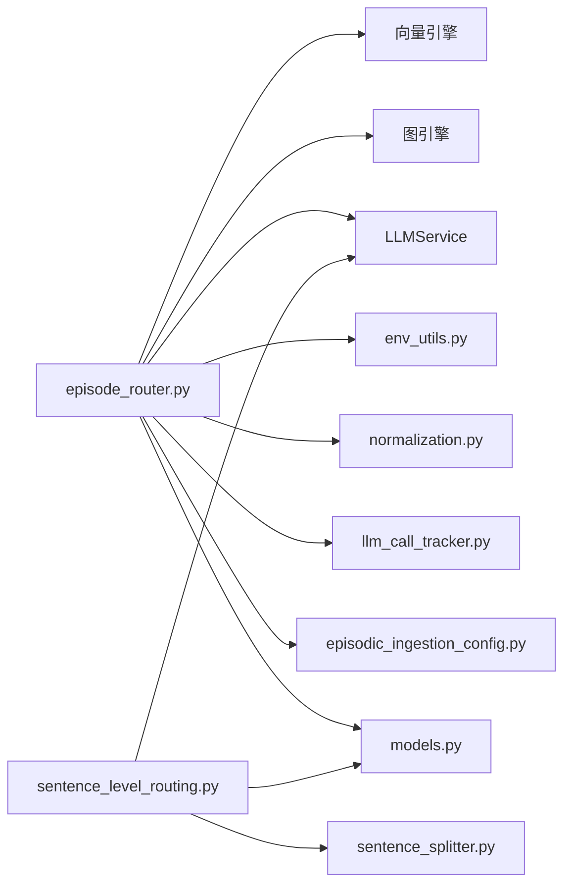
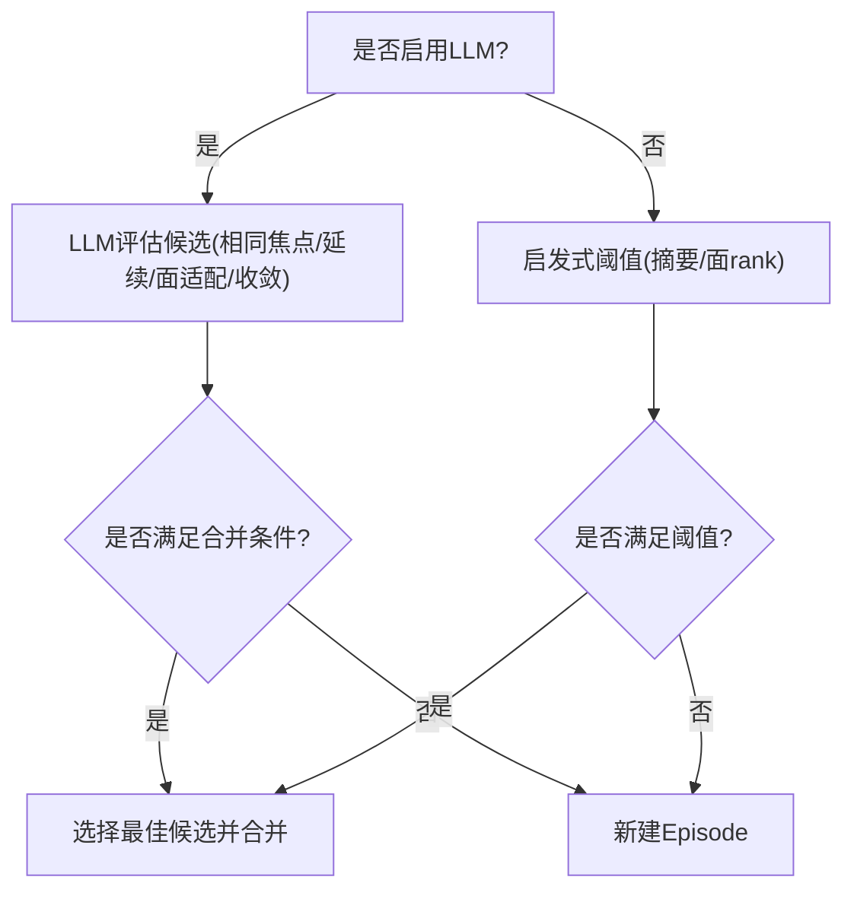

# 事件路由决策

<cite>
**本文引用的文件**
- [episode_router.py](file://m_flow/memory/episodic/episode_router.py)
- [sentence_level_routing.py](file://m_flow/memory/episodic/sentence_level_routing.py)
- [models.py](file://m_flow/memory/episodic/models.py)
- [env_utils.py](file://m_flow/memory/episodic/env_utils.py)
- [normalization.py](file://m_flow/memory/episodic/normalization.py)
- [llm_call_tracker.py](file://m_flow/memory/episodic/llm_call_tracker.py)
- [episodic_ingestion_config.py](file://m_flow/memory/episodic/episodic_ingestion_config.py)
- [sentence_splitter.py](file://m_flow/memory/episodic/sentence_splitter.py)
- [episodic_route_decision.txt](file://m_flow/llm/prompts/episodic_route_decision.txt)
- [sentence_grouping.txt](file://m_flow/llm/prompts/sentence_grouping.txt)
</cite>

## 目录
1. [简介](#简介)
2. [项目结构](#项目结构)
3. [核心组件](#核心组件)
4. [架构总览](#架构总览)
5. [详细组件分析](#详细组件分析)
6. [依赖关系分析](#依赖关系分析)
7. [性能考量](#性能考量)
8. [故障排查指南](#故障排查指南)
9. [结论](#结论)
10. [附录](#附录)

## 简介
本文档聚焦于事件路由决策的技术实现，涵盖两层关键路由：
- 事件级路由（Episode Router）：在“现有 Episode”与“新建 Episode”之间进行决策，基于向量召回与可选的 LLM 决策，确保 Episode 的边界性与可检索性。
- 句子级路由（Sentence-Level Routing）：对单个内容片段内的句子进行细粒度分组，支持“事件型”和“原子型”两类路由，使一个片段内可同时包含多个事件与原子句。

文档将深入解释路由决策算法、新事件创建与现有事件合并的判断条件与评分机制、性能优化策略与缓存机制，并提供配置选项与调优参数、流程图与决策树示例。

## 项目结构
围绕事件路由决策的关键模块组织如下：
- episode_router.py：事件级路由主流程，负责候选召回、细节拉取、LLM 决策与回退策略。
- sentence_level_routing.py：句子级路由主流程，负责句子拆分、LLM 分类、重试与回退。
- models.py：路由相关的数据模型（RouteDecision、SentenceRoutingResult 等）。
- env_utils.py：统一环境变量读取工具，用于路由开关与阈值控制。
- normalization.py：文本规范化与截断工具，保障输入长度与质量。
- llm_call_tracker.py：LLM 调用追踪器，记录重试次数与错误原因，便于性能分析。
- episodic_ingestion_config.py：路由与写入配置的集中管理，支持环境变量覆盖。
- sentence_splitter.py：句子拆分器，支撑对话与多语言场景。
- prompts/*.txt：LLM 提示词模板，驱动路由决策。

**图表来源**
- [episode_router.py:1-594](file://m_flow/memory/episodic/episode_router.py#L1-L594)
- [sentence_level_routing.py:1-526](file://m_flow/memory/episodic/sentence_level_routing.py#L1-L526)
- [models.py:1-548](file://m_flow/memory/episodic/models.py#L1-L548)
- [env_utils.py:1-111](file://m_flow/memory/episodic/env_utils.py#L1-L111)
- [normalization.py:1-290](file://m_flow/memory/episodic/normalization.py#L1-L290)
- [llm_call_tracker.py:1-428](file://m_flow/memory/episodic/llm_call_tracker.py#L1-L428)
- [episodic_ingestion_config.py:1-274](file://m_flow/memory/episodic/episodic_ingestion_config.py#L1-L274)
- [sentence_splitter.py:1-490](file://m_flow/memory/episodic/sentence_splitter.py#L1-L490)
- [episodic_route_decision.txt:1-99](file://m_flow/llm/prompts/episodic_route_decision.txt#L1-L99)
- [sentence_grouping.txt:1-105](file://m_flow/llm/prompts/sentence_grouping.txt#L1-L105)

**章节来源**
- [episode_router.py:1-594](file://m_flow/memory/episodic/episode_router.py#L1-L594)
- [sentence_level_routing.py:1-526](file://m_flow/memory/episodic/sentence_level_routing.py#L1-L526)

## 核心组件
- 事件级路由（Episode Router）
  - 基于向量数据库的三路召回：Episode_summary、Facet_search_text、Facet_anchor_text。
  - 并发拉取候选详情，按 rank 组合信号强度排序，限制发送给 LLM 的候选数量。
  - LLM 决策模型 RouteDecision，支持“新建”或“合并到现有”两种动作。
  - 回退策略：禁用路由、嵌入失败、无集合存在、LLM 失败时默认新建。
- 句子级路由（Sentence-Level Routing）
  - 支持 TEXT 与 DIALOG 两种内容类型，自动检测对话并按说话人切分。
  - 单句短句采用启发式规则快速分类为“原子型/事件型”，长句通过 LLM 进行分组。
  - 具备重试与回退：验证索引完整性与覆盖度，失败则回退为“全部事件型”。

**章节来源**
- [episode_router.py:319-594](file://m_flow/memory/episodic/episode_router.py#L319-L594)
- [sentence_level_routing.py:85-526](file://m_flow/memory/episodic/sentence_level_routing.py#L85-L526)
- [models.py:289-548](file://m_flow/memory/episodic/models.py#L289-L548)

## 架构总览
事件路由决策贯穿“召回—评估—决策—回退”的闭环，结合向量与 LLM 的优势，兼顾稳定性与扩展性。

**图表来源**
- [episode_router.py:410-594](file://m_flow/memory/episodic/episode_router.py#L410-L594)
- [sentence_level_routing.py:143-297](file://m_flow/memory/episodic/sentence_level_routing.py#L143-L297)
- [models.py:289-548](file://m_flow/memory/episodic/models.py#L289-L548)

## 详细组件分析

### 事件级路由（episode_router）
- 候选生成与排序
  - 三路向量召回：摘要、面检索文本、面锚文本，分别得到候选集。
  - 将候选映射到 Episode，并记录各路的 rank（越小越优），使用“无证据”哨兵值表示未命中。
  - 仅保留至少有一路命中的候选，按最小 rank 排序，截断至最大候选数。
- 详情拉取与过滤
  - 对前 K 名候选并发拉取名称、摘要、面列表与总数。
  - 支持按 nodeset/dataset 隔离过滤，若过滤后为空则回退新建。
- LLM 决策与回退
  - 若启用 LLM：构造简明候选视图（名称、面数、面标题），调用结构化提取，返回 RouteDecision。
  - 若禁用 LLM：使用启发式阈值（摘要/面 rank）判定是否合并，否则新建。
  - LLM 失败回退：新建并记录原因。
- 关键常量与阈值
  - 无证据哨兵值、启发式阈值、候选上限等均通过环境变量或默认值控制。

**图表来源**
- [episode_router.py:319-594](file://m_flow/memory/episodic/episode_router.py#L319-L594)

**章节来源**
- [episode_router.py:52-120](file://m_flow/memory/episodic/episode_router.py#L52-L120)
- [episode_router.py:122-176](file://m_flow/memory/episodic/episode_router.py#L122-L176)
- [episode_router.py:178-221](file://m_flow/memory/episodic/episode_router.py#L178-L221)
- [episode_router.py:223-317](file://m_flow/memory/episodic/episode_router.py#L223-L317)
- [episode_router.py:319-594](file://m_flow/memory/episodic/episode_router.py#L319-L594)
- [models.py:269-321](file://m_flow/memory/episodic/models.py#L269-L321)
- [episodic_route_decision.txt:1-99](file://m_flow/llm/prompts/episodic_route_decision.txt#L1-L99)

### 句子级路由（sentence_level_routing）
- 拆分与类型判定
  - 自动检测对话：基于正则匹配说话人格式，排除常见非对话前缀。
  - 文本模式：根据中英文比例选择不同分句策略。
- 单句处理
  - 判断长短与语言特征，短句直接分类为“原子型/事件型”，并生成唯一事件ID。
- 多句处理
  - LLM 分组：输出事件列表与原子索引，要求索引不重复且全覆盖。
  - 重试与校验：若索引越界或覆盖不全，则最多重试一次并回退为“全部事件型”。
- 输出
  - 在片段元数据中写入每句的分类信息，下游任务据此进行事件聚合。

**图表来源**
- [sentence_level_routing.py:85-297](file://m_flow/memory/episodic/sentence_level_routing.py#L85-L297)
- [sentence_splitter.py:214-264](file://m_flow/memory/episodic/sentence_splitter.py#L214-L264)

**章节来源**
- [sentence_level_routing.py:56-125](file://m_flow/memory/episodic/sentence_level_routing.py#L56-L125)
- [sentence_level_routing.py:143-297](file://m_flow/memory/episodic/sentence_level_routing.py#L143-L297)
- [sentence_splitter.py:156-212](file://m_flow/memory/episodic/sentence_splitter.py#L156-L212)
- [sentence_grouping.txt:1-105](file://m_flow/llm/prompts/sentence_grouping.txt#L1-L105)

### 数据模型与提示词
- RouteDecision：LLM 决策输出，包含“新建/合并”、“目标EpisodeID”、“理由”等字段。
- SentenceRoutingResult：句子级分组输出，包含事件列表与原子索引，具备索引有效性与覆盖性校验。
- 提示词模板：episodic_route_decision.txt 与 sentence_grouping.txt，分别驱动事件级与句子级路由的结构化输出。

**章节来源**
- [models.py:289-321](file://m_flow/memory/episodic/models.py#L289-L321)
- [models.py:480-548](file://m_flow/memory/episodic/models.py#L480-L548)
- [episodic_route_decision.txt:1-99](file://m_flow/llm/prompts/episodic_route_decision.txt#L1-L99)
- [sentence_grouping.txt:1-105](file://m_flow/llm/prompts/sentence_grouping.txt#L1-L105)

## 依赖关系分析
- episode_router 依赖
  - 向量引擎：执行三路召回。
  - 图引擎：拉取候选 Episode 的名称、摘要、面与节点集。
  - LLMService：结构化抽取 RouteDecision。
  - 环境变量与配置：路由开关、候选上限、是否启用 LLM 等。
  - 日志与追踪：记录 LLM 调用统计与错误。
- sentence_level_routing 依赖
  - LLMService：结构化抽取 SentenceRoutingResult。
  - sentence_splitter：智能分句与对话切分。
  - 模型：SentenceClassification、EventClassification 等。

**图表来源**
- [episode_router.py:1-50](file://m_flow/memory/episodic/episode_router.py#L1-L50)
- [sentence_level_routing.py:1-40](file://m_flow/memory/episodic/sentence_level_routing.py#L1-L40)
- [models.py:1-50](file://m_flow/memory/episodic/models.py#L1-L50)

**章节来源**
- [episode_router.py:1-50](file://m_flow/memory/episodic/episode_router.py#L1-L50)
- [sentence_level_routing.py:1-40](file://m_flow/memory/episodic/sentence_level_routing.py#L1-L40)

## 性能考量
- 并发优化
  - 事件级路由：三路向量召回并发执行，候选详情并发拉取，显著降低端到端延迟。
  - 句子级路由：单片段内逐句处理，但 LLM 调用受全局并发限制。
- LLM 并发控制
  - 使用全局 LLM 信号量限制并发数，避免资源争用与超卖。
  - LLM 调用追踪器记录每次尝试耗时与错误类型，便于定位瓶颈。
- 输入长度与截断
  - 事件级路由在 LLM 输入侧对摘要与候选视图进行截断，避免超出上下文限制。
  - 句子级路由在提示词中动态注入句子数量与索引，减少冗余。
- 缓存与隔离
  - 向量/图查询失败时返回空或降级，保证系统可用性。
  - 数据集隔离通过 where 过滤与 nodeset 校验实现，注意共享数据库下的隔离局限。

**章节来源**
- [episode_router.py:432-443](file://m_flow/memory/episodic/episode_router.py#L432-L443)
- [episode_router.py:499-501](file://m_flow/memory/episodic/episode_router.py#L499-L501)
- [episode_router.py:294-304](file://m_flow/memory/episodic/episode_router.py#L294-L304)
- [llm_call_tracker.py:140-201](file://m_flow/memory/episodic/llm_call_tracker.py#L140-L201)
- [normalization.py:76-93](file://m_flow/memory/episodic/normalization.py#L76-L93)
- [sentence_level_routing.py:203-245](file://m_flow/memory/episodic/sentence_level_routing.py#L203-L245)

## 故障排查指南
- 事件级路由
  - 现象：返回默认 Episode 或新建。
  - 排查要点：检查路由开关、集合是否存在、嵌入是否成功、候选是否被 nodeset 过滤清空、LLM 是否抛错。
  - 建议：开启 LLM 调用追踪日志，查看重试次数与最终错误类型；必要时放宽候选上限或调整阈值。
- 句子级路由
  - 现象：部分片段报错或全部回退为事件型。
  - 排查要点：确认提示词模板可用、LLM 输出索引合法性与覆盖度；检查重试是否生效。
  - 建议：在低并发下重试一次，若仍失败，检查输入文本的语言与对话格式。
- 通用
  - 检查环境变量与配置项是否正确覆盖；关注日志中的“无证据”“过滤后空”“LLM 失败”等关键提示。

**章节来源**
- [episode_router.py:544-594](file://m_flow/memory/episodic/episode_router.py#L544-L594)
- [sentence_level_routing.py:131-140](file://m_flow/memory/episodic/sentence_level_routing.py#L131-L140)
- [sentence_level_routing.py:212-245](file://m_flow/memory/episodic/sentence_level_routing.py#L212-L245)
- [llm_call_tracker.py:184-201](file://m_flow/memory/episodic/llm_call_tracker.py#L184-L201)

## 结论
事件路由决策通过“向量召回 + LLM 决策 + 回退策略”的组合，在保证 Episode 边界性与可检索性的同时，兼顾吞吐与稳定性。句子级路由进一步细化到句粒度，提升内容组织的精细度。通过并发优化、输入截断、LLM 并发控制与调用追踪，系统在复杂场景下仍能保持高效与可靠。

## 附录

### 配置选项与调优参数
- 事件级路由（episode_router）
  - 开关与阈值
    - MFLOW_EPISODIC_ENABLE_ROUTING：是否启用路由（默认启用）
    - MFLOW_EPISODIC_ROUTING_USE_LLM：是否启用 LLM 决策（默认启用）
    - MFLOW_EPISODIC_ROUTING_SUMMARY_K：摘要召回 top-K（默认 25）
    - MFLOW_EPISODIC_ROUTING_FACET_K：面/锚召回 top-K（默认 35）
    - MFLOW_EPISODIC_ROUTING_MAX_CANDIDATES：发送给 LLM 的候选上限（默认 5）
  - 其他
    - 默认 Episode ID：当路由失败或禁用时的回退目标。
    - 数据集隔离：通过 nodeset 与 dataset_id 过滤候选。
- 句子级路由（sentence_level_routing）
  - 开关
    - MFLOW_CONTENT_ROUTING：是否启用句子级路由（默认启用）
    - MFLOW_AUTO_DETECT_DIALOG：是否自动检测对话（默认启用）
  - 其他
    - 单句短句阈值：根据语言与字符长度决定原子/事件分类。
- 全局与写入配置（episodic_ingestion_config）
  - 功能开关：启用语义合并、启用路由、启用面点、启用 LLM 实体等。
  - 阈值与容量：语义合并阈值、LLM 并发限制、每批最大面数、提示词容量等。
  - 文件/模板：面点提示词文件名等。

**章节来源**
- [episode_router.py:11-17](file://m_flow/memory/episodic/episode_router.py#L11-L17)
- [episode_router.py:395-400](file://m_flow/memory/episodic/episode_router.py#L395-L400)
- [sentence_level_routing.py:14-18](file://m_flow/memory/episodic/sentence_level_routing.py#L14-L18)
- [episodic_ingestion_config.py:131-164](file://m_flow/memory/episodic/episodic_ingestion_config.py#L131-L164)

### 决策树示例（事件级路由）
以下为“是否合并到现有 Episode”的简化决策树，对应 LLM 决策与启发式阈值：

**图表来源**
- [episode_router.py:544-594](file://m_flow/memory/episodic/episode_router.py#L544-L594)
- [episodic_route_decision.txt:26-82](file://m_flow/llm/prompts/episodic_route_decision.txt#L26-L82)