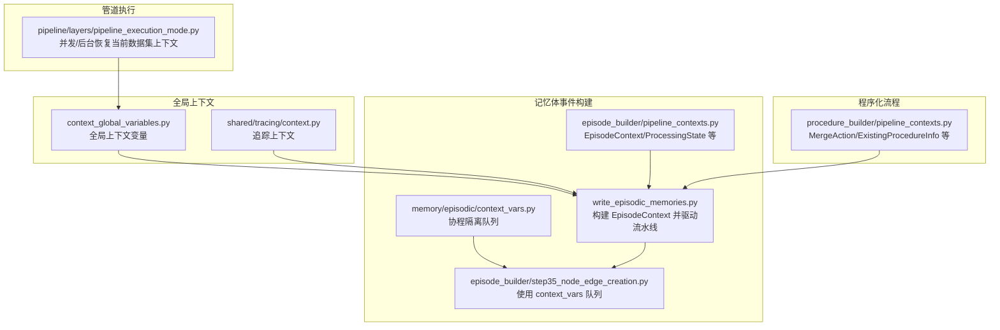
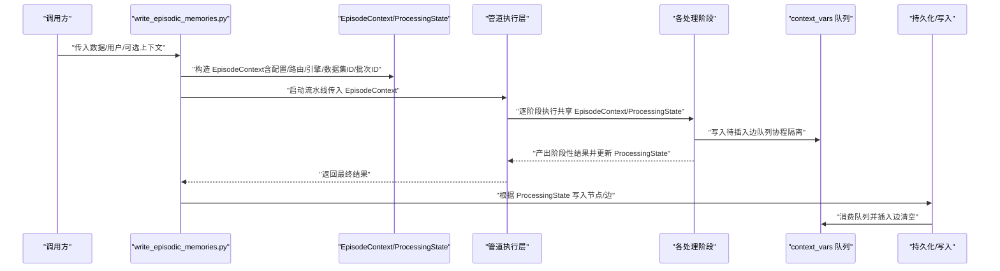
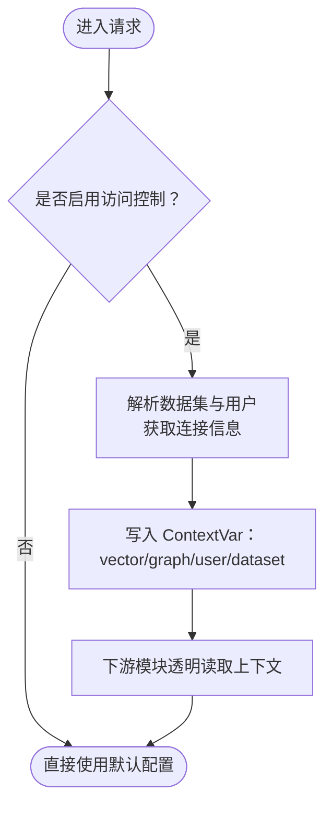
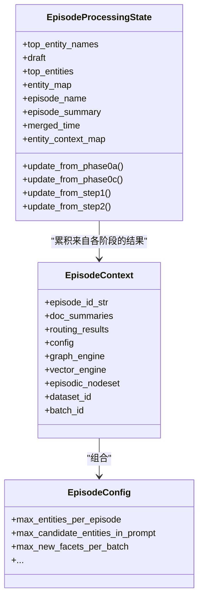
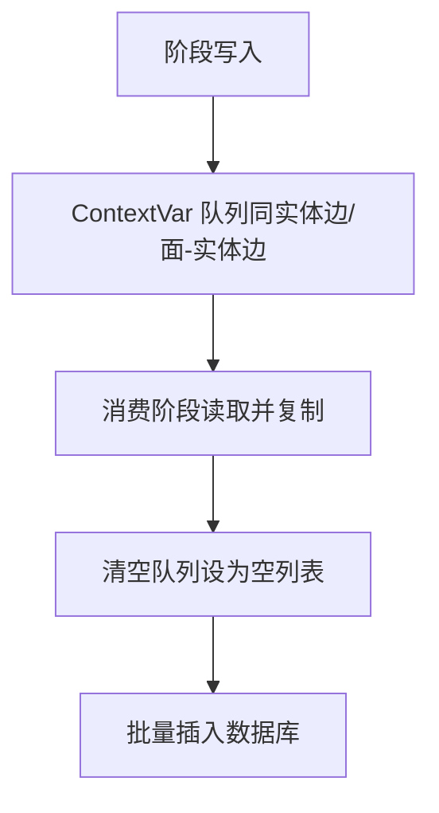
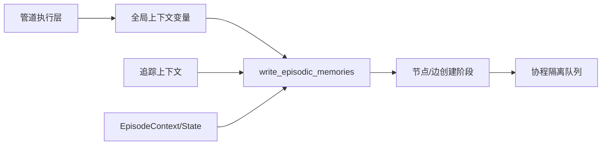

# 管道上下文管理

<cite>
**本文引用的文件**
- [context_global_variables.py](file://m_flow/context_global_variables.py)
- [context_vars.py](file://m_flow/memory/episodic/context_vars.py)
- [pipeline_contexts.py（记忆体事件构建）](file://m_flow/memory/episodic/episode_builder/pipeline_contexts.py)
- [pipeline_contexts.py（程序化流程增量更新）](file://m_flow/memory/procedural/procedure_builder/pipeline_contexts.py)
- [write_episodic_memories.py](file://m_flow/memory/episodic/write_episodic_memories.py)
- [step35_node_edge_creation.py](file://m_flow/memory/episodic/episode_builder/step35_node_edge_creation.py)
- [pipeline_execution_mode.py](file://m_flow/pipeline/layers/pipeline_execution_mode.py)
- [run_tasks_with_context_test.py](file://m_flow/tests/unit/modules/pipelines/run_tasks_with_context_test.py)
- [test_context_isolation.py](file://m_flow/tests/unit/tasks/episodic/test_context_isolation.py)
- [__init__.py（共享上下文包）](file://m_flow/shared/context/__init__.py)
- [context.py（追踪上下文）](file://m_flow/shared/tracing/context.py)
</cite>

## 目录
1. [简介](#简介)
2. [项目结构](#项目结构)
3. [核心组件](#核心组件)
4. [架构总览](#架构总览)
5. [详细组件分析](#详细组件分析)
6. [依赖关系分析](#依赖关系分析)
7. [性能考量](#性能考量)
8. [故障排查指南](#故障排查指南)
9. [结论](#结论)
10. [附录：最佳实践与常见问题](#附录最佳实践与常见问题)

## 简介
本文件系统性阐述 M-flow 在“事件构建”等处理流程中对“上下文”的管理机制，重点覆盖以下方面：
- pipeline_contexts 中的上下文数据模型与生命周期
- context_vars 中的全局变量（协程隔离）管理
- 上下文在不同处理阶段之间的传递与状态保持
- 作用域与作用域切换、内存管理策略
- 配置与使用最佳实践、常见问题与排障建议

## 项目结构
围绕上下文管理的关键模块分布如下：
- 全局上下文变量：用于多租户数据库隔离与会话用户等请求级状态
- 记忆体事件构建上下文：以数据类承载跨阶段输入输出
- 程序化流程上下文：定义增量更新决策与现有流程信息
- 协程隔离的上下文变量：用于同一进程内并发安全的队列与状态
- 管道执行层：在并发/后台模式下恢复正确的上下文
- 测试用例：验证上下文在管道任务链中的透传与协程隔离

**图表来源**
- [context_global_variables.py:1-184](file://m_flow/context_global_variables.py#L1-L184)
- [context.py（追踪上下文）:1-33](file://m_flow/shared/tracing/context.py#L1-L33)
- [pipeline_contexts.py（记忆体事件构建）:1-341](file://m_flow/memory/episodic/episode_builder/pipeline_contexts.py#L1-L341)
- [write_episodic_memories.py:518-570](file://m_flow/memory/episodic/write_episodic_memories.py#L518-L570)
- [step35_node_edge_creation.py:60-80](file://m_flow/memory/episodic/episode_builder/step35_node_edge_creation.py#L60-L80)
- [context_vars.py:1-124](file://m_flow/memory/episodic/context_vars.py#L1-L124)
- [pipeline_execution_mode.py:96-133](file://m_flow/pipeline/layers/pipeline_execution_mode.py#L96-L133)

**章节来源**
- [context_global_variables.py:1-184](file://m_flow/context_global_variables.py#L1-L184)
- [context_vars.py:1-124](file://m_flow/memory/episodic/context_vars.py#L1-L124)
- [pipeline_contexts.py（记忆体事件构建）:1-341](file://m_flow/memory/episodic/episode_builder/pipeline_contexts.py#L1-L341)
- [pipeline_contexts.py（程序化流程增量更新）:1-82](file://m_flow/memory/procedural/procedure_builder/pipeline_contexts.py#L1-L82)
- [write_episodic_memories.py:518-570](file://m_flow/memory/episodic/write_episodic_memories.py#L518-L570)
- [step35_node_edge_creation.py:60-80](file://m_flow/memory/episodic/episode_builder/step35_node_edge_creation.py#L60-L80)
- [pipeline_execution_mode.py:96-133](file://m_flow/pipeline/layers/pipeline_execution_mode.py#L96-L133)
- [__init__.py（共享上下文包）:1-29](file://m_flow/shared/context/__init__.py#L1-L29)
- [context.py（追踪上下文）:1-33](file://m_flow/shared/tracing/context.py#L1-L33)

## 核心组件
- 全局上下文变量（多租户隔离）
  - 通过 Python 的 ContextVar 提供请求级隔离的向量/图数据库配置、当前用户、当前数据集 ID 等
  - 在并发/后台运行时，通过映射恢复每个生成器的正确上下文
- 记忆体事件构建上下文（数据类）
  - EpisodeContext：单次事件构建的完整输入（如文档摘要、路由结果、配置、引擎、节点集合、数据集 ID、批次 ID 等）
  - EpisodeProcessingState：跨阶段累积结果，便于后续阶段访问
  - EpisodeConfig：统一配置参数，减少参数传递复杂度
- 程序化流程上下文（数据类）
  - MergeAction：增量合并动作枚举
  - ExistingProcedureInfo：召回流程信息，支持决策编译
- 协程隔离上下文变量（队列）
  - 同一进程内并发安全的“待插入边”队列，避免全局状态串扰
- 管道执行层
  - 在并发/后台模式下，为每个生成器恢复正确的数据集上下文，确保不同数据集的处理互不干扰

**章节来源**
- [context_global_variables.py:25-36](file://m_flow/context_global_variables.py#L25-L36)
- [context_global_variables.py:128-184](file://m_flow/context_global_variables.py#L128-L184)
- [pipeline_contexts.py（记忆体事件构建）:47-146](file://m_flow/memory/episodic/episode_builder/pipeline_contexts.py#L47-L146)
- [pipeline_contexts.py（记忆体事件构建）:247-326](file://m_flow/memory/episodic/episode_builder/pipeline_contexts.py#L247-L326)
- [pipeline_contexts.py（程序化流程增量更新）:21-81](file://m_flow/memory/procedural/procedure_builder/pipeline_contexts.py#L21-L81)
- [context_vars.py:22-62](file://m_flow/memory/episodic/context_vars.py#L22-L62)
- [pipeline_execution_mode.py:96-133](file://m_flow/pipeline/layers/pipeline_execution_mode.py#L96-L133)

## 架构总览
下图展示从“事件构建入口”到“节点与边创建”的上下文流转路径，以及协程隔离队列的使用。

**图表来源**
- [write_episodic_memories.py:518-570](file://m_flow/memory/episodic/write_episodic_memories.py#L518-L570)
- [pipeline_contexts.py（记忆体事件构建）:96-146](file://m_flow/memory/episodic/episode_builder/pipeline_contexts.py#L96-L146)
- [step35_node_edge_creation.py:60-80](file://m_flow/memory/episodic/episode_builder/step35_node_edge_creation.py#L60-L80)
- [context_vars.py:27-62](file://m_flow/memory/episodic/context_vars.py#L27-L62)

## 详细组件分析

### 组件A：全局上下文变量（多租户隔离）
- 设计要点
  - 使用 ContextVar 存储向量/图数据库配置、当前用户、当前数据集 ID
  - 在启用后端访问控制时，按数据集与用户解析独立连接信息
  - 提供 set_db_context 异步函数设置上下文，供下游透明使用
- 生命周期
  - 请求开始时设置；请求结束时自动随协程上下文失效
  - 并发/后台模式下，通过映射恢复每个生成器的上下文
- 作用域与切换
  - 作用域为当前协程及其子任务；不同协程互不影响
  - 切换通过 set_db_context 或执行层恢复逻辑完成
- 内存管理
  - ContextVar 默认值为空；仅在需要时写入对象引用
  - 退出协程即释放，避免泄漏

**图表来源**
- [context_global_variables.py:115-184](file://m_flow/context_global_variables.py#L115-L184)
- [pipeline_execution_mode.py:116-133](file://m_flow/pipeline/layers/pipeline_execution_mode.py#L116-L133)

**章节来源**
- [context_global_variables.py:25-36](file://m_flow/context_global_variables.py#L25-L36)
- [context_global_variables.py:128-184](file://m_flow/context_global_variables.py#L128-L184)
- [pipeline_execution_mode.py:96-133](file://m_flow/pipeline/layers/pipeline_execution_mode.py#L96-L133)

### 组件B：记忆体事件构建上下文（数据类）
- EpisodeContext
  - 聚合一次事件构建所需的所有输入：标识、摘要、路由、配置、引擎、节点集合、数据集 ID、批次 ID 等
- EpisodeProcessingState
  - 跨阶段累积结果，便于后续阶段访问；提供更新方法，保证一致性
- EpisodeConfig
  - 将 20+ 配置项封装为单一对象，降低参数传递复杂度
- 生命周期
  - 在单次事件构建开始时创建，贯穿所有阶段，最后被持久化使用
- 作用域与切换
  - 作为显式参数在阶段间传递；无隐式作用域切换
- 内存管理
  - 数据类字段为对象引用共享；注意避免无意修改共享对象导致副作用

**图表来源**
- [pipeline_contexts.py（记忆体事件构建）:47-146](file://m_flow/memory/episodic/episode_builder/pipeline_contexts.py#L47-L146)
- [pipeline_contexts.py（记忆体事件构建）:247-326](file://m_flow/memory/episodic/episode_builder/pipeline_contexts.py#L247-L326)

**章节来源**
- [pipeline_contexts.py（记忆体事件构建）:47-146](file://m_flow/memory/episodic/episode_builder/pipeline_contexts.py#L47-L146)
- [pipeline_contexts.py（记忆体事件构建）:247-326](file://m_flow/memory/episodic/episode_builder/pipeline_contexts.py#L247-L326)

### 组件C：程序化流程上下文（数据类）
- MergeAction：定义增量合并动作（新建/补丁/新版本/跳过）
- ExistingProcedureInfo：召回流程信息，支撑决策与编译
- 作用域与生命周期
  - 与程序化流程阶段绑定，随候选流程的处理周期存在

**章节来源**
- [pipeline_contexts.py（程序化流程增量更新）:21-81](file://m_flow/memory/procedural/procedure_builder/pipeline_contexts.py#L21-L81)

### 组件D：协程隔离上下文变量（队列）
- 功能
  - 提供同名的“待插入边”队列（同实体边、面-实体边），支持并发安全
  - 支持获取与清空，避免全局状态互相污染
- 作用域与隔离
  - 每个协程拥有独立 ContextVar 值；并发协程互不影响
- 使用场景
  - 在事件构建的节点/边创建阶段，先写入队列，再由专门任务消费并清空

**图表来源**
- [context_vars.py:27-62](file://m_flow/memory/episodic/context_vars.py#L27-L62)
- [step35_node_edge_creation.py:60-80](file://m_flow/memory/episodic/episode_builder/step35_node_edge_creation.py#L60-L80)

**章节来源**
- [context_vars.py:22-62](file://m_flow/memory/episodic/context_vars.py#L22-L62)
- [step35_node_edge_creation.py:60-80](file://m_flow/memory/episodic/episode_builder/step35_node_edge_creation.py#L60-L80)

### 组件E：管道执行层（并发/后台上下文恢复）
- 场景
  - 多数据集并发运行或后台继续处理时，需要为每个生成器恢复正确的数据集上下文
- 实现
  - 维护生成器到数据集 ID 的映射，在每次恢复生成器前设置 ContextVar
- 效果
  - 避免“后台模式下全部使用最后一个数据集上下文”的问题

**章节来源**
- [pipeline_execution_mode.py:96-133](file://m_flow/pipeline/layers/pipeline_execution_mode.py#L96-L133)

### 组件F：上下文在管道任务中的透传与测试验证
- 任务链透传
  - 通过 execute_pipeline_tasks 将 context 参数透传给每个阶段
- 测试验证
  - 数值型管道任务链验证上下文在链路中正确参与计算
  - 协程隔离测试验证不同协程的队列互不干扰

**章节来源**
- [run_tasks_with_context_test.py:1-75](file://m_flow/tests/unit/modules/pipelines/run_tasks_with_context_test.py#L1-L75)
- [test_context_isolation.py:1-147](file://m_flow/tests/unit/tasks/episodic/test_context_isolation.py#L1-L147)

## 依赖关系分析
- 写入记忆体主流程依赖 EpisodeContext/ProcessingState 完整输入与累积结果
- 节点/边创建阶段依赖协程隔离队列进行延迟插入
- 执行层在并发/后台模式下依赖全局上下文变量恢复数据集上下文
- 追踪上下文与全局上下文共同构成请求级可见性

**图表来源**
- [context_global_variables.py:128-184](file://m_flow/context_global_variables.py#L128-L184)
- [context.py（追踪上下文）:20-27](file://m_flow/shared/tracing/context.py#L20-L27)
- [pipeline_contexts.py（记忆体事件构建）:96-146](file://m_flow/memory/episodic/episode_builder/pipeline_contexts.py#L96-L146)
- [write_episodic_memories.py:518-570](file://m_flow/memory/episodic/write_episodic_memories.py#L518-L570)
- [step35_node_edge_creation.py:60-80](file://m_flow/memory/episodic/episode_builder/step35_node_edge_creation.py#L60-L80)
- [pipeline_execution_mode.py:116-133](file://m_flow/pipeline/layers/pipeline_execution_mode.py#L116-L133)

**章节来源**
- [write_episodic_memories.py:518-570](file://m_flow/memory/episodic/write_episodic_memories.py#L518-L570)
- [step35_node_edge_creation.py:60-80](file://m_flow/memory/episodic/episode_builder/step35_node_edge_creation.py#L60-L80)
- [pipeline_execution_mode.py:96-133](file://m_flow/pipeline/layers/pipeline_execution_mode.py#L96-L133)

## 性能考量
- 减少上下文拷贝
  - EpisodeContext/ProcessingState 采用数据类，字段为对象引用；避免深层复制
- 队列延迟插入
  - 使用协程隔离队列减少频繁 IO；集中消费、批量写入
- 并发/后台恢复
  - 通过映射快速恢复 ContextVar，避免重复解析与查找
- 配置封装
  - EpisodeConfig 将大量参数封装，降低参数传递成本与错误概率

[本节为通用指导，无需列出具体文件来源]

## 故障排查指南
- 现象：并发执行时不同数据集使用了错误的上下文
  - 排查：确认执行层是否为每个生成器设置了正确的数据集 ID
  - 参考：并发/后台恢复逻辑
- 现象：同一进程内并发写入“待插入边”出现数据串扰
  - 排查：确认是否使用协程隔离队列接口（添加/获取并清空）
  - 参考：协程隔离队列实现与测试
- 现象：上下文未生效或为空
  - 排查：检查是否在请求入口设置了全局上下文变量；确认访问控制开关
  - 参考：全局上下文变量设置与启用条件
- 现象：阶段间状态缺失或不一致
  - 排查：确认各阶段是否正确更新 EpisodeProcessingState；核对更新方法调用顺序

**章节来源**
- [pipeline_execution_mode.py:96-133](file://m_flow/pipeline/layers/pipeline_execution_mode.py#L96-L133)
- [context_vars.py:27-62](file://m_flow/memory/episodic/context_vars.py#L27-L62)
- [test_context_isolation.py:16-94](file://m_flow/tests/unit/tasks/episodic/test_context_isolation.py#L16-L94)
- [context_global_variables.py:115-184](file://m_flow/context_global_variables.py#L115-L184)
- [pipeline_contexts.py（记忆体事件构建）:298-326](file://m_flow/memory/episodic/episode_builder/pipeline_contexts.py#L298-L326)

## 结论
M-flow 的上下文管理通过“数据类上下文 + 协程隔离变量 + 全局上下文变量 + 执行层恢复”的组合，实现了：
- 显式且清晰的跨阶段数据传递
- 并发安全的状态隔离
- 请求级的多租户数据库隔离
- 良好的可维护性与扩展性

[本节为总结，无需列出具体文件来源]

## 附录：最佳实践与常见问题
- 最佳实践
  - 使用 EpisodeContext/ProcessingState 明确界定阶段边界与数据依赖
  - 将配置收敛到 EpisodeConfig，减少参数爆炸
  - 对需要并发安全的共享状态使用协程隔离队列
  - 在并发/后台模式下，确保执行层恢复正确的数据集上下文
  - 通过测试验证上下文透传与协程隔离行为
- 常见问题
  - 忘记在并发/后台恢复 ContextVar 导致数据集错乱
  - 直接操作全局队列而非通过协程隔离接口，造成竞态
  - 在阶段间遗漏更新 ProcessingState，导致后续阶段读取不到预期状态
  - 访问控制未启用但期望隔离，需检查环境变量与适配器注册

**章节来源**
- [run_tasks_with_context_test.py:1-75](file://m_flow/tests/unit/modules/pipelines/run_tasks_with_context_test.py#L1-L75)
- [test_context_isolation.py:1-147](file://m_flow/tests/unit/tasks/episodic/test_context_isolation.py#L1-L147)
- [pipeline_execution_mode.py:96-133](file://m_flow/pipeline/layers/pipeline_execution_mode.py#L96-L133)
- [context_vars.py:27-62](file://m_flow/memory/episodic/context_vars.py#L27-L62)
- [pipeline_contexts.py（记忆体事件构建）:298-326](file://m_flow/memory/episodic/episode_builder/pipeline_contexts.py#L298-L326)