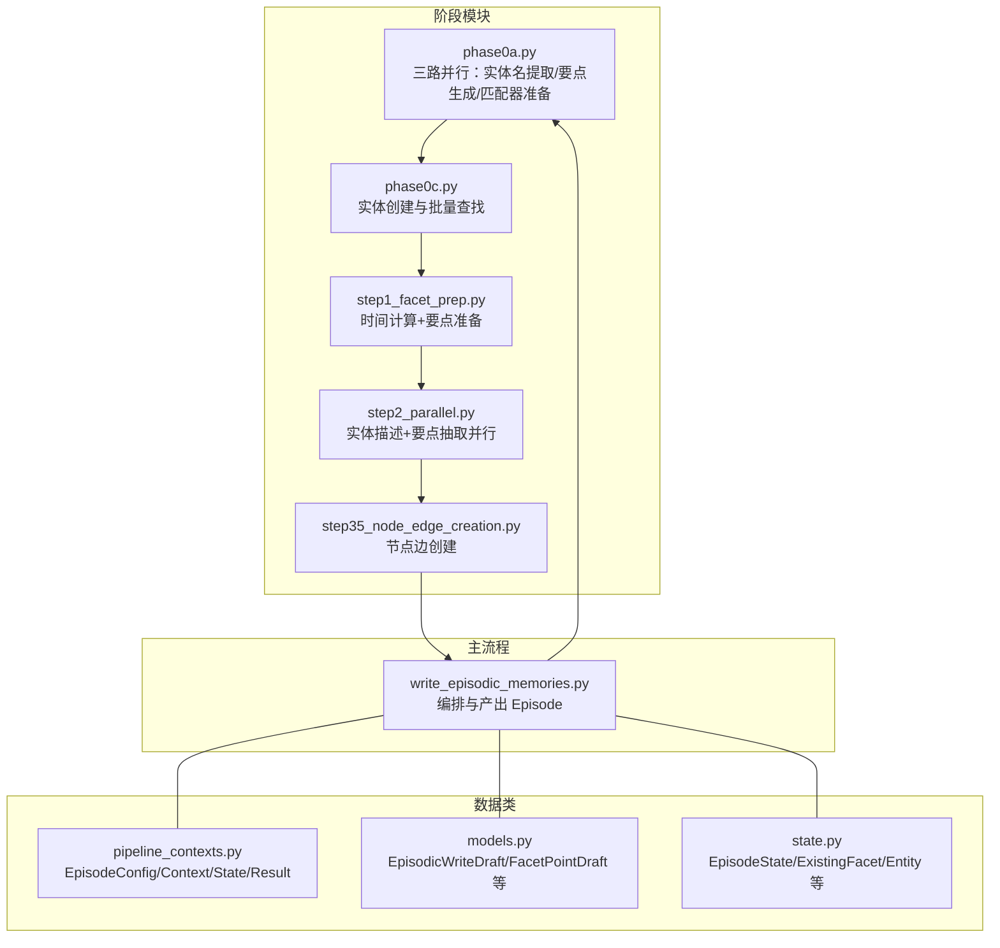
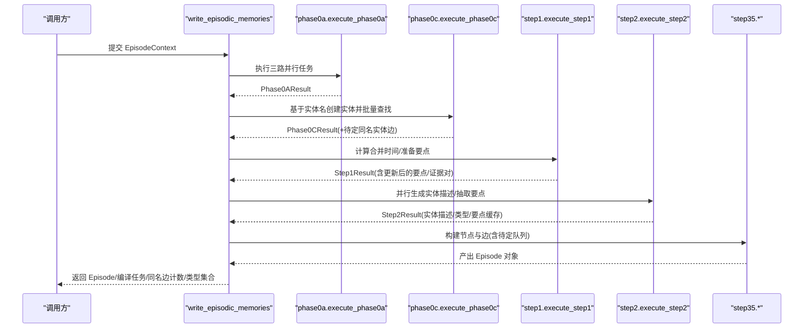

# 阶段处理流程

<cite>
**本文引用的文件**
- [phase0a.py](file://m_flow/memory/episodic/episode_builder/phase0a.py)
- [phase0c.py](file://m_flow/memory/episodic/episode_builder/phase0c.py)
- [step1_facet_prep.py](file://m_flow/memory/episodic/episode_builder/step1_facet_prep.py)
- [step2_parallel.py](file://m_flow/memory/episodic/episode_builder/step2_parallel.py)
- [step35_node_edge_creation.py](file://m_flow/memory/episodic/episode_builder/step35_node_edge_creation.py)
- [pipeline_contexts.py](file://m_flow/memory/episodic/episode_builder/pipeline_contexts.py)
- [models.py](file://m_flow/memory/episodic/models.py)
- [write_episodic_memories.py](file://m_flow/memory/episodic/write_episodic_memories.py)
- [state.py](file://m_flow/memory/episodic/state.py)
</cite>

## 目录
1. [简介](#简介)
2. [项目结构](#项目结构)
3. [核心组件](#核心组件)
4. [架构总览](#架构总览)
5. [详细组件分析](#详细组件分析)
6. [依赖分析](#依赖分析)
7. [性能考虑](#性能考虑)
8. [故障排查指南](#故障排查指南)
9. [结论](#结论)

## 简介
本文件系统化阐述“事件构建”的五个核心处理阶段：phase0a 内容预处理、phase0c 内容标准化、step1_facet_prep 要点准备、step2_parallel 并行处理、step35_node_edge_creation 节点边创建。文档覆盖每个阶段的输入输出、处理逻辑、中间状态、阶段间依赖与数据流转，并给出配置参数与性能调优建议，同时提供时序图与数据转换示例路径，帮助读者快速理解与优化该流水线。

## 项目结构
- 阶段化模块位于 episode_builder 子目录，按阶段拆分职责，便于并行与测试。
- 主写入入口在 write_episodic_memories 中，负责编排各阶段并产出 Episode 对象。
- 数据类（配置、上下文、结果）集中在 pipeline_contexts，统一跨阶段传递。

图表来源
- [write_episodic_memories.py:784-1002](file://m_flow/memory/episodic/write_episodic_memories.py#L784-L1002)
- [phase0a.py:458-565](file://m_flow/memory/episodic/episode_builder/phase0a.py#L458-L565)
- [phase0c.py:57-151](file://m_flow/memory/episodic/episode_builder/phase0c.py#L57-L151)
- [step1_facet_prep.py:367-471](file://m_flow/memory/episodic/episode_builder/step1_facet_prep.py#L367-L471)
- [step2_parallel.py:360-459](file://m_flow/memory/episodic/episode_builder/step2_parallel.py#L360-L459)
- [step35_node_edge_creation.py:90-673](file://m_flow/memory/episodic/episode_builder/step35_node_edge_creation.py#L90-L673)
- [pipeline_contexts.py:47-340](file://m_flow/memory/episodic/episode_builder/pipeline_contexts.py#L47-L340)
- [models.py:148-370](file://m_flow/memory/episodic/models.py#L148-L370)
- [state.py:51-187](file://m_flow/memory/episodic/state.py#L51-L187)

章节来源
- [write_episodic_memories.py:784-1002](file://m_flow/memory/episodic/write_episodic_memories.py#L784-L1002)
- [pipeline_contexts.py:47-340](file://m_flow/memory/episodic/episode_builder/pipeline_contexts.py#L47-L340)

## 核心组件
- EpisodeConfig：封装所有可调参数（实体/要点数量限制、语义合并开关与阈值、要点抽取开关与提示词、路由开关等）。
- EpisodeContext：单次处理的完整输入上下文（episode_id、摘要列表、路由结果、配置、数据库引擎、节点集等）。
- EpisodeProcessingState：跨阶段累加器，保存各阶段输出以便后续阶段使用。
- 各阶段 Result 数据类：Phase0AResult、Phase0CResult、Step1Result、Step2Result，明确每阶段的输出字段与用途。

章节来源
- [pipeline_contexts.py:47-340](file://m_flow/memory/episodic/episode_builder/pipeline_contexts.py#L47-L340)

## 架构总览
五个阶段的编排顺序如下：phase0a → phase0c → step1 → step2 → step35。阶段间通过显式参数与 Result 数据类传递数据，避免闭包耦合；step35 使用“待定队列”机制延迟插入边，保证一致性。

图表来源
- [write_episodic_memories.py:784-1002](file://m_flow/memory/episodic/write_episodic_memories.py#L784-L1002)
- [phase0a.py:458-565](file://m_flow/memory/episodic/episode_builder/phase0a.py#L458-L565)
- [phase0c.py:57-151](file://m_flow/memory/episodic/episode_builder/phase0c.py#L57-L151)
- [step1_facet_prep.py:367-471](file://m_flow/memory/episodic/episode_builder/step1_facet_prep.py#L367-L471)
- [step2_parallel.py:360-459](file://m_flow/memory/episodic/episode_builder/step2_parallel.py#L360-L459)
- [step35_node_edge_creation.py:90-673](file://m_flow/memory/episodic/episode_builder/step35_node_edge_creation.py#L90-L673)

## 详细组件分析

### 阶段一：phase0a 内容预处理（三路并行）
- 输入
  - EpisodeContext：包含 episode_id、doc_summaries、chunk_summaries、路由缓存、配置等。
- 处理逻辑
  - 实体名提取：优先从路由缓存聚合，若无则合并文本段落走 LLM 提取，去重并截断上限。
  - 要点生成：基于 summarize_by_event 生成节级要点草稿与合并摘要，支持过程式路由候选收集。
  - 匹配器准备：基于现有要点建立语义匹配器，用于后续去重与吸收。
- 输出
  - Phase0AResult：top_entity_names、draft、semantic_matcher、procedural_candidates。
- 关键点
  - 三任务并发执行，异常隔离，返回异常时回退到默认值。
  - procedural_candidates 为后续过程式记忆桥接提供候选。

章节来源
- [phase0a.py:458-565](file://m_flow/memory/episodic/episode_builder/phase0a.py#L458-L565)
- [write_episodic_memories.py:813-820](file://m_flow/memory/episodic/write_episodic_memories.py#L813-L820)

### 阶段二：phase0c 内容标准化（实体创建与批量查找）
- 输入
  - top_entity_names、episode_id_str、episode_memory_types。
- 处理逻辑
  - 为每个实体名生成唯一 ID 与规范名；批量查询同名历史实体；创建 Entity 对象并建立 same_entity_edges_pending。
- 输出
  - Phase0CResult：top_entities、entity_map、existing_entities_batch；以及 same_entity_edges_pending。
- 关键点
  - 使用规范名进行批量查询，降低 N 次查询成本。
  - top_entities 与 entity_map 共享对象引用，后续修改对两者可见。

章节来源
- [phase0c.py:57-151](file://m_flow/memory/episodic/episode_builder/phase0c.py#L57-L151)
- [pipeline_contexts.py:171-188](file://m_flow/memory/episodic/episode_builder/pipeline_contexts.py#L171-L188)

### 阶段三：step1 要点准备（时间计算 + 要点准备）
- 输入
  - EpisodeContext（摘要、路由）、Phase0AResult（draft/semantic_matcher）、Phase0CResult（top_entities/entity_map）。
- 处理逻辑
  - Step 0：从摘要中提取提及时间，结合现有 Episode 时间进行合并，得到 merged_time 与锚点时间。
  - Step 8：将 merged_time 的时间字段原位写入 top_entities（共享引用）。
  - STEP 1：对 draft 中的要点进行字符串/语义匹配，决定吸收或新建；为每个要点生成 FacetUpdate；收集证据对用于后续引用。
- 输出
  - Step1Result：episode_name/signature/summary、merged_time、updates、existing_by_id、evidence_pairs。
- 关键点
  - 时间字段继承与覆盖策略：要点可有独立时间，否则回退到 Episode 合并时间。
  - 低质量搜索文本会记录警告但保留，避免丢失信息。

章节来源
- [step1_facet_prep.py:367-471](file://m_flow/memory/episodic/episode_builder/step1_facet_prep.py#L367-L471)
- [state.py:51-187](file://m_flow/memory/episodic/state.py#L51-L187)

### 阶段四：step2 并行处理（实体描述 + 要点抽取）
- 输入
  - 上述阶段输出（updates/existing_by_id/evidence_pairs、top_entities/entity_map、chunk_summaries）。
- 处理逻辑
  - 并行任务 1：批量生成实体描述（按批次减少 LLM 调用次数）。
  - 并行任务 2：逐要点抽取 FacetPoint（可选），并可启用后处理精炼。
  - 后处理：将新旧描述智能合并，更新实体的 merge_count；创建 EntityType 对象并复用。
- 输出
  - Step2Result：entity_context_map、facet_points_cache、entity_type_cache。
- 关键点
  - 使用全局 LLM 并发信号量控制吞吐。
  - FacetPoint 过滤策略：空值、坏别名、重复、与要点同名项会被过滤并统计日志。

章节来源
- [step2_parallel.py:360-459](file://m_flow/memory/episodic/episode_builder/step2_parallel.py#L360-L459)

### 阶段五：step35 节点边创建（要点-实体-片段-剧集）
- 输入
  - Step1/Step2 结果（updates/evidence_pairs、entity_context_map/facet_points_cache）。
- 处理逻辑
  - Step 3：构建 has_facet 边与 Facet 对象，包含 FacetPoint 列表（如启用）；继承时间字段；记录 supported_by 引用证据。
  - Step 4：构建 involves_entity 边与实体集合，受 max_entities_per_episode 限制。
  - Step 4（续）：匹配实体与要点，将 Facet-involves_entity 边加入“待定队列”。
  - Step 5：收集 same_entity_as 边（来自 phase0c 的待定队列），仅对参与实体生效。
  - Step 5（续）：构建 includes_chunk 边；最终创建 Episode 对象，设置时间与 created_at。
- 输出
  - Episode 对象、待定同名边计数、EntityType 集合（供外部使用）。
- 关键点
  - 时间传播：Facet 可独立拥有时间，否则继承 Episode 合并时间；Episode 继承最早源内容时间戳。
  - 待定队列：通过上下文变量延迟插入，确保事务一致性。

章节来源
- [step35_node_edge_creation.py:90-673](file://m_flow/memory/episodic/episode_builder/step35_node_edge_creation.py#L90-L673)
- [write_episodic_memories.py:980-1002](file://m_flow/memory/episodic/write_episodic_memories.py#L980-L1002)

## 依赖分析
- 阶段内依赖
  - phase0a 依赖 LLM 提供的实体名提取与要点生成；并发执行三个子任务。
  - phase0c 依赖批量实体查找接口，减少查询次数。
  - step1 依赖时间提取与合并工具、语义匹配器。
  - step2 依赖实体描述与要点抽取 LLM 接口，并行控制吞吐。
  - step35 依赖边文本生成器、实体-要点匹配器、待定队列上下文。
- 阶段间依赖
  - phase0a → phase0c：top_entity_names/draft → 创建实体与查找历史。
  - phase0c → step1：top_entities/entity_map → 时间字段原位更新。
  - step1 → step2：updates/evidence_pairs → 生成要点与实体描述。
  - step2 → step35：entity_context_map/facet_points_cache → 构建节点与边。
  - step35 → 主流程：产出 Episode 对象。

图表来源
- [write_episodic_memories.py:784-1002](file://m_flow/memory/episodic/write_episodic_memories.py#L784-L1002)
- [phase0a.py:458-565](file://m_flow/memory/episodic/episode_builder/phase0a.py#L458-L565)
- [phase0c.py:57-151](file://m_flow/memory/episodic/episode_builder/phase0c.py#L57-L151)
- [step1_facet_prep.py:367-471](file://m_flow/memory/episodic/episode_builder/step1_facet_prep.py#L367-L471)
- [step2_parallel.py:360-459](file://m_flow/memory/episodic/episode_builder/step2_parallel.py#L360-L459)
- [step35_node_edge_creation.py:90-673](file://m_flow/memory/episodic/episode_builder/step35_node_edge_creation.py#L90-L673)

## 性能考虑
- 并发与限流
  - phase0a 三任务并发；step2 使用全局 LLM 并发信号量控制；合理设置并发上限可提升吞吐并避免过载。
- 批量化
  - phase0c 使用批量查找同名实体；step2 将实体描述生成按批次切分；有助于降低 LLM 调用次数与网络开销。
- 缓存与复用
  - 通过 entity_map/top_entities 共享对象引用，避免重复构造；entity_type_cache 复用类型节点。
- 时间字段处理
  - 合并时间时尽量利用锚点时间（源内容 created_at），减少相对时间解析误差。
- 配置调优
  - max_entities_per_episode、max_new_facets_per_batch、evidence_chunks_per_facet 等直接影响处理规模与 LLM 负载。
  - enable_facet_points 与 facet_points_prompt_file 控制要点抽取成本与质量平衡。

## 故障排查指南
- 实体名提取失败
  - 现象：phase0a 返回异常或实体名为空。
  - 排查：检查路由缓存是否缺失、LLM 提取是否报错、输入文本段是否为空。
- 要点生成失败
  - 现象：draft 为空或摘要拼接异常。
  - 排查：确认 summarize_by_event 的输入文本、参考日期、prompt 设置。
- 实体描述/要点抽取失败
  - 现象：Step2 返回异常或结果为空。
  - 排查：检查 LLM 并发限制、提示词文件、候选要点是否存在；关注过滤日志（坏别名/重复等）。
- 时间字段不一致
  - 现象：Episode/Facet 时间与预期不符。
  - 排查：核对 merged_time 合并逻辑、锚点时间来源、Facet 是否自带时间。
- 同名实体未链接
  - 现象：same_entity_as 边缺失。
  - 排查：确认 phase0c 的批量查找结果、same_entity_edges_pending、involves_entities 是否命中。

章节来源
- [phase0a.py:527-551](file://m_flow/memory/episodic/episode_builder/phase0a.py#L527-L551)
- [step2_parallel.py:431-443](file://m_flow/memory/episodic/episode_builder/step2_parallel.py#L431-L443)
- [step35_node_edge_creation.py:509-554](file://m_flow/memory/episodic/episode_builder/step35_node_edge_creation.py#L509-L554)

## 结论
该阶段处理流程通过模块化与并行化设计，实现了从内容到知识图谱节点与边的高效转换。phase0a/0c 完成预处理与实体标准化，step1/2 进行时间与语义增强，step35 最终构建节点与边并产出 Episode。通过清晰的数据类与严格的阶段依赖，系统具备良好的可维护性与可观测性。建议在生产环境中根据数据规模与 LLM 资源动态调整并发与批大小，并持续监控时间字段与过滤日志以保障质量。