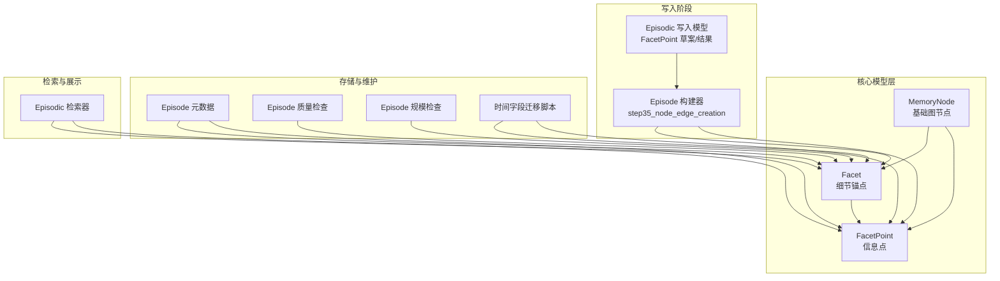
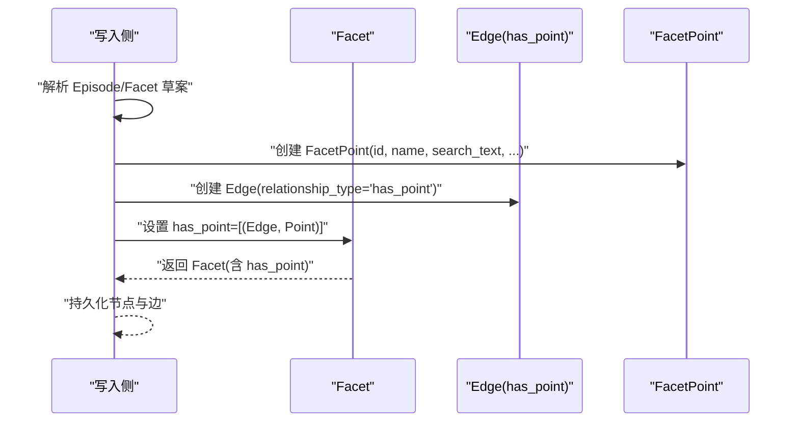
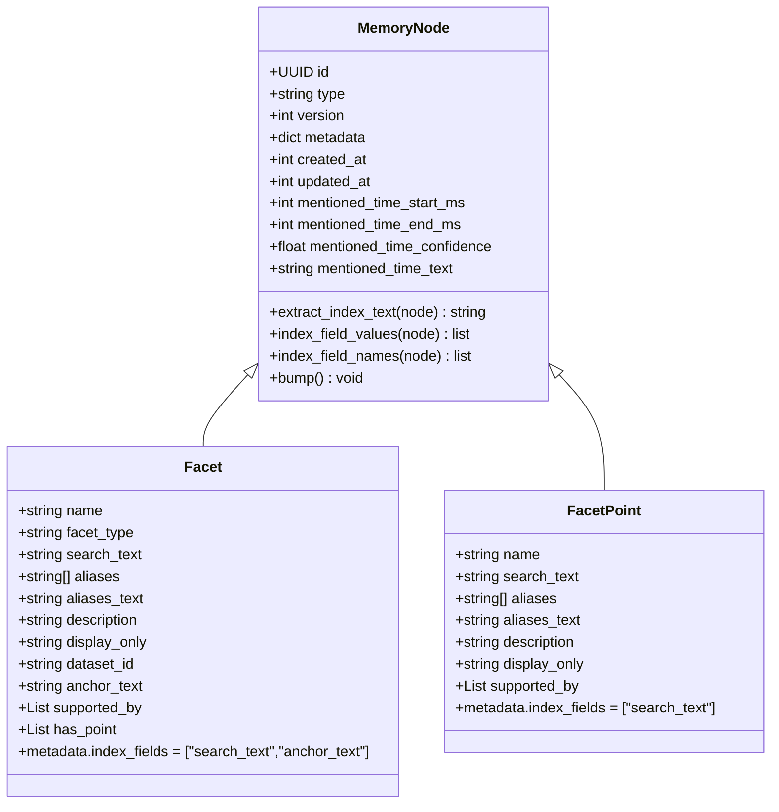
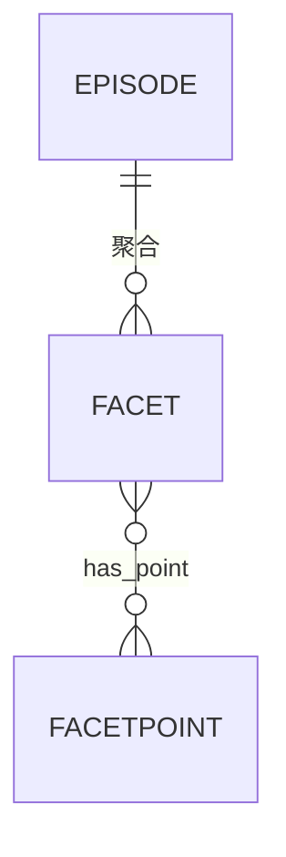
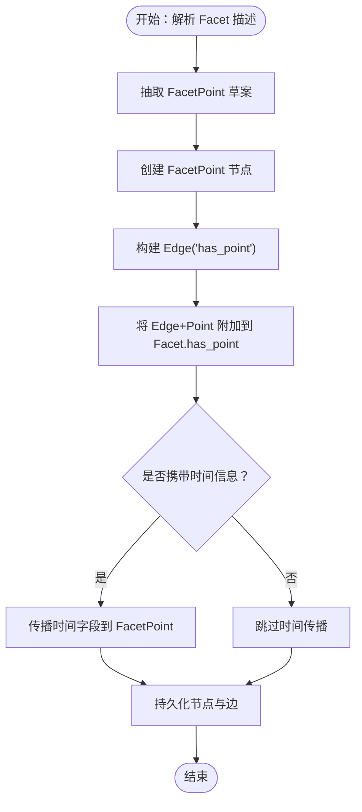

# 事件记忆数据模型

<cite>
**本文引用的文件**
- [Facet.py](file://m_flow/core/domain/models/Facet.py)
- [FacetPoint.py](file://m_flow/core/domain/models/FacetPoint.py)
- [MemoryNode.py](file://m_flow/core/models/MemoryNode.py)
- [models.py](file://m_flow/memory/episodic/models.py)
- [step35_node_edge_creation.py](file://m_flow/memory/episodic/episode_builder/step35_node_edge_creation.py)
- [episode_quality.py](file://m_flow/api/v1/maintenance/episode_quality.py)
- [episode_size.py](file://m_flow/api/v1/maintenance/episode_size.py)
- [episode_metadata.py](file://m_flow/storage/episode_metadata.py)
- [migrate_created_at.py](file://scripts/migrate_created_at.py)
- [test_stage1_verification.py](file://examples/test_stage1_verification.py)
- [episodic_retriever.py](file://m_flow/retrieval/episodic_retriever.py)
</cite>

## 目录
1. [简介](#简介)
2. [项目结构](#项目结构)
3. [核心组件](#核心组件)
4. [架构总览](#架构总览)
5. [详细组件分析](#详细组件分析)
6. [依赖分析](#依赖分析)
7. [性能考虑](#性能考虑)
8. [故障排除指南](#故障排除指南)
9. [结论](#结论)
10. [附录](#附录)

## 简介
本文件面向事件记忆（Episodic Memory）场景下的数据模型，系统性阐述以下核心实体及其关系：
- Episode：粗粒度的记忆锚点，用于聚合多个内容片段并承载高层摘要与主题。
- Facet：细粒度的“细节锚点”，作为检索定位的中间层，承载类型、标题、别名、锚文本等信息，并可指向一组 FacetPoint。
- FacetPoint：最细粒度的信息点，代表一个独立的事实或主张，支持独立向量化、重排序与证据链接。

文档将从设计原则、字段定义、约束与业务规则、模型间关系映射、验证与完整性约束、序列化/反序列化机制、数据库映射等方面进行深入说明，并提供最佳实践与常见错误处理建议。

## 项目结构
围绕事件记忆的数据模型，相关代码主要分布在如下模块：
- 核心模型层：位于 core/domain/models，定义 MemoryNode 基类及 Facet、FacetPoint 实体。
- 写入阶段模型：位于 memory/episodic/models，定义 FacetPoint 草案、提取结果等。
- 写入流程：位于 memory/episodic/episode_builder，负责将草稿转换为图节点与边。
- 存储与元数据：位于 storage，提供 Episode 元数据管理。
- 维护与迁移：位于 api/v1/maintenance 与 scripts，提供质量检查与时间字段一致性迁移。
- 检索与展示：位于 retrieval，定义 Facet/FacetPoint 的文本回填策略。

**图表来源**
- [MemoryNode.py:27-106](file://m_flow/core/models/MemoryNode.py#L27-L106)
- [Facet.py:22-102](file://m_flow/core/domain/models/Facet.py#L22-L102)
- [FacetPoint.py:20-58](file://m_flow/core/domain/models/FacetPoint.py#L20-L58)
- [models.py:327-370](file://m_flow/memory/episodic/models.py#L327-L370)
- [step35_node_edge_creation.py:232-263](file://m_flow/memory/episodic/episode_builder/step35_node_edge_creation.py#L232-L263)
- [episode_metadata.py](file://m_flow/storage/episode_metadata.py)
- [episode_quality.py](file://m_flow/api/v1/maintenance/episode_quality.py)
- [episode_size.py](file://m_flow/api/v1/maintenance/episode_size.py)
- [migrate_created_at.py:287-322](file://scripts/migrate_created_at.py#L287-L322)
- [episodic_retriever.py:429-447](file://m_flow/retrieval/episodic_retriever.py#L429-L447)

**章节来源**
- [MemoryNode.py:27-106](file://m_flow/core/models/MemoryNode.py#L27-L106)
- [Facet.py:22-102](file://m_flow/core/domain/models/Facet.py#L22-L102)
- [FacetPoint.py:20-58](file://m_flow/core/domain/models/FacetPoint.py#L20-L58)
- [models.py:327-370](file://m_flow/memory/episodic/models.py#L327-L370)
- [step35_node_edge_creation.py:232-263](file://m_flow/memory/episodic/episode_builder/step35_node_edge_creation.py#L232-L263)
- [episode_metadata.py](file://m_flow/storage/episode_metadata.py)
- [episode_quality.py](file://m_flow/api/v1/maintenance/episode_quality.py)
- [episode_size.py](file://m_flow/api/v1/maintenance/episode_size.py)
- [migrate_created_at.py:287-322](file://scripts/migrate_created_at.py#L287-L322)
- [episodic_retriever.py:429-447](file://m_flow/retrieval/episodic_retriever.py#L429-L447)

## 核心组件
本节对三个核心数据模型进行逐项解析，涵盖用途、字段、约束与业务规则。

- MemoryNode（基类）
  - 作用：所有领域节点的统一基类，提供版本控制、嵌入辅助、索引字段抽取、时间戳等通用能力。
  - 关键字段与特性：
    - id：UUID，唯一标识
    - type：字符串，自动由具体子类名称填充
    - version：整数，版本号，支持 bump 升级
    - metadata：NodeMeta，声明节点类型与索引字段列表
    - 时间字段：created_at、updated_at（毫秒时间戳）
    - 时序字段：mentioned_time_start_ms、mentioned_time_end_ms、mentioned_time_confidence、mentioned_time_text
    - 索引辅助：extract_index_text、index_field_values、index_field_names
  - 设计原则：不强制数量/字符上限，策略留给写入侧；提供统一序列化/反序列化与嵌入入口。

- Facet（细节锚点）
  - 作用：作为 Episode 的细粒度定位锚点，支撑精确检索与上下文扩展。
  - 关键字段与约束：
    - name：节点显示名，推荐与 search_text 一致
    - facet_type：类型标签（如决策/风险/结果/指标/问题/计划/约束/原因等）
    - search_text：主检索句柄，短而尖锐，参与向量化
    - aliases：结构化别名列表（不直接索引）
    - aliases_text：别名拼接文本，参与向量化以提升召回
    - description：RAG 扩展用的解释性文本（不参与向量化）
    - display_only：仅展示字段（不参与检索），用于检索时的附加说明
    - dataset_id：数据集隔离标识，用于路由过滤
    - anchor_text：中层语义富文本（参与向量化），可直接等于精炼后的描述
    - supported_by：证据边集合（Facet → ContentFragment），用于后续精确证据检索
    - has_point：细粒度点集合（Facet → FacetPoint），支持独立匹配、评分与证据链接
    - metadata.index_fields：["search_text", "anchor_text"]（aliases_text 不索引）
  - 业务规则：
    - 别名生成与拼接策略在写入阶段完成，避免在检索阶段产生误匹配
    - anchor_text 可与 description 对齐，减少重复摘要

- FacetPoint（信息点）
  - 作用：最小粒度的事实/主张节点，支持独立向量化、重排序与证据链接。
  - 关键字段与约束：
    - name：推荐与 search_text 一致
    - search_text：主检索句柄（短、尖锐），参与向量化
    - aliases：结构化别名列表（不直接索引）
    - aliases_text：别名拼接文本（向量化回退召回）
    - description：解释性扩展（不参与向量化）
    - display_only：仅展示字段（不参与检索）
    - supported_by：证据边集合（指向 ContentFragment）
    - metadata.index_fields：["search_text"]（aliases_text 不索引）
  - 业务规则：
    - 不限制数量与字符长度，策略由写入侧决定
    - 支持与 Facet 的 has_point 边建立层级关系

**章节来源**
- [MemoryNode.py:27-106](file://m_flow/core/models/MemoryNode.py#L27-L106)
- [Facet.py:22-102](file://m_flow/core/domain/models/Facet.py#L22-L102)
- [FacetPoint.py:20-58](file://m_flow/core/domain/models/FacetPoint.py#L20-L58)

## 架构总览
事件记忆数据模型在写入阶段的典型流转如下：
- 写入侧根据 Episode 草案与 Facet 草案，提取细粒度信息点（FacetPoint Draft/Result）。
- 将 FacetPoint 转换为独立节点，并通过 Edge（relationship_type="has_point"）连接到对应的 Facet。
- Episode 层面聚合 Facet，形成“Episode → Facet → FacetPoint”的三层结构。
- 检索侧根据 Facet/FacetPoint 的索引字段进行向量化检索，并在展示时按优先级回填文本。

**图表来源**
- [models.py:327-370](file://m_flow/memory/episodic/models.py#L327-L370)
- [step35_node_edge_creation.py:232-263](file://m_flow/memory/episodic/episode_builder/step35_node_edge_creation.py#L232-L263)
- [test_stage1_verification.py:118-190](file://examples/test_stage1_verification.py#L118-L190)

**章节来源**
- [models.py:327-370](file://m_flow/memory/episodic/models.py#L327-L370)
- [step35_node_edge_creation.py:232-263](file://m_flow/memory/episodic/episode_builder/step35_node_edge_creation.py#L232-L263)
- [test_stage1_verification.py:118-190](file://examples/test_stage1_verification.py#L118-L190)

## 详细组件分析

### 类关系与继承

**图表来源**
- [MemoryNode.py:27-106](file://m_flow/core/models/MemoryNode.py#L27-L106)
- [Facet.py:22-102](file://m_flow/core/domain/models/Facet.py#L22-L102)
- [FacetPoint.py:20-58](file://m_flow/core/domain/models/FacetPoint.py#L20-L58)

**章节来源**
- [MemoryNode.py:27-106](file://m_flow/core/models/MemoryNode.py#L27-L106)
- [Facet.py:22-102](file://m_flow/core/domain/models/Facet.py#L22-L102)
- [FacetPoint.py:20-58](file://m_flow/core/domain/models/FacetPoint.py#L20-L58)

### Episode 与 Facet 的一对多关系
- 关系定义：Episode 聚合多个 Facet，Facet 通过 has_point 指向多个 FacetPoint。
- 关系映射：
  - Episode → Facet：一对多（聚合）
  - Facet → FacetPoint：一对多（层级细化）
- 边类型：has_point（关系类型固定为 "has_point"），用于表达 Facet 对其内部信息点的拥有关系。

**图表来源**
- [test_stage1_verification.py:122-136](file://examples/test_stage1_verification.py#L122-L136)
- [step35_node_edge_creation.py:252-263](file://m_flow/memory/episodic/episode_builder/step35_node_edge_creation.py#L252-L263)

**章节来源**
- [test_stage1_verification.py:122-136](file://examples/test_stage1_verification.py#L122-L136)
- [step35_node_edge_creation.py:252-263](file://m_flow/memory/episodic/episode_builder/step35_node_edge_creation.py#L252-L263)

### Facet 与 FacetPoint 的层级结构
- 层级设计：Facet 作为中间层，承载锚文本与证据；FacetPoint 作为最细粒度事实单元，支持独立检索与证据溯源。
- 写入流程要点：
  - 从 Facet 描述中抽取细粒度信息点，生成 FacetPoint 草案并转换为节点
  - 通过 Edge("has_point") 建立 Facet 与 FacetPoint 的连接
  - 支持时间字段传播：若 Facet 或 Episode 含有提及时间，则传播到 FacetPoint

**图表来源**
- [models.py:327-370](file://m_flow/memory/episodic/models.py#L327-L370)
- [step35_node_edge_creation.py:232-263](file://m_flow/memory/episodic/episode_builder/step35_node_edge_creation.py#L232-L263)

**章节来源**
- [models.py:327-370](file://m_flow/memory/episodic/models.py#L327-L370)
- [step35_node_edge_creation.py:232-263](file://m_flow/memory/episodic/episode_builder/step35_node_edge_creation.py#L232-L263)

### 验证规则与完整性约束
- FacetPoint 草案/结果校验：
  - FacetPointDraft.search_text 必填，且应为短小明确的检索句柄
  - FacetPointExtractionResult.points 为非空列表，facets 与 points 的对应关系需保持一致
- Facet/FacetPoint 索引字段：
  - Facet 的索引字段：["search_text", "anchor_text"]
  - FacetPoint 的索引字段：["search_text"]
  - aliases_text 不参与索引，避免同义词导致的误匹配
- 时间字段一致性：
  - 迁移脚本确保 FacetPoint 的 created_at 与关联 Facet 的 created_at 一致
- 写入阶段约束：
  - has_point 边的 relationship_type 固定为 "has_point"
  - Facet/FacetPoint 的时间字段可独立于 Episode，但可从 Facet 或 Episode 传播

**章节来源**
- [models.py:327-370](file://m_flow/memory/episodic/models.py#L327-L370)
- [migrate_created_at.py:287-322](file://scripts/migrate_created_at.py#L287-L322)

### 序列化与反序列化机制
- 统一基类能力：
  - MemoryNode 提供索引文本抽取与字段名/值访问方法，便于嵌入与检索
  - type 字段自动从类名填充，保证节点类型可追溯
- 写入侧转换：
  - 将 FacetPoint 草案转换为节点对象，设置索引字段与时间字段
  - 通过 Edge 对象建立层级关系，最终持久化到图数据库
- 展示侧回填：
  - 检索器按优先级回填 Facet/FacetPoint 的文本字段，确保用户看到可读内容

**章节来源**
- [MemoryNode.py:64-106](file://m_flow/core/models/MemoryNode.py#L64-L106)
- [step35_node_edge_creation.py:232-263](file://m_flow/memory/episodic/episode_builder/step35_node_edge_creation.py#L232-L263)
- [episodic_retriever.py:429-447](file://m_flow/retrieval/episodic_retriever.py#L429-L447)

### 数据库存储映射
- 节点类型映射：
  - Facet：type = "Facet"
  - FacetPoint：type = "FacetPoint"
- 边类型映射：
  - has_point：表示 Facet 对其信息点的拥有关系
- 元数据与索引：
  - Facet：metadata.index_fields = ["search_text", "anchor_text"]
  - FacetPoint：metadata.index_fields = ["search_text"]
- 时间字段：
  - created_at/updated_at：毫秒级时间戳
  - mentioned_time_*：可选时序字段，支持传播与一致性校验

**章节来源**
- [Facet.py:94-102](file://m_flow/core/domain/models/Facet.py#L94-L102)
- [FacetPoint.py:55-58](file://m_flow/core/domain/models/FacetPoint.py#L55-L58)
- [migrate_created_at.py:287-322](file://scripts/migrate_created_at.py#L287-L322)

## 依赖分析
- 组件耦合：
  - Facet/FacetPoint 均继承自 MemoryNode，共享版本、时间戳与索引能力
  - 写入侧通过 Edge("has_point") 强耦合 Facet 与 FacetPoint
- 外部依赖：
  - 图数据库适配器用于节点与边的持久化
  - 检索器依赖索引字段与时间字段进行排序与回填
- 循环依赖规避：
  - supported_by、has_point 使用类型注解延迟导入，避免循环引用

**图表来源**
- [Facet.py:84-92](file://m_flow/core/domain/models/Facet.py#L84-L92)
- [FacetPoint.py:51-53](file://m_flow/core/domain/models/FacetPoint.py#L51-L53)

**章节来源**
- [Facet.py:84-92](file://m_flow/core/domain/models/Facet.py#L84-L92)
- [FacetPoint.py:51-53](file://m_flow/core/domain/models/FacetPoint.py#L51-L53)

## 性能考虑
- 索引字段选择：
  - Facet/FacetPoint 仅对关键字段建立索引，避免冗余索引带来的写入开销
  - aliases_text 不索引，降低误匹配风险
- 向量化与回填：
  - 通过 extract_index_text 将索引字段拼接为嵌入输入，兼顾召回与精度
  - 展示时按优先级回填，减少不必要的计算
- 时间字段传播：
  - 在写入阶段完成时间传播，避免检索时重复计算

[本节为通用指导，无需列出具体文件来源]

## 故障排除指南
- 常见问题与处理：
  - has_point 关系缺失或类型错误：检查写入侧是否正确创建 Edge("has_point")
  - Facet/FacetPoint 索引字段为空：确认 metadata.index_fields 设置与实际字段赋值
  - 时间字段不一致：运行迁移脚本确保 created_at 与 Facet 的 created_at 一致
  - 展示文本为空：检查检索器的文本回填逻辑，确保优先级字段存在
- 质量与规模检查：
  - 使用 episode_quality 与 episode_size 接口进行质量评估与规模核验
- 单元测试参考：
  - test_stage1_verification：验证 has_point 关系结构与字段正确性

**章节来源**
- [episode_quality.py](file://m_flow/api/v1/maintenance/episode_quality.py)
- [episode_size.py](file://m_flow/api/v1/maintenance/episode_size.py)
- [migrate_created_at.py:287-322](file://scripts/migrate_created_at.py#L287-L322)
- [test_stage1_verification.py:118-190](file://examples/test_stage1_verification.py#L118-L190)

## 结论
事件记忆数据模型通过 MemoryNode 的统一基类能力，结合 Facet 与 FacetPoint 的分层设计，实现了从粗粒度 Episode 到细粒度信息点的完整索引与检索体系。通过严格的索引字段选择、时间字段传播与一致性校验，确保了检索精度与数据一致性。写入侧的 Edge("has_point") 明确表达了层级关系，配合检索侧的文本回填策略，提供了良好的用户体验与可维护性。

[本节为总结性内容，无需列出具体文件来源]

## 附录
- 最佳实践：
  - 写入侧严格控制 FacetPoint 的 search_text 精准度，避免过宽导致召回噪声
  - 合理使用 display_only 字段补充上下文，不影响检索行为
  - 在大规模写入前执行 episode_quality 与 episode_size 检查
- 常见错误：
  - 忘记设置 Edge("has_point") 导致层级关系断裂
  - aliases_text 过长或包含无关信息，影响向量化效果
  - 时间字段未传播或不一致，导致检索排序异常

[本节为通用指导，无需列出具体文件来源]