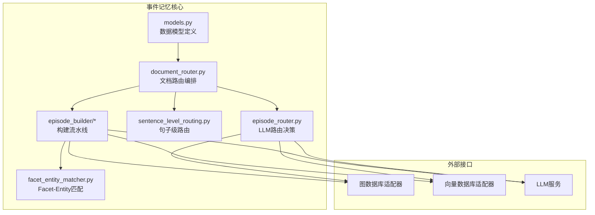
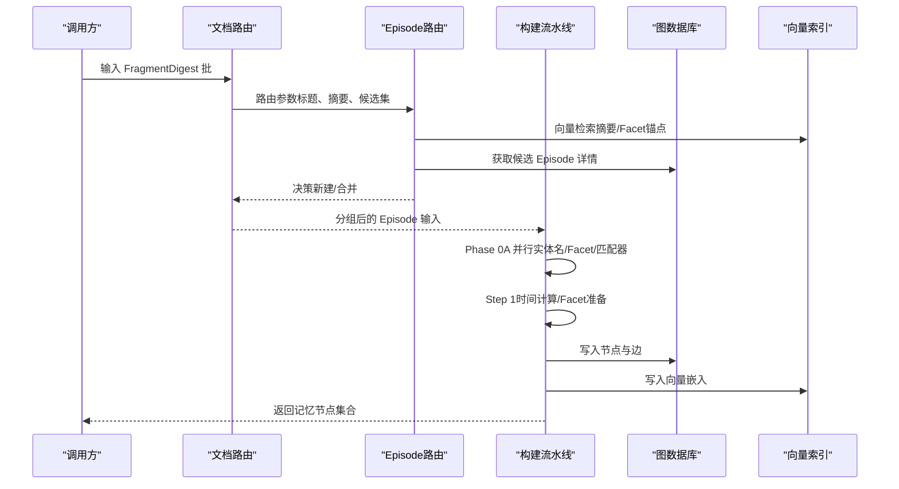
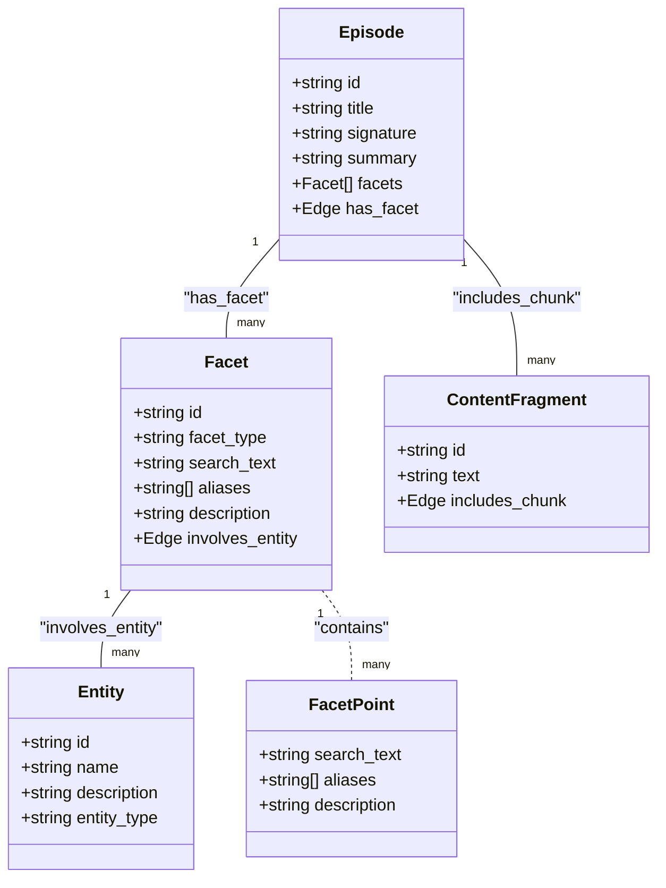
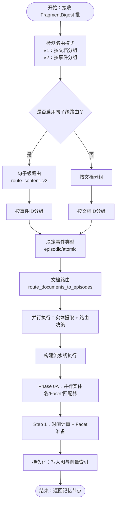
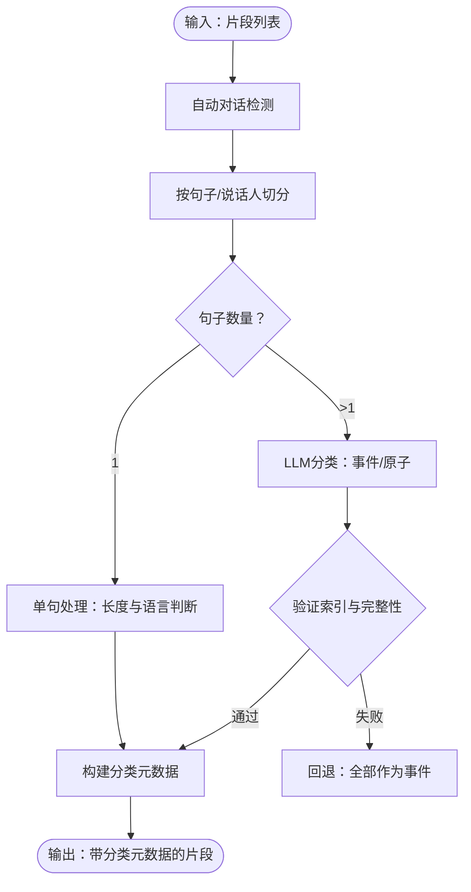
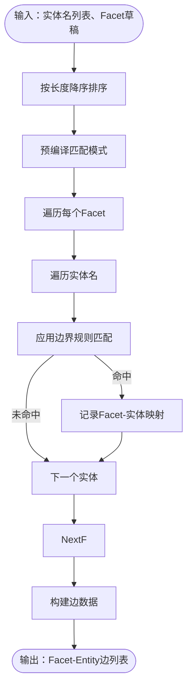
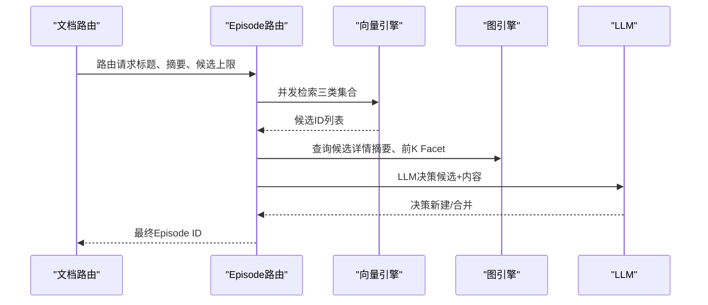
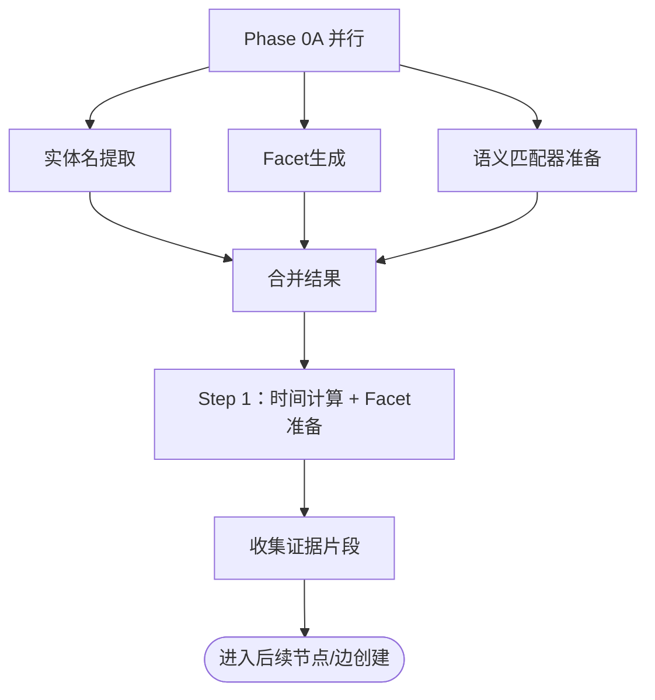
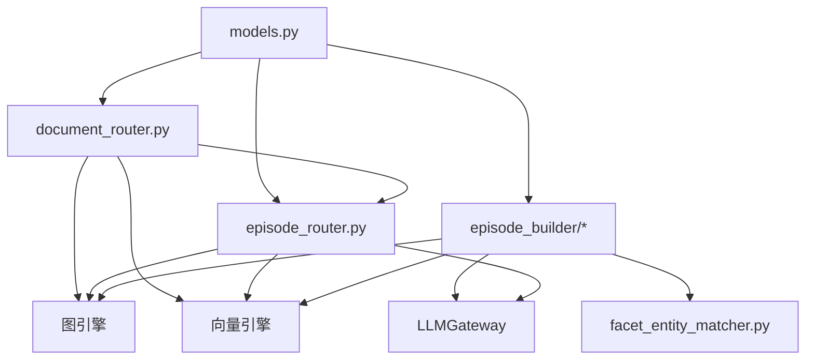

# 事件记忆系统

<cite>
**本文档引用的文件**
- [models.py](file://m_flow/memory/episodic/models.py)
- [write_episodic_memories.py](file://m_flow/memory/episodic/write_episodic_memories.py)
- [sentence_level_routing.py](file://m_flow/memory/episodic/sentence_level_routing.py)
- [episode_router.py](file://m_flow/memory/episodic/episode_router.py)
- [document_router.py](file://m_flow/memory/episodic/routing/document_router.py)
- [facet_entity_matcher.py](file://m_flow/memory/episodic/facet_entity_matcher.py)
- [pipeline_contexts.py](file://m_flow/memory/episodic/episode_builder/pipeline_contexts.py)
- [phase0a.py](file://m_flow/memory/episodic/episode_builder/phase0a.py)
- [step1_facet_prep.py](file://m_flow/memory/episodic/episode_builder/step1_facet_prep.py)
</cite>

## 目录
1. [简介](#简介)
2. [项目结构](#项目结构)
3. [核心组件](#核心组件)
4. [架构总览](#架构总览)
5. [详细组件分析](#详细组件分析)
6. [依赖关系分析](#依赖关系分析)
7. [性能考虑](#性能考虑)
8. [故障排除指南](#故障排除指南)
9. [结论](#结论)
10. [附录](#附录)

## 简介
本文件面向事件记忆系统（Episodic Memory）的技术文档，系统性阐述从原始数据到知识图谱的完整处理链路。重点覆盖以下方面：
- 核心数据模型：Episode、Facet、FacetPoint 的设计与关系
- 事件记忆构建流程：从 FragmentDigest 到 Episode 的转换
- 句子级路由机制：内容分类、事件识别与路由决策
- Facet 提取与实体链接算法：基于精确匹配与边界规则的实体定位
- 存储策略：图数据库与向量索引的协同使用
- 完整处理流程图：端到端从原始数据到最终知识图谱
- 性能优化策略、并发处理机制与错误处理方案

## 项目结构
事件记忆系统位于 m_flow/memory/episodic 目录下，采用模块化分层设计：
- 模型定义：统一在 models.py 中定义路由、写入草稿、FacetPoint、实体描述等数据结构
- 路由与编排：document_router.py 负责文档到 Episode 的路由；episode_router.py 提供 LLM 驱动的路由决策
- 内容路由：sentence_level_routing.py 实现句子级分类与事件分组
- 构建流水线：episode_builder 下的 pipeline_contexts.py、phase0a.py、step1_facet_prep.py 等模块化执行各阶段任务
- 实体链接：facet_entity_matcher.py 基于精确匹配与语言学边界规则进行 Facet-Entity 关联

图表来源
- [models.py:26-548](file://m_flow/memory/episodic/models.py#L26-L548)
- [document_router.py:105-444](file://m_flow/memory/episodic/routing/document_router.py#L105-L444)
- [episode_router.py:105-594](file://m_flow/memory/episodic/episode_router.py#L105-L594)
- [sentence_level_routing.py:85-526](file://m_flow/memory/episodic/sentence_level_routing.py#L85-L526)
- [facet_entity_matcher.py:172-309](file://m_flow/memory/episodic/facet_entity_matcher.py#L172-L309)

章节来源
- [models.py:26-548](file://m_flow/memory/episodic/models.py#L26-L548)
- [document_router.py:105-444](file://m_flow/memory/episodic/routing/document_router.py#L105-L444)
- [episode_router.py:105-594](file://m_flow/memory/episodic/episode_router.py#L105-L594)
- [sentence_level_routing.py:85-526](file://m_flow/memory/episodic/sentence_level_routing.py#L85-L526)
- [facet_entity_matcher.py:172-309](file://m_flow/memory/episodic/facet_entity_matcher.py#L172-L309)

## 核心组件
本节聚焦事件记忆系统的关键数据模型与处理组件。

- 数据模型
  - 路由类型与段落：RoutingType、EpisodicSegment、ContentRoutingResult
  - 写入草稿：EpisodicWriteDraft、EpisodicFacetDraft、EpisodicAliasUpdate
  - 实体选择：ConceptContextInfo、FacetConceptMapping、ConceptSelectionResult
  - 路由决策：EpisodeCandidate、RouteDecision
  - 细粒度点：FacetPointDraft、FacetPointExtractionResult
  - 实体描述：ConceptDescription、ConceptDescriptionResult
  - 句子级路由：SentenceClassification、EventClassification、SentenceRoutingResult

- 处理组件
  - 文档路由：route_documents_to_episodes，支持并行实体提取与路由
  - Episode 路由：route_episode_id_for_doc，基于向量召回与 LLM 决策
  - 句子级路由：route_content_v2，将片段细分为事件与原子句
  - Facet-Entity 匹配：match_entities_to_facets，精确匹配与边界规则
  - 构建流水线：Phase 0A 并行（实体名提取、Facet 生成、语义匹配器准备）、Step 1 时间计算与 Facet 准备

章节来源
- [models.py:26-548](file://m_flow/memory/episodic/models.py#L26-L548)
- [document_router.py:105-444](file://m_flow/memory/episodic/routing/document_router.py#L105-L444)
- [episode_router.py:105-594](file://m_flow/memory/episodic/episode_router.py#L105-L594)
- [sentence_level_routing.py:85-526](file://m_flow/memory/episodic/sentence_level_routing.py#L85-L526)
- [facet_entity_matcher.py:172-309](file://m_flow/memory/episodic/facet_entity_matcher.py#L172-L309)

## 架构总览
事件记忆系统采用“路由-构建-持久化”的三层架构：
- 路由层：根据标题与摘要向量召回候选 Episode，并通过 LLM 决策合并或新建
- 构建层：以 Episode 为单位，执行实体提取、Facet 生成、语义合并、时间抽取与证据收集
- 持久化层：将 Episode、Facet、Entity、Edge 写入图数据库与向量索引

图表来源
- [document_router.py:105-444](file://m_flow/memory/episodic/routing/document_router.py#L105-L444)
- [episode_router.py:319-594](file://m_flow/memory/episodic/episode_router.py#L319-L594)
- [write_episodic_memories.py:178-800](file://m_flow/memory/episodic/write_episodic_memories.py#L178-L800)

章节来源
- [document_router.py:105-444](file://m_flow/memory/episodic/routing/document_router.py#L105-L444)
- [episode_router.py:319-594](file://m_flow/memory/episodic/episode_router.py#L319-L594)
- [write_episodic_memories.py:178-800](file://m_flow/memory/episodic/write_episodic_memories.py#L178-L800)

## 详细组件分析

### 数据模型与关系
- Episode：粗粒度记忆锚点，包含标题、签名、摘要、Facet 列表与别名更新
- Facet：细节锚点，用于精确定位，包含类型、搜索词、别名与描述
- FacetPoint：更细粒度的事实条目，具备搜索词、别名与可选解释
- Entity：实体对象，与 Facet 通过“涉及实体”边连接
- 边关系：Episode-has_facet->Facet、Facet-involves_entity->Entity、Episode-includes_chunk->ContentFragment

图表来源
- [models.py:197-370](file://m_flow/memory/episodic/models.py#L197-L370)
- [models.py:328-370](file://m_flow/memory/episodic/models.py#L328-L370)

章节来源
- [models.py:197-370](file://m_flow/memory/episodic/models.py#L197-L370)
- [models.py:328-370](file://m_flow/memory/episodic/models.py#L328-L370)

### 事件记忆构建流程（从 FragmentDigest 到 Episode）
该流程由 write_episodic_memories 协调，结合路由与构建流水线完成：

图表来源
- [write_episodic_memories.py:178-800](file://m_flow/memory/episodic/write_episodic_memories.py#L178-L800)
- [sentence_level_routing.py:85-526](file://m_flow/memory/episodic/sentence_level_routing.py#L85-L526)
- [document_router.py:105-444](file://m_flow/memory/episodic/routing/document_router.py#L105-L444)
- [phase0a.py:458-577](file://m_flow/memory/episodic/episode_builder/phase0a.py#L458-L577)
- [step1_facet_prep.py:367-484](file://m_flow/memory/episodic/episode_builder/step1_facet_prep.py#L367-L484)

章节来源
- [write_episodic_memories.py:178-800](file://m_flow/memory/episodic/write_episodic_memories.py#L178-L800)
- [sentence_level_routing.py:85-526](file://m_flow/memory/episodic/sentence_level_routing.py#L85-L526)
- [document_router.py:105-444](file://m_flow/memory/episodic/routing/document_router.py#L105-L444)
- [phase0a.py:458-577](file://m_flow/memory/episodic/episode_builder/phase0a.py#L458-L577)
- [step1_facet_prep.py:367-484](file://m_flow/memory/episodic/episode_builder/step1_facet_prep.py#L367-L484)

### 句子级路由机制
句子级路由将单个片段拆分为多个事件与原子句，支持细粒度检索与处理：
- 自动对话检测：基于正则表达式识别多说话人对话格式
- 单句短文处理：根据长度与语言特征自动判定原子或事件
- 多句处理：调用 LLM 对句子进行事件分组与原子标记，带重试与回退策略
- 元数据存储：将分类结果写入 chunk.metadata["sentence_classifications"]

图表来源
- [sentence_level_routing.py:85-526](file://m_flow/memory/episodic/sentence_level_routing.py#L85-L526)

章节来源
- [sentence_level_routing.py:85-526](file://m_flow/memory/episodic/sentence_level_routing.py#L85-L526)

### Facet 提取与实体链接算法
- Facet 提取：通过 summarize_by_event 生成章节与 Facet  草案，随后在 Step 1 中进行字符串/语义匹配与去重
- 实体链接：match_entities_to_facets 使用精确匹配与语言学边界规则（CJK、单字符数字/字母/汉字）进行实体定位，避免误匹配
- 边缘生成：build_facet_entity_edges 将匹配结果转化为图边，包含关系名称与边文本

图表来源
- [facet_entity_matcher.py:172-309](file://m_flow/memory/episodic/facet_entity_matcher.py#L172-L309)

章节来源
- [facet_entity_matcher.py:172-309](file://m_flow/memory/episodic/facet_entity_matcher.py#L172-L309)

### Episode 路由决策（向量召回 + LLM 决策）
- 向量召回：对 Episode_summary、Facet_search_text、Facet_anchor_text 三类集合进行并发检索
- 候选过滤：按节点集隔离与数据集过滤，保留有效候选
- LLM 决策：基于候选摘要与 Facet 标题，决定新建或合并
- 回退策略：当 LLM 不可用时采用启发式阈值合并

图表来源
- [episode_router.py:319-594](file://m_flow/memory/episodic/episode_router.py#L319-L594)

章节来源
- [episode_router.py:319-594](file://m_flow/memory/episodic/episode_router.py#L319-L594)

### 构建流水线（Phase 0A 与 Step 1）
- Phase 0A 并行：实体名提取（优先缓存，回退 LLM）、Facet 生成（summarize_by_event）、语义匹配器准备
- Step 1：时间信息合并与 Facet 准备，收集证据片段，为后续节点创建做准备

图表来源
- [phase0a.py:458-577](file://m_flow/memory/episodic/episode_builder/phase0a.py#L458-L577)
- [step1_facet_prep.py:367-484](file://m_flow/memory/episodic/episode_builder/step1_facet_prep.py#L367-L484)

章节来源
- [phase0a.py:458-577](file://m_flow/memory/episodic/episode_builder/phase0a.py#L458-L577)
- [step1_facet_prep.py:367-484](file://m_flow/memory/episodic/episode_builder/step1_facet_prep.py#L367-L484)

## 依赖关系分析
- 模块内聚与耦合
  - models.py 作为统一数据契约，被路由、构建、匹配等模块广泛依赖
  - document_router.py 与 episode_router.py 通过向量与图引擎交互，耦合度高但职责清晰
  - episode_builder 各阶段通过 pipeline_contexts.py 的数据类传递状态，降低跨阶段耦合
- 外部依赖
  - 图数据库与向量数据库适配器通过 get_graph_provider/get_vector_provider 注入
  - LLM 服务通过 LLMGateway 抽象，统一并发控制与跟踪

图表来源
- [models.py:26-548](file://m_flow/memory/episodic/models.py#L26-L548)
- [document_router.py:105-444](file://m_flow/memory/episodic/routing/document_router.py#L105-L444)
- [episode_router.py:319-594](file://m_flow/memory/episodic/episode_router.py#L319-L594)
- [facet_entity_matcher.py:172-309](file://m_flow/memory/episodic/facet_entity_matcher.py#L172-L309)

章节来源
- [models.py:26-548](file://m_flow/memory/episodic/models.py#L26-L548)
- [document_router.py:105-444](file://m_flow/memory/episodic/routing/document_router.py#L105-L444)
- [episode_router.py:319-594](file://m_flow/memory/episodic/episode_router.py#L319-L594)
- [facet_entity_matcher.py:172-309](file://m_flow/memory/episodic/facet_entity_matcher.py#L172-L309)

## 性能考虑
- 并行优化
  - 文档路由阶段并行执行实体提取与路由决策，显著减少路由阶段耗时
  - 构建流水线 Phase 0A 三路并行，充分利用 LLM 并发资源
- 向量检索优化
  - 并发检索三类集合，按需过滤候选，减少 LLM 输入规模
- 缓存与回退
  - 路由阶段优先使用实体缓存，避免重复 LLM 调用
  - 句子级路由在 LLM 结果不合法时回退为单一事件，保证吞吐
- 时间传播与去重
  - 在 Facet 准备阶段进行字符串/语义匹配与去重，避免冗余 Facet
  - 时间字段在实体与 Facet 层分别维护，提升检索精度

## 故障排除指南
- 句子级路由异常
  - 现象：路由函数抛出异常导致部分片段无法分类
  - 处理：触发回退逻辑，将所有句子标记为事件并写入元数据
  - 参考路径：[sentence_level_routing.py:134-137](file://m_flow/memory/episodic/sentence_level_routing.py#L134-L137)
- LLM 路由失败
  - 现象：LLM 调用失败或结果不合法
  - 处理：回退至“新建 Episode”，记录原因与错误信息
  - 参考路径：[episode_router.py:310-317](file://m_flow/memory/episodic/episode_router.py#L310-L317)
- 向量集合不存在
  - 现象：首次导入时向量集合尚未建立
  - 处理：跳过向量召回，直接返回默认 Episode ID
  - 参考路径：[episode_router.py:425-430](file://m_flow/memory/episodic/episode_router.py#L425-L430)
- Facet-Entity 匹配为空
  - 现象：实体名过短或边界规则导致未匹配
  - 处理：调整最小实体长度参数或放宽匹配规则
  - 参考路径：[facet_entity_matcher.py:202-218](file://m_flow/memory/episodic/facet_entity_matcher.py#L202-L218)

章节来源
- [sentence_level_routing.py:134-137](file://m_flow/memory/episodic/sentence_level_routing.py#L134-L137)
- [episode_router.py:310-317](file://m_flow/memory/episodic/episode_router.py#L310-L317)
- [episode_router.py:425-430](file://m_flow/memory/episodic/episode_router.py#L425-L430)
- [facet_entity_matcher.py:202-218](file://m_flow/memory/episodic/facet_entity_matcher.py#L202-L218)

## 结论
事件记忆系统通过“句子级路由 + 文档路由 + 构建流水线 + 图/向量持久化”的完整链路，实现了从原始数据到结构化知识图谱的高效转换。其核心优势在于：
- 精细化路由：句子级事件分组与原子句处理，提升检索质量
- 并行化编排：路由与实体提取并行，构建阶段三路并行，显著提升吞吐
- 稳健性保障：完善的回退与错误处理机制，确保系统在异常场景下的可用性
- 可扩展性：模块化设计与统一数据契约，便于功能演进与集成

## 附录
- 配置与环境变量
  - MFLOW_CONTENT_ROUTING：控制是否启用句子级路由
  - MFLOW_EPISODIC_ENABLE_ROUTING / USE_LLM / SUMMARY_K / FACET_K / MAX_CANDIDATES：控制 Episode 路由行为
  - MFLOW_LLM_CONCURRENCY_LIMIT：限制 LLM 并发，影响路由并行能力
- 数据模型参考路径
  - [models.py:26-548](file://m_flow/memory/episodic/models.py#L26-L548)
- 流水线上下文与配置
  - [pipeline_contexts.py:47-341](file://m_flow/memory/episodic/episode_builder/pipeline_contexts.py#L47-L341)
- 路由与构建主流程
  - [write_episodic_memories.py:178-800](file://m_flow/memory/episodic/write_episodic_memories.py#L178-L800)
  - [document_router.py:105-444](file://m_flow/memory/episodic/routing/document_router.py#L105-L444)
  - [episode_router.py:319-594](file://m_flow/memory/episodic/episode_router.py#L319-L594)
  - [phase0a.py:458-577](file://m_flow/memory/episodic/episode_builder/phase0a.py#L458-L577)
  - [step1_facet_prep.py:367-484](file://m_flow/memory/episodic/episode_builder/step1_facet_prep.py#L367-L484)