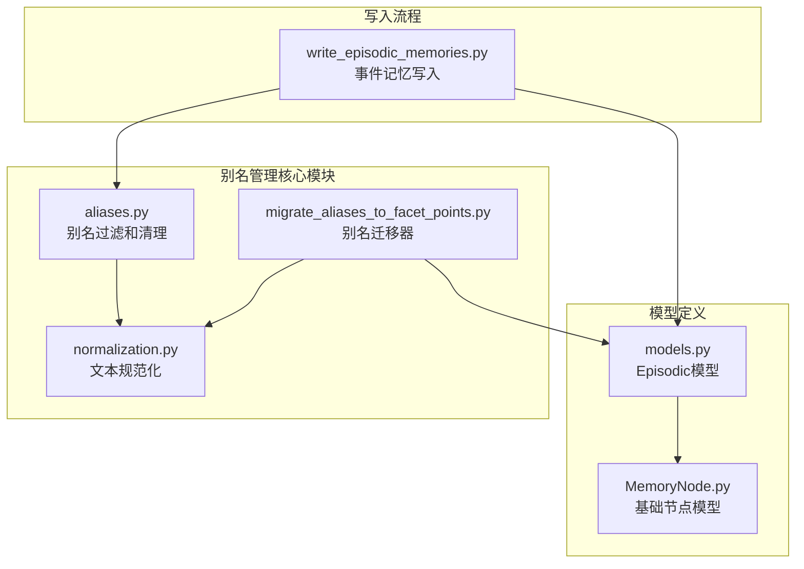
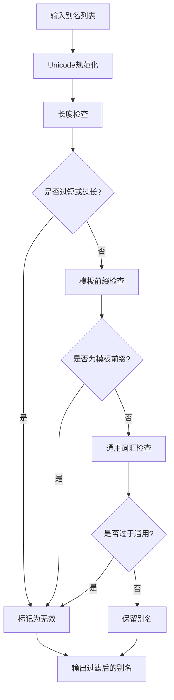
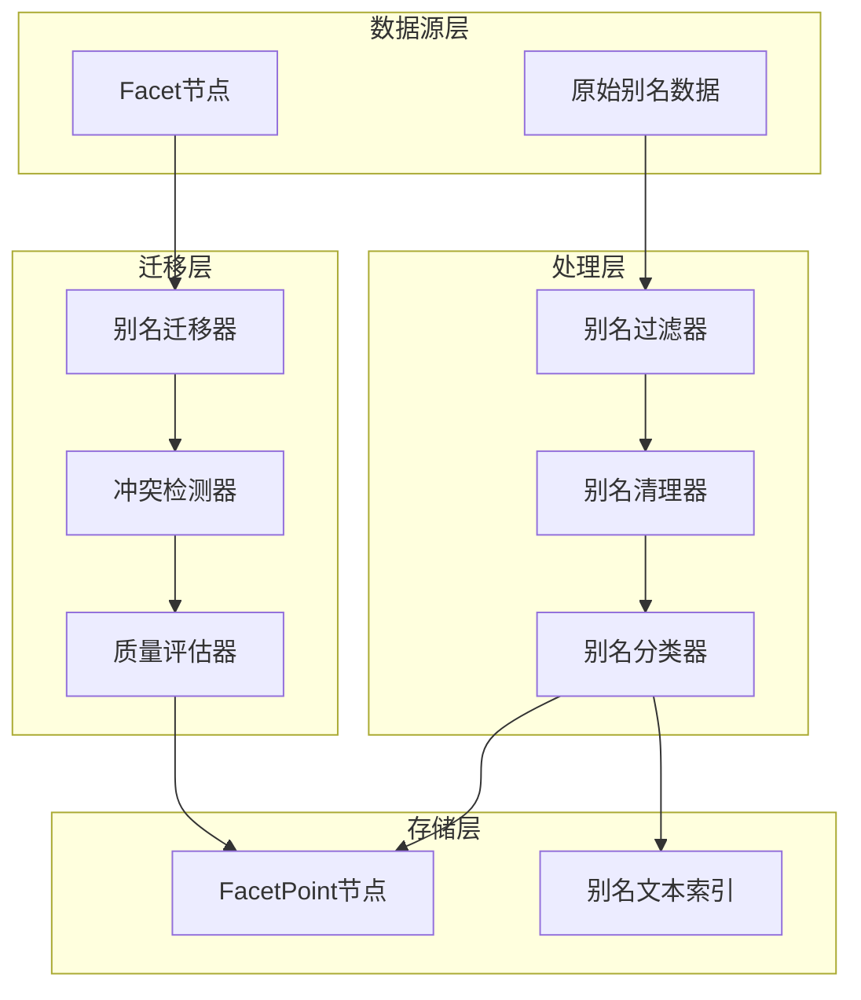
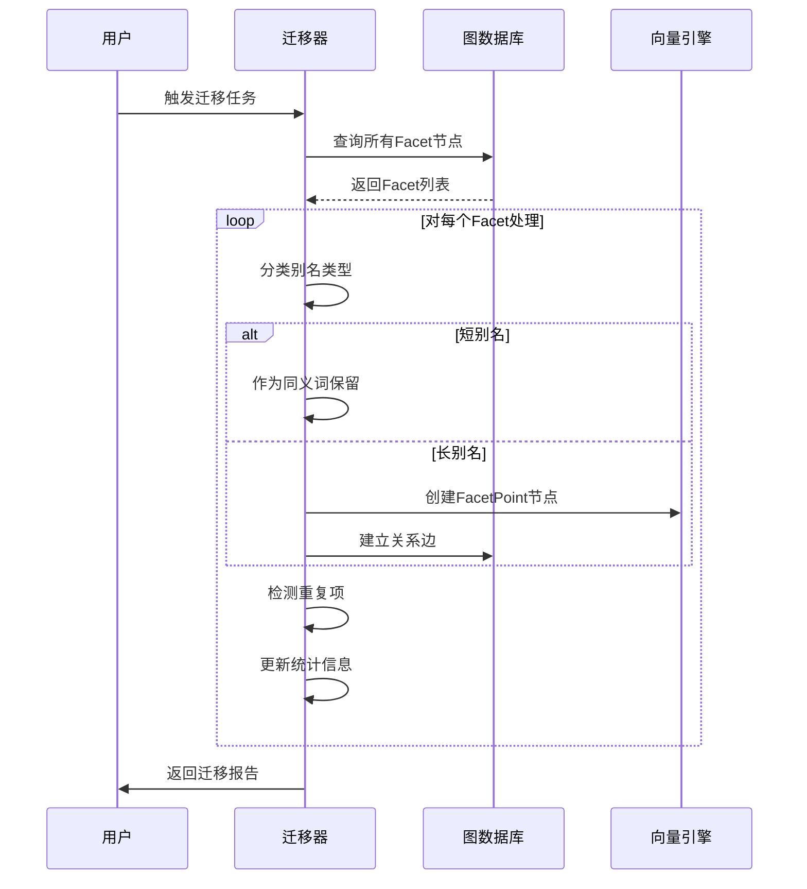
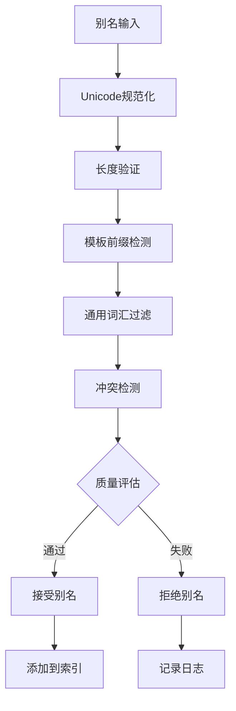
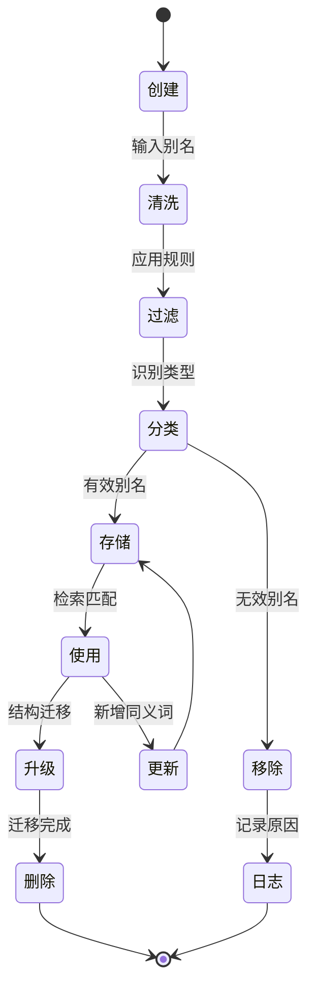
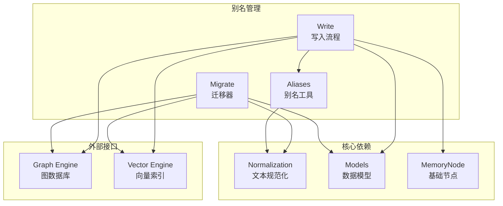

# 别名管理系统

<cite>
**本文档引用的文件**
- [aliases.py](file://m_flow/memory/episodic/aliases.py)
- [migrate_aliases_to_facet_points.py](file://m_flow/memory/episodic/migrate_aliases_to_facet_points.py)
- [models.py](file://m_flow/memory/episodic/models.py)
- [write_episodic_memories.py](file://m_flow/memory/episodic/write_episodic_memories.py)
- [normalization.py](file://m_flow/memory/episodic/normalization.py)
- [MemoryNode.py](file://m_flow/core/models/MemoryNode.py)
</cite>

## 目录
1. [简介](#简介)
2. [项目结构](#项目结构)
3. [核心组件](#核心组件)
4. [架构概览](#架构概览)
5. [详细组件分析](#详细组件分析)
6. [依赖关系分析](#依赖关系分析)
7. [性能考虑](#性能考虑)
8. [故障排除指南](#故障排除指南)
9. [结论](#结论)

## 简介

别名管理系统是M-Flow知识图谱系统中的核心组件，负责管理和维护事件记忆中的别名数据。该系统实现了从传统别名结构向现代要点点（FacetPoint）结构的平滑迁移，确保别名数据的质量和一致性。

别名系统在事件记忆中发挥着重要作用：
- 提供多语言、多表达方式的检索入口
- 支持同义词和近义词的统一管理
- 增强检索召回率和准确性
- 维护实体名称的历史演进轨迹

## 项目结构

别名管理系统主要分布在以下模块中：

**图表来源**
- [aliases.py:1-153](file://m_flow/memory/episodic/aliases.py#L1-L153)
- [migrate_aliases_to_facet_points.py:1-385](file://m_flow/memory/episodic/migrate_aliases_to_facet_points.py#L1-L385)
- [models.py:1-548](file://m_flow/memory/episodic/models.py#L1-L548)

**章节来源**
- [aliases.py:1-153](file://m_flow/memory/episodic/aliases.py#L1-L153)
- [migrate_aliases_to_facet_points.py:1-385](file://m_flow/memory/episodic/migrate_aliases_to_facet_points.py#L1-L385)
- [models.py:1-548](file://m_flow/memory/episodic/models.py#L1-L548)

## 核心组件

### 别名过滤器（Alias Filter）

别名过滤器负责识别和移除低质量的别名数据：

**图表来源**
- [aliases.py:67-91](file://m_flow/memory/episodic/aliases.py#L67-L91)

### 别名清理器（Alias Cleaner）

别名清理器执行综合的数据清洗操作：

| 处理步骤 | 功能描述 | 性能特征 |
|---------|----------|----------|
| 去除无效别名 | 移除过短、模板化、通用的别名 | O(n) |
| 去重处理 | 基于规范化比较的重复项移除 | O(n²) 最坏情况 |
| 长度限制 | 控制别名数量上限 | O(k) k≤max_aliases |
| 文本规范化 | 统一Unicode编码和大小写 | O(m) m为文本长度 |

**章节来源**
- [aliases.py:93-131](file://m_flow/memory/episodic/aliases.py#L93-L131)

### 别名文本生成器

将清理后的别名转换为可索引的文本格式：

**章节来源**
- [aliases.py:133-153](file://m_flow/memory/episodic/aliases.py#L133-L153)

## 架构概览

别名管理系统采用分层架构设计，支持从传统别名结构到现代要点点结构的迁移：

**图表来源**
- [migrate_aliases_to_facet_points.py:174-359](file://m_flow/memory/episodic/migrate_aliases_to_facet_points.py#L174-L359)

## 详细组件分析

### 别名迁移机制

别名迁移器实现了从传统别名结构到现代要点点结构的自动化迁移：

**图表来源**
- [migrate_aliases_to_facet_points.py:231-359](file://m_flow/memory/episodic/migrate_aliases_to_facet_points.py#L231-L359)

#### 迁移策略

| 别名长度阈值 | 处理策略 | 保留条件 |
|-------------|----------|----------|
| < 30字符 | 同义词处理 | keep_synonyms=true且数量<max_synonyms |
| ≥ 30字符 | 要点点创建 | 作为独立的知识单元 |
| 无效别名 | 移除处理 | 模板前缀或过度通用 |

**章节来源**
- [migrate_aliases_to_facet_points.py:252-284](file://m_flow/memory/episodic/migrate_aliases_to_facet_points.py#L252-L284)

### 别名质量控制系统

系统实现了多层次的质量控制机制：

**图表来源**
- [aliases.py:67-91](file://m_flow/memory/episodic/aliases.py#L67-L91)
- [migrate_aliases_to_facet_points.py:264-274](file://m_flow/memory/episodic/migrate_aliases_to_facet_points.py#L264-L274)

#### 质量评估标准

| 评估维度 | 评估标准 | 处理方式 |
|---------|----------|----------|
| 语义有效性 | 不是模板前缀 | 通过 |
| 词汇丰富性 | 不是过度通用词汇 | 通过 |
| 结构完整性 | 非空且非纯空白 | 通过 |
| 唯一性 | 不与现有要点点重复 | 通过 |
| 长度适中性 | 3-50字符范围 | 通过 |

**章节来源**
- [aliases.py:18-54](file://m_flow/memory/episodic/aliases.py#L18-L54)
- [migrate_aliases_to_facet_points.py:58-102](file://m_flow/memory/episodic/migrate_aliases_to_facet_points.py#L58-L102)

### 别名生命周期管理

别名的完整生命周期包括以下阶段：

**图表来源**
- [write_episodic_memories.py:178-663](file://m_flow/memory/episodic/write_episodic_memories.py#L178-L663)

## 依赖关系分析

别名管理系统与其他组件的依赖关系如下：

**图表来源**
- [aliases.py:14-15](file://m_flow/memory/episodic/aliases.py#L14-L15)
- [migrate_aliases_to_facet_points.py:23-29](file://m_flow/memory/episodic/migrate_aliases_to_facet_points.py#L23-L29)
- [write_episodic_memories.py:34-55](file://m_flow/memory/episodic/write_episodic_memories.py#L34-L55)

**章节来源**
- [aliases.py:14-15](file://m_flow/memory/episodic/aliases.py#L14-L15)
- [migrate_aliases_to_facet_points.py:23-29](file://m_flow/memory/episodic/migrate_aliases_to_facet_points.py#L23-L29)
- [write_episodic_memories.py:34-55](file://m_flow/memory/episodic/write_episodic_memories.py#L34-L55)

## 性能考虑

### 时间复杂度分析

| 操作类型 | 时间复杂度 | 空间复杂度 | 优化策略 |
|---------|-----------|-----------|----------|
| 别名过滤 | O(n) | O(1) | 预编译正则表达式 |
| 别名去重 | O(n²) | O(n) | 使用哈希集合优化 |
| 文本规范化 | O(m) | O(m) | 缓存规范化结果 |
| 冲突检测 | O(k) | O(k) | 建立索引加速查找 |

### 内存优化策略

1. **流式处理**：对大量别名数据采用流式处理模式
2. **批量操作**：使用批量插入减少数据库往返
3. **缓存机制**：缓存常用规范化结果和查询结果
4. **延迟计算**：推迟不必要的计算直到真正需要

### 并发处理

系统支持异步并发处理，通过以下机制保证数据一致性：
- 事务隔离确保迁移过程的原子性
- 锁机制防止重复项的并发插入
- 批量提交减少数据库压力

## 故障排除指南

### 常见问题及解决方案

| 问题类型 | 症状 | 可能原因 | 解决方案 |
|---------|------|----------|----------|
| 迁移失败 | 进程异常终止 | 数据库连接错误 | 检查连接配置和权限 |
| 性能问题 | 处理速度慢 | 大量重复项 | 优化去重算法 |
| 数据不一致 | 重复别名出现 | 并发访问冲突 | 实施锁机制 |
| 内存溢出 | 内存使用过高 | 大批量数据处理 | 实施分批处理 |

### 调试工具

系统提供了详细的日志记录功能：
- 迁移进度跟踪
- 错误详情记录
- 性能指标监控
- 冲突检测报告

**章节来源**
- [migrate_aliases_to_facet_points.py:324-359](file://m_flow/memory/episodic/migrate_aliases_to_facet_points.py#L324-L359)

## 结论

别名管理系统通过模块化设计实现了从传统别名结构到现代要点点结构的平滑过渡。系统的关键优势包括：

1. **高质量的数据治理**：通过多层次的质量控制确保别名数据的准确性
2. **高效的迁移机制**：自动化的迁移流程减少了人工干预需求
3. **强大的扩展性**：模块化架构支持未来功能的扩展和优化
4. **完善的监控体系**：全面的日志记录和性能监控确保系统稳定性

该系统为M-Flow知识图谱提供了坚实的别名管理基础，为后续的智能检索和推理应用奠定了重要基础。