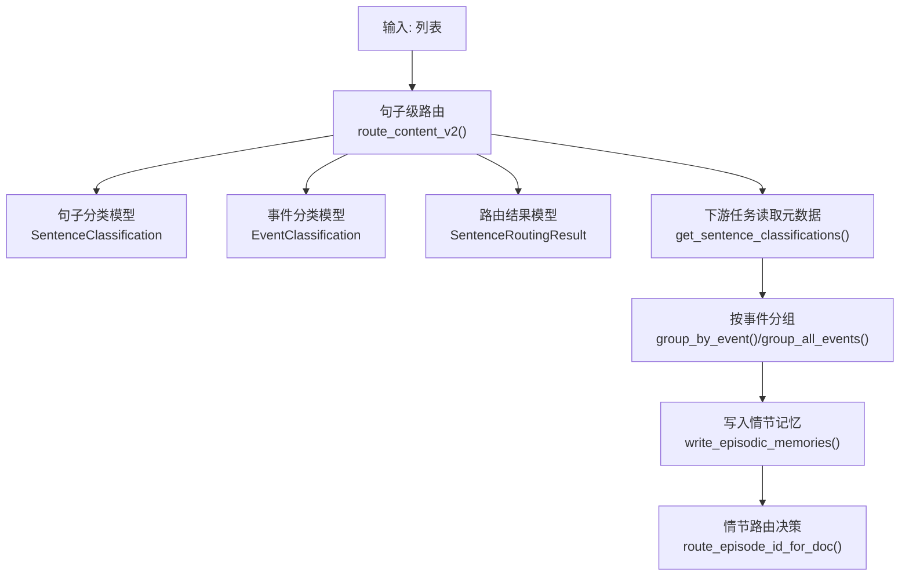
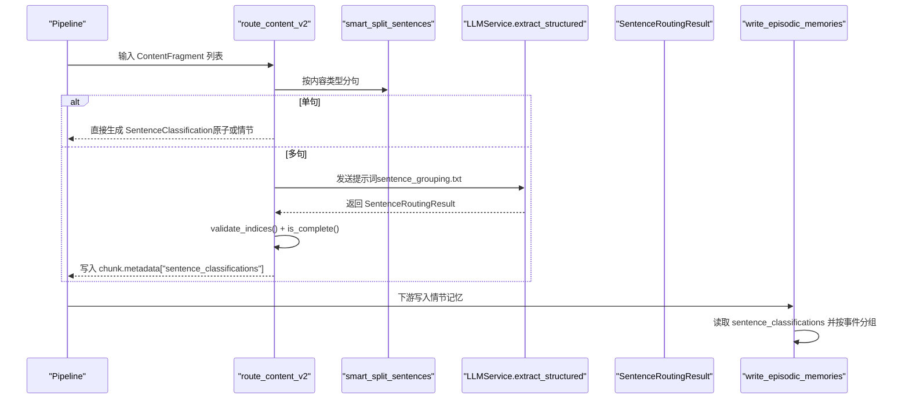
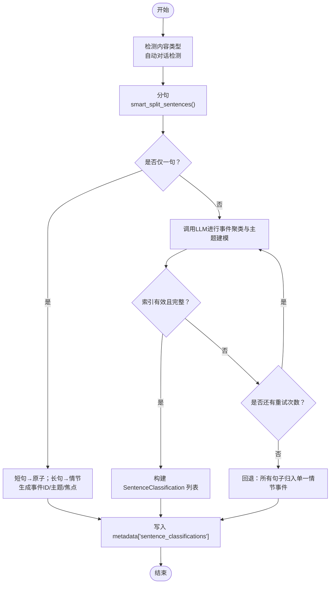
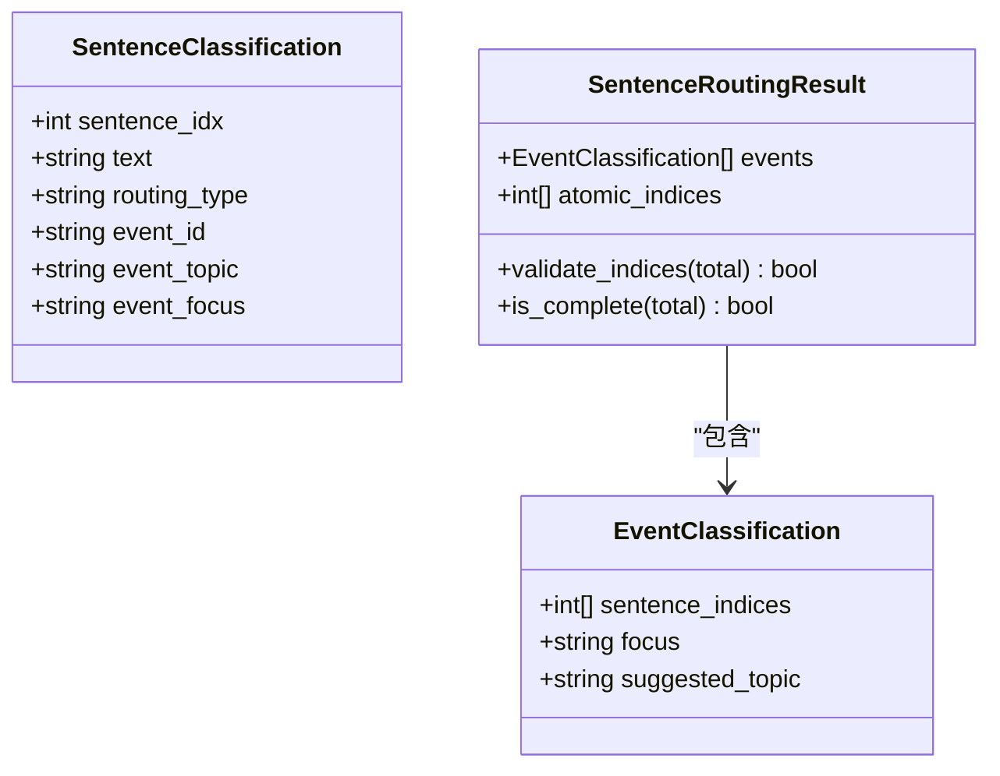
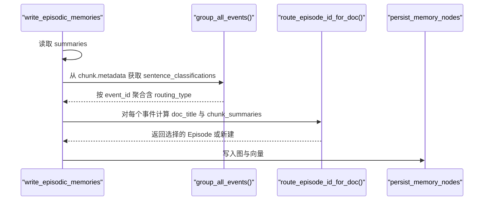
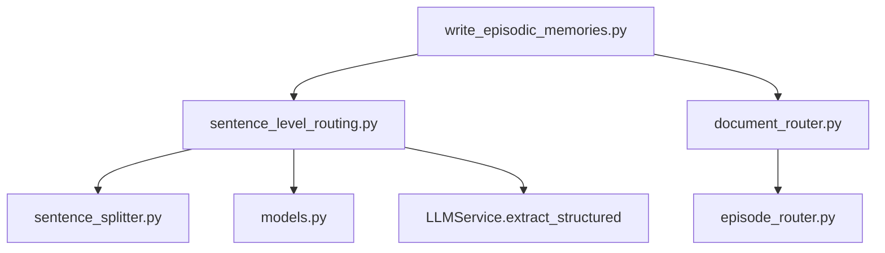

# 句子级路由机制

<cite>
**本文档引用的文件**
- [sentence_level_routing.py](file://m_flow/memory/episodic/sentence_level_routing.py)
- [models.py](file://m_flow/memory/episodic/models.py)
- [sentence_splitter.py](file://m_flow/memory/episodic/sentence_splitter.py)
- [episode_router.py](file://m_flow/memory/episodic/episode_router.py)
- [document_router.py](file://m_flow/memory/episodic/routing/document_router.py)
- [write_episodic_memories.py](file://m_flow/memory/episodic/write_episodic_memories.py)
- [sentence_grouping.txt](file://m_flow/llm/prompts/sentence_grouping.txt)
- [episodic_route_decision.txt](file://m_flow/llm/prompts/episodic_route_decision.txt)
</cite>

## 目录
1. [简介](#简介)
2. [项目结构](#项目结构)
3. [核心组件](#核心组件)
4. [架构总览](#架构总览)
5. [详细组件分析](#详细组件分析)
6. [依赖关系分析](#依赖关系分析)
7. [性能考虑](#性能考虑)
8. [故障排查指南](#故障排查指南)
9. [结论](#结论)
10. [附录](#附录)

## 简介
本文件系统性阐述 m_flow 中的句子级路由机制，重点覆盖以下目标：
- 在单个文本块内实现细粒度的内容分类与路由，支持将一个块同时拆分为多个事件与原子句。
- 深入解析 SentenceClassification、EventClassification、SentenceRoutingResult 等核心模型及其使用方式。
- 解释句子级路由的算法实现，包括事件聚类、主题建模与路由决策逻辑。
- 记录路由规则与约束条件，确保句子索引的唯一性与完整性。
- 提供路由质量评估方法与性能优化策略，并给出处理混合内容文本块的实际示例路径。

## 项目结构
句子级路由位于记忆模块的“情节记忆（Episodic）”子系统中，围绕 ContentFragment 的元数据扩展，形成“句子级分类 → 事件分组 → 写入情节记忆”的流水线。

图表来源
- [sentence_level_routing.py:85-140](file://m_flow/memory/episodic/sentence_level_routing.py#L85-L140)
- [models.py:419-548](file://m_flow/memory/episodic/models.py#L419-L548)
- [write_episodic_memories.py:178-200](file://m_flow/memory/episodic/write_episodic_memories.py#L178-L200)

章节来源
- [sentence_level_routing.py:1-140](file://m_flow/memory/episodic/sentence_level_routing.py#L1-L140)
- [models.py:419-548](file://m_flow/memory/episodic/models.py#L419-L548)

## 核心组件
- 路由入口与流程控制
  - route_content_v2：对一批 ContentFragment 执行句子级路由，将分类结果写入 chunk.metadata["sentence_classifications"]，并返回原批处理列表以保持流水线一致性。
  - 控制开关：MFLOW_CONTENT_ROUTING（默认启用），并支持自动对话内容类型检测（MFLOW_AUTO_DETECT_DIALOG）。
- 分类模型
  - SentenceClassification：描述单句在块内的分类信息（路由类型、事件ID、主题、语义焦点等）。
  - EventClassification：描述由 LLM 输出的事件分组（包含句索引集合、焦点、建议主题）。
  - SentenceRoutingResult：LLM 的路由输出模式，包含事件列表与原子句索引列表，并提供索引校验与完整性检查。
- 辅助工具
  - smart_split_sentences：根据显式声明的内容类型（文本/对话）进行智能分句；对话模式下按说话人保留整段为一条“话语单元”。
  - group_by_event/group_all_events：按事件ID对句子进行分组，后者同时处理原子句。

章节来源
- [sentence_level_routing.py:85-140](file://m_flow/memory/episodic/sentence_level_routing.py#L85-L140)
- [models.py:419-548](file://m_flow/memory/episodic/models.py#L419-L548)
- [sentence_splitter.py:214-264](file://m_flow/memory/episodic/sentence_splitter.py#L214-L264)

## 架构总览
句子级路由贯穿“分句 → LLM分类 → 元数据落盘 → 下游分组 → 写入情节记忆”的链路，其中 LLM 的提示词来自 prompts 文件，确保输出结构化且可验证。

图表来源
- [sentence_level_routing.py:143-296](file://m_flow/memory/episodic/sentence_level_routing.py#L143-L296)
- [sentence_grouping.txt](file://m_flow/llm/prompts/sentence_grouping.txt)

章节来源
- [sentence_level_routing.py:143-296](file://m_flow/memory/episodic/sentence_level_routing.py#L143-L296)
- [sentence_grouping.txt](file://m_flow/llm/prompts/sentence_grouping.txt)

## 详细组件分析

### 组件一：句子级路由主流程（route_content_v2）
- 功能要点
  - 自动检测对话内容类型（基于样本统计与正则），必要时强制切换到 DIALOG 模式。
  - 对每个块执行分句；单句时依据长度与语言特征决定原子或情节路由，并直接生成分类。
  - 多句时调用 LLM 进行事件聚类与主题建模，失败时重试一次，最终回退为“全部作为单一情节事件”。
  - 将分类结果写入 chunk.metadata["sentence_classifications"]，并按句索引排序保证一致性。
- 关键约束
  - 索引唯一性与完整性：SentenceRoutingResult.validate_indices() 与 is_complete() 保障每句仅出现一次且覆盖全量。
  - 错误恢复：任何异常均回退为“全部情节路由”，确保下游处理不中断。
- 输出形态
  - 每个块的分类列表，包含 routing_type、event_id、event_topic、event_focus 等字段，供后续阶段使用。

图表来源
- [sentence_level_routing.py:115-296](file://m_flow/memory/episodic/sentence_level_routing.py#L115-L296)

章节来源
- [sentence_level_routing.py:115-296](file://m_flow/memory/episodic/sentence_level_routing.py#L115-L296)

### 组件二：分句器（smart_split_sentences）
- 设计目标
  - 面向英文与中文的保守分句策略，避免错误断句；对话模式下按说话人保留整段为一条“话语单元”，并过滤常见非对话前缀。
- 关键能力
  - 语言自适应：中文使用特定标点集，英文使用缩写保护与边界匹配。
  - 对话识别：严格的正则表达式匹配说话人格式，结合非对话前缀集合降低误判。
- 使用建议
  - 当启用内容路由时，需显式传入内容类型（文本/对话），否则可能无法正确拆分。

章节来源
- [sentence_splitter.py:214-264](file://m_flow/memory/episodic/sentence_splitter.py#L214-L264)

### 组件三：核心数据模型
- SentenceClassification
  - 字段：sentence_idx、text、routing_type、event_id、event_topic、event_focus。
  - 作用：记录单句在块内的路由结果，支撑下游按事件分组与情节命名。
- EventClassification
  - 字段：sentence_indices、focus、suggested_topic。
  - 作用：描述由 LLM 归并出的事件，包含焦点句与建议主题。
- SentenceRoutingResult
  - 字段：events、atomic_indices。
  - 校验：validate_indices(total) 与 is_complete(total)，确保索引范围合法、无重复、全覆盖。
- 事件路由决策模型（Episode 级）
  - EpisodeCandidate、RouteDecision：用于情节路由决策（合并现有或新建），与句子级路由协同工作。

图表来源
- [models.py:419-548](file://m_flow/memory/episodic/models.py#L419-L548)

章节来源
- [models.py:419-548](file://m_flow/memory/episodic/models.py#L419-L548)

### 组件四：下游分组与写入
- 分组函数
  - group_by_event：仅处理情节句，按 event_id 聚合。
  - group_all_events：同时处理情节句与原子句，返回包含 routing_type 的聚合字典。
- 写入流程
  - write_episodic_memories 读取每个块的 sentence_classifications，按事件ID分组，生成情节与面（Facet），并写入图数据库与向量索引。
  - episode_router.route_episode_id_for_doc：在情节层面做路由决策（合并或新建），结合向量召回与 LLM 决策。

图表来源
- [write_episodic_memories.py:324-379](file://m_flow/memory/episodic/write_episodic_memories.py#L324-L379)
- [episode_router.py:319-370](file://m_flow/memory/episodic/episode_router.py#L319-L370)
- [document_router.py:105-201](file://m_flow/memory/episodic/routing/document_router.py#L105-L201)

章节来源
- [write_episodic_memories.py:324-379](file://m_flow/memory/episodic/write_episodic_memories.py#L324-L379)
- [episode_router.py:319-370](file://m_flow/memory/episodic/episode_router.py#L319-L370)
- [document_router.py:105-201](file://m_flow/memory/episodic/routing/document_router.py#L105-L201)

## 依赖关系分析
- 模块耦合
  - sentence_level_routing 依赖 sentence_splitter（分句）、LLMService（结构化抽取）、models（路由结果模式）。
  - write_episodic_memories 依赖 sentence_level_routing 的元数据，以及 episode_router 的情节路由决策。
  - document_router 提供并行化的实体提取与路由任务，与 episode_router 协同。
- 外部依赖
  - 向量引擎与图引擎：用于情节路由的检索与详情拉取。
  - LLM 提示词：sentence_grouping.txt 与 episodic_route_decision.txt。

图表来源
- [sentence_level_routing.py:26-36](file://m_flow/memory/episodic/sentence_level_routing.py#L26-L36)
- [write_episodic_memories.py:51-54](file://m_flow/memory/episodic/write_episodic_memories.py#L51-L54)
- [document_router.py:42-42](file://m_flow/memory/episodic/routing/document_router.py#L42-L42)
- [episode_router.py:33-36](file://m_flow/memory/episodic/episode_router.py#L33-L36)

章节来源
- [sentence_level_routing.py:26-36](file://m_flow/memory/episodic/sentence_level_routing.py#L26-L36)
- [write_episodic_memories.py:51-54](file://m_flow/memory/episodic/write_episodic_memories.py#L51-L54)
- [document_router.py:42-42](file://m_flow/memory/episodic/routing/document_router.py#L42-L42)
- [episode_router.py:33-36](file://m_flow/memory/episodic/episode_router.py#L33-L36)

## 性能考虑
- 并行化
  - 文档路由阶段采用并发实体提取与路由任务，显著降低端到端延迟。
  - 要求最低 LLM 并发阈值（_MIN_CONCURRENCY_FOR_PARALLEL）以避免 API 过载。
- LLM 调用节流
  - 全局 LLM 信号量统一控制并发，避免资源争用。
- 回退策略
  - 单句短句直接分类，避免不必要的 LLM 调用；多句失败重试一次，最终回退为单一情节事件。
- 向量检索优化
  - episode_router 并发检索多个集合，按秩合并候选，减少无效 LLM 决策成本。

章节来源
- [document_router.py:50-53](file://m_flow/memory/episodic/routing/document_router.py#L50-L53)
- [episode_router.py:122-150](file://m_flow/memory/episodic/episode_router.py#L122-L150)

## 故障排查指南
- 常见问题与定位
  - 分类结果为空：检查分句是否成功（smart_split_sentences 返回空），确认内容类型声明是否正确。
  - LLM 结果非法：validate_indices() 与 is_complete() 报告索引越界或覆盖不全，查看日志中的“缺失索引”统计。
  - 回退触发：当路由异常时会回退为“全部情节路由”，检查异常日志与重试次数。
- 排查步骤
  - 确认 MFLOW_CONTENT_ROUTING 与 MFLOW_AUTO_DETECT_DIALOG 设置。
  - 查看路由统计日志（事件数、情节句数、原子句数）。
  - 检查提示词文件是否存在且可读（sentence_grouping.txt、episodic_route_decision.txt）。
- 相关实现参考
  - 错误回退与统计日志：[sentence_level_routing.py:132-138](file://m_flow/memory/episodic/sentence_level_routing.py#L132-L138)
  - 索引校验与重试逻辑：[sentence_level_routing.py:203-244](file://m_flow/memory/episodic/sentence_level_routing.py#L203-L244)
  - 回退为单一情节事件：[sentence_level_routing.py:340-359](file://m_flow/memory/episodic/sentence_level_routing.py#L340-L359)

章节来源
- [sentence_level_routing.py:132-138](file://m_flow/memory/episodic/sentence_level_routing.py#L132-L138)
- [sentence_level_routing.py:203-244](file://m_flow/memory/episodic/sentence_level_routing.py#L203-L244)
- [sentence_level_routing.py:340-359](file://m_flow/memory/episodic/sentence_level_routing.py#L340-L359)

## 结论
句子级路由通过“分句 + LLM 事件聚类 + 主题建模 + 元数据落盘”的闭环，实现了对单文本块内复杂内容的细粒度路由。其核心在于：
- 明确的索引唯一性与完整性约束，确保下游分组与写入稳定可靠；
- 健壮的回退策略与重试机制，提升鲁棒性；
- 与情节路由决策的协同，形成从“句子级”到“情节级”的统一记忆组织。

## 附录

### 路由规则与约束条件
- 索引规则
  - 每个句子的索引必须在 [0, total_sentences-1] 范围内，且仅出现一次。
  - 事件间与事件与原子句之间不得有索引重叠。
- 主题与焦点
  - 建议主题应具体、可区分，避免宽泛类别（如“日常活动”、“工作”）。
  - 焦点为该事件的限定性语义摘要，便于检索与命名。
- 元数据字段
  - routing_type：episodic 或 atomic。
  - event_id：情节标识，原子句也生成独立事件ID以便进入情节管线。
  - event_topic/event_focus：用于情节命名与检索锚定。

章节来源
- [models.py:487-491](file://m_flow/memory/episodic/models.py#L487-L491)
- [models.py:470-477](file://m_flow/memory/episodic/models.py#L470-L477)

### 路由质量评估方法
- 精度指标
  - 索引校验通过率：validate_indices() 与 is_complete() 的成功率。
  - 事件覆盖率：事件与原子句索引合计占总句数的比例。
- 召回指标
  - 事件焦点句质量：焦点句是否准确概括事件语义。
  - 建议主题可区分度：主题标签是否能有效区分不同事件。
- 可靠性指标
  - 回退频率：异常导致的回退次数占比。
  - 重试命中率：首次即通过与重试后通过的比例。

章节来源
- [sentence_level_routing.py:206-216](file://m_flow/memory/episodic/sentence_level_routing.py#L206-L216)
- [models.py:502-547](file://m_flow/memory/episodic/models.py#L502-L547)

### 实际代码示例（路径）
- 单句短文的路由（原子/情节自动判定）：  
  [sentence_level_routing.py:164-197](file://m_flow/memory/episodic/sentence_level_routing.py#L164-L197)
- 多句文本的 LLM 路由与重试：  
  [sentence_level_routing.py:203-244](file://m_flow/memory/episodic/sentence_level_routing.py#L203-L244)
- 事件聚类与主题建模提示词：  
  [sentence_grouping.txt](file://m_flow/llm/prompts/sentence_grouping.txt)
- 情节路由决策提示词：  
  [episodic_route_decision.txt](file://m_flow/llm/prompts/episodic_route_decision.txt)
- 按事件分组与聚合：  
  [sentence_level_routing.py:457-525](file://m_flow/memory/episodic/sentence_level_routing.py#L457-L525)
- 写入情节记忆并路由到现有/新建情节：  
  [write_episodic_memories.py:324-379](file://m_flow/memory/episodic/write_episodic_memories.py#L324-L379)  
  [episode_router.py:319-370](file://m_flow/memory/episodic/episode_router.py#L319-L370)  
  [document_router.py:105-201](file://m_flow/memory/episodic/routing/document_router.py#L105-L201)