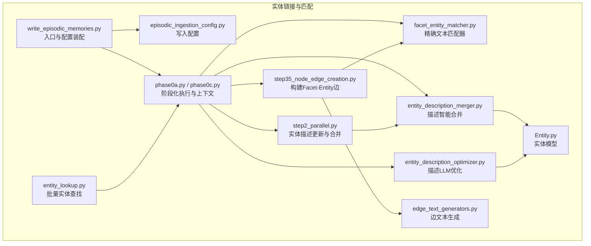
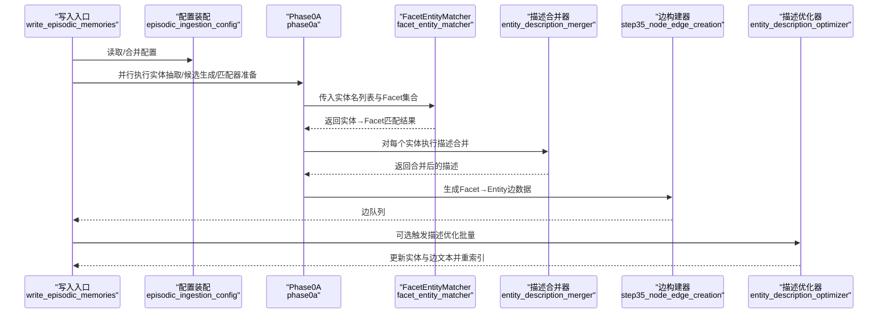
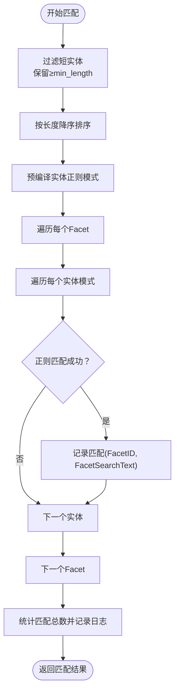
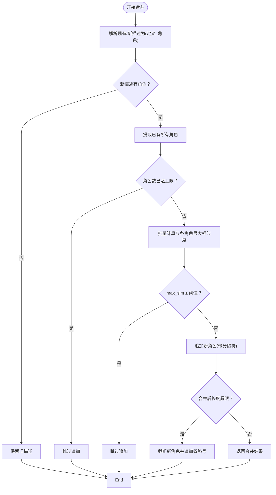
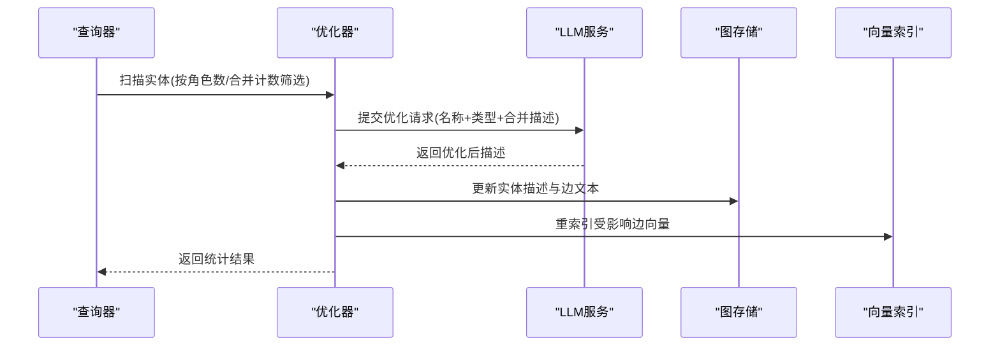
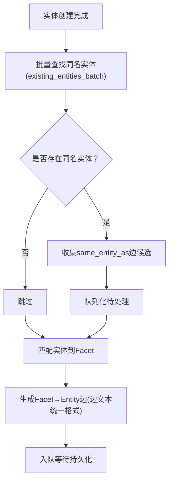
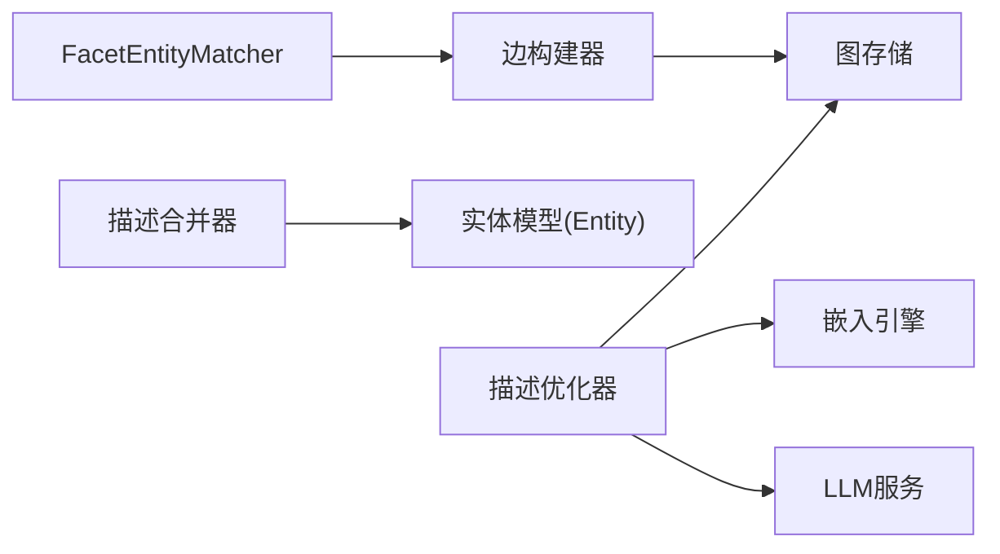

# 实体链接和匹配

<cite>
**本文引用的文件**
- [facet_entity_matcher.py](file://m_flow/memory/episodic/facet_entity_matcher.py)
- [entity_description_merger.py](file://m_flow/memory/episodic/entity_description_merger.py)
- [entity_description_optimizer.py](file://m_flow/memory/episodic/entity_description_optimizer.py)
- [step35_node_edge_creation.py](file://m_flow/memory/episodic/episode_builder/step35_node_edge_creation.py)
- [step2_parallel.py](file://m_flow/memory/episodic/episode_builder/step2_parallel.py)
- [episodic_ingestion_config.py](file://m_flow/memory/episodic/episodic_ingestion_config.py)
- [phase0a.py](file://m_flow/memory/episodic/episode_builder/phase0a.py)
- [phase0c.py](file://m_flow/memory/episodic/episode_builder/phase0c.py)
- [entity_lookup.py](file://m_flow/memory/episodic/utils/entity_lookup.py)
- [edge_text_generators.py](file://m_flow/memory/episodic/edge_text_generators.py)
- [write_episodic_memories.py](file://m_flow/memory/episodic/write_episodic_memories.py)
- [Entity.py](file://m_flow/core/domain/models/Entity.py)
- [report.py](file://m_flow/eval/report.py)
- [metrics_test_utils.py](file://m_flow/tests/tasks/descriptive_metrics/metrics_test_utils.py)
</cite>

## 目录
1. [引言](#引言)
2. [项目结构](#项目结构)
3. [核心组件](#核心组件)
4. [架构总览](#架构总览)
5. [详细组件分析](#详细组件分析)
6. [依赖分析](#依赖分析)
7. [性能考量](#性能考量)
8. [故障排查指南](#故障排查指南)
9. [结论](#结论)
10. [附录](#附录)

## 引言
本文件系统性阐述 m_flow 中“实体链接与匹配”机制的技术实现，重点围绕以下目标：
- 如何从文本中识别实体并将它们链接到现有知识图谱中的“Facet”节点；
- FacetEntityMatcher 的匹配算法设计、边界条件与效率优化；
- 实体描述合并与冲突处理策略；
- 描述优化算法（LLM 驱动）与去重逻辑；
- 质量评估指标与性能基准建议；
- 可调参数与配置项、常见问题与排错。

## 项目结构
与实体链接直接相关的模块主要位于 episodic 写入流水线中，涉及实体抽取、Facet 匹配、实体描述合并、边构建与优化等阶段。下图给出与实体链接相关的核心文件与职责概览：

图表来源
- [facet_entity_matcher.py:172-256](file://m_flow/memory/episodic/facet_entity_matcher.py#L172-L256)
- [entity_description_merger.py:181-253](file://m_flow/memory/episodic/entity_description_merger.py#L181-L253)
- [entity_description_optimizer.py:131-353](file://m_flow/memory/episodic/entity_description_optimizer.py#L131-L353)
- [step35_node_edge_creation.py:467-501](file://m_flow/memory/episodic/episode_builder/step35_node_edge_creation.py#L467-L501)
- [step2_parallel.py:318-340](file://m_flow/memory/episodic/episode_builder/step2_parallel.py#L318-L340)
- [episodic_ingestion_config.py:152-208](file://m_flow/memory/episodic/episodic_ingestion_config.py#L152-L208)
- [phase0a.py:522-553](file://m_flow/memory/episodic/episode_builder/phase0a.py#L522-L553)
- [phase0c.py:109-140](file://m_flow/memory/episodic/episode_builder/phase0c.py#L109-L140)
- [entity_lookup.py:82-146](file://m_flow/memory/episodic/utils/entity_lookup.py#L82-L146)
- [edge_text_generators.py](file://m_flow/memory/episodic/edge_text_generators.py)
- [write_episodic_memories.py:246-270](file://m_flow/memory/episodic/write_episodic_memories.py#L246-L270)
- [Entity.py:1-120](file://m_flow/core/domain/models/Entity.py#L1-L120)

章节来源
- [facet_entity_matcher.py:1-309](file://m_flow/memory/episodic/facet_entity_matcher.py#L1-L309)
- [entity_description_merger.py:1-299](file://m_flow/memory/episodic/entity_description_merger.py#L1-L299)
- [entity_description_optimizer.py:1-423](file://m_flow/memory/episodic/entity_description_optimizer.py#L1-L423)
- [step35_node_edge_creation.py:467-501](file://m_flow/memory/episodic/episode_builder/step35_node_edge_creation.py#L467-L501)
- [step2_parallel.py:318-340](file://m_flow/memory/episodic/episode_builder/step2_parallel.py#L318-L340)
- [episodic_ingestion_config.py:152-208](file://m_flow/memory/episodic/episodic_ingestion_config.py#L152-L208)
- [phase0a.py:522-553](file://m_flow/memory/episodic/episode_builder/phase0a.py#L522-L553)
- [phase0c.py:109-140](file://m_flow/memory/episodic/episode_builder/phase0c.py#L109-L140)
- [entity_lookup.py:82-146](file://m_flow/memory/episodic/utils/entity_lookup.py#L82-L146)
- [edge_text_generators.py](file://m_flow/memory/episodic/edge_text_generators.py)
- [write_episodic_memories.py:246-270](file://m_flow/memory/episodic/write_episodic_memories.py#L246-L270)
- [Entity.py:1-120](file://m_flow/core/domain/models/Entity.py#L1-L120)

## 核心组件
- FacetEntityMatcher：基于精确文本匹配（含边界感知）将实体名映射到 Facet；支持单字符严格边界匹配与多字符单词边界/子串匹配。
- 实体描述合并器：按“定义; 上下文角色”的格式拆分描述，仅对新上下文角色进行向量相似度去重后追加，并限制最大角色数与总长度。
- 描述优化器：通过 LLM 将多上下文角色的合并描述重写为更凝练、一致的单一描述，并同步更新相关边文本与向量索引。
- 边构建器：根据匹配结果生成 Facet→Entity 的“involves_entity”边，使用统一的边文本生成器保证一致性。
- 配置与上下文：通过环境变量与函数参数装配写入配置，控制是否启用语义合并、阈值、路由开关等。

章节来源
- [facet_entity_matcher.py:172-256](file://m_flow/memory/episodic/facet_entity_matcher.py#L172-L256)
- [entity_description_merger.py:181-253](file://m_flow/memory/episodic/entity_description_merger.py#L181-L253)
- [entity_description_optimizer.py:131-353](file://m_flow/memory/episodic/entity_description_optimizer.py#L131-L353)
- [step35_node_edge_creation.py:467-501](file://m_flow/memory/episodic/episode_builder/step35_node_edge_creation.py#L467-L501)
- [episodic_ingestion_config.py:152-208](file://m_flow/memory/episodic/episodic_ingestion_config.py#L152-L208)

## 架构总览
实体链接在写入流程中的关键路径如下：

图表来源
- [write_episodic_memories.py:246-270](file://m_flow/memory/episodic/write_episodic_memories.py#L246-L270)
- [episodic_ingestion_config.py:152-208](file://m_flow/memory/episodic/episodic_ingestion_config.py#L152-L208)
- [phase0a.py:522-553](file://m_flow/memory/episodic/episode_builder/phase0a.py#L522-L553)
- [facet_entity_matcher.py:172-256](file://m_flow/memory/episodic/facet_entity_matcher.py#L172-L256)
- [entity_description_merger.py:181-253](file://m_flow/memory/episodic/entity_description_merger.py#L181-L253)
- [step35_node_edge_creation.py:467-501](file://m_flow/memory/episodic/episode_builder/step35_node_edge_creation.py#L467-L501)
- [entity_description_optimizer.py:131-353](file://m_flow/memory/episodic/entity_description_optimizer.py#L131-L353)

## 详细组件分析

### FacetEntityMatcher：精确文本匹配与边界策略
- 算法要点
  - 单字符实体采用严格边界匹配：数字需两侧非数字；字母需两侧非字母；CJK 需两侧非 CJK。
  - 多字符实体：非 CJK 使用单词边界匹配；CJK 使用简单子串匹配。
  - 匹配前先按实体长度降序排序，优先匹配更具体的长实体，减少误匹配。
  - 预编译正则模式，避免重复编译开销。
- 输入输出
  - 输入：实体名列表、Facet 列表（支持对象或字典）、最小实体长度。
  - 输出：实体名到匹配 Facet 信息（Facet ID、Facet 搜索文本）的映射。
- 性能与鲁棒性
  - 过滤短实体、跳过空文本 Facet、统计匹配数量用于调试。
  - 支持字典/对象两种 Facet 接口，增强兼容性。

图表来源
- [facet_entity_matcher.py:172-256](file://m_flow/memory/episodic/facet_entity_matcher.py#L172-L256)

章节来源
- [facet_entity_matcher.py:67-124](file://m_flow/memory/episodic/facet_entity_matcher.py#L67-L124)
- [facet_entity_matcher.py:172-256](file://m_flow/memory/episodic/facet_entity_matcher.py#L172-L256)

### 实体描述合并机制：去重与冲突处理
- 描述格式
  - “定义; 上下文角色”，若无分号则整个视为定义。
- 合并策略
  - 仅当新描述存在“上下文角色”时才考虑追加。
  - 计算新角色与已有所有角色的最大向量相似度，超过阈值则跳过，避免重复。
  - 最大保留角色数可配置，超限则跳过。
  - 合并后长度超限则截断新角色尾部并追加省略号。
  - 合并计数 merge_count 继承并递增，便于后续优化触发。
- 关键参数
  - 相似度阈值、最大总长度、最大上下文角色数。

图表来源
- [entity_description_merger.py:181-253](file://m_flow/memory/episodic/entity_description_merger.py#L181-L253)

章节来源
- [entity_description_merger.py:29-68](file://m_flow/memory/episodic/entity_description_merger.py#L29-L68)
- [entity_description_merger.py:181-253](file://m_flow/memory/episodic/entity_description_merger.py#L181-L253)
- [step2_parallel.py:318-340](file://m_flow/memory/episodic/episode_builder/step2_parallel.py#L318-L340)
- [Entity.py:1-120](file://m_flow/core/domain/models/Entity.py#L1-L120)

### 描述优化算法：LLM 精炼与边文本更新
- 触发条件
  - 合并计数 merge_count 或上下文角色数达到阈值。
- 优化流程
  - 查询所有实体节点（或指定 Episode 关联实体），筛选需要优化的实体。
  - 使用 LLM 将合并描述重写为更凝练、一致的单一描述。
  - 更新实体节点描述并同步更新“involves_entity”边文本（区分 Facet 与 Episode 源）。
  - 重新索引受影响的边向量，确保检索质量。
- 批处理与可观测性
  - 支持批大小控制并发；记录扫描、需要优化、成功、失败、跳过的统计。

图表来源
- [entity_description_optimizer.py:131-353](file://m_flow/memory/episodic/entity_description_optimizer.py#L131-L353)

章节来源
- [entity_description_optimizer.py:64-124](file://m_flow/memory/episodic/entity_description_optimizer.py#L64-L124)
- [entity_description_optimizer.py:131-353](file://m_flow/memory/episodic/entity_description_optimizer.py#L131-L353)

### 边构建与实体消歧：same_entity_as 与涉及边
- same_entity_as 边收集
  - 在实体创建阶段，对同名实体（同一 canonical_name）收集待建立“same_entity_as”边的候选。
  - 仅当实体出现在“involves_entity”上下文中时才纳入收集，避免无关链接。
- Facet→Entity 边
  - 使用统一的边文本生成器，将实体名、描述与 Facet 搜索文本组合，形成可检索的边文本。
  - 该边作为细粒度召回与 Episode 分割的基础。

图表来源
- [phase0c.py:109-140](file://m_flow/memory/episodic/episode_builder/phase0c.py#L109-L140)
- [entity_lookup.py:82-146](file://m_flow/memory/episodic/utils/entity_lookup.py#L82-L146)
- [step35_node_edge_creation.py:467-501](file://m_flow/memory/episodic/episode_builder/step35_node_edge_creation.py#L467-L501)
- [edge_text_generators.py](file://m_flow/memory/episodic/edge_text_generators.py)

章节来源
- [phase0c.py:109-140](file://m_flow/memory/episodic/episode_builder/phase0c.py#L109-L140)
- [entity_lookup.py:82-146](file://m_flow/memory/episodic/utils/entity_lookup.py#L82-L146)
- [step35_node_edge_creation.py:467-501](file://m_flow/memory/episodic/episode_builder/step35_node_edge_creation.py#L467-L501)

## 依赖分析
- 组件耦合
  - FacetEntityMatcher 与边构建器紧密协作，前者负责匹配，后者负责落边。
  - 描述合并器与实体模型（Entity）强关联，依赖 merge_count 字段驱动优化。
  - 描述优化器依赖图存储抽象与向量索引，以保证检索质量。
- 外部依赖
  - 嵌入引擎（向量化）：用于相似度计算与批量嵌入。
  - LLM 服务：用于描述优化。
  - 图存储适配器：提供节点/边查询与更新能力。

图表来源
- [facet_entity_matcher.py:259-308](file://m_flow/memory/episodic/facet_entity_matcher.py#L259-L308)
- [entity_description_merger.py:18-21](file://m_flow/memory/episodic/entity_description_merger.py#L18-L21)
- [entity_description_optimizer.py:31-38](file://m_flow/memory/episodic/entity_description_optimizer.py#L31-L38)

章节来源
- [entity_description_merger.py:18-21](file://m_flow/memory/episodic/entity_description_merger.py#L18-L21)
- [entity_description_optimizer.py:31-38](file://m_flow/memory/episodic/entity_description_optimizer.py#L31-L38)

## 性能考量
- 正则匹配优化
  - 预编译实体模式，避免重复编译。
  - 长实体优先匹配，减少误命中。
- 向量相似度优化
  - 批量嵌入一次计算多个候选，降低往返开销。
  - 仅在必要时触发 LLM 优化，支持批处理与干跑（dry-run）。
- 数据访问优化
  - 批量实体查找，减少数据库往返。
- 资源控制
  - LLM 并发限制、批大小、阈值等可通过配置调节。

章节来源
- [facet_entity_matcher.py:220-221](file://m_flow/memory/episodic/facet_entity_matcher.py#L220-L221)
- [entity_description_merger.py:134-173](file://m_flow/memory/episodic/entity_description_merger.py#L134-L173)
- [entity_description_optimizer.py:131-151](file://m_flow/memory/episodic/entity_description_optimizer.py#L131-L151)
- [entity_lookup.py:82-146](file://m_flow/memory/episodic/utils/entity_lookup.py#L82-L146)
- [episodic_ingestion_config.py:152-208](file://m_flow/memory/episodic/episodic_ingestion_config.py#L152-L208)

## 故障排查指南
- 匹配不到任何实体
  - 检查实体名长度过滤与 Facet 文本是否为空。
  - 确认 Facet 的 search_text 与 description 是否包含目标实体词。
- 误匹配/边界误判
  - 单字符实体需满足严格边界条件；检查输入是否符合数字/字母/CJK 的边界规则。
- 描述未合并
  - 新描述无上下文角色（无分号）则不会追加；确认描述格式。
  - 相似度过高被判定为重复；适当降低阈值或调整描述内容。
- 优化失败
  - LLM 服务异常或返回为空；查看日志并重试。
  - 图更新失败（边属性更新）通常为后端特定语法问题，检查图存储后端与权限。
- 性能问题
  - 正则编译与批量嵌入已优化；如仍慢，检查 LLM 并发与批大小设置。

章节来源
- [facet_entity_matcher.py:202-215](file://m_flow/memory/episodic/facet_entity_matcher.py#L202-L215)
- [entity_description_merger.py:217-236](file://m_flow/memory/episodic/entity_description_merger.py#L217-L236)
- [entity_description_optimizer.py:178-180](file://m_flow/memory/episodic/entity_description_optimizer.py#L178-L180)
- [entity_description_optimizer.py:309-311](file://m_flow/memory/episodic/entity_description_optimizer.py#L309-L311)

## 结论
本方案以“精确文本匹配 + 智能描述合并 + LLM 精炼”的组合实现高质量的实体链接与知识图谱维护。通过严格的边界匹配与向量去重，有效降低误链与冗余；通过统一的边文本生成与向量索引重排，保障检索质量与可扩展性。建议在生产环境中结合阈值、批大小与并发参数进行调优，并定期运行描述优化以保持知识的一致性与可读性。

## 附录

### 配置选项与调优参数
- 启用语义合并与阈值
  - enable_semantic_merge：是否启用语义合并（默认关闭）。
  - semantic_merge_threshold：语义合并阈值（默认 0.90）。
- 写入阶段参数
  - enable_episode_routing / enable_facet_points / enable_llm_entity_for_routing：路由与 Facet 点生成开关。
  - max_entities_per_episode / max_new_facets_per_batch / max_existing_facets_in_prompt 等：控制提示词规模与吞吐。
- 描述合并参数
  - similarity_threshold：角色相似度阈值（默认 0.75）。
  - max_total_length / max_context_roles：描述总长度与最大角色数限制。
- 描述优化参数
  - min_context_roles：触发优化的最小角色数（默认 2）。
  - batch_size：批大小（默认 10）。
  - dry_run：干跑模式，不写入数据库。

章节来源
- [episodic_ingestion_config.py:152-208](file://m_flow/memory/episodic/episodic_ingestion_config.py#L152-L208)
- [write_episodic_memories.py:246-270](file://m_flow/memory/episodic/write_episodic_memories.py#L246-L270)
- [entity_description_merger.py:185-201](file://m_flow/memory/episodic/entity_description_merger.py#L185-L201)
- [entity_description_optimizer.py:131-151](file://m_flow/memory/episodic/entity_description_optimizer.py#L131-L151)

### 质量评估指标与基准建议
- 指标参考
  - 召回率@1/2/3、上下文完整性、触发准确率、误注率（FP 注入率）。
- 基准方法
  - 使用评估报告工具对比当前版本与基线版本的指标差异，关注 FP 注入率上升等回归信号。
- 建议
  - 在不同阈值与批大小下进行 A/B 测试，观察召回与误注之间的平衡。

章节来源
- [report.py:194-230](file://m_flow/eval/report.py#L194-L230)
- [metrics_test_utils.py:129-137](file://m_flow/tests/tasks/descriptive_metrics/metrics_test_utils.py#L129-L137)