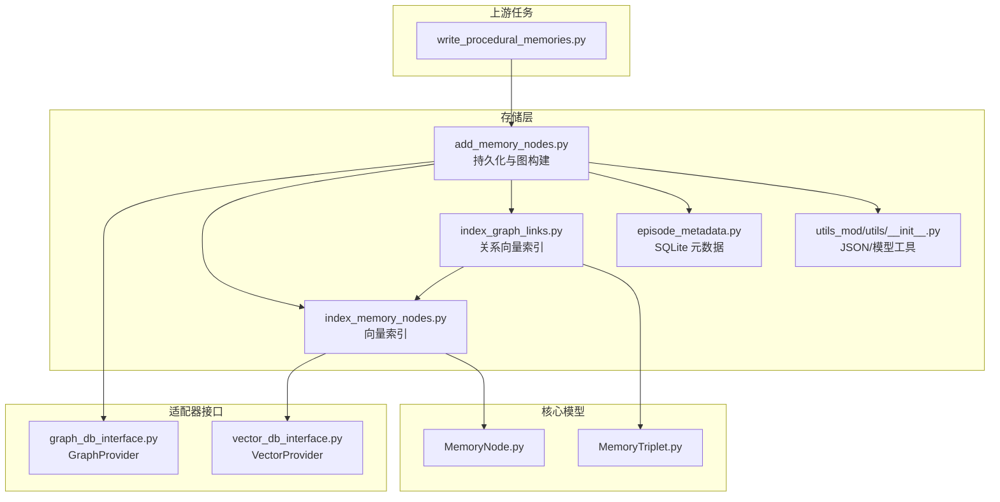
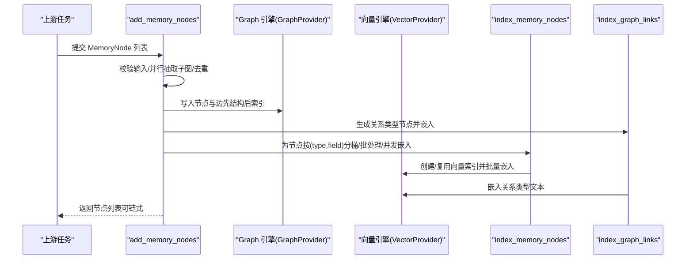
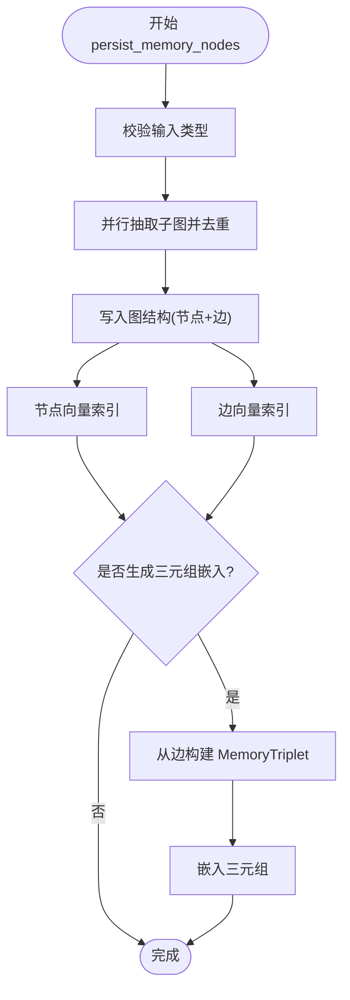
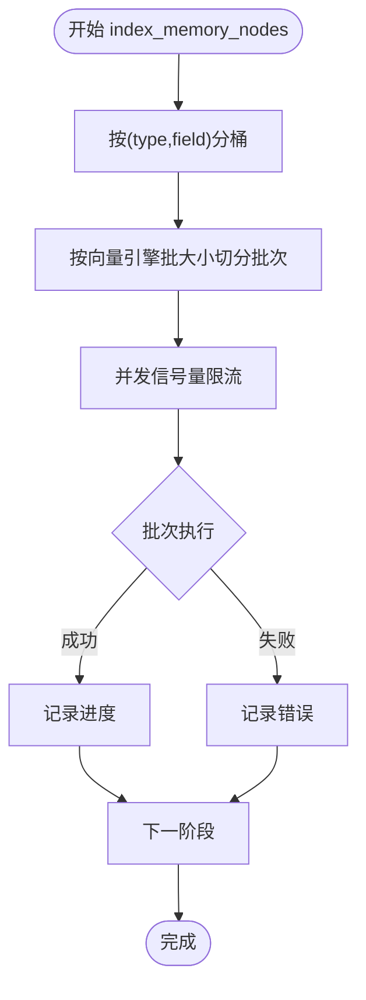
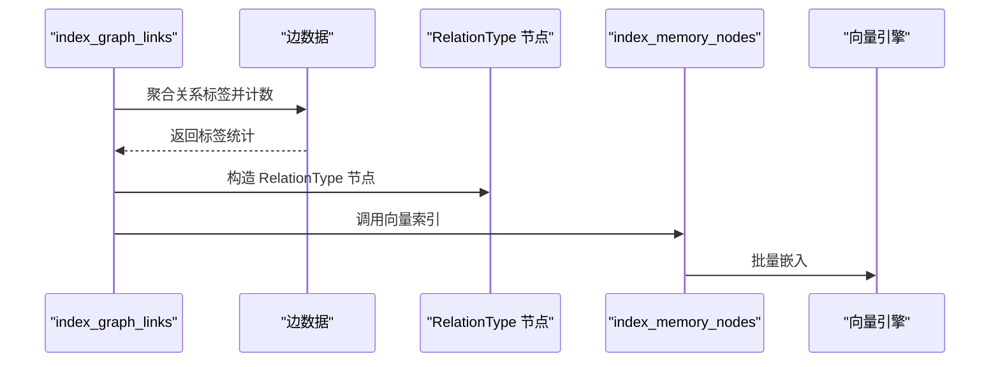
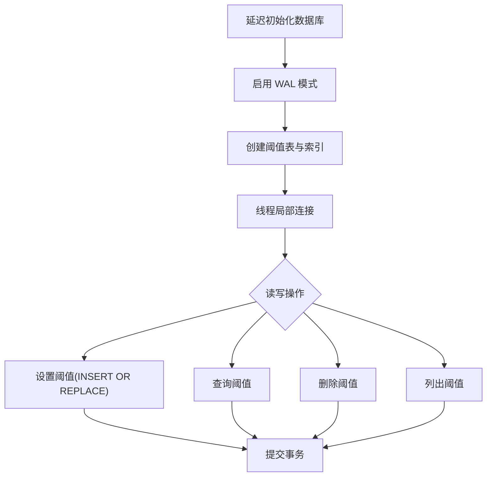
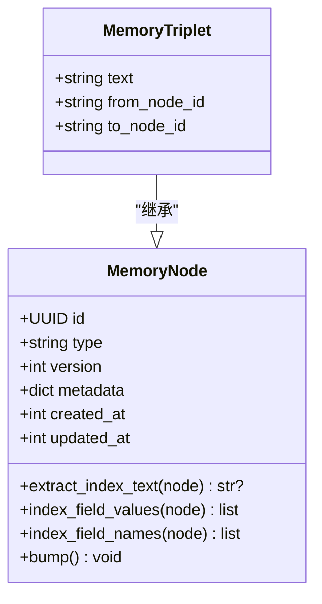
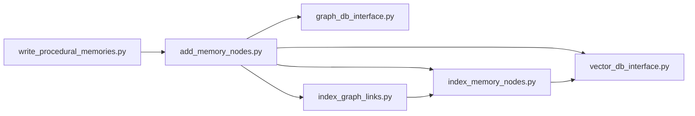

# 记忆存储策略

<cite>
**本文引用的文件**
- [m_flow/storage/__init__.py](file://m_flow/storage/__init__.py)
- [m_flow/storage/add_memory_nodes.py](file://m_flow/storage/add_memory_nodes.py)
- [m_flow/storage/index_memory_nodes.py](file://m_flow/storage/index_memory_nodes.py)
- [m_flow/storage/index_graph_links.py](file://m_flow/storage/index_graph_links.py)
- [m_flow/storage/episode_metadata.py](file://m_flow/storage/episode_metadata.py)
- [m_flow/storage/utils_mod/utils/__init__.py](file://m_flow/storage/utils_mod/utils/__init__.py)
- [m_flow/core/models/MemoryNode.py](file://m_flow/core/models/MemoryNode.py)
- [m_flow/core/domain/models/MemoryTriplet.py](file://m_flow/core/domain/models/MemoryTriplet.py)
- [m_flow/adapters/vector/vector_db_interface.py](file://m_flow/adapters/vector/vector_db_interface.py)
- [m_flow/adapters/graph/graph_db_interface.py](file://m_flow/adapters/graph/graph_db_interface.py)
- [m_flow/memory/procedural/write_procedural_memories.py](file://m_flow/memory/procedural/write_procedural_memories.py)
</cite>

## 目录
1. [简介](#简介)
2. [项目结构](#项目结构)
3. [核心组件](#核心组件)
4. [架构总览](#架构总览)
5. [详细组件分析](#详细组件分析)
6. [依赖分析](#依赖分析)
7. [性能考虑](#性能考虑)
8. [故障排查指南](#故障排查指南)
9. [结论](#结论)
10. [附录](#附录)

## 简介
本文件系统化阐述记忆存储策略，聚焦事件记忆的存储架构与数据持久化机制，覆盖内存节点的存储格式与索引策略（向量索引与图索引协同）、存储优化技术（数据压缩、批量写入、缓存策略）、存储元数据管理（事件元数据、时间戳与版本控制）、存储性能监控与调优、容量规划与扩展策略，以及灾难恢复与备份机制。文档以代码为依据，结合可视化图示帮助读者快速理解与落地。

## 项目结构
围绕“记忆存储”这一核心域，相关模块分布如下：
- 存储入口与编排：m_flow/storage 下的导出与入口函数
- 节点持久化与图构建：add_memory_nodes
- 向量索引：index_memory_nodes
- 关系向量索引：index_graph_links
- 元数据存储：episode_metadata（SQLite）
- 工具与序列化：storage/utils_mod/utils
- 核心模型：MemoryNode、MemoryTriplet
- 适配器接口：VectorProvider、GraphProvider
- 上游写入任务：write_procedural_memories（生成节点供存储层写入）

图表来源
- [m_flow/storage/add_memory_nodes.py:1-261](file://m_flow/storage/add_memory_nodes.py#L1-L261)
- [m_flow/storage/index_memory_nodes.py:1-235](file://m_flow/storage/index_memory_nodes.py#L1-L235)
- [m_flow/storage/index_graph_links.py:1-98](file://m_flow/storage/index_graph_links.py#L1-L98)
- [m_flow/storage/episode_metadata.py:1-253](file://m_flow/storage/episode_metadata.py#L1-L253)
- [m_flow/storage/utils_mod/utils/__init__.py:1-120](file://m_flow/storage/utils_mod/utils/__init__.py#L1-L120)
- [m_flow/core/models/MemoryNode.py:1-106](file://m_flow/core/models/MemoryNode.py#L1-L106)
- [m_flow/core/domain/models/MemoryTriplet.py:1-54](file://m_flow/core/domain/models/MemoryTriplet.py#L1-L54)
- [m_flow/adapters/vector/vector_db_interface.py:1-180](file://m_flow/adapters/vector/vector_db_interface.py#L1-L180)
- [m_flow/adapters/graph/graph_db_interface.py:1-347](file://m_flow/adapters/graph/graph_db_interface.py#L1-L347)
- [m_flow/memory/procedural/write_procedural_memories.py:1-669](file://m_flow/memory/procedural/write_procedural_memories.py#L1-L669)

章节来源
- [m_flow/storage/__init__.py:1-4](file://m_flow/storage/__init__.py#L1-L4)

## 核心组件
- 内存节点模型 MemoryNode：统一的版本化、可嵌入节点基类，支持字段级索引配置与时间戳管理。
- 记忆三元组 MemoryTriplet：面向关系检索的原子事实单元，文本字段作为主要索引目标。
- 图持久化与索引编排 add_memory_nodes：校验输入、并行抽取子图、去重、落库、刷新向量索引。
- 向量索引 index_memory_nodes：按类型/字段分桶、批处理、并发限流、失败隔离。
- 关系向量索引 index_graph_links：从边聚合关系标签，生成 RelationType 节点并嵌入。
- 元数据存储 episode_metadata：基于 SQLite 的轻量持久化，支持 WAL、线程安全与延迟初始化。
- 适配器接口 vector_db_interface、graph_db_interface：抽象向量与图数据库能力，便于替换后端。
- 工具与序列化 utils_mod/utils：JSON 扩展编码器、模型复制、扁平属性提取。

章节来源
- [m_flow/core/models/MemoryNode.py:1-106](file://m_flow/core/models/MemoryNode.py#L1-L106)
- [m_flow/core/domain/models/MemoryTriplet.py:1-54](file://m_flow/core/domain/models/MemoryTriplet.py#L1-L54)
- [m_flow/storage/add_memory_nodes.py:1-261](file://m_flow/storage/add_memory_nodes.py#L1-L261)
- [m_flow/storage/index_memory_nodes.py:1-235](file://m_flow/storage/index_memory_nodes.py#L1-L235)
- [m_flow/storage/index_graph_links.py:1-98](file://m_flow/storage/index_graph_links.py#L1-L98)
- [m_flow/storage/episode_metadata.py:1-253](file://m_flow/storage/episode_metadata.py#L1-L253)
- [m_flow/adapters/vector/vector_db_interface.py:1-180](file://m_flow/adapters/vector/vector_db_interface.py#L1-L180)
- [m_flow/adapters/graph/graph_db_interface.py:1-347](file://m_flow/adapters/graph/graph_db_interface.py#L1-L347)
- [m_flow/storage/utils_mod/utils/__init__.py:1-120](file://m_flow/storage/utils_mod/utils/__init__.py#L1-L120)

## 架构总览
记忆存储采用“图+向量”的混合索引架构：
- 图层负责结构化存储与关系表达，确保即使向量索引失败，仍可进行图查询。
- 向量层负责语义检索，通过按类型/字段分桶与批处理提升吞吐。
- 元数据层独立于图/向量，用于存储无法在图属性中动态添加的信息（如阈值）。

图表来源
- [m_flow/storage/add_memory_nodes.py:220-261](file://m_flow/storage/add_memory_nodes.py#L220-L261)
- [m_flow/storage/index_memory_nodes.py:114-183](file://m_flow/storage/index_memory_nodes.py#L114-L183)
- [m_flow/storage/index_graph_links.py:68-98](file://m_flow/storage/index_graph_links.py#L68-L98)
- [m_flow/adapters/graph/graph_db_interface.py:122-347](file://m_flow/adapters/graph/graph_db_interface.py#L122-L347)
- [m_flow/adapters/vector/vector_db_interface.py:16-180](file://m_flow/adapters/vector/vector_db_interface.py#L16-L180)

## 详细组件分析

### 组件A：节点持久化与图构建（add_memory_nodes）
职责与流程
- 输入校验：确保传入为 MemoryNode 列表。
- 并行抽取：对每个节点异步抽取子图，汇总后去重。
- 结构写入：先写节点再写边，保证图完整性。
- 向量索引：分别对节点与边进行向量索引，失败不影响图结构。
- 可选三元组嵌入：从最终边集合生成 MemoryTriplet 并嵌入。

图表来源
- [m_flow/storage/add_memory_nodes.py:220-261](file://m_flow/storage/add_memory_nodes.py#L220-L261)
- [m_flow/storage/index_memory_nodes.py:114-183](file://m_flow/storage/index_memory_nodes.py#L114-L183)
- [m_flow/storage/index_graph_links.py:68-98](file://m_flow/storage/index_graph_links.py#L68-L98)

章节来源
- [m_flow/storage/add_memory_nodes.py:33-261](file://m_flow/storage/add_memory_nodes.py#L33-L261)

### 组件B：向量索引（index_memory_nodes）
设计要点
- 分桶与批处理：按“类型/字段”分组，限制批大小，避免单次负载过高。
- 并发控制：通过信号量限制嵌入并发，避免外部服务过载。
- 失败隔离：批次级异常记录但不中断整体流程。
- 特性开关：支持跳过特定类型的摘要嵌入，降低开销。
- 递归遍历：提供从根节点出发的模型遍历，收集所有可达 MemoryNode。

图表来源
- [m_flow/storage/index_memory_nodes.py:114-183](file://m_flow/storage/index_memory_nodes.py#L114-L183)

章节来源
- [m_flow/storage/index_memory_nodes.py:1-235](file://m_flow/storage/index_memory_nodes.py#L1-L235)

### 组件C：关系向量索引（index_graph_links）
设计要点
- 从边属性中提取关系标签，统计频次，生成 RelationType 节点。
- 直接委托给 index_memory_nodes 完成嵌入。
- 支持直接传入边数据或回退到图引擎拉取（已标注弃用）。

图表来源
- [m_flow/storage/index_graph_links.py:68-98](file://m_flow/storage/index_graph_links.py#L68-L98)
- [m_flow/storage/index_memory_nodes.py:114-183](file://m_flow/storage/index_memory_nodes.py#L114-L183)

章节来源
- [m_flow/storage/index_graph_links.py:1-98](file://m_flow/storage/index_graph_links.py#L1-L98)

### 组件D：元数据存储（episode_metadata）
设计要点
- SQLite 轻量化存储，支持 WAL 模式提升并发安全性。
- 延迟初始化与线程局部连接，避免竞争。
- 面向“剧集阈值”的专用表，提供增删改查与统计接口。
- 时间戳与检查次数等字段支撑运行时治理。

图表来源
- [m_flow/storage/episode_metadata.py:48-253](file://m_flow/storage/episode_metadata.py#L48-L253)

章节来源
- [m_flow/storage/episode_metadata.py:1-253](file://m_flow/storage/episode_metadata.py#L1-L253)

### 组件E：核心模型与序列化工具
- MemoryNode：统一的版本号、时间戳、索引字段配置、嵌入辅助方法。
- MemoryTriplet：以文本为主索引的关系型事实单元。
- utils_mod/utils：JSON 编码器扩展、模型复制、扁平属性提取，保障跨层传输一致性。

图表来源
- [m_flow/core/models/MemoryNode.py:27-106](file://m_flow/core/models/MemoryNode.py#L27-L106)
- [m_flow/core/domain/models/MemoryTriplet.py:22-54](file://m_flow/core/domain/models/MemoryTriplet.py#L22-L54)

章节来源
- [m_flow/core/models/MemoryNode.py:1-106](file://m_flow/core/models/MemoryNode.py#L1-L106)
- [m_flow/core/domain/models/MemoryTriplet.py:1-54](file://m_flow/core/domain/models/MemoryTriplet.py#L1-L54)
- [m_flow/storage/utils_mod/utils/__init__.py:1-120](file://m_flow/storage/utils_mod/utils/__init__.py#L1-L120)

## 依赖分析
- 存储层内部依赖清晰：add_memory_nodes 依赖图/向量适配器与索引模块；index_memory_nodes 依赖向量适配器；index_graph_links 依赖 RelationType 与 index_memory_nodes。
- 上游任务 write_procedural_memories 生成 Procedure/Points 等节点，经 add_memory_nodes 写入并索引。
- 适配器接口解耦具体后端，便于替换与扩展。

图表来源
- [m_flow/memory/procedural/write_procedural_memories.py:1-669](file://m_flow/memory/procedural/write_procedural_memories.py#L1-L669)
- [m_flow/storage/add_memory_nodes.py:1-261](file://m_flow/storage/add_memory_nodes.py#L1-L261)
- [m_flow/adapters/graph/graph_db_interface.py:1-347](file://m_flow/adapters/graph/graph_db_interface.py#L1-L347)
- [m_flow/adapters/vector/vector_db_interface.py:1-180](file://m_flow/adapters/vector/vector_db_interface.py#L1-L180)
- [m_flow/storage/index_memory_nodes.py:1-235](file://m_flow/storage/index_memory_nodes.py#L1-L235)
- [m_flow/storage/index_graph_links.py:1-98](file://m_flow/storage/index_graph_links.py#L1-L98)

章节来源
- [m_flow/storage/add_memory_nodes.py:1-261](file://m_flow/storage/add_memory_nodes.py#L1-L261)
- [m_flow/storage/index_memory_nodes.py:1-235](file://m_flow/storage/index_memory_nodes.py#L1-L235)
- [m_flow/storage/index_graph_links.py:1-98](file://m_flow/storage/index_graph_links.py#L1-L98)
- [m_flow/adapters/vector/vector_db_interface.py:1-180](file://m_flow/adapters/vector/vector_db_interface.py#L1-L180)
- [m_flow/adapters/graph/graph_db_interface.py:1-347](file://m_flow/adapters/graph/graph_db_interface.py#L1-L347)
- [m_flow/memory/procedural/write_procedural_memories.py:1-669](file://m_flow/memory/procedural/write_procedural_memories.py#L1-L669)

## 性能考虑
- 并发与批处理
  - 向量嵌入并发由环境变量控制，默认上限，避免外部服务过载。
  - 批大小由向量引擎提供，批次间并发受信号量限制。
- 失败隔离
  - 索引批次级异常记录但不中断整体流程，保证可用性。
- 索引策略
  - 先写图结构，再做向量索引，确保即使向量失败，图查询仍可用。
  - 关系标签独立建模并嵌入，提升关系检索质量。
- 序列化与拷贝
  - 使用扩展 JSON 编码器与模型复制工具，减少跨层数据转换成本。
- 元数据访问
  - SQLite WAL 模式与线程局部连接，兼顾并发与可靠性。

章节来源
- [m_flow/storage/index_memory_nodes.py:33-38](file://m_flow/storage/index_memory_nodes.py#L33-L38)
- [m_flow/storage/index_memory_nodes.py:139-183](file://m_flow/storage/index_memory_nodes.py#L139-L183)
- [m_flow/storage/add_memory_nodes.py:94-125](file://m_flow/storage/add_memory_nodes.py#L94-L125)
- [m_flow/storage/episode_metadata.py:67-110](file://m_flow/storage/episode_metadata.py#L67-L110)
- [m_flow/storage/utils_mod/utils/__init__.py:45-55](file://m_flow/storage/utils_mod/utils/__init__.py#L45-L55)

## 故障排查指南
- 向量索引失败
  - 现象：节点或边向量索引抛错但图结构已写入。
  - 排查：查看日志中的批次级错误信息；确认外部嵌入服务可用性与配额。
  - 处置：重试失败批次；必要时调整并发与批大小。
- 图结构完整性
  - 现象：向量索引失败导致部分检索不可用。
  - 排查：确认写入阶段是否完成；检查图引擎状态。
  - 处置：优先修复向量索引；必要时重建索引。
- 元数据异常
  - 现象：阈值读写失败或连接异常。
  - 排查：确认数据库路径与权限；检查 WAL 模式与连接池。
  - 处置：重启进程释放线程局部连接；清理损坏记录后重试。
- 并发与超时
  - 现象：嵌入请求超时或被限流。
  - 排查：检查环境变量并发配置；核对后端配额。
  - 处置：降低并发或增加批大小；扩容后端资源。

章节来源
- [m_flow/storage/add_memory_nodes.py:109-121](file://m_flow/storage/add_memory_nodes.py#L109-L121)
- [m_flow/storage/index_memory_nodes.py:167-172](file://m_flow/storage/index_memory_nodes.py#L167-L172)
- [m_flow/storage/episode_metadata.py:123-130](file://m_flow/storage/episode_metadata.py#L123-L130)
- [m_flow/storage/episode_metadata.py:147-177](file://m_flow/storage/episode_metadata.py#L147-L177)

## 结论
本记忆存储策略通过“图+向量”的协同架构，在保证结构完整性的同时提供强大的语义检索能力。通过分桶批处理、并发限流与失败隔离，系统在高吞吐场景下保持稳定；通过独立的元数据层与 WAL 模式，兼顾了可靠性与并发性。建议在生产环境中结合监控指标持续优化并发与批大小，并定期评估索引维护策略与容量规划。

## 附录

### 存储元数据管理
- 元数据表：episode_thresholds，包含剧集标识、自适应阈值、最后检查时间与检查次数。
- 访问模式：线程局部连接、延迟初始化、WAL 模式；提供查询、设置、删除、列举与清空等操作。
- 适用场景：阈值治理、运行时统计与可观测性。

章节来源
- [m_flow/storage/episode_metadata.py:73-86](file://m_flow/storage/episode_metadata.py#L73-L86)
- [m_flow/storage/episode_metadata.py:113-177](file://m_flow/storage/episode_metadata.py#L113-L177)

### 版本控制与时间戳
- MemoryNode：内置版本号与创建/更新时间戳，支持 bump 升级版本并记录更新时间。
- 用途：版本演进追踪、增量更新与一致性保障。

章节来源
- [m_flow/core/models/MemoryNode.py:40-106](file://m_flow/core/models/MemoryNode.py#L40-L106)

### 存储容量规划与扩展
- 容量估算：结合节点数量、字段数量、嵌入维度与索引策略，预估向量存储与磁盘占用。
- 扩展策略：按类型/字段拆分集合、分片部署、后端横向扩展；定期清理与归档历史数据。
- 监控指标：写入 QPS、索引耗时、并发与失败率、图/向量引擎健康度。

章节来源
- [m_flow/storage/index_memory_nodes.py:139-183](file://m_flow/storage/index_memory_nodes.py#L139-L183)
- [m_flow/adapters/vector/vector_db_interface.py:135-150](file://m_flow/adapters/vector/vector_db_interface.py#L135-L150)

### 灾难恢复与备份
- 图层：依赖图引擎的 WAL/Checkpoint 能力；必要时执行检查点强制持久化。
- 向量层：根据后端能力进行快照/备份；在失败隔离前提下可重放索引。
- 元数据：SQLite 文件级备份；WAL 模式下可配合归档日志。

章节来源
- [m_flow/adapters/graph/graph_db_interface.py:332-346](file://m_flow/adapters/graph/graph_db_interface.py#L332-L346)
- [m_flow/storage/episode_metadata.py:67-110](file://m_flow/storage/episode_metadata.py#L67-L110)