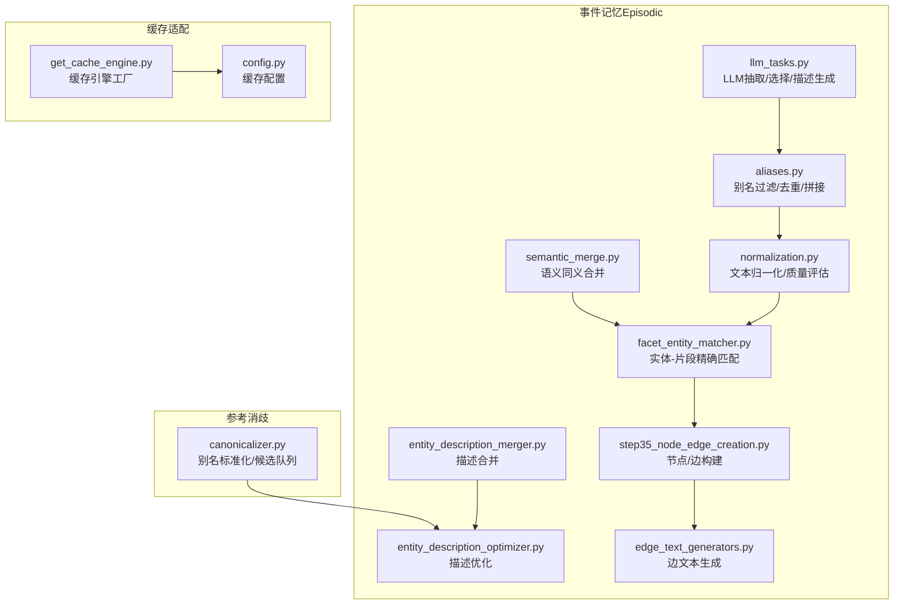
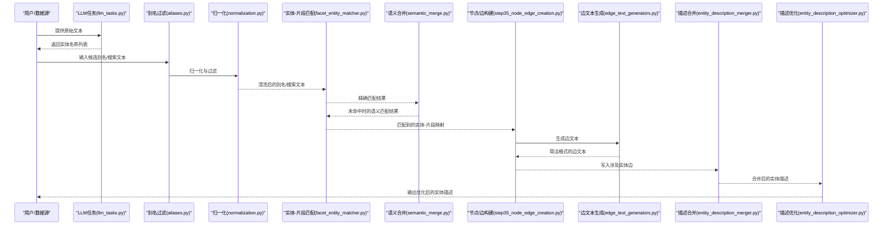
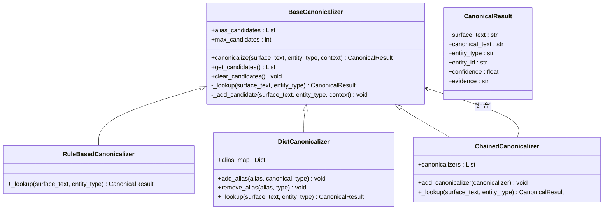
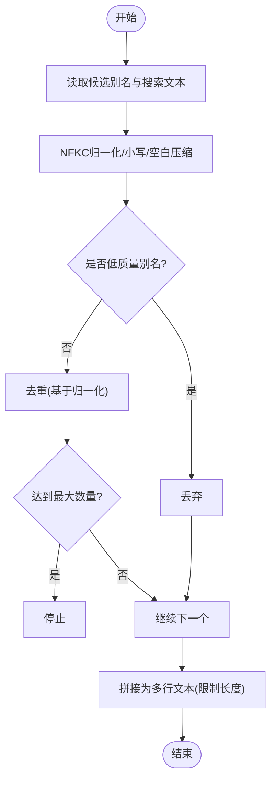
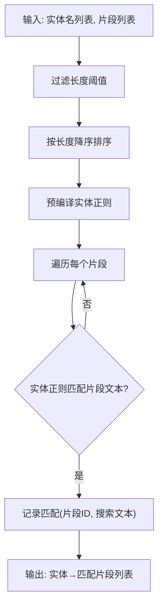
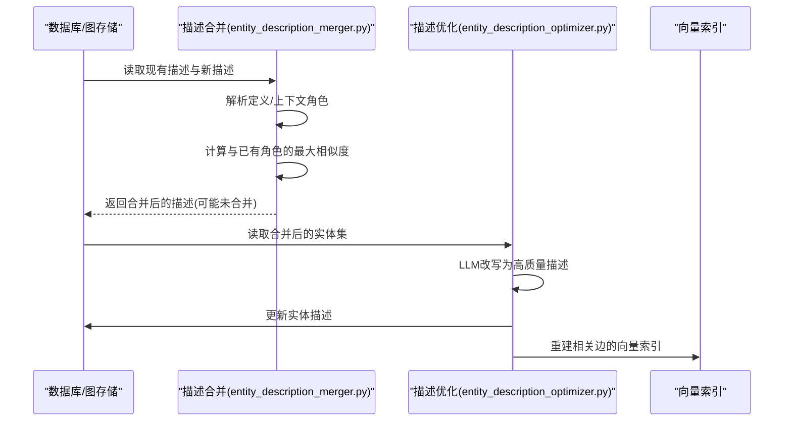
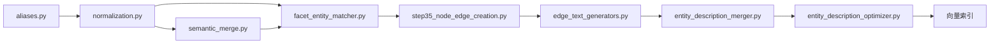
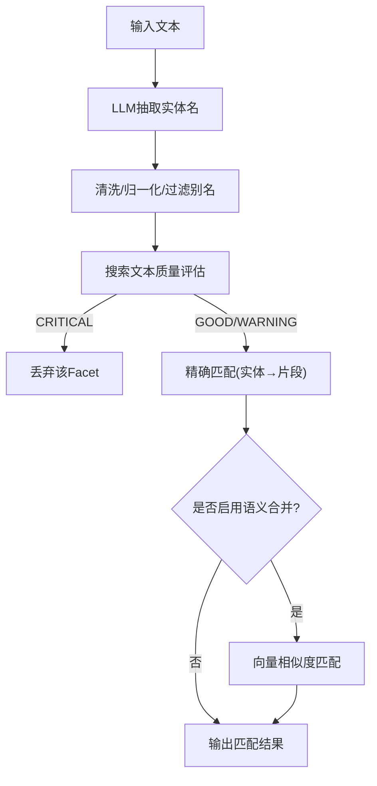

# 别名和实体管理

<cite>
**本文引用的文件**
- [canonicalizer.py](file://coreference/coreference_module/canonicalizer.py)
- [aliases.py](file://m_flow/memory/episodic/aliases.py)
- [entity_description_merger.py](file://m_flow/memory/episodic/entity_description_merger.py)
- [entity_description_optimizer.py](file://m_flow/memory/episodic/entity_description_optimizer.py)
- [facet_entity_matcher.py](file://m_flow/memory/episodic/facet_entity_matcher.py)
- [normalization.py](file://m_flow/memory/episodic/normalization.py)
- [semantic_merge.py](file://m_flow/memory/episodic/semantic_merge.py)
- [edge_text_generators.py](file://m_flow/memory/episodic/edge_text_generators.py)
- [step35_node_edge_creation.py](file://m_flow/memory/episodic/episode_builder/step35_node_edge_creation.py)
- [llm_tasks.py](file://m_flow/memory/episodic/llm_tasks.py)
- [get_cache_engine.py](file://m_flow/adapters/cache/get_cache_engine.py)
- [config.py](file://m_flow/adapters/cache/config.py)
</cite>

## 目录
1. [简介](#简介)
2. [项目结构](#项目结构)
3. [核心组件](#核心组件)
4. [架构总览](#架构总览)
5. [详细组件分析](#详细组件分析)
6. [依赖分析](#依赖分析)
7. [性能考量](#性能考量)
8. [故障排查指南](#故障排查指南)
9. [结论](#结论)
10. [附录](#附录)

## 简介
本文件面向“别名和实体管理”主题，系统化梳理了以下能力：
- 别名提取、过滤与规范化：清洗候选别名、去除低质量条目、生成可检索文本。
- 实体识别与链接：通过精确匹配（含边界规则）与语义匹配（向量相似度）完成实体到片段（Facet）的链接。
- 实体消解与描述优化：在事件合并过程中智能合并实体描述，避免冗余；通过LLM对合并后的描述进行优化重构。
- 别名到实体映射：通过规范化的别名集合与实体名称建立稳定映射，支持后续检索与链接。
- 查找与匹配策略：涵盖精确匹配与语义匹配两种路径，并给出性能优化与扩展建议。

## 项目结构
围绕别名与实体管理的关键模块分布于如下位置：
- 核心参考消歧：coreference/coreference_module/canonicalizer.py
- 事件记忆中的别名处理与匹配：m_flow/memory/episodic/*（aliases.py、facet_entity_matcher.py、semantic_merge.py、entity_description_merger.py、entity_description_optimizer.py、normalization.py、edge_text_generators.py、episode_builder/step35_node_edge_creation.py）
- LLM任务编排：m_flow/memory/episodic/llm_tasks.py
- 缓存适配器：m_flow/adapters/cache/*

**图表来源**
- [canonicalizer.py:1-298](file://coreference/coreference_module/canonicalizer.py#L1-L298)
- [aliases.py:1-153](file://m_flow/memory/episodic/aliases.py#L1-L153)
- [normalization.py:1-290](file://m_flow/memory/episodic/normalization.py#L1-L290)
- [semantic_merge.py:1-154](file://m_flow/memory/episodic/semantic_merge.py#L1-L154)
- [facet_entity_matcher.py:1-309](file://m_flow/memory/episodic/facet_entity_matcher.py#L1-L309)
- [entity_description_merger.py:1-299](file://m_flow/memory/episodic/entity_description_merger.py#L1-L299)
- [entity_description_optimizer.py:1-423](file://m_flow/memory/episodic/entity_description_optimizer.py#L1-L423)
- [edge_text_generators.py:1-173](file://m_flow/memory/episodic/edge_text_generators.py#L1-L173)
- [step35_node_edge_creation.py:352-540](file://m_flow/memory/episodic/episode_builder/step35_node_edge_creation.py#L352-L540)
- [llm_tasks.py:113-222](file://m_flow/memory/episodic/llm_tasks.py#L113-L222)
- [get_cache_engine.py:1-79](file://m_flow/adapters/cache/get_cache_engine.py#L1-L79)
- [config.py:72-88](file://m_flow/adapters/cache/config.py#L72-L88)

**章节来源**
- [canonicalizer.py:1-298](file://coreference/coreference_module/canonicalizer.py#L1-L298)
- [aliases.py:1-153](file://m_flow/memory/episodic/aliases.py#L1-L153)
- [normalization.py:1-290](file://m_flow/memory/episodic/normalization.py#L1-L290)
- [semantic_merge.py:1-154](file://m_flow/memory/episodic/semantic_merge.py#L1-L154)
- [facet_entity_matcher.py:1-309](file://m_flow/memory/episodic/facet_entity_matcher.py#L1-L309)
- [entity_description_merger.py:1-299](file://m_flow/memory/episodic/entity_description_merger.py#L1-L299)
- [entity_description_optimizer.py:1-423](file://m_flow/memory/episodic/entity_description_optimizer.py#L1-L423)
- [edge_text_generators.py:1-173](file://m_flow/memory/episodic/edge_text_generators.py#L1-L173)
- [step35_node_edge_creation.py:352-540](file://m_flow/memory/episodic/episode_builder/step35_node_edge_creation.py#L352-L540)
- [llm_tasks.py:113-222](file://m_flow/memory/episodic/llm_tasks.py#L113-L222)
- [get_cache_engine.py:1-79](file://m_flow/adapters/cache/get_cache_engine.py#L1-L79)
- [config.py:72-88](file://m_flow/adapters/cache/config.py#L72-L88)

## 核心组件
- 别名标准化与候选学习
  - 规则驱动与字典驱动的链式标准化，未知别名进入候选队列等待后续LLM标注。
- 别名过滤与拼接
  - 去除过短/过长/模板前缀/通用词等低质量别名；去重并限制数量；生成索引化的别名文本。
- 文本归一化与质量评估
  - 统一NFKC归一化、大小写折叠、空白压缩；提供搜索文本质量等级评估，决定是否丢弃或警告保留。
- 实体-片段匹配
  - 基于精确正则匹配（含单字符边界规则），以及CJK/非CJK差异化策略；支持构建Facet→Entity边。
- 语义合并
  - 在同一片段类型内保守阈值的向量相似匹配，降低误合并风险。
- 描述合并与优化
  - 按“定义; 上下文角色”的格式拆分描述，仅追加新的上下文角色；使用向量相似度避免重复；LLM后置优化统一为高质量描述。
- 边文本生成
  - 面向向量检索的简洁格式，减少结构化前缀干扰。
- 节点/边构建与链接
  - 将匹配结果转化为图结构边，更新边文本并触发向量索引重建。
- 缓存与并发
  - 支持Redis/文件系统缓存后端，LRU缓存工厂函数，统一配置入口。

**章节来源**
- [canonicalizer.py:42-108](file://coreference/coreference_module/canonicalizer.py#L42-L108)
- [aliases.py:67-131](file://m_flow/memory/episodic/aliases.py#L67-L131)
- [normalization.py:181-271](file://m_flow/memory/episodic/normalization.py#L181-L271)
- [facet_entity_matcher.py:172-256](file://m_flow/memory/episodic/facet_entity_matcher.py#L172-L256)
- [semantic_merge.py:52-154](file://m_flow/memory/episodic/semantic_merge.py#L52-L154)
- [entity_description_merger.py:181-254](file://m_flow/memory/episodic/entity_description_merger.py#L181-L254)
- [entity_description_optimizer.py:131-353](file://m_flow/memory/episodic/entity_description_optimizer.py#L131-L353)
- [edge_text_generators.py:26-173](file://m_flow/memory/episodic/edge_text_generators.py#L26-L173)
- [step35_node_edge_creation.py:352-540](file://m_flow/memory/episodic/episode_builder/step35_node_edge_creation.py#L352-L540)
- [get_cache_engine.py:19-79](file://m_flow/adapters/cache/get_cache_engine.py#L19-L79)
- [config.py:72-88](file://m_flow/adapters/cache/config.py#L72-L88)

## 架构总览
下图展示了从文本中提取别名到最终实体链接的端到端流程，包括精确匹配与语义匹配两条路径，以及描述合并与优化环节。

**图表来源**
- [llm_tasks.py:155-222](file://m_flow/memory/episodic/llm_tasks.py#L155-L222)
- [aliases.py:93-153](file://m_flow/memory/episodic/aliases.py#L93-L153)
- [normalization.py:23-93](file://m_flow/memory/episodic/normalization.py#L23-L93)
- [facet_entity_matcher.py:172-256](file://m_flow/memory/episodic/facet_entity_matcher.py#L172-L256)
- [semantic_merge.py:52-154](file://m_flow/memory/episodic/semantic_merge.py#L52-L154)
- [step35_node_edge_creation.py:352-540](file://m_flow/memory/episodic/episode_builder/step35_node_edge_creation.py#L352-L540)
- [edge_text_generators.py:26-173](file://m_flow/memory/episodic/edge_text_generators.py#L26-L173)
- [entity_description_merger.py:181-254](file://m_flow/memory/episodic/entity_description_merger.py#L181-L254)
- [entity_description_optimizer.py:131-353](file://m_flow/memory/episodic/entity_description_optimizer.py#L131-L353)

## 详细组件分析

### 别名标准化与候选学习（参考消歧）
- 设计要点
  - 支持规则驱动（如地名别称）与字典驱动（类型-别名→规范名）的链式组合。
  - 未知别名不猜测，直接返回原文本，并加入“学习候选队列”，用于后续LLM标注。
  - 提供候选队列上限控制，避免无限增长。
- 关键类与方法
  - BaseCanonicalizer：抽象基类，定义标准化主流程与候选队列管理。
  - RuleBasedCanonicalizer：内置规则（如地名别称）。
  - DictCanonicalizer：内存字典映射。
  - ChainedCanonicalizer：按顺序尝试多个标准化器。
  - create_canonicalizer：默认创建“规则→字典”的链式实例。
- 复杂度与性能
  - 查询复杂度近似O(k)，k为链中标准化器数量；字典查询O(1)。
  - 候选队列采用尾部截断，保证空间开销可控。

**图表来源**
- [canonicalizer.py:42-247](file://coreference/coreference_module/canonicalizer.py#L42-L247)

**章节来源**
- [canonicalizer.py:42-247](file://coreference/coreference_module/canonicalizer.py#L42-L247)

### 别名过滤与拼接（事件记忆）
- 功能目标
  - 过滤掉过短、过长、模板前缀、通用词等低质量别名。
  - 对别名进行NFKC归一化、小写化、空白压缩，去重并限制数量。
  - 生成最多max_chars长度的别名文本，便于检索与显示。
- 关键函数
  - is_bad_alias：判定别名是否不可用。
  - clean_aliases：清洗与去重。
  - make_aliases_text：生成索引化别名文本。
- 复杂度
  - 时间复杂度O(n)，n为别名数量；空间复杂度O(n)。

**图表来源**
- [aliases.py:67-153](file://m_flow/memory/episodic/aliases.py#L67-L153)

**章节来源**
- [aliases.py:67-153](file://m_flow/memory/episodic/aliases.py#L67-L153)

### 文本归一化与质量评估
- 归一化
  - NFKC标准化、小写化、空白折叠，确保比较一致性。
- 质量评估
  - 定义GOOD/WARNING/CRITICAL三级：空/纯空白/过短/纯数字/纯标点/以无效前缀开头为CRITICAL；过度通用词汇为WARNING；其余为GOOD。
- 应用价值
  - Facet搜索文本质量控制，避免无效Facet进入后续匹配与检索。

**章节来源**
- [normalization.py:23-93](file://m_flow/memory/episodic/normalization.py#L23-L93)
- [normalization.py:181-271](file://m_flow/memory/episodic/normalization.py#L181-L271)

### 实体-片段精确匹配
- 匹配策略
  - 单字符实体：严格边界规则（数字/字母/汉字周围必须非同类字符）。
  - 多字符实体：非CJK使用单词边界；CJK使用简单子串匹配。
  - 先过滤长度阈值，再按长度降序匹配，优先特定实体。
- 输出
  - 返回实体到匹配片段的映射，用于构建Facet→Entity边。
- 性能
  - 预编译正则表达式；按长度排序减少误匹配。

**图表来源**
- [facet_entity_matcher.py:172-256](file://m_flow/memory/episodic/facet_entity_matcher.py#L172-L256)

**章节来源**
- [facet_entity_matcher.py:172-256](file://m_flow/memory/episodic/facet_entity_matcher.py#L172-L256)

### 语义合并（可选）
- 设计原则
  - 同一片段类型内，仅使用现有片段的搜索文本进行向量嵌入，保守阈值（默认0.90）防止误合并。
  - 别名不参与向量匹配，降低误判风险。
- 流程
  - prepare：按片段类型分组，批量嵌入现有片段搜索文本并缓存。
  - match：对候选片段计算相似度，返回最佳匹配ID或None。
- 性能
  - 批量嵌入减少调用次数；缓存避免重复计算。

**章节来源**
- [semantic_merge.py:52-154](file://m_flow/memory/episodic/semantic_merge.py#L52-L154)

### 描述合并与优化
- 描述格式
  - “定义; 上下文角色”，仅追加新的上下文角色部分。
- 向量相似度
  - 使用嵌入引擎计算与已有上下文角色的最大相似度，低于阈值才追加。
- 优化策略
  - 计数上限与总长度上限，避免无限增长。
  - LLM后置优化：将多次事件合并的描述统一改写为高质量、简洁的单一描述。
- 边文本更新
  - 更新Episode→Entity与Facet→Entity边的edge_text，触发向量索引重建。

**图表来源**
- [entity_description_merger.py:181-254](file://m_flow/memory/episodic/entity_description_merger.py#L181-L254)
- [entity_description_optimizer.py:131-353](file://m_flow/memory/episodic/entity_description_optimizer.py#L131-L353)

**章节来源**
- [entity_description_merger.py:181-254](file://m_flow/memory/episodic/entity_description_merger.py#L181-L254)
- [entity_description_optimizer.py:131-353](file://m_flow/memory/episodic/entity_description_optimizer.py#L131-L353)

### 边文本生成与节点/边构建
- 边文本格式
  - Episode→Entity：实体名 | 简要描述
  - Facet→Entity：实体名 | 简要描述 (in 片段上下文)
  - 其他关系：简洁格式，避免结构化前缀干扰向量检索。
- 节点/边构建
  - 将匹配结果转为边数据，设置edge_text并写入图存储；随后触发向量索引重建。

**章节来源**
- [edge_text_generators.py:26-173](file://m_flow/memory/episodic/edge_text_generators.py#L26-L173)
- [step35_node_edge_creation.py:352-540](file://m_flow/memory/episodic/episode_builder/step35_node_edge_creation.py#L352-L540)

## 依赖分析
- 组件耦合
  - 别名过滤与归一化紧密耦合，前者依赖后者提供的比较归一化函数。
  - 实体-片段匹配依赖归一化与质量评估的结果，确保输入质量。
  - 语义合并与精确匹配并行存在，由开关控制启用与否。
  - 描述合并与优化依赖向量嵌入服务；优化后依赖图存储与索引重建。
- 外部依赖
  - 向量嵌入引擎（用于相似度与语义合并）。
  - 图存储接口（用于节点/边写入与查询）。
  - LLM服务（用于实体抽取、描述生成与优化）。
- 循环依赖
  - 当前模块间无循环导入；各模块职责清晰，通过函数/方法调用交互。

**图表来源**
- [aliases.py:1-153](file://m_flow/memory/episodic/aliases.py#L1-L153)
- [normalization.py:1-290](file://m_flow/memory/episodic/normalization.py#L1-L290)
- [facet_entity_matcher.py:1-309](file://m_flow/memory/episodic/facet_entity_matcher.py#L1-L309)
- [semantic_merge.py:1-154](file://m_flow/memory/episodic/semantic_merge.py#L1-L154)
- [step35_node_edge_creation.py:352-540](file://m_flow/memory/episodic/episode_builder/step35_node_edge_creation.py#L352-L540)
- [edge_text_generators.py:1-173](file://m_flow/memory/episodic/edge_text_generators.py#L1-L173)
- [entity_description_merger.py:1-299](file://m_flow/memory/episodic/entity_description_merger.py#L1-L299)
- [entity_description_optimizer.py:1-423](file://m_flow/memory/episodic/entity_description_optimizer.py#L1-L423)

**章节来源**
- [aliases.py:1-153](file://m_flow/memory/episodic/aliases.py#L1-L153)
- [normalization.py:1-290](file://m_flow/memory/episodic/normalization.py#L1-L290)
- [facet_entity_matcher.py:1-309](file://m_flow/memory/episodic/facet_entity_matcher.py#L1-L309)
- [semantic_merge.py:1-154](file://m_flow/memory/episodic/semantic_merge.py#L1-L154)
- [step35_node_edge_creation.py:352-540](file://m_flow/memory/episodic/episode_builder/step35_node_edge_creation.py#L352-L540)
- [edge_text_generators.py:1-173](file://m_flow/memory/episodic/edge_text_generators.py#L1-L173)
- [entity_description_merger.py:1-299](file://m_flow/memory/episodic/entity_description_merger.py#L1-L299)
- [entity_description_optimizer.py:1-423](file://m_flow/memory/episodic/entity_description_optimizer.py#L1-L423)

## 性能考量
- 向量化与批处理
  - 描述合并阶段使用“批量嵌入+一次性相似度计算”的方式，显著降低调用次数。
  - 语义合并阶段按片段类型分组，批量嵌入并缓存，避免重复计算。
- 正则匹配优化
  - 实体正则预编译；按长度降序匹配，优先特定实体，减少回溯。
- 缓存与并发
  - 缓存引擎工厂采用LRU缓存，统一后端（Redis/文件系统），支持进程级单例。
  - LLM任务使用信号量控制并发，避免资源争用。
- 存储与索引
  - 优化后统一更新边文本并重建向量索引，确保检索质量。

**章节来源**
- [entity_description_merger.py:134-174](file://m_flow/memory/episodic/entity_description_merger.py#L134-L174)
- [semantic_merge.py:84-113](file://m_flow/memory/episodic/semantic_merge.py#L84-L113)
- [facet_entity_matcher.py:220-222](file://m_flow/memory/episodic/facet_entity_matcher.py#L220-L222)
- [get_cache_engine.py:19-79](file://m_flow/adapters/cache/get_cache_engine.py#L19-L79)
- [config.py:72-88](file://m_flow/adapters/cache/config.py#L72-L88)
- [llm_tasks.py:113-222](file://m_flow/memory/episodic/llm_tasks.py#L113-L222)

## 故障排查指南
- 别名未被识别
  - 检查是否落入“学习候选队列”（canonicalizer.get_candidates），确认是否需要补充字典映射或规则。
  - 确认别名是否被过滤（is_bad_alias），必要时调整长度/通用词阈值。
- 匹配结果为空
  - 检查Facet搜索文本质量评估（evaluate_search_text），确认是否为CRITICAL级别被丢弃。
  - 对单字符实体，检查边界规则是否过于严格。
- 描述未合并或合并异常
  - 检查相似度阈值与上下文角色计数上限；确认向量嵌入服务可用。
  - 若优化失败，查看LLM服务日志与提示词是否存在缺失。
- 边索引未更新
  - 确认优化后是否执行了边向量重建流程；检查图存储接口与Cypher更新语句。

**章节来源**
- [canonicalizer.py:82-108](file://coreference/coreference_module/canonicalizer.py#L82-L108)
- [aliases.py:67-91](file://m_flow/memory/episodic/aliases.py#L67-L91)
- [normalization.py:181-271](file://m_flow/memory/episodic/normalization.py#L181-L271)
- [entity_description_merger.py:181-254](file://m_flow/memory/episodic/entity_description_merger.py#L181-L254)
- [entity_description_optimizer.py:131-353](file://m_flow/memory/episodic/entity_description_optimizer.py#L131-L353)

## 结论
本系统通过“规则+字典”的别名标准化、严格的别名过滤与归一化、精确+语义双路径的实体-片段匹配，以及描述合并与LLM优化的闭环，实现了高召回、低误判的别名与实体管理。配合向量化批处理、缓存与并发控制，整体具备良好的性能与扩展性。建议在生产环境中：
- 明确开启语义合并开关并根据业务调优阈值；
- 定期维护别名映射表，将候选队列中的样本纳入字典；
- 控制描述合并的上下文角色数量与总长度，避免膨胀；
- 在大规模部署中优先使用Redis缓存与向量索引加速检索。

## 附录
- 关键流程图（从文本提取别名到实体链接）

**图表来源**
- [llm_tasks.py:155-222](file://m_flow/memory/episodic/llm_tasks.py#L155-L222)
- [aliases.py:93-153](file://m_flow/memory/episodic/aliases.py#L93-L153)
- [normalization.py:181-271](file://m_flow/memory/episodic/normalization.py#L181-L271)
- [facet_entity_matcher.py:172-256](file://m_flow/memory/episodic/facet_entity_matcher.py#L172-L256)
- [semantic_merge.py:52-154](file://m_flow/memory/episodic/semantic_merge.py#L52-L154)