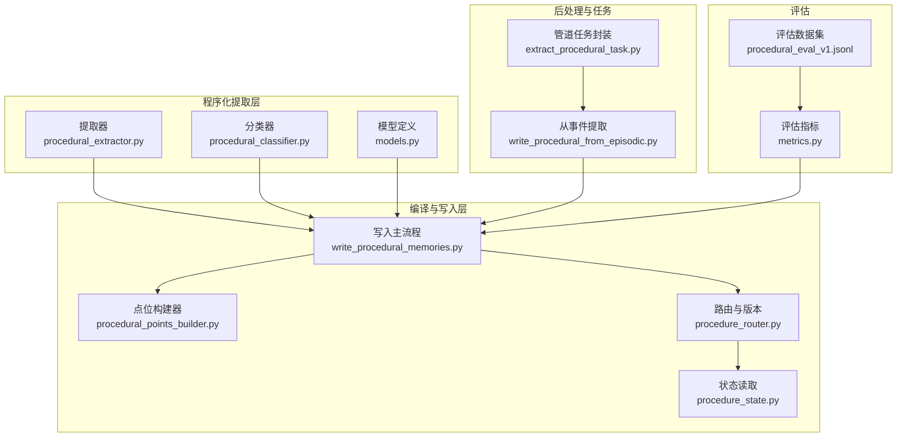
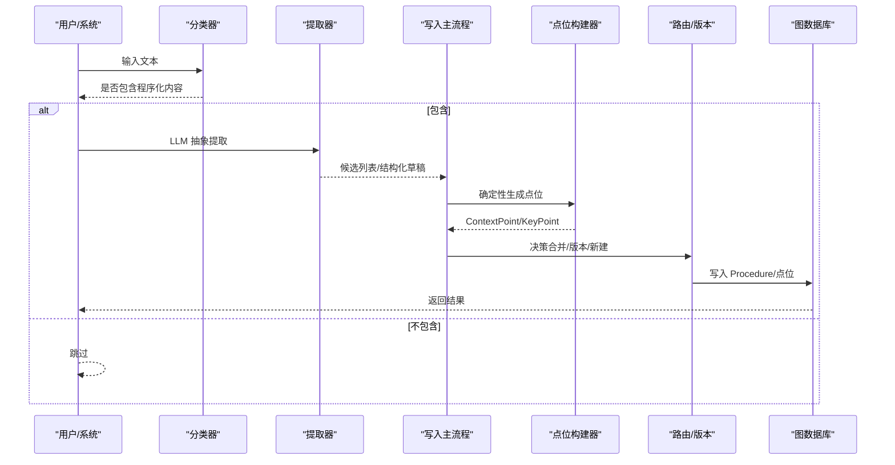
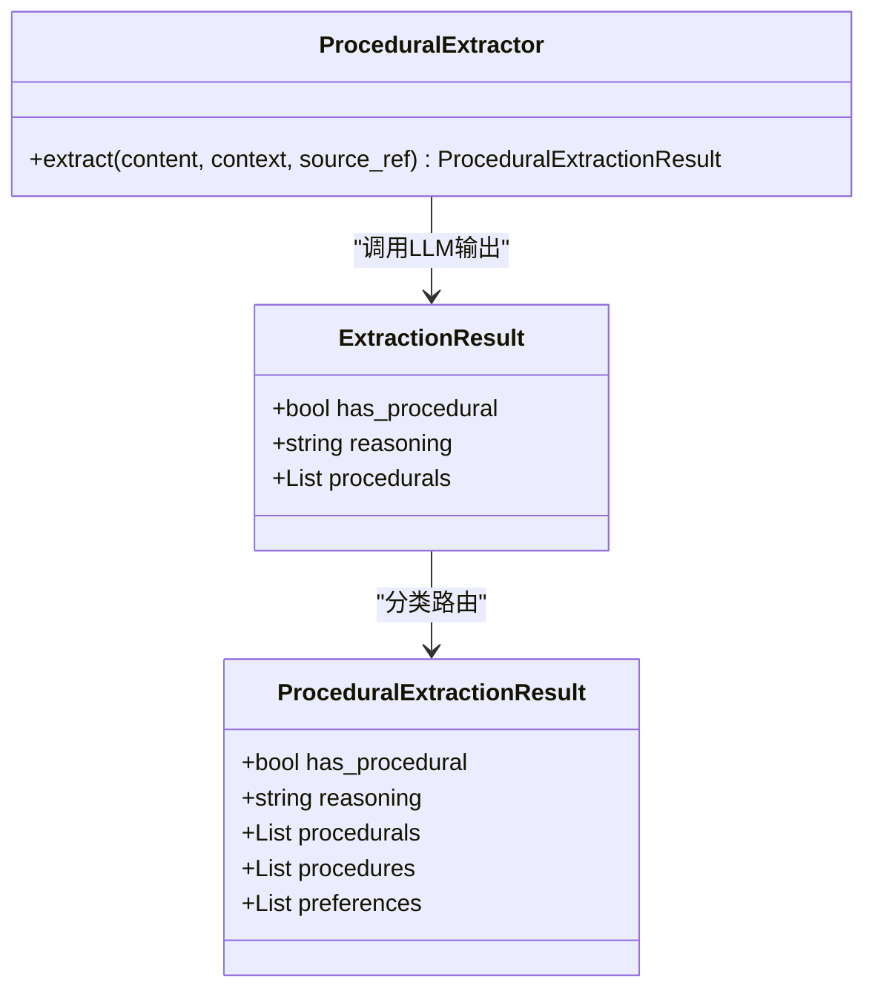
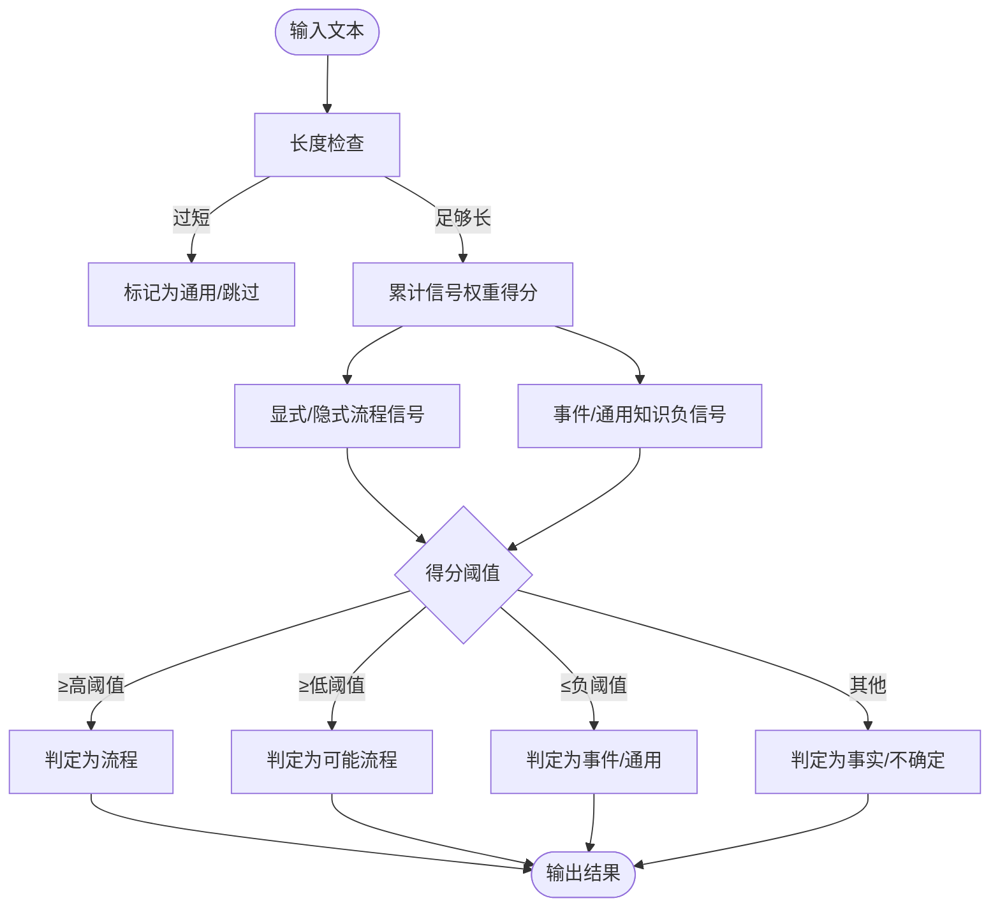
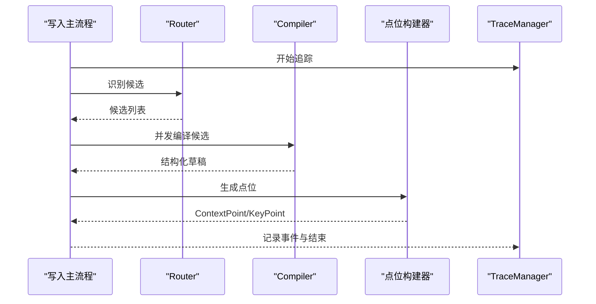
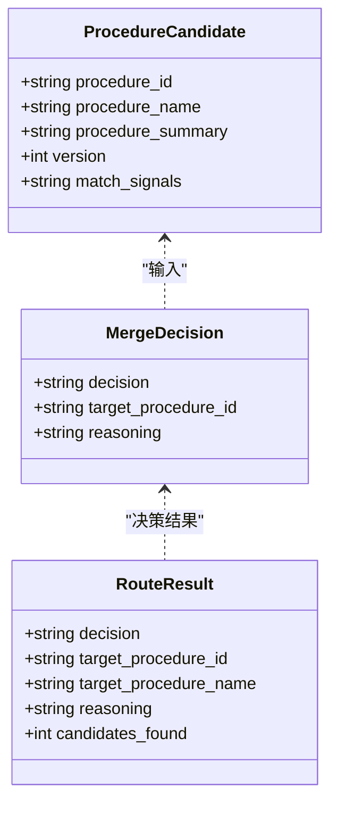
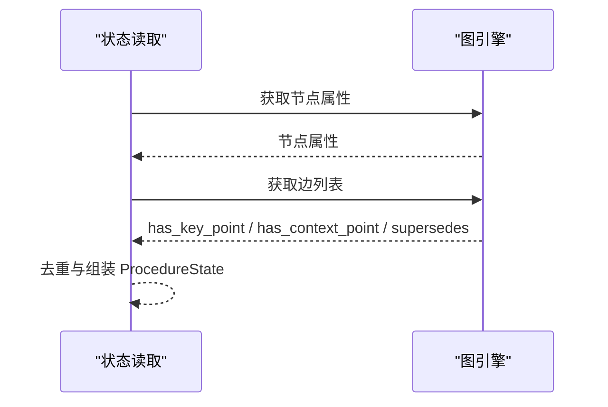
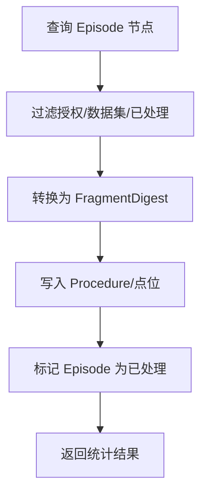
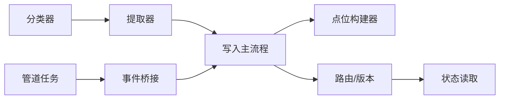

# 程序化提取机制

<cite>
**本文档引用的文件**
- [procedural_extractor.py](file://m_flow/memory/procedural/governance/procedural_extractor.py)
- [procedural_classifier.py](file://m_flow/memory/procedural/governance/procedural_classifier.py)
- [models.py](file://m_flow/memory/procedural/models.py)
- [write_procedural_memories.py](file://m_flow/memory/procedural/write_procedural_memories.py)
- [procedural_points_builder.py](file://m_flow/memory/procedural/procedural_points_builder.py)
- [procedure_router.py](file://m_flow/memory/procedural/procedure_router.py)
- [procedure_state.py](file://m_flow/memory/procedural/procedure_state.py)
- [write_procedural_from_episodic.py](file://m_flow/memory/procedural/write_procedural_from_episodic.py)
- [extract_procedural_task.py](file://m_flow/memory/procedural/extract_procedural_task.py)
- [metrics.py](file://m_flow/eval/metrics.py)
- [procedural_eval_v1.jsonl](file://m_flow/eval/datasets/procedural_eval_v1.jsonl)
</cite>

## 目录
1. [简介](#简介)
2. [项目结构](#项目结构)
3. [核心组件](#核心组件)
4. [架构总览](#架构总览)
5. [详细组件分析](#详细组件分析)
6. [依赖关系分析](#依赖关系分析)
7. [性能考虑](#性能考虑)
8. [故障排除指南](#故障排除指南)
9. [结论](#结论)
10. [附录](#附录)

## 简介
本文件系统性阐述程序化提取机制的技术细节，涵盖从事件记忆中识别与抽取可复用程序化知识的算法与流程、程序化任务路由机制、质量评估标准、上下文分析方法，以及完整的提取流程图与准确性评估指标与优化策略。目标读者既包括工程人员也包括非技术使用者。

## 项目结构
程序化提取机制位于 m_flow/memory/procedural 目录下，围绕“识别候选 → 结构化编译 → 点位生成 → 路由合并/版本管理 → 存储”的流水线展开，并通过评估数据集与指标进行质量度量。

图表来源
- [procedural_extractor.py:1-409](file://m_flow/memory/procedural/governance/procedural_extractor.py#L1-L409)
- [procedural_classifier.py:1-272](file://m_flow/memory/procedural/governance/procedural_classifier.py#L1-L272)
- [models.py:1-249](file://m_flow/memory/procedural/models.py#L1-L249)
- [write_procedural_memories.py:1-669](file://m_flow/memory/procedural/write_procedural_memories.py#L1-L669)
- [procedural_points_builder.py:1-390](file://m_flow/memory/procedural/procedural_points_builder.py#L1-L390)
- [procedure_router.py:1-459](file://m_flow/memory/procedural/procedure_router.py#L1-L459)
- [procedure_state.py:1-393](file://m_flow/memory/procedural/procedure_state.py#L1-L393)
- [write_procedural_from_episodic.py:1-353](file://m_flow/memory/procedural/write_procedural_from_episodic.py#L1-L353)
- [extract_procedural_task.py:1-64](file://m_flow/memory/procedural/extract_procedural_task.py#L1-L64)
- [metrics.py:1-283](file://m_flow/eval/metrics.py#L1-L283)
- [procedural_eval_v1.jsonl:1-21](file://m_flow/eval/datasets/procedural_eval_v1.jsonl#L1-L21)

章节来源
- [procedural_extractor.py:1-409](file://m_flow/memory/procedural/governance/procedural_extractor.py#L1-L409)
- [procedural_classifier.py:1-272](file://m_flow/memory/procedural/governance/procedural_classifier.py#L1-L272)
- [models.py:1-249](file://m_flow/memory/procedural/models.py#L1-L249)
- [write_procedural_memories.py:1-669](file://m_flow/memory/procedural/write_procedural_memories.py#L1-L669)
- [procedural_points_builder.py:1-390](file://m_flow/memory/procedural/procedural_points_builder.py#L1-L390)
- [procedure_router.py:1-459](file://m_flow/memory/procedural/procedure_router.py#L1-L459)
- [procedure_state.py:1-393](file://m_flow/memory/procedural/procedure_state.py#L1-L393)
- [write_procedural_from_episodic.py:1-353](file://m_flow/memory/procedural/write_procedural_from_episodic.py#L1-L353)
- [extract_procedural_task.py:1-64](file://m_flow/memory/procedural/extract_procedural_task.py#L1-L64)
- [metrics.py:1-283](file://m_flow/eval/metrics.py#L1-L283)
- [procedural_eval_v1.jsonl:1-21](file://m_flow/eval/datasets/procedural_eval_v1.jsonl#L1-L21)

## 核心组件
- 提取器（LLM 驱动）：从任意文本中抽象出可复用的方法/习惯/做法，自动区分 procedure 与 preference 类型。
- 分类器（预过滤）：快速判定内容是否可能包含程序化知识，避免对纯事件/对话/常识进行昂贵的 LLM 处理。
- 编译器与写入：基于候选识别结果，结构化编译完整 procedure，生成直接边连接的 Procedure-Point 二层结构。
- 点位构建器：确定性地从结构化文本生成 ContextPoint 与 KeyPoint，保证锚点覆盖与去重。
- 路由与版本：在相似 procedure 中做合并/版本替换/新建决策，维护版本链与追溯关系。
- 状态读取：从图数据库读取现有 procedure 的状态，支持增量更新与去重。
- 事件到程序化桥接：从已存在的 episodic 记忆中提取程序化知识，支持后置批量提取。
- 评估指标：召回@K、ActiveHit@K、假阳性注入率、上下文完整性、触发准确率、遮蔽率等。

章节来源
- [procedural_extractor.py:263-373](file://m_flow/memory/procedural/governance/procedural_extractor.py#L263-L373)
- [procedural_classifier.py:119-271](file://m_flow/memory/procedural/governance/procedural_classifier.py#L119-L271)
- [write_procedural_memories.py:212-669](file://m_flow/memory/procedural/write_procedural_memories.py#L212-L669)
- [procedural_points_builder.py:153-390](file://m_flow/memory/procedural/procedural_points_builder.py#L153-L390)
- [procedure_router.py:89-321](file://m_flow/memory/procedural/procedure_router.py#L89-L321)
- [procedure_state.py:150-393](file://m_flow/memory/procedural/procedure_state.py#L150-L393)
- [write_procedural_from_episodic.py:173-353](file://m_flow/memory/procedural/write_procedural_from_episodic.py#L173-L353)
- [metrics.py:65-283](file://m_flow/eval/metrics.py#L65-L283)

## 架构总览
程序化提取以“候选识别 + 结构化编译 + 点位生成 + 路由版本”为核心闭环，结合事件记忆桥接与评估体系，形成可扩展、可追踪、可优化的程序化知识流水线。

图表来源
- [procedural_classifier.py:135-241](file://m_flow/memory/procedural/governance/procedural_classifier.py#L135-L241)
- [procedural_extractor.py:271-340](file://m_flow/memory/procedural/governance/procedural_extractor.py#L271-L340)
- [write_procedural_memories.py:380-669](file://m_flow/memory/procedural/write_procedural_memories.py#L380-L669)
- [procedural_points_builder.py:153-390](file://m_flow/memory/procedural/procedural_points_builder.py#L153-L390)
- [procedure_router.py:261-321](file://m_flow/memory/procedural/procedure_router.py#L261-L321)

## 详细组件分析

### 组件A：程序化提取器（LLM 驱动）
- 功能要点
  - 识别 reusable methods/habits/practices，区分 procedure（流程）与 preference（偏好）。
  - 输出 ExtractionResult，包含 has_procedural、reasoning、procedurals 列表。
  - 支持轻量预过滤 should_skip_extraction，避免明显不合适的输入进入 LLM。
- 关键流程
  - 长度校验与预过滤 → 组装提示词 → LLM 结构化输出 → 分类路由 → 返回结果。
- 触发条件
  - 内容长度阈值、对话上下文可选注入、证据片段保留用于溯源。

图表来源
- [procedural_extractor.py:263-373](file://m_flow/memory/procedural/governance/procedural_extractor.py#L263-L373)
- [procedural_extractor.py:94-111](file://m_flow/memory/procedural/governance/procedural_extractor.py#L94-L111)
- [procedural_extractor.py:245-340](file://m_flow/memory/procedural/governance/procedural_extractor.py#L245-L340)

章节来源
- [procedural_extractor.py:1-409](file://m_flow/memory/procedural/governance/procedural_extractor.py#L1-L409)

### 组件B：程序化分类器（预过滤）
- 功能要点
  - 使用正则信号（显式/隐式流程信号、事件/通用知识负信号）计算得分，快速判定内容类型。
  - 输出 ClassificationResult，包含 content_type、is_procedural、confidence、reason。
- 质量控制
  - 长度惩罚、步骤数量启发、代码块启发、长度奖励等。
  - 严格“宁缺毋滥”，优先漏判而非误判。

图表来源
- [procedural_classifier.py:135-241](file://m_flow/memory/procedural/governance/procedural_classifier.py#L135-L241)

章节来源
- [procedural_classifier.py:1-272](file://m_flow/memory/procedural/governance/procedural_classifier.py#L1-L272)

### 组件C：结构化编译与写入（Router + Compiler + Points）
- 功能要点
  - Router：从输入中识别多个 procedure 候选（search_text、confidence、reason、type）。
  - Compiler：基于候选与源内容，结构化编译完整 procedure（title/signature/search_text/context/key_points）。
  - Points：确定性生成 ContextPoint 与 KeyPoint，保持锚点覆盖与去重。
  - 软门控元数据（write_decision、write_reason、evidence_refs、source_refs）便于追踪与治理。
- 时间传播：从摘要中抽取提及时间，传播至 Procedure 与其点位。
- 安全：危险内容检测与敏感信息脱敏。

图表来源
- [write_procedural_memories.py:212-377](file://m_flow/memory/procedural/write_procedural_memories.py#L212-L377)
- [write_procedural_memories.py:380-417](file://m_flow/memory/procedural/write_procedural_memories.py#L380-L417)
- [write_procedural_memories.py:511-669](file://m_flow/memory/procedural/write_procedural_memories.py#L511-L669)
- [procedural_points_builder.py:153-390](file://m_flow/memory/procedural/procedural_points_builder.py#L153-L390)

章节来源
- [write_procedural_memories.py:1-669](file://m_flow/memory/procedural/write_procedural_memories.py#L1-L669)
- [procedural_points_builder.py:1-390](file://m_flow/memory/procedural/procedural_points_builder.py#L1-L390)

### 组件D：路由与版本管理（合并/版本/新建）
- 功能要点
  - 向量检索相似 procedure（Procedure_summary、Procedure_search_text），构建候选集合。
  - LLM 决策：merge_update、new_version、new_procedure，必要时回退保守策略。
  - 版本管理：获取当前版本、废弃 procedure、创建 supersedes 边、合并内容。
- 数据模型
  - ProcedureCandidate/MergeDecision 用于路由决策与结果表达。

图表来源
- [models.py:217-249](file://m_flow/memory/procedural/models.py#L217-L249)
- [procedure_router.py:78-87](file://m_flow/memory/procedural/procedure_router.py#L78-L87)
- [procedure_router.py:188-259](file://m_flow/memory/procedural/procedure_router.py#L188-L259)

章节来源
- [procedure_router.py:1-459](file://m_flow/memory/procedural/procedure_router.py#L1-L459)
- [models.py:1-249](file://m_flow/memory/procedural/models.py#L1-L249)

### 组件E：状态读取与版本链
- 功能要点
  - 读取现有 procedure 的标题、签名、版本、状态、上下文/步骤文本、点位列表、版本链（supersedes）。
  - 支持按 signature 查找 active 版本，构建版本链（双向遍历）。
- 用途
  - 增量更新前的状态对比与去重，版本演进与追溯。

图表来源
- [procedure_state.py:150-301](file://m_flow/memory/procedural/procedure_state.py#L150-L301)
- [procedure_state.py:309-393](file://m_flow/memory/procedural/procedure_state.py#L309-L393)

章节来源
- [procedure_state.py:1-393](file://m_flow/memory/procedural/procedure_state.py#L1-L393)

### 组件F：事件到程序化的桥接与任务封装
- 功能要点
  - 从已存在 episodic 记忆中提取程序化知识，支持后置批量提取。
  - 管道任务封装，集成仪表盘可见性、重复预防、数据库上下文、后台执行。
- 流程
  - 查询 Episode → 过滤授权/数据集/已处理标记 → 转换为 FragmentDigest → 写入 Procedure/点位 → 标记已处理。

图表来源
- [write_procedural_from_episodic.py:220-352](file://m_flow/memory/procedural/write_procedural_from_episodic.py#L220-L352)
- [extract_procedural_task.py:24-63](file://m_flow/memory/procedural/extract_procedural_task.py#L24-L63)

章节来源
- [write_procedural_from_episodic.py:1-353](file://m_flow/memory/procedural/write_procedural_from_episodic.py#L1-L353)
- [extract_procedural_task.py:1-64](file://m_flow/memory/procedural/extract_procedural_task.py#L1-L64)

## 依赖关系分析
- 组件耦合
  - 分类器与提取器：分类器先行过滤，减少 LLM 负载；提取器负责细粒度抽象。
  - 编译器与点位构建器：编译器产出结构化草稿，点位构建器确保锚点覆盖与去重。
  - 路由与状态：路由依赖向量检索与 LLM 决策，状态读取保障增量更新一致性。
  - 事件桥接：从 episodic 到 procedural 的数据通路，复用写入主流程。
- 外部依赖
  - 图数据库适配器、向量数据库适配器、LLM 服务、TraceManager、并发信号量。

图表来源
- [procedural_classifier.py:1-272](file://m_flow/memory/procedural/governance/procedural_classifier.py#L1-L272)
- [procedural_extractor.py:1-409](file://m_flow/memory/procedural/governance/procedural_extractor.py#L1-L409)
- [write_procedural_memories.py:1-669](file://m_flow/memory/procedural/write_procedural_memories.py#L1-L669)
- [procedural_points_builder.py:1-390](file://m_flow/memory/procedural/procedural_points_builder.py#L1-L390)
- [procedure_router.py:1-459](file://m_flow/memory/procedural/procedure_router.py#L1-L459)
- [procedure_state.py:1-393](file://m_flow/memory/procedural/procedure_state.py#L1-L393)
- [write_procedural_from_episodic.py:1-353](file://m_flow/memory/procedural/write_procedural_from_episodic.py#L1-L353)
- [extract_procedural_task.py:1-64](file://m_flow/memory/procedural/extract_procedural_task.py#L1-L64)

章节来源
- [write_procedural_memories.py:1-669](file://m_flow/memory/procedural/write_procedural_memories.py#L1-L669)
- [procedure_router.py:1-459](file://m_flow/memory/procedural/procedure_router.py#L1-L459)

## 性能考虑
- 并发控制
  - 全局 LLM 并发信号量，避免 LLM 侧过载。
  - 异步 gather 并发编译多个候选，提升吞吐。
- 预过滤与裁剪
  - 分类器快速拒识，降低无效 LLM 调用。
  - Router 候选置信度阈值与数量上限，控制编译规模。
- 确定性点位生成
  - 避免 LLM 生成点位带来的不确定性与重复，提高检索稳定性。
- 向量检索
  - 限定 top_k 与距离阈值，平衡召回与性能。
- 时间字段传播
  - 从摘要抽取时间并传播至 Procedure 与点位，减少二次解析成本。

## 故障排除指南
- 提取失败
  - 检查输入长度与预过滤条件；查看 LLM 错误日志；确认 source_ref 是否正确传递。
- 路由失败
  - 检查向量引擎可用性与 collection 名称；确认 candidates 文本构造与 LLM 结构化输出匹配。
- 写入失败
  - 检查 Procedure/点位的 edge_text 是否有意义；确认内存空间分配与权限。
- 版本合并失败
  - 检查现有 procedure 状态（active/deprecated/superseded）；确认 supersedes 边方向与版本号。
- 事件桥接失败
  - 检查 Episode 查询条件、授权数据集过滤、已处理标记逻辑。

章节来源
- [procedural_extractor.py:335-340](file://m_flow/memory/procedural/governance/procedural_extractor.py#L335-L340)
- [procedure_router.py:251-258](file://m_flow/memory/procedural/procedure_router.py#L251-L258)
- [write_procedural_memories.py:511-669](file://m_flow/memory/procedural/write_procedural_memories.py#L511-L669)
- [procedure_state.py:150-301](file://m_flow/memory/procedural/procedure_state.py#L150-L301)
- [write_procedural_from_episodic.py:220-352](file://m_flow/memory/procedural/write_procedural_from_episodic.py#L220-L352)

## 结论
程序化提取机制通过“预过滤 + LLM 抽象 + 结构化编译 + 确定性点位 + 路由版本”的闭环设计，在保证质量的同时兼顾性能与可扩展性。评估指标体系为持续优化提供了量化依据，事件桥接能力支持历史知识的后置激活。建议在实际部署中结合业务场景调整阈值与提示词，持续迭代以提升召回与准确性。

## 附录

### 程序化提取质量评估标准
- 触发条件
  - should_trigger_procedural：显式/隐式触发词、上下文隐式任务、微操作触发等。
- 边界限制
  - injection_constraints：要求上下文字段（when/why/boundary/outcome/prereq/exception）、步骤存在性等。
- 适用场景识别
  - explicit_procedure、implicit_task、micro_action、negative 示例类别。

章节来源
- [procedural_eval_v1.jsonl:1-21](file://m_flow/eval/datasets/procedural_eval_v1.jsonl#L1-L21)

### 上下文分析方法（when/why/boundary 等）
- 结构化抽取
  - ContextPackDraft 提供 when/why/boundary/outcome/prereq/exception 字段，Compiler 仅填充明确声明的内容。
- 确定性点位
  - procedural_points_builder 对字段进行分割、清洗、锚点提取与覆盖补全，确保检索锚点稳定。
- 时间传播
  - 从摘要抽取提及时间并传播至 Procedure 与点位，增强时序检索能力。

章节来源
- [models.py:30-91](file://m_flow/memory/procedural/models.py#L30-L91)
- [write_procedural_memories.py:511-583](file://m_flow/memory/procedural/write_procedural_memories.py#L511-L583)
- [procedural_points_builder.py:270-390](file://m_flow/memory/procedural/procedural_points_builder.py#L270-L390)

### 提取准确性评估指标与优化策略
- 指标
  - Recall@K、ActiveHit@K、FalsePositiveInjectRate、ContextCompleteness、TriggerAccuracy、OvershadowRate。
- 优化策略
  - 调整分类器阈值与信号权重；改进 Router 候选提示词；加强点位锚点覆盖率；引入更严格的危险内容检测；通过评估数据集持续回归。

章节来源
- [metrics.py:65-283](file://m_flow/eval/metrics.py#L65-L283)
- [procedural_eval_v1.jsonl:1-21](file://m_flow/eval/datasets/procedural_eval_v1.jsonl#L1-L21)