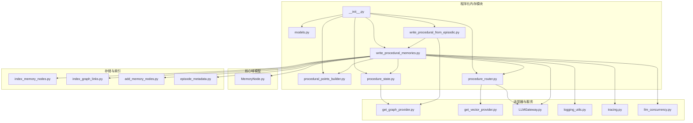
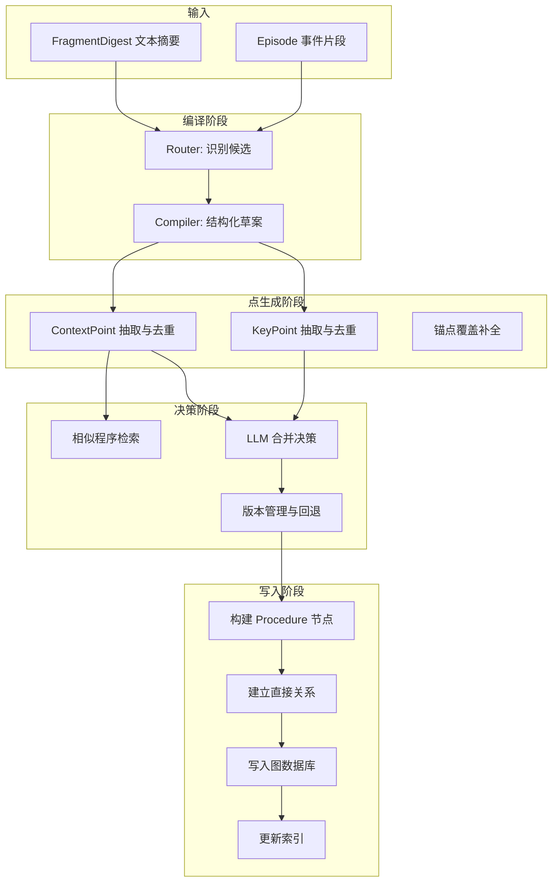
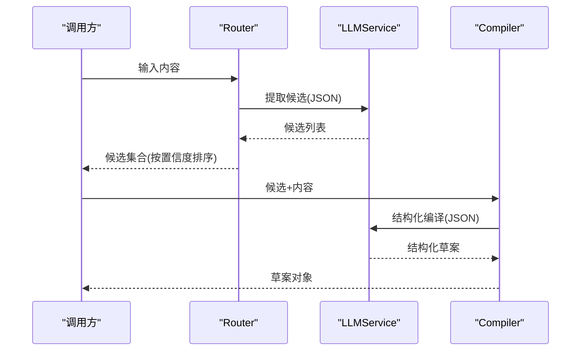
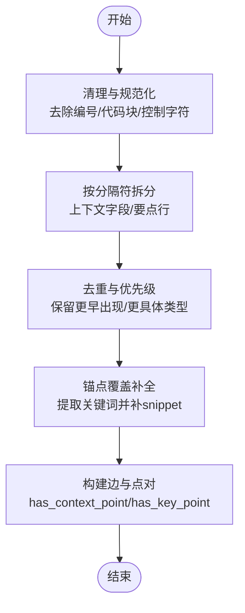
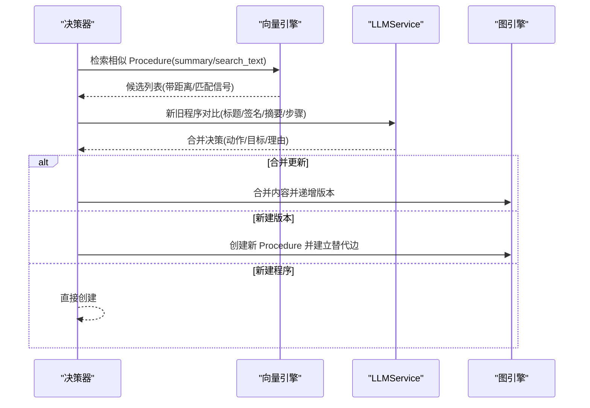
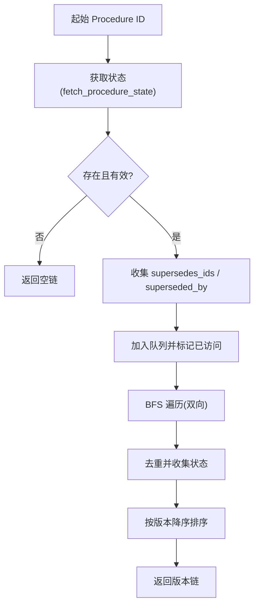
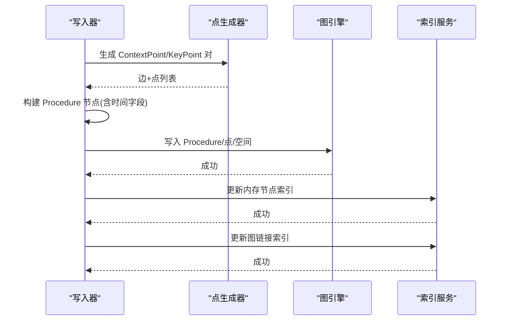
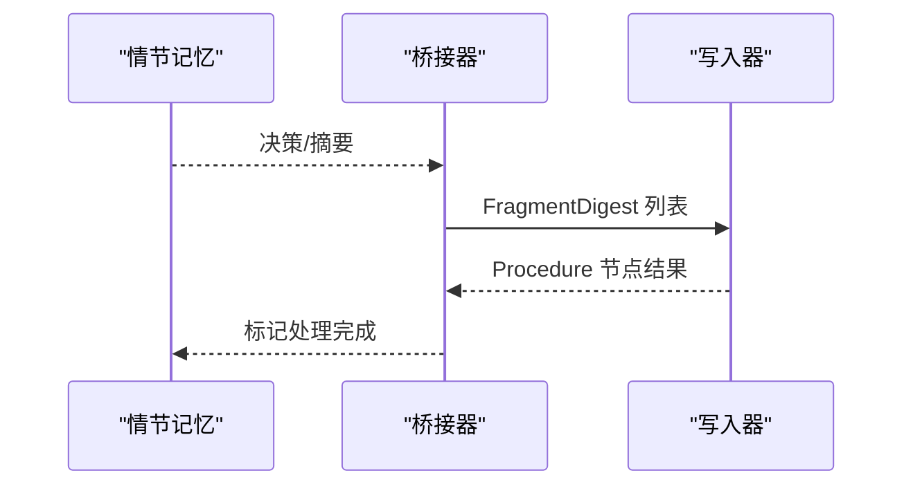
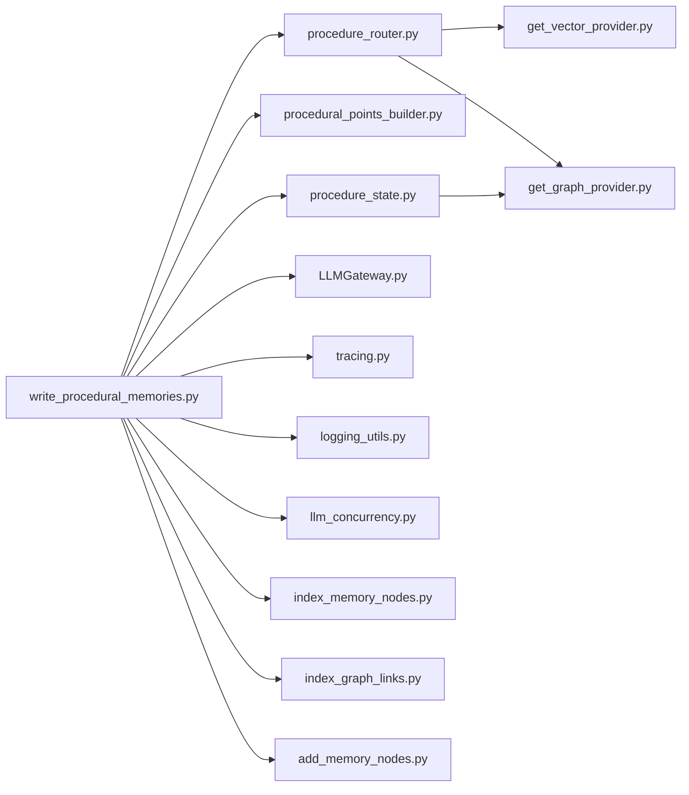

# 程序化构建器

<cite>
**本文引用的文件**
- [m_flow/memory/procedural/__init__.py](file://m_flow/memory/procedural/__init__.py)
- [m_flow/memory/procedural/models.py](file://m_flow/memory/procedural/models.py)
- [m_flow/memory/procedural/write_procedural_memories.py](file://m_flow/memory/procedural/write_procedural_memories.py)
- [m_flow/memory/procedural/procedural_points_builder.py](file://m_flow/memory/procedural/procedural_points_builder.py)
- [m_flow/memory/procedural/procedure_router.py](file://m_flow/memory/procedural/procedure_router.py)
- [m_flow/memory/procedural/write_procedural_from_episodic.py](file://m_flow/memory/procedural/write_procedural_from_episodic.py)
- [m_flow/memory/procedural/procedure_state.py](file://m_flow/memory/procedural/procedure_state.py)
- [m_flow/core/domain/models/MemoryNode.py](file://m_flow/core/domain/models/MemoryNode.py)
- [m_flow/storage/add_memory_nodes.py](file://m_flow/storage/add_memory_nodes.py)
- [m_flow/storage/index_memory_nodes.py](file://m_flow/storage/index_memory_nodes.py)
- [m_flow/storage/index_graph_links.py](file://m_flow/storage/index_graph_links.py)
- [m_flow/storage/episode_metadata.py](file://m_flow/storage/episode_metadata.py)
- [m_flow/knowledge/summarization/models.py](file://m_flow/knowledge/summarization/models.py)
- [m_flow/llm/LLMGateway.py](file://m_flow/llm/LLMGateway.py)
- [m_flow/shared/tracing.py](file://m_flow/shared/tracing.py)
- [m_flow/shared/logging_utils.py](file://m_flow/shared/logging_utils.py)
- [m_flow/shared/llm_concurrency.py](file://m_flow/shared/llm_concurrency.py)
- [m_flow/adapters/graph/get_graph_provider.py](file://m_flow/adapters/graph/get_graph_provider.py)
- [m_flow/adapters/vector/get_vector_provider.py](file://m_flow/adapters/vector/get_vector_provider.py)
</cite>

## 目录
1. [简介](#简介)
2. [项目结构](#项目结构)
3. [核心组件](#核心组件)
4. [架构总览](#架构总览)
5. [详细组件分析](#详细组件分析)
6. [依赖关系分析](#依赖关系分析)
7. [性能考量](#性能考量)
8. [故障排除指南](#故障排除指南)
9. [结论](#结论)
10. [附录](#附录)

## 简介
本文件面向程序化构建器的技术文档，系统阐述程序化记忆的构建流程，涵盖编译、决策、回忆与写入四个核心阶段。文档重点说明：
- 编译阶段：将程序化草案转换为可执行的图数据库结构，生成 Procedure 节点及其直接连接的 ContextPoint/KeyPoint。
- 决策阶段：基于相似性检索与 LLM 判定，决定创建新程序、更新现有程序或创建新版本。
- 回忆阶段：通过向量检索与时间信息传播，实现上下文匹配与版本追踪。
- 写入阶段：数据持久化策略，包括节点创建、关系建立与索引更新。

同时提供完整的流程图与状态转换图，展示从草案到最终存储的全过程，并包含错误处理与回滚机制说明。

## 项目结构
程序化构建器位于 m_flow/memory/procedural 目录下，围绕“路由-编译-点生成-安全-返回”的流水线组织模块，配合检索与版本管理模块实现增量更新与版本演进。

图表来源
- [m_flow/memory/procedural/__init__.py:1-121](file://m_flow/memory/procedural/__init__.py#L1-L121)
- [m_flow/memory/procedural/write_procedural_memories.py:1-669](file://m_flow/memory/procedural/write_procedural_memories.py#L1-L669)
- [m_flow/memory/procedural/procedural_points_builder.py:1-390](file://m_flow/memory/procedural/procedural_points_builder.py#L1-L390)
- [m_flow/memory/procedural/procedure_router.py:1-459](file://m_flow/memory/procedural/procedure_router.py#L1-L459)
- [m_flow/memory/procedural/procedure_state.py:1-393](file://m_flow/memory/procedural/procedure_state.py#L1-L393)
- [m_flow/memory/procedural/write_procedural_from_episodic.py:1-353](file://m_flow/memory/procedural/write_procedural_from_episodic.py#L1-L353)
- [m_flow/core/domain/models/MemoryNode.py](file://m_flow/core/domain/models/MemoryNode.py)
- [m_flow/storage/index_memory_nodes.py](file://m_flow/storage/index_memory_nodes.py)
- [m_flow/storage/index_graph_links.py](file://m_flow/storage/index_graph_links.py)
- [m_flow/storage/add_memory_nodes.py](file://m_flow/storage/add_memory_nodes.py)
- [m_flow/storage/episode_metadata.py](file://m_flow/storage/episode_metadata.py)
- [m_flow/adapters/graph/get_graph_provider.py](file://m_flow/adapters/graph/get_graph_provider.py)
- [m_flow/adapters/vector/get_vector_provider.py](file://m_flow/adapters/vector/get_vector_provider.py)
- [m_flow/llm/LLMGateway.py](file://m_flow/llm/LLMGateway.py)
- [m_flow/shared/tracing.py](file://m_flow/shared/tracing.py)
- [m_flow/shared/logging_utils.py](file://m_flow/shared/logging_utils.py)
- [m_flow/shared/llm_concurrency.py](file://m_flow/shared/llm_concurrency.py)

章节来源
- [m_flow/memory/procedural/__init__.py:1-121](file://m_flow/memory/procedural/__init__.py#L1-L121)

## 核心组件
- 路由器与合并决策：负责相似程序检索、LLM 合并决策与版本管理。
- 编译器：将候选与源内容编译为结构化草案（标题、签名、检索词、上下文包、要点包）。
- 点生成器：确定性地从结构化内容生成 ContextPoint 与 KeyPoint，保证覆盖与去重。
- 安全检查：敏感信息脱敏与危险内容检测。
- 写入管线：构建 Procedure 节点及其直接边，写入图数据库与向量索引。
- 回忆与检索：基于 Procedure_summary 与 Procedure_search_text 的向量检索，结合时间传播与版本链查询。

章节来源
- [m_flow/memory/procedural/write_procedural_memories.py:1-669](file://m_flow/memory/procedural/write_procedural_memories.py#L1-L669)
- [m_flow/memory/procedural/procedural_points_builder.py:1-390](file://m_flow/memory/procedural/procedural_points_builder.py#L1-L390)
- [m_flow/memory/procedural/procedure_router.py:1-459](file://m_flow/memory/procedural/procedure_router.py#L1-L459)
- [m_flow/memory/procedural/procedure_state.py:1-393](file://m_flow/memory/procedural/procedure_state.py#L1-L393)

## 架构总览
程序化构建器采用“2层三元组”架构：Procedure 直接连接 ContextPoint 与 KeyPoint，不使用 Pack 中间节点。编译阶段产出结构化草案，点生成阶段进行确定性抽取与覆盖补全，路由阶段进行相似性检索与 LLM 决策，最终写入图数据库并更新索引。

图表来源
- [m_flow/memory/procedural/write_procedural_memories.py:212-377](file://m_flow/memory/procedural/write_procedural_memories.py#L212-L377)
- [m_flow/memory/procedural/procedural_points_builder.py:153-390](file://m_flow/memory/procedural/procedural_points_builder.py#L153-L390)
- [m_flow/memory/procedural/procedure_router.py:261-321](file://m_flow/memory/procedural/procedure_router.py#L261-L321)
- [m_flow/storage/index_memory_nodes.py](file://m_flow/storage/index_memory_nodes.py)
- [m_flow/storage/index_graph_links.py](file://m_flow/storage/index_graph_links.py)
- [m_flow/storage/add_memory_nodes.py](file://m_flow/storage/add_memory_nodes.py)

## 详细组件分析

### 组件A：编译阶段（Router + Compiler）
- Router：从输入内容中识别多个程序化候选，输出候选列表（包含 search_text、置信度、理由、类型），支持阈值过滤与数量限制。
- Compiler：基于候选与源内容，结构化提取标题、签名、检索词、上下文字段与要点文本，严格避免虚构事实与泄露敏感信息。

图表来源
- [m_flow/memory/procedural/write_procedural_memories.py:380-417](file://m_flow/memory/procedural/write_procedural_memories.py#L380-L417)
- [m_flow/llm/LLMGateway.py](file://m_flow/llm/LLMGateway.py)

章节来源
- [m_flow/memory/procedural/write_procedural_memories.py:380-417](file://m_flow/memory/procedural/write_procedural_memories.py#L380-L417)

### 组件B：点生成阶段（确定性抽取与覆盖补全）
- ContextPoint：从 when/why/boundary/outcome/prereq/exception 等字段拆分并规范化，去重后生成点与边。
- KeyPoint：按行拆分要点文本，识别编号步骤，规范化与去重，必要时自动补全锚点覆盖。
- 时间传播：在摘要构建后提取提及时间，传播至 Procedure 及其点。

图表来源
- [m_flow/memory/procedural/procedural_points_builder.py:153-390](file://m_flow/memory/procedural/procedural_points_builder.py#L153-L390)

章节来源
- [m_flow/memory/procedural/procedural_points_builder.py:153-390](file://m_flow/memory/procedural/procedural_points_builder.py#L153-L390)

### 组件C：决策阶段（相似性检索与合并决策）
- 相似性检索：在 Procedure_summary 与 Procedure_search_text 上进行向量检索，收集候选并给出匹配信号。
- 合并决策：LLM 判定三种动作（合并更新、新建版本、新建程序），并指定目标程序 ID。
- 版本管理：获取版本、创建“替代”关系、合并内容并递增版本号。

图表来源
- [m_flow/memory/procedural/procedure_router.py:89-259](file://m_flow/memory/procedural/procedure_router.py#L89-L259)
- [m_flow/adapters/vector/get_vector_provider.py](file://m_flow/adapters/vector/get_vector_provider.py)
- [m_flow/adapters/graph/get_graph_provider.py](file://m_flow/adapters/graph/get_graph_provider.py)
- [m_flow/llm/LLMGateway.py](file://m_flow/llm/LLMGateway.py)

章节来源
- [m_flow/memory/procedural/procedure_router.py:89-259](file://m_flow/memory/procedural/procedure_router.py#L89-L259)

### 组件D：回忆阶段（上下文匹配与版本链）
- 版本链查询：从给定 Procedure 出发，沿“替代”边双向遍历，构建完整版本历史并按版本降序排列。
- 活跃版本查找：按 signature 与 active 状态在图中查询当前活跃版本。
- 时间传播：在摘要中解析时间范围并传播到 Procedure 与其点，用于检索与排序。

图表来源
- [m_flow/memory/procedural/procedure_state.py:309-355](file://m_flow/memory/procedural/procedure_state.py#L309-L355)

章节来源
- [m_flow/memory/procedural/procedure_state.py:309-355](file://m_flow/memory/procedural/procedure_state.py#L309-L355)

### 组件E：写入阶段（节点创建、关系建立与索引更新）
- 节点创建：生成 Procedure 节点，填充名称、摘要、检索词、上下文文本、要点文本、签名、置信度、时间字段与内存空间。
- 关系建立：为每个 ContextPoint/KeyPoint 构建边，确保 edge_text 有意义。
- 索引更新：调用存储层接口更新内存节点索引与图链接索引。
- 持久化：通过统一的持久化函数写入图数据库。

图表来源
- [m_flow/memory/procedural/write_procedural_memories.py:511-668](file://m_flow/memory/procedural/write_procedural_memories.py#L511-L668)
- [m_flow/storage/index_memory_nodes.py](file://m_flow/storage/index_memory_nodes.py)
- [m_flow/storage/index_graph_links.py](file://m_flow/storage/index_graph_links.py)
- [m_flow/storage/add_memory_nodes.py](file://m_flow/storage/add_memory_nodes.py)

章节来源
- [m_flow/memory/procedural/write_procedural_memories.py:511-668](file://m_flow/memory/procedural/write_procedural_memories.py#L511-L668)

### 组件F：从情节记忆桥接（统一注入与事后提取）
- 统一注入：接收情节路由决策，直接编译候选并生成 Procedure。
- 事后提取：从已存储的情节记忆中批量提取，转换为 FragmentDigest 后走统一写入流程。

图表来源
- [m_flow/memory/procedural/write_procedural_from_episodic.py:88-353](file://m_flow/memory/procedural/write_procedural_from_episodic.py#L88-L353)

章节来源
- [m_flow/memory/procedural/write_procedural_from_episodic.py:88-353](file://m_flow/memory/procedural/write_procedural_from_episodic.py#L88-L353)

## 依赖关系分析
- 模块内聚：各阶段职责清晰，编译与点生成解耦，路由与写入解耦。
- 外部依赖：LLMService、图引擎、向量引擎、日志与追踪、并发控制。
- 循环依赖：未发现循环导入；路由与状态查询通过接口调用，避免强耦合。

图表来源
- [m_flow/memory/procedural/write_procedural_memories.py:1-669](file://m_flow/memory/procedural/write_procedural_memories.py#L1-L669)
- [m_flow/memory/procedural/procedure_router.py:1-459](file://m_flow/memory/procedural/procedure_router.py#L1-L459)
- [m_flow/memory/procedural/procedural_points_builder.py:1-390](file://m_flow/memory/procedural/procedural_points_builder.py#L1-L390)
- [m_flow/memory/procedural/procedure_state.py:1-393](file://m_flow/memory/procedural/procedure_state.py#L1-L393)
- [m_flow/llm/LLMGateway.py](file://m_flow/llm/LLMGateway.py)
- [m_flow/shared/tracing.py](file://m_flow/shared/tracing.py)
- [m_flow/shared/logging_utils.py](file://m_flow/shared/logging_utils.py)
- [m_flow/shared/llm_concurrency.py](file://m_flow/shared/llm_concurrency.py)
- [m_flow/adapters/vector/get_vector_provider.py](file://m_flow/adapters/vector/get_vector_provider.py)
- [m_flow/adapters/graph/get_graph_provider.py](file://m_flow/adapters/graph/get_graph_provider.py)
- [m_flow/storage/index_memory_nodes.py](file://m_flow/storage/index_memory_nodes.py)
- [m_flow/storage/index_graph_links.py](file://m_flow/storage/index_graph_links.py)
- [m_flow/storage/add_memory_nodes.py](file://m_flow/storage/add_memory_nodes.py)

## 性能考量
- 并发控制：全局 LLM 信号量限制并发，避免过载；异步 gather 并行编译候选。
- 候选过滤：置信度阈值与数量上限减少无效编译开销。
- 去重与覆盖：规范化与锚点提取降低重复点数量，提升检索效率。
- 索引更新：批量写入与索引更新分离，避免阻塞主流程。
- 时间传播：在摘要阶段解析时间，减少后续检索成本。

## 故障排除指南
- LLM 调用失败：编译与合并决策均捕获异常，失败时回退到保守策略（新建程序）。
- 路由失败：向量检索异常时记录警告并跳过候选；图查询异常时返回空结果。
- 危险内容：在编译后进行敏感信息脱敏与危险内容检测，检测到则跳过该候选。
- 并发超限：通过全局 LLM 信号量控制，避免 LLM 服务过载。
- 写入异常：写入图数据库与索引失败时记录错误，不影响其他候选处理。

章节来源
- [m_flow/memory/procedural/write_procedural_memories.py:461-508](file://m_flow/memory/procedural/write_procedural_memories.py#L461-L508)
- [m_flow/memory/procedural/procedure_router.py:145-178](file://m_flow/memory/procedural/procedure_router.py#L145-L178)
- [m_flow/memory/procedural/procedure_router.py:251-258](file://m_flow/memory/procedural/procedure_router.py#L251-L258)

## 结论
程序化构建器通过“路由-编译-点生成-安全-写入”的流水线，实现了从非结构化内容到图数据库中稳定、可检索、可演进的程序化知识。确定性点生成与 LLM 合并决策相结合，在保证质量的同时兼顾扩展性与可维护性。版本管理与时间传播机制进一步增强了系统的可追溯性与实用性。

## 附录
- 数据模型概览：程序化草案与点模型定义见 models.py；Procedure、ContextPoint、KeyPoint 等节点类型定义见核心域模型。
- 摘要模型：FragmentDigest 作为输入摘要载体，参与统一写入流程。

章节来源
- [m_flow/memory/procedural/models.py:1-249](file://m_flow/memory/procedural/models.py#L1-L249)
- [m_flow/knowledge/summarization/models.py](file://m_flow/knowledge/summarization/models.py)
- [m_flow/core/domain/models/MemoryNode.py](file://m_flow/core/domain/models/MemoryNode.py)