# 程序化治理

<cite>
**本文引用的文件**
- [m_flow/memory/procedural/governance/__init__.py](file://m_flow/memory/procedural/governance/__init__.py)
- [m_flow/memory/procedural/governance/worth_storing.py](file://m_flow/memory/procedural/governance/worth_storing.py)
- [m_flow/memory/procedural/governance/reconcile_active.py](file://m_flow/memory/procedural/governance/reconcile_active.py)
- [m_flow/memory/procedural/governance/update_usage_stats.py](file://m_flow/memory/procedural/governance/update_usage_stats.py)
- [m_flow/memory/procedural/governance/procedural_classifier.py](file://m_flow/memory/procedural/governance/procedural_classifier.py)
- [m_flow/memory/procedural/governance/procedural_extractor.py](file://m_flow/memory/procedural/governance/procedural_extractor.py)
- [m_flow/memory/procedural/models.py](file://m_flow/memory/procedural/models.py)
- [m_flow/memory/procedural/write_procedural_from_episodic.py](file://m_flow/memory/procedural/write_procedural_from_episodic.py)
- [m_flow/memory/procedural/extract_procedural_task.py](file://m_flow/memory/procedural/extract_procedural_task.py)
- [m_flow/memory/procedural/procedure_state.py](file://m_flow/memory/procedural/procedure_state.py)
- [m_flow/memory/procedural/versioning/__init__.py](file://m_flow/memory/procedural/versioning/__init__.py)
- [m_flow/memory/procedural/versioning/conflict_detector.py](file://m_flow/memory/procedural/versioning/conflict_detector.py)
- [m_flow/memory/procedural/versioning/generate_version_diff.py](file://m_flow/memory/procedural/versioning/generate_version_diff.py)
</cite>

## 目录
1. [简介](#简介)
2. [项目结构](#项目结构)
3. [核心组件](#核心组件)
4. [架构总览](#架构总览)
5. [详细组件分析](#详细组件分析)
6. [依赖分析](#依赖分析)
7. [性能考虑](#性能考虑)
8. [故障排查指南](#故障排查指南)
9. [结论](#结论)
10. [附录](#附录)

## 简介
本文件面向“程序化治理”的技术实现，聚焦于程序化记忆的质量控制与管理机制，覆盖分类、提取、协调、统计与价值评估等能力。文档同时解释程序化分类器与提取器的工作原理，说明冲突检测与版本差异生成机制，给出活跃程序的协调算法与使用统计更新策略，并提供治理流程的决策树与序列图，帮助读者快速理解与落地。

## 项目结构
程序化治理相关代码集中在内存子系统的“procedural”目录下，围绕“治理层”（分类、提取、价值评估、活跃协调、使用统计）与“版本管理”（冲突检测、版本差异）两大主线展开，并通过“从情节记忆抽取程序化记忆”的桥接模块连接到统一的写入流程。

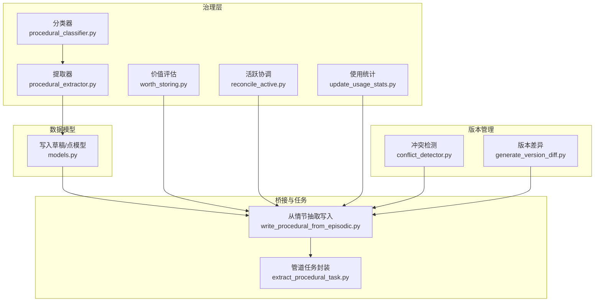

**图表来源**
- [m_flow/memory/procedural/governance/procedural_classifier.py:1-272](file://m_flow/memory/procedural/governance/procedural_classifier.py#L1-272)
- [m_flow/memory/procedural/governance/procedural_extractor.py:1-409](file://m_flow/memory/procedural/governance/procedural_extractor.py#L1-409)
- [m_flow/memory/procedural/governance/worth_storing.py:1-244](file://m_flow/memory/procedural/governance/worth_storing.py#L1-244)
- [m_flow/memory/procedural/governance/reconcile_active.py:1-144](file://m_flow/memory/procedural/governance/reconcile_active.py#L1-144)
- [m_flow/memory/procedural/governance/update_usage_stats.py:1-150](file://m_flow/memory/procedural/governance/update_usage_stats.py#L1-150)
- [m_flow/memory/procedural/versioning/conflict_detector.py:1-330](file://m_flow/memory/procedural/versioning/conflict_detector.py#L1-330)
- [m_flow/memory/procedural/versioning/generate_version_diff.py:1-187](file://m_flow/memory/procedural/versioning/generate_version_diff.py#L1-187)
- [m_flow/memory/procedural/models.py:1-249](file://m_flow/memory/procedural/models.py#L1-249)
- [m_flow/memory/procedural/write_procedural_from_episodic.py:1-353](file://m_flow/memory/procedural/write_procedural_from_episodic.py#L1-353)
- [m_flow/memory/procedural/extract_procedural_task.py:1-64](file://m_flow/memory/procedural/extract_procedural_task.py#L1-64)

**章节来源**
- [m_flow/memory/procedural/governance/__init__.py:1-55](file://m_flow/memory/procedural/governance/__init__.py#L1-55)

## 核心组件
- 程序化分类器：在进入大模型提取前进行快速预判，区分“流程类”“可能流程类”“事件/对话/事实/通用”等类型，降低LLM负担。
- 程序化提取器：以结构化提示词驱动LLM，抽象可复用的方法、习惯与做法，自动路由到“流程”或“偏好”两类存储。
- 价值评估器：基于文本特征与启发式规则计算“存储价值”，决定是否索引及索引粒度。
- 活跃协调器：保证同一签名的程序化知识在同一时刻仅保留一个“激活版本”，其余降级。
- 使用统计追踪器：记录检索/注入次数、最近使用时间等指标，支撑后续治理与淘汰策略。
- 冲突检测器：对新旧版本进行确定性冲突检测，必要时支持LLM增强判定。
- 版本差异生成器：生成面向用户的变更摘要与结构化差异，便于审阅与归档。

**章节来源**
- [m_flow/memory/procedural/governance/procedural_classifier.py:1-272](file://m_flow/memory/procedural/governance/procedural_classifier.py#L1-272)
- [m_flow/memory/procedural/governance/procedural_extractor.py:1-409](file://m_flow/memory/procedural/governance/procedural_extractor.py#L1-409)
- [m_flow/memory/procedural/governance/worth_storing.py:1-244](file://m_flow/memory/procedural/governance/worth_storing.py#L1-244)
- [m_flow/memory/procedural/governance/reconcile_active.py:1-144](file://m_flow/memory/procedural/governance/reconcile_active.py#L1-144)
- [m_flow/memory/procedural/governance/update_usage_stats.py:1-150](file://m_flow/memory/procedural/governance/update_usage_stats.py#L1-150)
- [m_flow/memory/procedural/versioning/conflict_detector.py:1-330](file://m_flow/memory/procedural/versioning/conflict_detector.py#L1-330)
- [m_flow/memory/procedural/versioning/generate_version_diff.py:1-187](file://m_flow/memory/procedural/versioning/generate_version_diff.py#L1-187)

## 架构总览
程序化治理贯穿“输入—预处理—提取—写入—治理—检索/注入”的闭环。输入可来自统一摄取的“情节记忆候选”，也可来自事后从已有情节记忆中抽取。写入阶段通过“写入草稿/点模型”组织结构，随后进入治理层进行价值评估、活跃协调与使用统计更新。

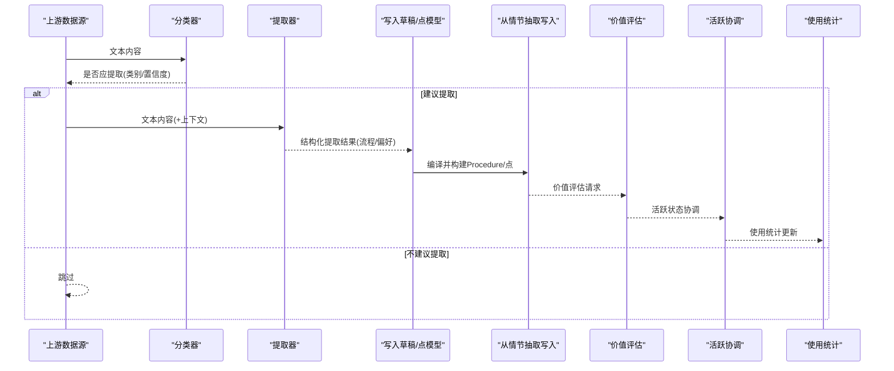

**图表来源**
- [m_flow/memory/procedural/governance/procedural_classifier.py:135-241](file://m_flow/memory/procedural/governance/procedural_classifier.py#L135-241)
- [m_flow/memory/procedural/governance/procedural_extractor.py:271-340](file://m_flow/memory/procedural/governance/procedural_extractor.py#L271-340)
- [m_flow/memory/procedural/models.py:154-209](file://m_flow/memory/procedural/models.py#L154-209)
- [m_flow/memory/procedural/write_procedural_from_episodic.py:173-352](file://m_flow/memory/procedural/write_procedural_from_episodic.py#L173-352)
- [m_flow/memory/procedural/governance/worth_storing.py:84-188](file://m_flow/memory/procedural/governance/worth_storing.py#L84-188)
- [m_flow/memory/procedural/governance/reconcile_active.py:31-122](file://m_flow/memory/procedural/governance/reconcile_active.py#L31-122)
- [m_flow/memory/procedural/governance/update_usage_stats.py:33-125](file://m_flow/memory/procedural/governance/update_usage_stats.py#L33-125)

## 详细组件分析

### 程序化分类器
- 设计目标：在LLM提取前进行轻量规则+弱LLM两层过滤，优先避免误判，减少昂贵推理成本。
- 关键机制：
  - 显式流程信号（步骤编号、流程关键词、命令/工具名、条件分支、注意事项等）加权打分；
  - 隐式流程信号（顺序动作词、经验分享、问答式方法、因果/决策模式等）辅助识别；
  - 事件/对话/通用内容的负向信号抑制；
  - 最小意义步骤数与最小长度阈值，过滤过于简单的片段；
  - 综合得分与阈值决定内容类型与是否提取。
- 输出：内容类型（流程/可能流程/事件/事实/对话/通用）、是否提取、置信度、触发信号列表与原因。

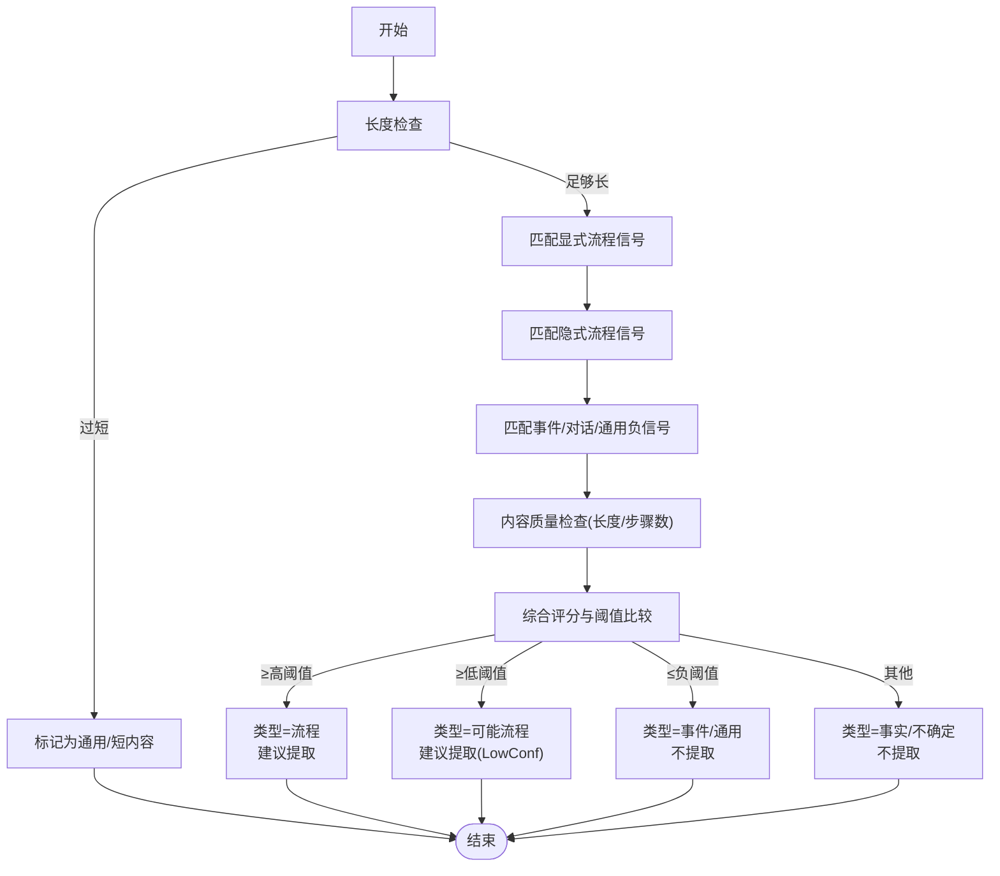

**图表来源**
- [m_flow/memory/procedural/governance/procedural_classifier.py:135-241](file://m_flow/memory/procedural/governance/procedural_classifier.py#L135-241)

**章节来源**
- [m_flow/memory/procedural/governance/procedural_classifier.py:1-272](file://m_flow/memory/procedural/governance/procedural_classifier.py#L1-272)

### 程序化提取器
- 设计理念：强调“抽象维度”记忆，区分“流程”（多步骤、条件分支、上下文依赖）与“偏好”（简单规则/习惯/单一信息点）两类存储。
- 关键机制：
  - 系统提示词定义“什么是程序化记忆”以及两类存储的分流原则；
  - 输入内容截断与上下文拼接，调用LLM结构化抽取，输出包含标题、摘要、类别、记忆类型、要点证据等字段；
  - 对结果按memory_type进行分类路由（流程/偏好），并附加来源追踪。
- 冲突规避：提供“跳过提取”的轻量预过滤，避免明显无效内容进入LLM。

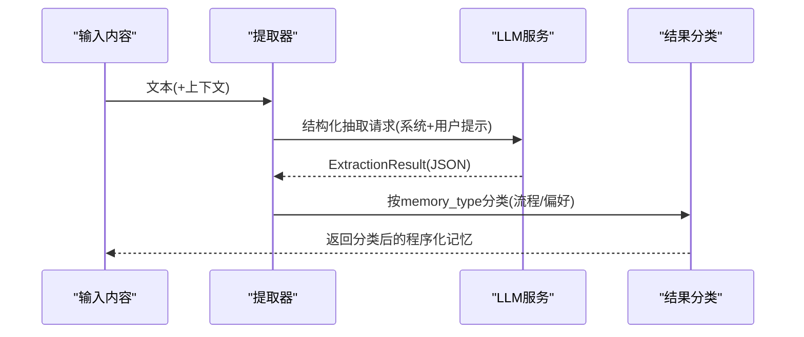

**图表来源**
- [m_flow/memory/procedural/governance/procedural_extractor.py:271-340](file://m_flow/memory/procedural/governance/procedural_extractor.py#L271-340)

**章节来源**
- [m_flow/memory/procedural/governance/procedural_extractor.py:1-409](file://m_flow/memory/procedural/governance/procedural_extractor.py#L1-409)

### 价值评估模型
- 目标：衡量一条程序化知识的“存储价值”，决定是否纳入索引及索引粒度。
- 关键信号：
  - 负面信号：通用步骤过多、内容过短；
  - 正面信号：安全关键、组织特定、工具链特定、高复杂度、上下文完整、步骤数量充足等；
  - 综合评分归一化至[0,1]，结合阈值决定：
    - ≥阈值：索引（全量或仅摘要）；
    - <阈值×0.5：不索引；
    - 在中间区间：仅摘要索引。
- 输出：评分、理由、触发信号集合、是否索引、索引级别。

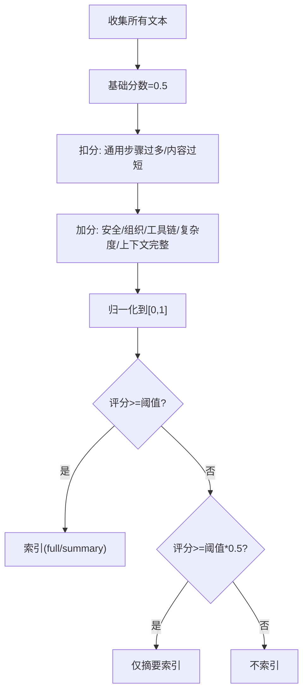

**图表来源**
- [m_flow/memory/procedural/governance/worth_storing.py:84-188](file://m_flow/memory/procedural/governance/worth_storing.py#L84-188)

**章节来源**
- [m_flow/memory/procedural/governance/worth_storing.py:1-244](file://m_flow/memory/procedural/governance/worth_storing.py#L1-244)

### 活跃程序协调算法
- 目标：确保同一procedure_key仅有一个“激活版本”，避免版本漂移与歧义。
- 算法流程：
  - 查询所有Procedure节点，筛选匹配signature或procedure_key；
  - 按版本号与更新时间排序，最新版本设为“激活”；
  - 其余版本状态置为“被替代”；
  - 记录被降级数量与激活ID，用于可观测性与审计。
- 异常处理：查询/更新失败时记录错误并返回空结果。

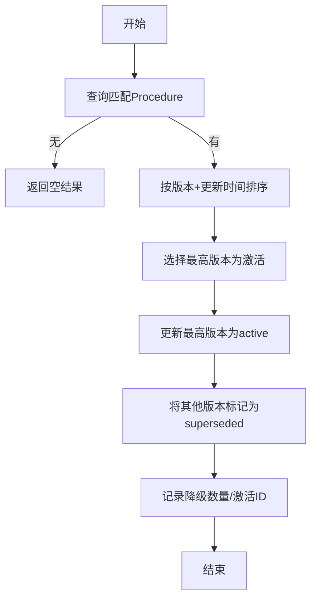

**图表来源**
- [m_flow/memory/procedural/governance/reconcile_active.py:31-122](file://m_flow/memory/procedural/governance/reconcile_active.py#L31-122)

**章节来源**
- [m_flow/memory/procedural/governance/reconcile_active.py:1-144](file://m_flow/memory/procedural/governance/reconcile_active.py#L1-144)

### 使用统计更新机制
- 目标：跟踪程序化知识的使用频率与效果，支撑治理与淘汰策略。
- 更新策略：
  - 支持“注入”和“检索”两类使用类型；
  - 原子读取→累加计数→写回属性（使用次数、最近使用时间、注入/检索计数）；
  - 批量更新，逐条捕获异常并记录日志；
  - 通过追踪事件上报使用统计更新事件，便于监控。
- 输出：每条Procedure的使用统计对象列表。

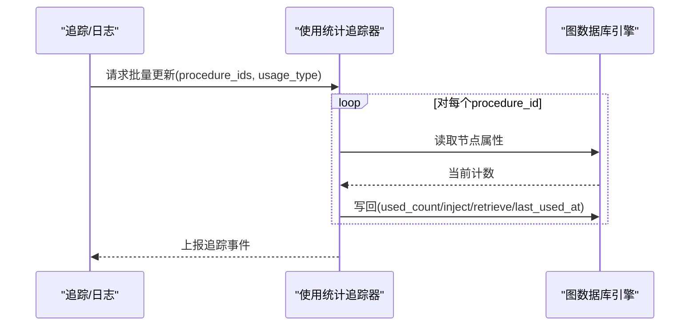

**图表来源**
- [m_flow/memory/procedural/governance/update_usage_stats.py:33-125](file://m_flow/memory/procedural/governance/update_usage_stats.py#L33-125)

**章节来源**
- [m_flow/memory/procedural/governance/update_usage_stats.py:1-150](file://m_flow/memory/procedural/governance/update_usage_stats.py#L1-150)

### 冲突检测与版本差异
- 冲突检测：
  - 确定性检测：步骤集的Jaccard距离、强/弱冲突信号词、边界约束词变化；
  - 若为“温和冲突”且允许LLM增强，则可进一步调用LLM辅助判定；
  - 输出冲突等级（无/温和/强烈）、推荐动作（修补/新建版本）与原因。
- 版本差异：
  - 计算步骤增删改数量、上下文/边界变化；
  - 生成面向用户的变更摘要与结构化diff，便于审阅与归档。

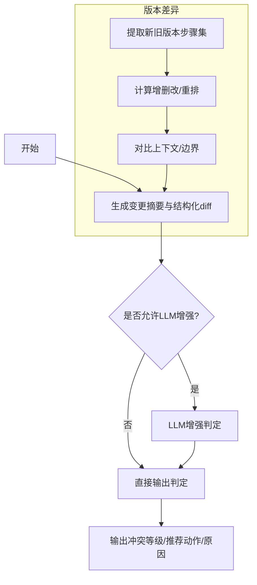

**图表来源**
- [m_flow/memory/procedural/versioning/conflict_detector.py:114-218](file://m_flow/memory/procedural/versioning/conflict_detector.py#L114-218)
- [m_flow/memory/procedural/versioning/generate_version_diff.py:36-150](file://m_flow/memory/procedural/versioning/generate_version_diff.py#L36-150)

**章节来源**
- [m_flow/memory/procedural/versioning/conflict_detector.py:1-330](file://m_flow/memory/procedural/versioning/conflict_detector.py#L1-330)
- [m_flow/memory/procedural/versioning/generate_version_diff.py:1-187](file://m_flow/memory/procedural/versioning/generate_version_diff.py#L1-187)

### 数据模型与写入桥接
- 写入草稿/点模型：
  - ContextPackDraft/KeyPointsPackDraft用于结构化上下文与要点；
  - ContextPointDraft/KeyPointDraft用于细粒度检索点；
  - ProceduralWriteDraft整合标题、签名、检索短语、上下文与要点，作为图存储的主结构。
- 从情节抽取写入：
  - 支持两类用例：统一摄取时直接接收候选，或事后从已有情节记忆中抽取；
  - 将情节摘要转换为FragmentDigest，调用写入流程编译并持久化；
  - 标记已处理情节，过滤临时节点，批量写入图数据库。

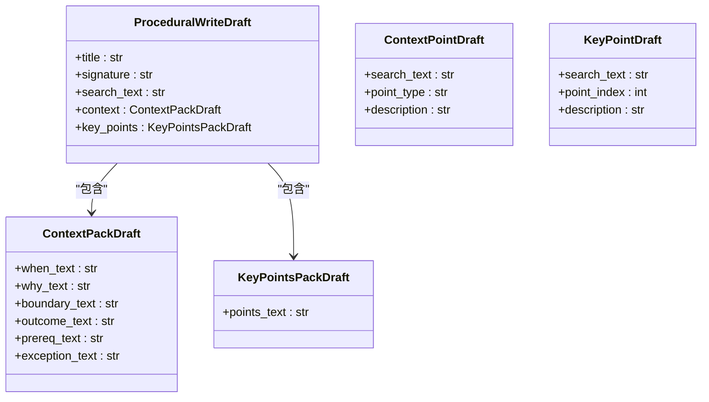

**图表来源**
- [m_flow/memory/procedural/models.py:30-209](file://m_flow/memory/procedural/models.py#L30-209)

**章节来源**
- [m_flow/memory/procedural/models.py:1-249](file://m_flow/memory/procedural/models.py#L1-249)
- [m_flow/memory/procedural/write_procedural_from_episodic.py:173-352](file://m_flow/memory/procedural/write_procedural_from_episodic.py#L173-352)
- [m_flow/memory/procedural/extract_procedural_task.py:24-63](file://m_flow/memory/procedural/extract_procedural_task.py#L24-63)

## 依赖分析
- 模块内聚与耦合：
  - 分类器与提取器通过“是否提取”的接口解耦，前者负责预过滤，后者负责结构化抽取；
  - 价值评估、活跃协调与使用统计均依赖图数据库引擎进行节点查询/更新；
  - 冲突检测与版本差异生成独立于写入流程，但与Procedure状态模型紧密关联；
  - 写入桥接模块串联“从情节抽取”与“写入草稿/点模型”，形成稳定的输入通道。
- 外部依赖：
  - LLM服务用于结构化抽取；
  - 图数据库适配器提供查询/更新能力；
  - 追踪与日志系统用于可观测性事件上报。

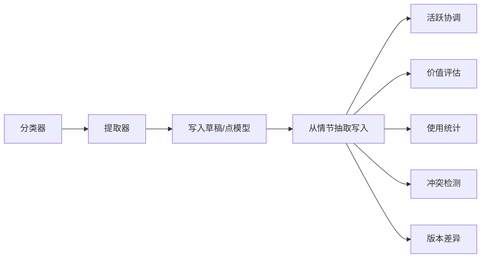

**图表来源**
- [m_flow/memory/procedural/governance/procedural_classifier.py:1-272](file://m_flow/memory/procedural/governance/procedural_classifier.py#L1-272)
- [m_flow/memory/procedural/governance/procedural_extractor.py:1-409](file://m_flow/memory/procedural/governance/procedural_extractor.py#L1-409)
- [m_flow/memory/procedural/models.py:1-249](file://m_flow/memory/procedural/models.py#L1-249)
- [m_flow/memory/procedural/write_procedural_from_episodic.py:1-353](file://m_flow/memory/procedural/write_procedural_from_episodic.py#L1-353)
- [m_flow/memory/procedural/governance/reconcile_active.py:1-144](file://m_flow/memory/procedural/governance/reconcile_active.py#L1-144)
- [m_flow/memory/procedural/governance/worth_storing.py:1-244](file://m_flow/memory/procedural/governance/worth_storing.py#L1-244)
- [m_flow/memory/procedural/governance/update_usage_stats.py:1-150](file://m_flow/memory/procedural/governance/update_usage_stats.py#L1-150)
- [m_flow/memory/procedural/versioning/conflict_detector.py:1-330](file://m_flow/memory/procedural/versioning/conflict_detector.py#L1-330)
- [m_flow/memory/procedural/versioning/generate_version_diff.py:1-187](file://m_flow/memory/procedural/versioning/generate_version_diff.py#L1-187)

**章节来源**
- [m_flow/memory/procedural/governance/__init__.py:1-55](file://m_flow/memory/procedural/governance/__init__.py#L1-55)

## 性能考虑
- 分类器与提取器的前置过滤显著降低LLM调用频次与成本，建议在大规模摄取场景中启用。
- 批量写入与并发处理（如异步gather）可提升从情节抽取的吞吐，注意异常隔离与日志记录。
- 使用统计更新采用原子读写，建议在高并发场景下配合限流与重试策略。
- 冲突检测与版本差异生成尽量使用确定性规则，必要时再引入LLM增强，平衡准确性与延迟。

## 故障排查指南
- 分类器误判：
  - 检查输入长度与信号模式是否触发阈值；
  - 调整阈值或扩展信号词库。
- 提取器失败：
  - 查看提示词是否清晰，输入长度是否截断过度；
  - 检查LLM服务连通性与响应模型。
- 价值评估异常：
  - 核对Procedure文本完整性与字段填充；
  - 检查阈值设置与索引策略。
- 活跃协调失败：
  - 排查图数据库查询/更新权限；
  - 确认signature/版本字段一致性。
- 使用统计缺失：
  - 检查procedure_id是否存在；
  - 核对usage_type与追踪事件上报。
- 冲突检测/版本差异异常：
  - 检查步骤文本标准化与边界文本提取逻辑；
  - 确认新旧版本结构一致性。

**章节来源**
- [m_flow/memory/procedural/governance/procedural_classifier.py:135-241](file://m_flow/memory/procedural/governance/procedural_classifier.py#L135-241)
- [m_flow/memory/procedural/governance/procedural_extractor.py:335-340](file://m_flow/memory/procedural/governance/procedural_extractor.py#L335-340)
- [m_flow/memory/procedural/governance/worth_storing.py:177-186](file://m_flow/memory/procedural/governance/worth_storing.py#L177-186)
- [m_flow/memory/procedural/governance/reconcile_active.py:48-56](file://m_flow/memory/procedural/governance/reconcile_active.py#L48-56)
- [m_flow/memory/procedural/governance/update_usage_stats.py:56-74](file://m_flow/memory/procedural/governance/update_usage_stats.py#L56-74)
- [m_flow/memory/procedural/versioning/conflict_detector.py:138-148](file://m_flow/memory/procedural/versioning/conflict_detector.py#L138-148)
- [m_flow/memory/procedural/versioning/generate_version_diff.py:136-148](file://m_flow/memory/procedural/versioning/generate_version_diff.py#L136-148)

## 结论
程序化治理通过“分类—提取—评估—协调—统计—版本管理”的闭环，实现了对程序化知识的高质量、低成本与可持续管理。分类器与提取器的两级过滤有效降低推理成本；价值评估与活跃协调保障知识库的可用性与一致性；使用统计为治理与淘汰提供数据依据；冲突检测与版本差异生成确保演进过程可控可追溯。建议在实际部署中结合业务场景调优阈值与策略，并持续完善可观测性与告警体系。

## 附录
- 治理流程决策树（概念示意）
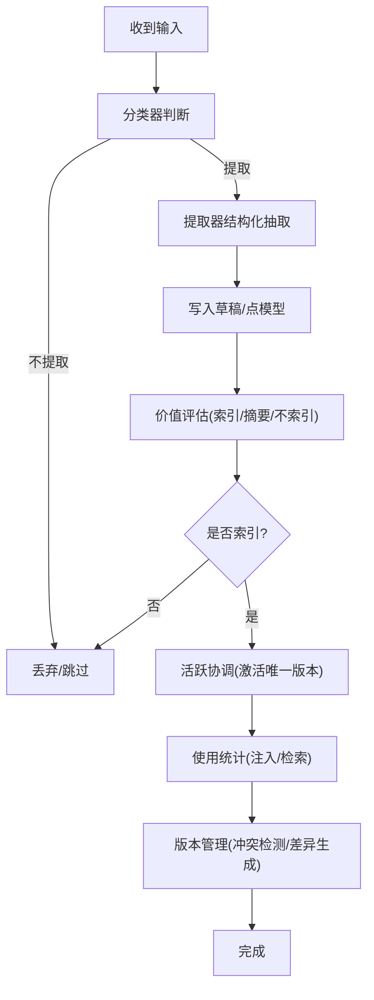