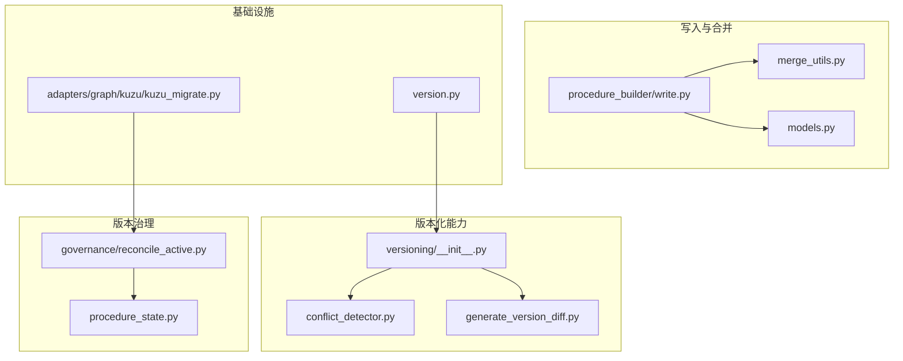
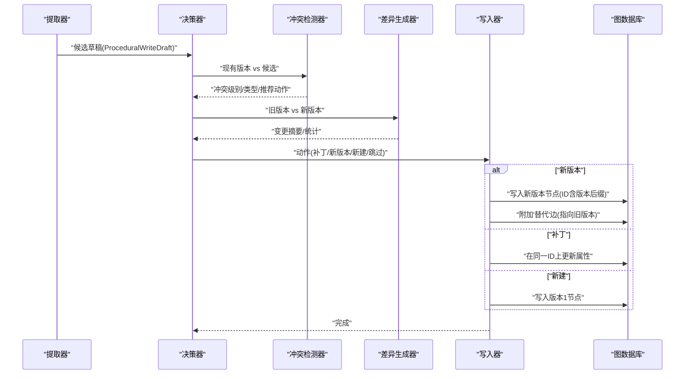
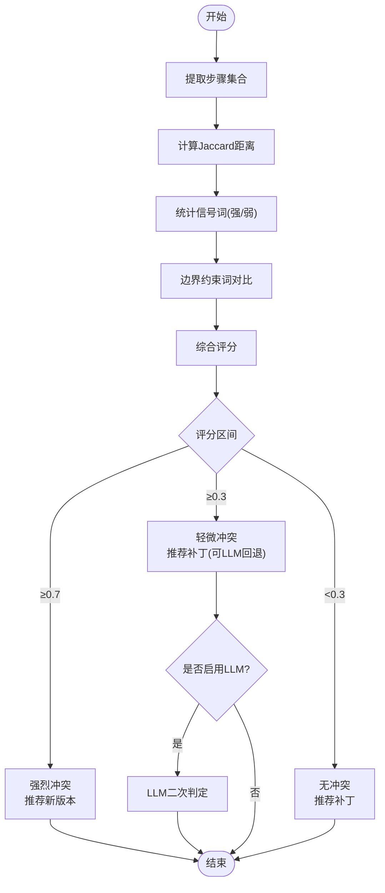
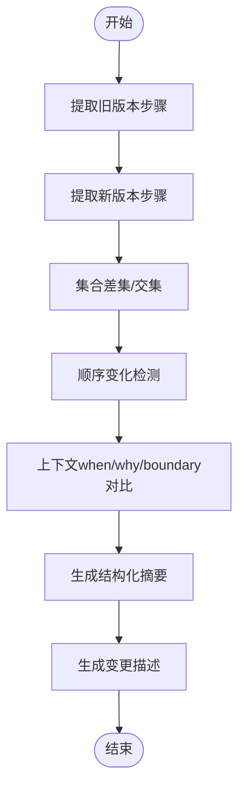
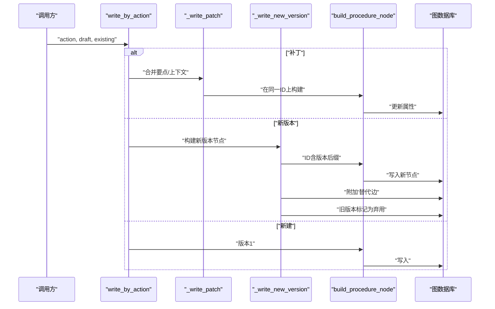
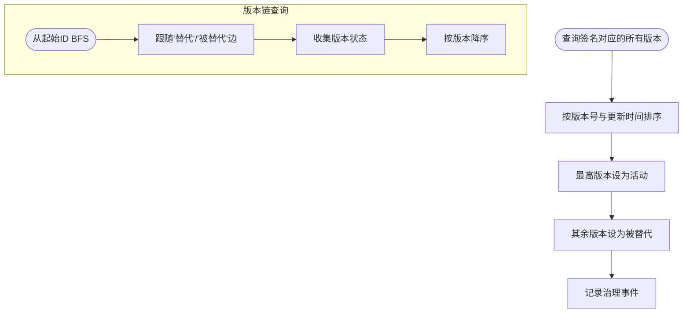
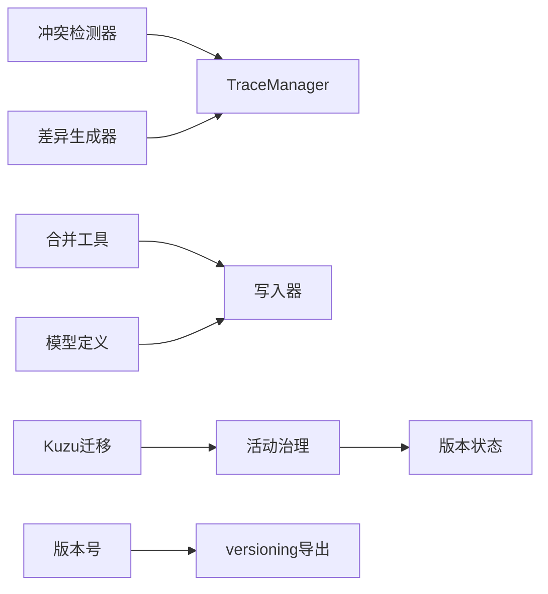

# 程序化版本管理

<cite>
**本文引用的文件**
- [m_flow/version.py](file://m_flow/version.py)
- [m_flow/memory/procedural/versioning/__init__.py](file://m_flow/memory/procedural/versioning/__init__.py)
- [m_flow/memory/procedural/versioning/conflict_detector.py](file://m_flow/memory/procedural/versioning/conflict_detector.py)
- [m_flow/memory/procedural/versioning/generate_version_diff.py](file://m_flow/memory/procedural/versioning/generate_version_diff.py)
- [m_flow/memory/procedural/models.py](file://m_flow/memory/procedural/models.py)
- [m_flow/memory/procedural/procedure_builder/merge_utils.py](file://m_flow/memory/procedural/procedure_builder/merge_utils.py)
- [m_flow/memory/procedural/procedure_builder/write.py](file://m_flow/memory/procedural/procedure_builder/write.py)
- [m_flow/memory/procedural/governance/reconcile_active.py](file://m_flow/memory/procedural/governance/reconcile_active.py)
- [m_flow/memory/procedural/procedure_state.py](file://m_flow/memory/procedural/procedure_state.py)
- [m_flow/adapters/graph/kuzu/kuzu_migrate.py](file://m_flow/adapters/graph/kuzu/kuzu_migrate.py)
</cite>

## 目录
1. [引言](#引言)
2. [项目结构](#项目结构)
3. [核心组件](#核心组件)
4. [架构总览](#架构总览)
5. [详细组件分析](#详细组件分析)
6. [依赖关系分析](#依赖关系分析)
7. [性能考量](#性能考量)
8. [故障排查指南](#故障排查指南)
9. [结论](#结论)
10. [附录](#附录)

## 引言
本文件系统化阐述“程序化版本管理”的技术实现与最佳实践，聚焦于程序化记忆（Procedural Memory）的版本控制机制。内容涵盖：
- 冲突检测：基于确定性规则与信号词的冲突判定，以及可扩展的LLM增强路径
- 差异生成：对比不同版本之间的步骤、上下文与边界变化，输出结构化变更摘要
- 版本合并策略：支持补丁合并、创建新版本与跳过等决策，并通过图谱边标记实现版本演进
- 版本治理：活动版本一致性治理、版本链路查询与回退
- 标签与版本号管理：签名（signature）、版本号（version）与状态（status）协同
- 发布与迁移：版本发布流程、向后兼容与数据库迁移

## 项目结构
围绕程序化版本管理的关键模块分布如下：
- 版本化能力入口与导出：versioning 包聚合冲突检测与差异生成
- 冲突检测器：确定性规则 + 可选LLM回退
- 差异生成器：步骤集合差集、顺序变化统计与上下文变更标记
- 合并与写入：补丁合并、创建新版本、附加“替代”边
- 模型定义：Procedure 候选、合并决策、草稿模型
- 版本治理：活动版本一致性与版本链查询
- 数据库迁移：Kuzu 图数据库跨版本迁移工具

**图表来源**
- [m_flow/memory/procedural/versioning/__init__.py:1-27](file://m_flow/memory/procedural/versioning/__init__.py#L1-L27)
- [m_flow/memory/procedural/versioning/conflict_detector.py:1-330](file://m_flow/memory/procedural/versioning/conflict_detector.py#L1-L330)
- [m_flow/memory/procedural/versioning/generate_version_diff.py:1-187](file://m_flow/memory/procedural/versioning/generate_version_diff.py#L1-L187)
- [m_flow/memory/procedural/procedure_builder/merge_utils.py:1-171](file://m_flow/memory/procedural/procedure_builder/merge_utils.py#L1-L171)
- [m_flow/memory/procedural/procedure_builder/write.py:39-241](file://m_flow/memory/procedural/procedure_builder/write.py#L39-L241)
- [m_flow/memory/procedural/models.py:1-249](file://m_flow/memory/procedural/models.py#L1-L249)
- [m_flow/memory/procedural/governance/reconcile_active.py:1-144](file://m_flow/memory/procedural/governance/reconcile_active.py#L1-L144)
- [m_flow/memory/procedural/procedure_state.py:322-392](file://m_flow/memory/procedural/procedure_state.py#L322-L392)
- [m_flow/version.py:1-47](file://m_flow/version.py#L1-L47)
- [m_flow/adapters/graph/kuzu/kuzu_migrate.py:131-255](file://m_flow/adapters/graph/kuzu/kuzu_migrate.py#L131-L255)

**章节来源**
- [m_flow/memory/procedural/versioning/__init__.py:1-27](file://m_flow/memory/procedural/versioning/__init__.py#L1-L27)
- [m_flow/version.py:1-47](file://m_flow/version.py#L1-L47)

## 核心组件
- 冲突检测器（ConflictDetector）
  - 确定性检测：步骤集合的Jaccard距离、信号词计数、边界约束词变化评分
  - LLM回退：在配置允许时对中度冲突进行语义判定（当前为占位）
  - 输出：冲突级别（无/轻微/强烈）、冲突类型列表、推荐动作、确定性分数与是否使用LLM
- 版本差异生成器（generate_version_diff）
  - 步骤层面：计算新增/删除/重排数量；从锚文本或要点提取步骤
  - 上下文层面：when/why/boundary 是否变化
  - 结构化摘要：包含步骤与上下文的变更统计
- 合并与写入（write_by_action）
  - 动作分支：跳过、新建、补丁、新版本
  - 新版本写入：在节点ID中追加版本后缀，将旧版本标记为弃用，并在模型层附加“替代”边
- 模型与决策（models.py）
  - Procedure 候选、合并决策（merge_update/new_version/new_procedure）
  - 草稿模型：标题、签名、检索短语、上下文包、关键点包
- 版本治理（reconcile_active）
  - 保证同一签名仅有一个活动版本，其余降级为“被替代”
  - 以版本号与更新时间排序，维持一致性
- 版本状态与链路（procedure_state）
  - 查询版本链：沿“替代/被替代”双向BFS遍历，按版本降序排列
  - 按签名查找活动版本

**章节来源**
- [m_flow/memory/procedural/versioning/conflict_detector.py:108-330](file://m_flow/memory/procedural/versioning/conflict_detector.py#L108-L330)
- [m_flow/memory/procedural/versioning/generate_version_diff.py:36-151](file://m_flow/memory/procedural/versioning/generate_version_diff.py#L36-L151)
- [m_flow/memory/procedural/procedure_builder/write.py:43-96](file://m_flow/memory/procedural/procedure_builder/write.py#L43-L96)
- [m_flow/memory/procedural/models.py:154-249](file://m_flow/memory/procedural/models.py#L154-L249)
- [m_flow/memory/procedural/governance/reconcile_active.py:28-144](file://m_flow/memory/procedural/governance/reconcile_active.py#L28-L144)
- [m_flow/memory/procedural/procedure_state.py:322-392](file://m_flow/memory/procedural/procedure_state.py#L322-L392)

## 架构总览
程序化版本管理贯穿“提取-决策-写入-治理”的闭环：
- 提取阶段：从片段摘要构建程序化草稿（ProceduralWriteDraft）
- 决策阶段：根据候选与现有版本执行冲突检测与差异生成，决定动作（补丁/新版本/新建/跳过）
- 写入阶段：按动作执行具体写入，必要时附加“替代”边并维护版本号
- 治理阶段：活动版本一致性治理与版本链查询，支持回溯与历史版本恢复

**图表来源**
- [m_flow/memory/procedural/versioning/conflict_detector.py:114-151](file://m_flow/memory/procedural/versioning/conflict_detector.py#L114-L151)
- [m_flow/memory/procedural/versioning/generate_version_diff.py:36-151](file://m_flow/memory/procedural/versioning/generate_version_diff.py#L36-L151)
- [m_flow/memory/procedural/procedure_builder/write.py:43-96](file://m_flow/memory/procedural/procedure_builder/write.py#L43-L96)

## 详细组件分析

### 冲突检测器（ConflictDetector）
- 确定性检测流程
  - 步骤集合：从锚文本与要点抽取步骤，计算Jaccard距离，阈值触发“步骤变更”冲突类型
  - 信号词：统计“强烈/轻微”信号词数量，累加到冲突评分
  - 边界词：比较上下文中的边界约束词集合，若增删则标记“边界变更”
  - 综合评分：≥0.7为“强烈”，≥0.3为“轻微”，否则“无冲突”
- LLM回退：当检测结果为“轻微”且启用LLM时，调用LLM进行二次判定（当前返回原结果）
- 文本归一化：去除编号、统一大小写，提升比较稳定性
- 输出：包含冲突级别、类型、推荐动作、原因与确定性分数

**图表来源**
- [m_flow/memory/procedural/versioning/conflict_detector.py:152-218](file://m_flow/memory/procedural/versioning/conflict_detector.py#L152-L218)
- [m_flow/memory/procedural/versioning/conflict_detector.py:220-231](file://m_flow/memory/procedural/versioning/conflict_detector.py#L220-L231)

**章节来源**
- [m_flow/memory/procedural/versioning/conflict_detector.py:108-330](file://m_flow/memory/procedural/versioning/conflict_detector.py#L108-L330)

### 版本差异生成器（generate_version_diff）
- 步骤差异：从旧/新版本提取步骤序列，计算集合差集与顺序变化
- 上下文差异：when/why/boundary 的文本对比，标记是否变化
- 变更摘要：结构化输出步骤与上下文的统计信息
- 用户提示：生成自然语言变更描述（可选使用LLM增强）

**图表来源**
- [m_flow/memory/procedural/versioning/generate_version_diff.py:56-122](file://m_flow/memory/procedural/versioning/generate_version_diff.py#L56-L122)

**章节来源**
- [m_flow/memory/procedural/versioning/generate_version_diff.py:36-187](file://m_flow/memory/procedural/versioning/generate_version_diff.py#L36-L187)

### 合并与写入（write_by_action）
- 动作分支
  - 跳过：直接返回空
  - 新建：标准写入，版本号为1
  - 补丁：在同一ID上合并要点文本与上下文字段，保持版本不变
  - 新版本：在ID中追加版本后缀，写入新版本节点，并在模型层附加“替代”边指向旧版本，同时将旧版本标记为弃用
- 合并策略
  - 要点文本去重：按规范化后的行进行去重，避免重复步骤
  - 上下文字段：新值填充空缺，不覆盖既有值
- 回退保护：若目标版本不存在，补丁/新版本分支回退到新建

**图表来源**
- [m_flow/memory/procedural/procedure_builder/write.py:43-96](file://m_flow/memory/procedural/procedure_builder/write.py#L43-L96)
- [m_flow/memory/procedural/procedure_builder/write.py:156-228](file://m_flow/memory/procedural/procedure_builder/write.py#L156-L228)
- [m_flow/memory/procedural/procedure_builder/merge_utils.py:28-101](file://m_flow/memory/procedural/procedure_builder/merge_utils.py#L28-L101)

**章节来源**
- [m_flow/memory/procedural/procedure_builder/write.py:43-241](file://m_flow/memory/procedural/procedure_builder/write.py#L43-L241)
- [m_flow/memory/procedural/procedure_builder/merge_utils.py:1-171](file://m_flow/memory/procedural/procedure_builder/merge_utils.py#L1-L171)

### 版本治理与状态（reconcile_active / procedure_state）
- 活动版本一致性
  - 查询所有匹配签名的版本，按版本号与更新时间排序
  - 将最新版本置为“活动”，其余置为“被替代”
  - 记录治理事件，便于审计
- 版本链路查询
  - 从给定ID出发，沿“替代/被替代”双向BFS遍历，收集版本链
  - 按版本降序排列，便于回溯与恢复

**图表来源**
- [m_flow/memory/procedural/governance/reconcile_active.py:31-122](file://m_flow/memory/procedural/governance/reconcile_active.py#L31-L122)
- [m_flow/memory/procedural/procedure_state.py:322-392](file://m_flow/memory/procedural/procedure_state.py#L322-L392)

**章节来源**
- [m_flow/memory/procedural/governance/reconcile_active.py:1-144](file://m_flow/memory/procedural/governance/reconcile_active.py#L1-L144)
- [m_flow/memory/procedural/procedure_state.py:322-392](file://m_flow/memory/procedural/procedure_state.py#L322-L392)

### 版本标签与版本号管理
- 签名（signature）：用于稳定标识同一程序化知识，作为版本追踪的标签
- 版本号（version）：默认从1递增，新版本写入时自增
- 状态（status）：活动（active）、被替代（superseded/弃用），由治理模块维护
- ID 设计：新版本在节点ID中追加版本后缀，确保唯一性与可追溯性

**章节来源**
- [m_flow/memory/procedural/models.py:167-170](file://m_flow/memory/procedural/models.py#L167-L170)
- [m_flow/memory/procedural/procedure_builder/write.py:179-180](file://m_flow/memory/procedural/procedure_builder/write.py#L179-L180)
- [m_flow/memory/procedural/governance/reconcile_active.py:82-102](file://m_flow/memory/procedural/governance/reconcile_active.py#L82-L102)

### 版本发布流程与最佳实践
- 发布前评估
  - 使用冲突检测器评估变更强度，决定是否需要新版本
  - 使用差异生成器输出变更摘要，形成发布说明
- 发布动作
  - 强冲突：创建新版本，保留旧版本并附加“替代”边
  - 轻微冲突：优先补丁合并，必要时再升级版本
  - 无冲突：补丁更新
- 向后兼容
  - 保持签名稳定，避免破坏检索与关联
  - 上下文字段采用“空值填充”策略，不覆盖既有信息
- 迁移策略
  - 数据库版本迁移：使用Kuzu迁移工具进行跨版本迁移，确保数据一致性

**章节来源**
- [m_flow/memory/procedural/versioning/conflict_detector.py:114-151](file://m_flow/memory/procedural/versioning/conflict_detector.py#L114-L151)
- [m_flow/memory/procedural/versioning/generate_version_diff.py:36-151](file://m_flow/memory/procedural/versioning/generate_version_diff.py#L36-L151)
- [m_flow/adapters/graph/kuzu/kuzu_migrate.py:145-204](file://m_flow/adapters/graph/kuzu/kuzu_migrate.py#L145-L204)

## 依赖关系分析
- 模块内聚与耦合
  - versioning 包内部高内聚：冲突检测与差异生成相互独立，通过统一接口对外暴露
  - 写入模块依赖合并工具与模型定义，形成清晰的职责边界
  - 治理模块依赖图引擎接口，负责状态一致性
- 外部依赖
  - 日志与追踪：TraceManager 用于事件记录
  - 图数据库：Kuzu 作为持久化后端，迁移工具保障版本演进

**图表来源**
- [m_flow/memory/procedural/versioning/conflict_detector.py:139-148](file://m_flow/memory/procedural/versioning/conflict_detector.py#L139-L148)
- [m_flow/memory/procedural/versioning/generate_version_diff.py:137-148](file://m_flow/memory/procedural/versioning/generate_version_diff.py#L137-L148)
- [m_flow/memory/procedural/procedure_builder/merge_utils.py:1-171](file://m_flow/memory/procedural/procedure_builder/merge_utils.py#L1-L171)
- [m_flow/memory/procedural/procedure_builder/write.py:43-96](file://m_flow/memory/procedural/procedure_builder/write.py#L43-L96)
- [m_flow/memory/procedural/governance/reconcile_active.py:112-121](file://m_flow/memory/procedural/governance/reconcile_active.py#L112-L121)
- [m_flow/version.py:16-46](file://m_flow/version.py#L16-L46)
- [m_flow/adapters/graph/kuzu/kuzu_migrate.py:131-204](file://m_flow/adapters/graph/kuzu/kuzu_migrate.py#L131-L204)

**章节来源**
- [m_flow/memory/procedural/versioning/__init__.py:1-27](file://m_flow/memory/procedural/versioning/__init__.py#L1-L27)

## 性能考量
- 冲突检测
  - 步骤集合比较采用Jaccard距离，时间复杂度近似O(n)，适合大规模步骤文本
  - 信号词与边界词扫描线性于文本长度，整体开销可控
- 差异生成
  - 步骤集合差集与顺序检查为线性/线性对数复杂度，适合频繁调用
- 合并与写入
  - 去重与规范化使用集合与正则，注意大文本场景下的内存占用
  - 批量写入时建议合并请求，减少图数据库往返
- 治理与状态
  - 活动治理按签名过滤，排序与更新为线性代价
  - 版本链查询设置最大深度，防止异常环路导致无限展开

[本节为通用性能建议，无需特定文件引用]

## 故障排查指南
- 冲突检测结果异常
  - 检查输入文本是否包含大量噪声或编号格式不一致，影响归一化效果
  - 若存在中度冲突但LLM未生效，确认use_llm参数与集成状态
- 差异生成为空或不准确
  - 确认步骤提取逻辑：要点优先，锚文本回退；检查锚文本格式
  - 上下文字段需保持一致的键值格式，避免解析失败
- 写入失败或版本未正确演进
  - 新版本写入需确保ID版本后缀正确附加，检查build_procedure_node调用
  - “替代”边应在模型层附加后再持久化，避免图写入竞态
- 活动版本不一致
  - 触发活动治理任务，检查签名匹配与状态更新日志
  - 对异常版本链进行BFS验证，确保无循环或断链
- 数据库迁移失败
  - 确认源数据库存在且可导出，目标路径权限与磁盘空间充足
  - 使用迁移工具的覆盖/删除选项时谨慎操作，备份原库

**章节来源**
- [m_flow/memory/procedural/versioning/conflict_detector.py:220-231](file://m_flow/memory/procedural/versioning/conflict_detector.py#L220-L231)
- [m_flow/memory/procedural/versioning/generate_version_diff.py:153-187](file://m_flow/memory/procedural/versioning/generate_version_diff.py#L153-L187)
- [m_flow/memory/procedural/procedure_builder/write.py:156-228](file://m_flow/memory/procedural/procedure_builder/write.py#L156-L228)
- [m_flow/memory/procedural/governance/reconcile_active.py:31-122](file://m_flow/memory/procedural/governance/reconcile_active.py#L31-L122)
- [m_flow/adapters/graph/kuzu/kuzu_migrate.py:181-204](file://m_flow/adapters/graph/kuzu/kuzu_migrate.py#L181-L204)

## 结论
本系统通过“确定性规则 + LLM回退”的冲突检测、“结构化差异 + 自然语言摘要”的变更报告，以及“补丁/新版本/新建”的灵活合并策略，实现了程序化记忆的稳健版本管理。配合活动版本治理与版本链查询，既保证了版本演进的可追溯性，也提供了回退与恢复的能力。建议在生产环境中结合批量写入、缓存与可观测性，持续优化吞吐与稳定性。

[本节为总结性内容，无需特定文件引用]

## 附录
- 版本号来源：优先从已安装包元数据获取，开发模式回退至pyproject.toml中的版本字符串
- 数据库迁移：提供Kuzu跨版本迁移脚本，支持导出/导入与原子替换

**章节来源**
- [m_flow/version.py:16-46](file://m_flow/version.py#L16-L46)
- [m_flow/adapters/graph/kuzu/kuzu_migrate.py:145-204](file://m_flow/adapters/graph/kuzu/kuzu_migrate.py#L145-L204)