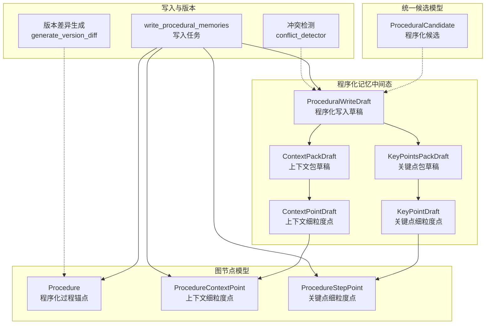
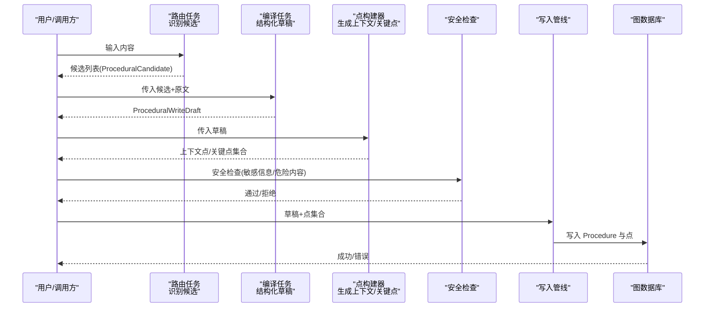
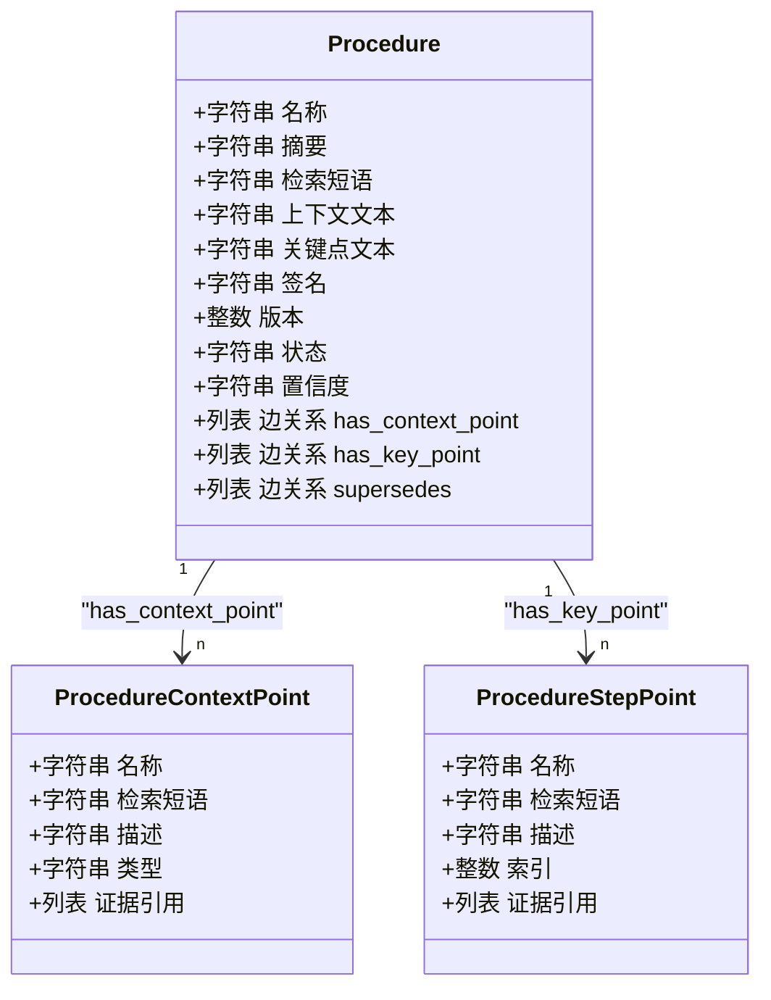
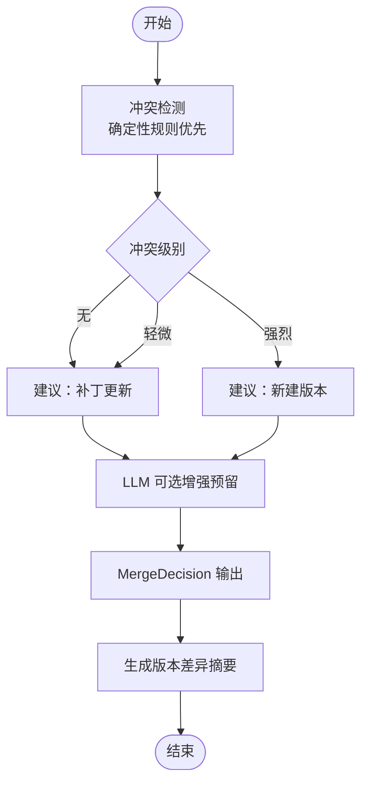
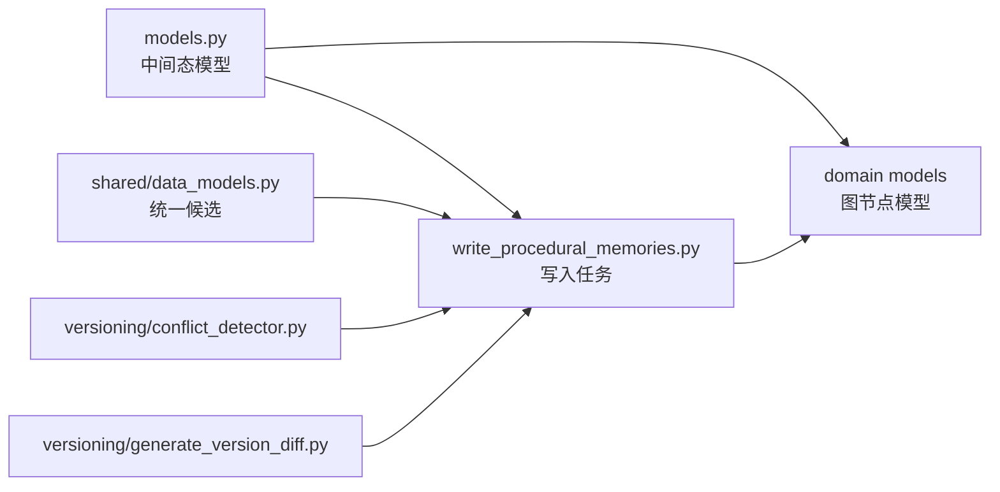

# 程序化记忆数据模型

<cite>
**本文引用的文件**
- [m_flow/memory/procedural/models.py](file://m_flow/memory/procedural/models.py)
- [m_flow/core/domain/models/Procedure.py](file://m_flow/core/domain/models/Procedure.py)
- [m_flow/core/domain/models/ProcedureContextPoint.py](file://m_flow/core/domain/models/ProcedureContextPoint.py)
- [m_flow/core/domain/models/ProcedureStepPoint.py](file://m_flow/core/domain/models/ProcedureStepPoint.py)
- [m_flow/shared/data_models.py](file://m_flow/shared/data_models.py)
- [m_flow/memory/procedural/write_procedural_memories.py](file://m_flow/memory/procedural/write_procedural_memories.py)
- [m_flow/memory/procedural/versioning/conflict_detector.py](file://m_flow/memory/procedural/versioning/conflict_detector.py)
- [m_flow/memory/procedural/versioning/generate_version_diff.py](file://m_flow/memory/procedural/versioning/generate_version_diff.py)
- [m_flow/memory/procedural/validators/__init__.py](file://m_flow/memory/procedural/validators/__init__.py)
</cite>

## 目录
1. [简介](#简介)
2. [项目结构](#项目结构)
3. [核心组件](#核心组件)
4. [架构总览](#架构总览)
5. [详细组件分析](#详细组件分析)
6. [依赖分析](#依赖分析)
7. [性能考虑](#性能考虑)
8. [故障排除指南](#故障排除指南)
9. [结论](#结论)
10. [附录](#附录)

## 简介
本文件系统化阐述“程序化记忆”数据模型的设计与实现，重点覆盖以下方面：
- ProceduralWriteDraft、ContextPackDraft、KeyPointsPackDraft 等核心中间态数据模型的设计原则与使用方法
- ContextPointDraft 与 KeyPointDraft 的精细化要点模型及其在检索中的作用
- 程序化记忆的结构化输出格式（标题、签名、检索短语等）的语义与用途
- 程序化候选模型与合并/版本决策模型的设计思路、版本管理策略与冲突检测机制
- 数据模型之间的关系图与从 LLM 输出到图数据库存储的完整数据流
- 数据验证规则、字段约束与最佳实践建议

## 项目结构
围绕程序化记忆的核心代码主要分布在如下模块：
- 中间态模型定义：m_flow/memory/procedural/models.py
- 图节点模型：m_flow/core/domain/models 下的 Procedure、ProcedureContextPoint、ProcedureStepPoint
- 统一候选模型：m_flow/shared/data_models.py
- 写入管线与提示词：m_flow/memory/procedural/write_procedural_memories.py
- 版本管理与冲突检测：m_flow/memory/procedural/versioning/*
- 验证与修复：m_flow/memory/procedural/validators/*

图表来源
- [m_flow/memory/procedural/models.py:154-182](file://m_flow/memory/procedural/models.py#L154-L182)
- [m_flow/core/domain/models/Procedure.py:22-108](file://m_flow/core/domain/models/Procedure.py#L22-L108)
- [m_flow/core/domain/models/ProcedureContextPoint.py:20-46](file://m_flow/core/domain/models/ProcedureContextPoint.py#L20-L46)
- [m_flow/core/domain/models/ProcedureStepPoint.py:18-53](file://m_flow/core/domain/models/ProcedureStepPoint.py#L18-L53)
- [m_flow/shared/data_models.py:171-188](file://m_flow/shared/data_models.py#L171-L188)
- [m_flow/memory/procedural/write_procedural_memories.py:118-200](file://m_flow/memory/procedural/write_procedural_memories.py#L118-L200)
- [m_flow/memory/procedural/versioning/conflict_detector.py:20-50](file://m_flow/memory/procedural/versioning/conflict_detector.py#L20-L50)
- [m_flow/memory/procedural/versioning/generate_version_diff.py:18-35](file://m_flow/memory/procedural/versioning/generate_version_diff.py#L18-L35)

章节来源
- [m_flow/memory/procedural/models.py:1-249](file://m_flow/memory/procedural/models.py#L1-L249)
- [m_flow/core/domain/models/Procedure.py:1-108](file://m_flow/core/domain/models/Procedure.py#L1-L108)
- [m_flow/shared/data_models.py:171-188](file://m_flow/shared/data_models.py#L171-L188)
- [m_flow/memory/procedural/write_procedural_memories.py:1-200](file://m_flow/memory/procedural/write_procedural_memories.py#L1-L200)
- [m_flow/memory/procedural/versioning/conflict_detector.py:1-330](file://m_flow/memory/procedural/versioning/conflict_detector.py#L1-L330)
- [m_flow/memory/procedural/versioning/generate_version_diff.py:1-187](file://m_flow/memory/procedural/versioning/generate_version_diff.py#L1-L187)

## 核心组件
本节聚焦程序化记忆的数据模型与职责划分。

- ProceduralWriteDraft
  - 用途：承载 LLM 生成的完整程序化草稿，用于后续构建图节点并持久化
  - 关键字段：标题、签名、检索短语、上下文包、关键点包
  - 注意：摘要字段由上层拼接生成，非 LLM 直出
- ContextPackDraft
  - 用途：结构化存放 when/why/boundary/outcome/prereq/exception 等上下文信息
  - 特性：容器型结构，不直接参与检索，其内容会并入 Procedure 摘要
- KeyPointsPackDraft
  - 用途：存放关键点文本（步骤/偏好/习惯/身份等），支持编号步骤或要点列表
  - 特性：容器型结构，不直接参与检索，其内容会并入 Procedure 摘要
- ContextPointDraft 与 KeyPointDraft
  - 用途：细粒度检索锚点，分别对应上下文与关键点的单条要点
  - 特性：包含检索短语、类型/索引、可选描述，作为检索三元组末端节点
- Procedure、ProcedureContextPoint、ProcedureStepPoint
  - 用途：图数据库中的实体节点，形成 Procedure → 点 的两层检索三元组
  - 特性：Procedure 仅索引摘要；点节点对检索短语建立索引，支持证据链接与评分

章节来源
- [m_flow/memory/procedural/models.py:30-182](file://m_flow/memory/procedural/models.py#L30-L182)
- [m_flow/core/domain/models/Procedure.py:22-108](file://m_flow/core/domain/models/Procedure.py#L22-L108)
- [m_flow/core/domain/models/ProcedureContextPoint.py:20-46](file://m_flow/core/domain/models/ProcedureContextPoint.py#L20-L46)
- [m_flow/core/domain/models/ProcedureStepPoint.py:18-53](file://m_flow/core/domain/models/ProcedureStepPoint.py#L18-L53)

## 架构总览
程序化记忆的端到端数据流分为“候选识别—结构编译—点生成—安全—入库”五个阶段，并通过统一候选模型与版本管理协同工作。

图表来源
- [m_flow/memory/procedural/write_procedural_memories.py:118-200](file://m_flow/memory/procedural/write_procedural_memories.py#L118-L200)
- [m_flow/shared/data_models.py:171-188](file://m_flow/shared/data_models.py#L171-L188)
- [m_flow/memory/procedural/models.py:154-182](file://m_flow/memory/procedural/models.py#L154-L182)

## 详细组件分析

### ProceduralWriteDraft 与上下文/关键点包
- 设计原则
  - 中间态草稿，不直接作为图节点存储
  - 摘要由上层拼接生成，避免重复抽取
  - 上下文包与关键点包仅承载结构化文本，不参与检索
- 字段语义
  - 标题：人类可读的简短名称
  - 签名：稳定短标识，用于版本追踪与去重
  - 检索短语：中等粒度检索标签（15-50字符）
  - 上下文包：when/why/boundary/outcome/prereq/exception 文本
  - 关键点包：步骤/偏好/习惯/身份等要点文本
- 使用方法
  - 由路由任务产出候选后，交由编译任务生成完整草稿
  - 草稿经点构建器转化为 Procedure 与细粒度点

章节来源
- [m_flow/memory/procedural/models.py:154-182](file://m_flow/memory/procedural/models.py#L154-L182)
- [m_flow/memory/procedural/write_procedural_memories.py:161-200](file://m_flow/memory/procedural/write_procedural_memories.py#L161-L200)

### ContextPackDraft 与 KeyPointsPackDraft
- ContextPackDraft
  - 承载触发条件、动机、边界、结果、前置条件、异常处理等上下文要素
  - 不直接参与检索，内容被并入 Procedure 摘要以提升检索覆盖面
- KeyPointsPackDraft
  - 支持两类要点形态：流程步骤（编号）、偏好/身份/习惯（要点）
  - 不直接参与检索，内容被并入 Procedure 摘要以提升检索覆盖面

章节来源
- [m_flow/memory/procedural/models.py:30-95](file://m_flow/memory/procedural/models.py#L30-L95)

### ContextPointDraft 与 KeyPointDraft（精细化要点模型）
- ContextPointDraft
  - 单条上下文要点，包含检索短语、类型（when/why/boundary/outcome/prereq/exception）、可选描述
  - 用于细粒度检索与解释，作为检索三元组末端节点
- KeyPointDraft
  - 单条关键点，包含检索短语、可选序号、可选描述
  - 用于细粒度检索与解释，作为检索三元组末端节点
- 应用场景
  - 将长文本切分为多个细粒度点，提升检索精度与解释能力
  - 支持独立向量化、评分与证据链接

章节来源
- [m_flow/memory/procedural/models.py:103-146](file://m_flow/memory/procedural/models.py#L103-L146)
- [m_flow/core/domain/models/ProcedureContextPoint.py:20-46](file://m_flow/core/domain/models/ProcedureContextPoint.py#L20-L46)
- [m_flow/core/domain/models/ProcedureStepPoint.py:18-53](file://m_flow/core/domain/models/ProcedureStepPoint.py#L18-L53)

### 图节点模型与检索三元组
- Procedure
  - 仅索引摘要字段，包含检索短语与上下文/关键点文本
  - 提供显示属性：上下文文本、关键点文本
  - 版本管理：签名、版本、状态、置信度、来源引用、更新时间
- ProcedureContextPoint / ProcedureStepPoint
  - 对检索短语建立索引，支持独立检索、评分与证据链接
  - 支持描述扩展与证据引用

图表来源
- [m_flow/core/domain/models/Procedure.py:22-108](file://m_flow/core/domain/models/Procedure.py#L22-L108)
- [m_flow/core/domain/models/ProcedureContextPoint.py:20-46](file://m_flow/core/domain/models/ProcedureContextPoint.py#L20-L46)
- [m_flow/core/domain/models/ProcedureStepPoint.py:18-53](file://m_flow/core/domain/models/ProcedureStepPoint.py#L18-L53)

章节来源
- [m_flow/core/domain/models/Procedure.py:1-108](file://m_flow/core/domain/models/Procedure.py#L1-L108)
- [m_flow/core/domain/models/ProcedureContextPoint.py:1-46](file://m_flow/core/domain/models/ProcedureContextPoint.py#L1-L46)
- [m_flow/core/domain/models/ProcedureStepPoint.py:1-53](file://m_flow/core/domain/models/ProcedureStepPoint.py#L1-L53)

### 程序化候选模型与合并/版本决策
- 统一候选模型
  - ProceduralCandidate：用于路由阶段识别程序化候选，包含检索短语、置信度、原因、类型
  - 用于统一处理“事件记忆 + 程序化记忆”的路由输出
- 合并/版本决策
  - MergeDecision：决定“合并更新/新建版本/新建程序”
  - 决策依据：目标程序ID、理由、匹配信号
- 冲突检测与版本差异
  - 冲突检测：基于确定性规则（如边界词变化、步骤集合相似度）判定冲突级别（无/轻微/强烈）
  - 版本差异：统计步骤增删改、上下文变更、边界变更，生成用户可读的变更摘要

图表来源
- [m_flow/shared/data_models.py:171-188](file://m_flow/shared/data_models.py#L171-L188)
- [m_flow/memory/procedural/versioning/conflict_detector.py:20-224](file://m_flow/memory/procedural/versioning/conflict_detector.py#L20-L224)
- [m_flow/memory/procedural/versioning/generate_version_diff.py:36-150](file://m_flow/memory/procedural/versioning/generate_version_diff.py#L36-L150)

章节来源
- [m_flow/shared/data_models.py:171-188](file://m_flow/shared/data_models.py#L171-L188)
- [m_flow/memory/procedural/versioning/conflict_detector.py:1-330](file://m_flow/memory/procedural/versioning/conflict_detector.py#L1-L330)
- [m_flow/memory/procedural/versioning/generate_version_diff.py:1-187](file://m_flow/memory/procedural/versioning/generate_version_diff.py#L1-L187)

### 从 LLM 输出到图数据库存储的完整数据流
- 路由阶段：识别候选（ProceduralCandidate）
- 编译阶段：将候选与源内容编译为 ProceduralWriteDraft
- 点生成阶段：根据草稿生成 ContextPointDraft 与 KeyPointDraft，并映射为 ProcedureContextPoint/ProcedureStepPoint
- 安全阶段：敏感信息脱敏与危险内容检测
- 写入阶段：生成 Procedure 与点，写入图数据库与向量索引

章节来源
- [m_flow/memory/procedural/write_procedural_memories.py:1-200](file://m_flow/memory/procedural/write_procedural_memories.py#L1-L200)
- [m_flow/memory/procedural/models.py:154-210](file://m_flow/memory/procedural/models.py#L154-L210)

## 依赖分析
- 中间态模型依赖关系
  - ProceduralWriteDraft 依赖 ContextPackDraft 与 KeyPointsPackDraft
  - 细粒度点模型（ContextPointDraft/KeyPointDraft）用于点生成阶段
- 图节点模型依赖关系
  - Procedure 与 ProcedureContextPoint/ProcedureStepPoint 形成检索三元组
- 统一候选模型
  - ProceduralCandidate 与写入管线协作，驱动草稿生成与点构建
- 版本管理
  - 冲突检测与版本差异生成依赖 Procedure 结构化字段（上下文/关键点）

图表来源
- [m_flow/memory/procedural/models.py:154-210](file://m_flow/memory/procedural/models.py#L154-L210)
- [m_flow/core/domain/models/Procedure.py:22-108](file://m_flow/core/domain/models/Procedure.py#L22-L108)
- [m_flow/shared/data_models.py:171-188](file://m_flow/shared/data_models.py#L171-L188)
- [m_flow/memory/procedural/write_procedural_memories.py:118-200](file://m_flow/memory/procedural/write_procedural_memories.py#L118-L200)
- [m_flow/memory/procedural/versioning/conflict_detector.py:20-50](file://m_flow/memory/procedural/versioning/conflict_detector.py#L20-L50)
- [m_flow/memory/procedural/versioning/generate_version_diff.py:18-35](file://m_flow/memory/procedural/versioning/generate_version_diff.py#L18-L35)

章节来源
- [m_flow/memory/procedural/models.py:1-249](file://m_flow/memory/procedural/models.py#L1-L249)
- [m_flow/core/domain/models/Procedure.py:1-108](file://m_flow/core/domain/models/Procedure.py#L1-L108)
- [m_flow/shared/data_models.py:171-188](file://m_flow/shared/data_models.py#L171-L188)
- [m_flow/memory/procedural/write_procedural_memories.py:1-200](file://m_flow/memory/procedural/write_procedural_memories.py#L1-L200)
- [m_flow/memory/procedural/versioning/conflict_detector.py:1-330](file://m_flow/memory/procedural/versioning/conflict_detector.py#L1-L330)
- [m_flow/memory/procedural/versioning/generate_version_diff.py:1-187](file://m_flow/memory/procedural/versioning/generate_version_diff.py#L1-L187)

## 性能考虑
- 检索索引优化
  - Procedure 仅索引摘要；点节点对检索短语建立索引，避免全文索引带来的开销
  - 检索短语长度控制在 10-30 字符，确保高召回与低歧义
- 文本拼接与摘要生成
  - 摘要由检索短语 + 上下文 + 关键点拼接而成，减少重复抽取成本
- 步骤去重与合并
  - 补丁更新时按行级去重合并关键点文本，降低冗余与存储压力
- 并发与限流
  - 写入任务使用全局 LLM 并发控制，避免资源争用

## 故障排除指南
- 常见问题与定位
  - 摘要为空或检索效果差：确认草稿中检索短语与上下文/关键点包是否填充
  - 点缺失：检查点生成阶段是否正确解析草稿文本
  - 版本冲突误判：调整边界词与步骤规范化策略，必要时启用 LLM 增强
- 验证与修复
  - 使用验证器对程序化包进行契约校验与自动修复
  - 通过版本差异生成核对步骤增删改与上下文变更

章节来源
- [m_flow/memory/procedural/validators/__init__.py:1-32](file://m_flow/memory/procedural/validators/__init__.py#L1-L32)
- [m_flow/memory/procedural/versioning/generate_version_diff.py:36-150](file://m_flow/memory/procedural/versioning/generate_version_diff.py#L36-L150)

## 结论
程序化记忆数据模型通过“中间态草稿 + 细粒度点 + 统一候选 + 版本管理”的设计，在保证检索精度的同时，实现了对复杂程序知识的结构化表达与演进式维护。中间态模型与图节点模型职责清晰、耦合度低，便于在不同图数据库与向量引擎之间迁移与扩展。

## 附录

### 字段约束与最佳实践
- ProceduralWriteDraft
  - 标题：简短明确，避免歧义
  - 签名：稳定短标识，建议采用主题哈希或语义指纹
  - 检索短语：15-50 字，准确反映主题
  - 上下文包/关键点包：仅填充分析确凿的内容，避免占位符
- 细粒度点
  - 检索短语：10-30 字，包含关键锚点（条件、术语、约束）
  - 类型/索引：严格对应上下文或关键点类别
  - 描述：可选，用于解释与 RAG 展开
- 图节点
  - Procedure 仅索引摘要，显示属性用于卡片渲染
  - 点节点对检索短语建立索引，支持证据链接与评分
- 版本管理
  - 冲突检测优先使用确定性规则，必要时引入 LLM 增强
  - 版本差异生成应保留前缀与变更统计，便于审计

章节来源
- [m_flow/memory/procedural/models.py:103-182](file://m_flow/memory/procedural/models.py#L103-L182)
- [m_flow/core/domain/models/Procedure.py:22-108](file://m_flow/core/domain/models/Procedure.py#L22-L108)
- [m_flow/memory/procedural/versioning/conflict_detector.py:20-224](file://m_flow/memory/procedural/versioning/conflict_detector.py#L20-L224)
- [m_flow/memory/procedural/versioning/generate_version_diff.py:36-150](file://m_flow/memory/procedural/versioning/generate_version_diff.py#L36-L150)