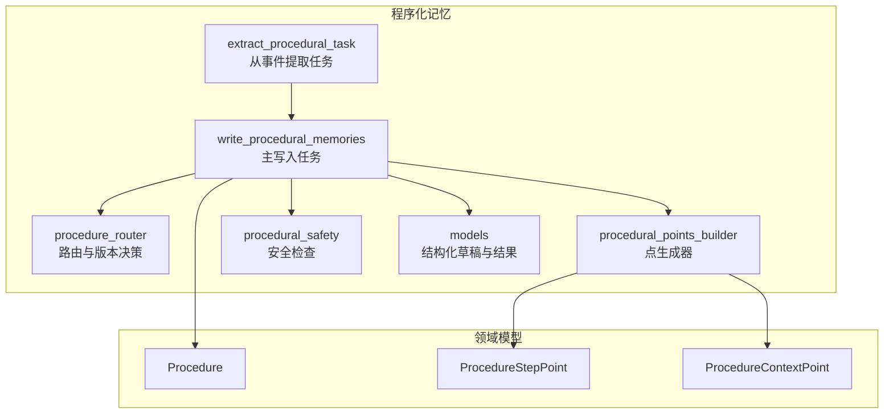
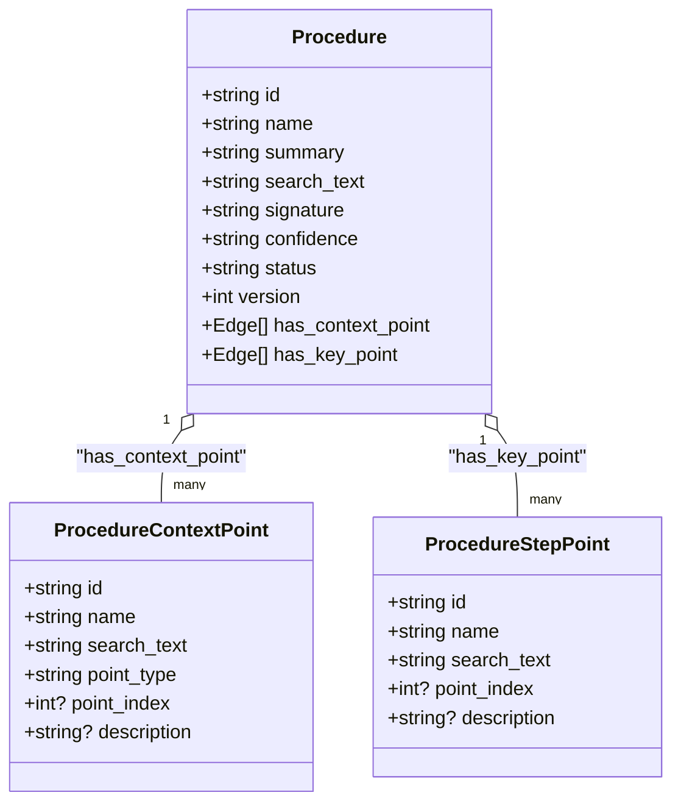
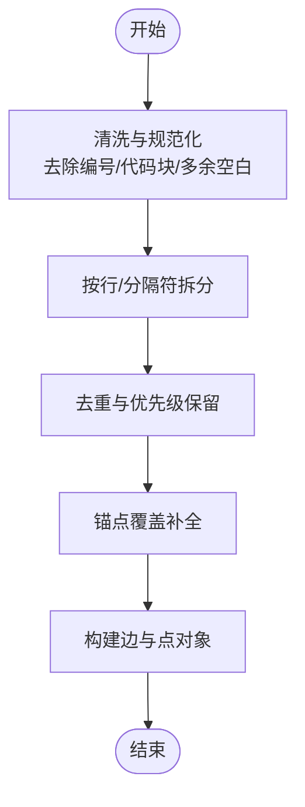
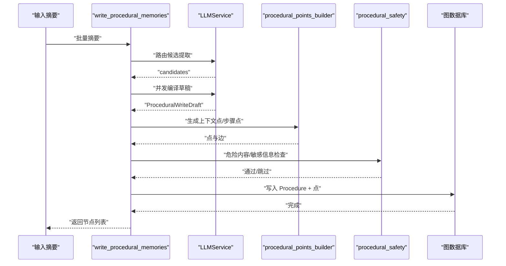
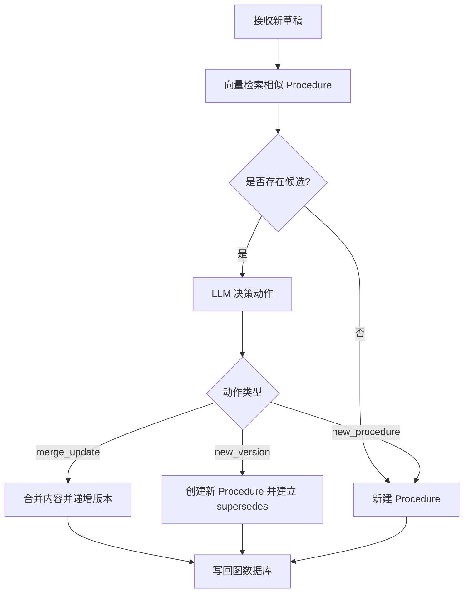
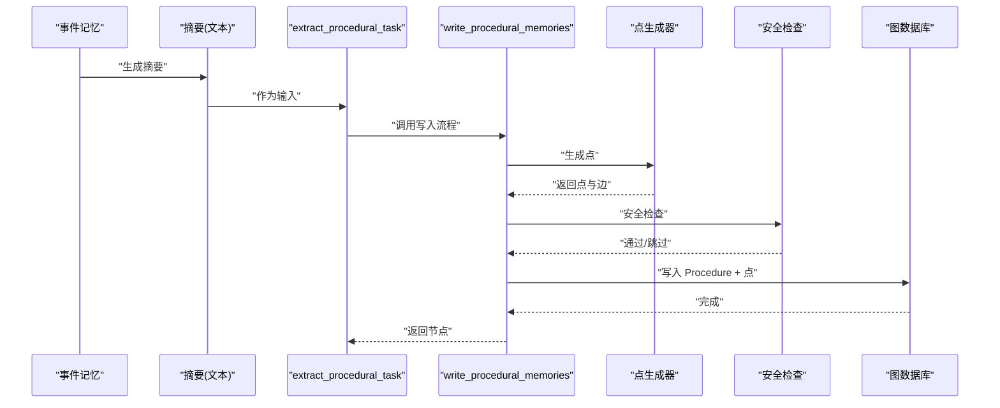
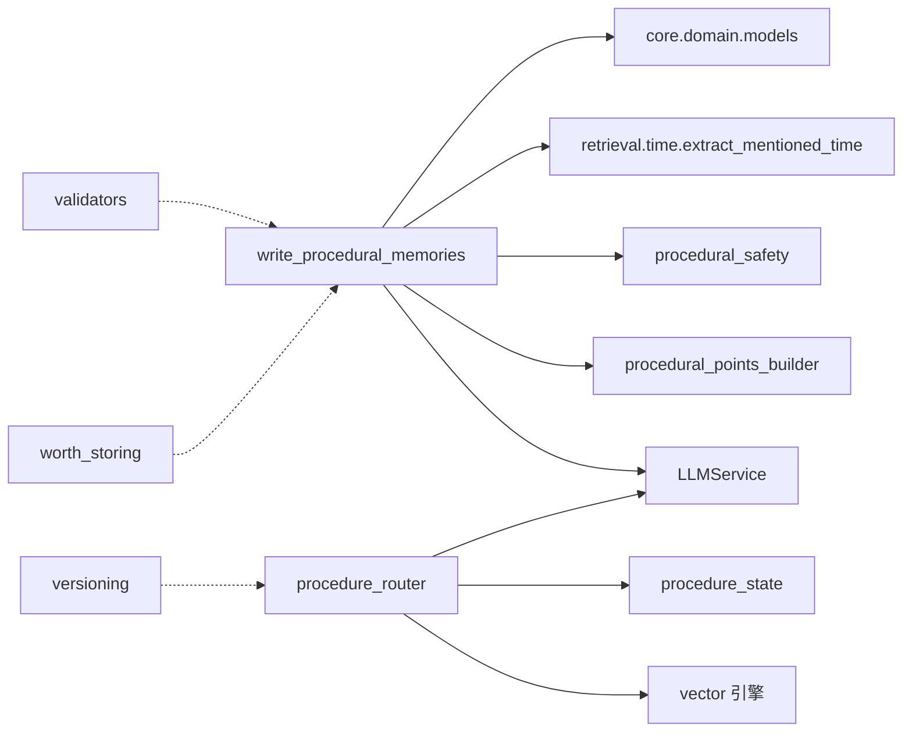

# 程序化记忆系统

<cite>
**本文引用的文件**
- [m_flow/memory/procedural/models.py](file://m_flow/memory/procedural/models.py)
- [m_flow/memory/procedural/write_procedural_memories.py](file://m_flow/memory/procedural/write_procedural_memories.py)
- [m_flow/memory/procedural/procedural_points_builder.py](file://m_flow/memory/procedural/procedural_points_builder.py)
- [m_flow/memory/procedural/extract_procedural_task.py](file://m_flow/memory/procedural/extract_procedural_task.py)
- [m_flow/memory/procedural/procedure_router.py](file://m_flow/memory/procedural/procedure_router.py)
- [m_flow/memory/procedural/procedure_state.py](file://m_flow/memory/procedural/procedure_state.py)
- [m_flow/memory/procedural/procedural_safety.py](file://m_flow/memory/procedural/procedural_safety.py)
- [m_flow/memory/procedural/governance/worth_storing.py](file://m_flow/memory/procedural/governance/worth_storing.py)
- [m_flow/memory/procedural/validators/procedural_contract.py](file://m_flow/memory/procedural/validators/procedural_contract.py)
- [m_flow/memory/procedural/versioning/conflict_detector.py](file://m_flow/memory/procedural/versioning/conflict_detector.py)
- [m_flow/core/domain/models/__init__.py](file://m_flow/core/domain/models/__init__.py)
- [m_flow/core/domain/models/Procedure.py](file://m_flow/core/domain/models/Procedure.py)
- [m_flow/core/domain/models/ProcedureContextPoint.py](file://m_flow/core/domain/models/ProcedureContextPoint.py)
- [m_flow/core/domain/models/ProcedureStepPoint.py](file://m_flow/core/domain/models/ProcedureStepPoint.py)
- [m_flow/memory/procedural/governance/__init__.py](file://m_flow/memory/procedural/governance/__init__.py)
- [m_flow/memory/procedural/validators/__init__.py](file://m_flow/memory/procedural/validators/__init__.py)
- [m_flow/memory/procedural/versioning/__init__.py](file://m_flow/memory/procedural/versioning/__init__.py)
- [examples/python/dynamic_steps_example.py](file://examples/python/dynamic_steps_example.py)
- [examples/python/run_custom_pipeline_example.py](file://examples/python/run_custom_pipeline_example.py)
</cite>

## 目录
1. [简介](#简介)
2. [项目结构](#项目结构)
3. [核心组件](#核心组件)
4. [架构总览](#架构总览)
5. [详细组件分析](#详细组件分析)
6. [依赖分析](#依赖分析)
7. [性能考量](#性能考量)
8. [故障排查指南](#故障排查指南)
9. [结论](#结论)
10. [附录](#附录)

## 简介
本文件面向“程序化记忆系统”的设计与实现，围绕事件记忆到可执行程序的转换路径，系统阐述以下方面：
- 程序化记忆的概念与数据模型：Procedure、ProcedureStepPoint、ProcedureContextPoint 及其与 Pack 节点的关系演进
- 提取机制：从事件记忆中识别可复用步骤与流程，形成 Procedure 候选
- 构建流程：路由、编译、点生成、安全与返回
- 治理机制：价值评估、冲突检测、版本管理与历史追踪
- 存储与检索：在知识图谱中的三元组表示与向量索引策略
- 完整流程图：从事件到可执行程序的端到端转换
- 质量控制、性能优化与扩展性建议

## 项目结构
程序化记忆位于 m_flow/memory/procedural 下，采用“任务-模块-子模块”分层组织：
- 顶层任务与入口：write_procedural_memories、extract_procedural_task
- 核心编译与路由：models、write_procedural_memories、procedure_router
- 点生成：procedural_points_builder
- 安全与治理：procedural_safety、governance、validators、versioning
- 领域模型：core/domain/models 中的 Procedure、ProcedureStepPoint、ProcedureContextPoint

图表来源
- [m_flow/memory/procedural/write_procedural_memories.py:212-377](file://m_flow/memory/procedural/write_procedural_memories.py#L212-L377)
- [m_flow/memory/procedural/procedure_router.py:261-321](file://m_flow/memory/procedural/procedure_router.py#L261-L321)
- [m_flow/memory/procedural/procedural_points_builder.py:153-262](file://m_flow/memory/procedural/procedural_points_builder.py#L153-L262)
- [m_flow/memory/procedural/procedural_safety.py:46-113](file://m_flow/memory/procedural/procedural_safety.py#L46-L113)
- [m_flow/memory/procedural/models.py:154-249](file://m_flow/memory/procedural/models.py#L154-L249)
- [m_flow/core/domain/models/Procedure.py](file://m_flow/core/domain/models/Procedure.py)
- [m_flow/core/domain/models/ProcedureStepPoint.py](file://m_flow/core/domain/models/ProcedureStepPoint.py)
- [m_flow/core/domain/models/ProcedureContextPoint.py](file://m_flow/core/domain/models/ProcedureContextPoint.py)

章节来源
- [m_flow/memory/procedural/write_procedural_memories.py:1-669](file://m_flow/memory/procedural/write_procedural_memories.py#L1-L669)
- [m_flow/memory/procedural/procedure_router.py:1-459](file://m_flow/memory/procedural/procedure_router.py#L1-L459)
- [m_flow/memory/procedural/procedural_points_builder.py:1-390](file://m_flow/memory/procedural/procedural_points_builder.py#L1-L390)
- [m_flow/memory/procedural/models.py:1-249](file://m_flow/memory/procedural/models.py#L1-L249)
- [m_flow/core/domain/models/__init__.py:30-37](file://m_flow/core/domain/models/__init__.py#L30-L37)

## 核心组件
- 结构化草稿与点模型
  - ProceduralWriteDraft：LLM 输出的 Procedure 草稿，包含标题、签名、检索词、上下文包与要点包
  - ContextPackDraft、KeyPointsPackDraft：上下文与要点的中间结构，不参与检索
  - ContextPointDraft、KeyPointDraft：细粒度检索锚点，用于 sharp retrieval
- 点生成器
  - build_step_points：从要点文本确定步骤顺序，去重与覆盖补全
  - build_context_points：从上下文字段拆分片段，去重与覆盖补全
- 主写入任务
  - write_procedural_memories：路由候选、并发编译、增量更新、返回 Procedure 与点
- 路由与版本
  - procedure_router：相似 Procedure 检索、LLM 决策合并/新版本/新建，并维护 supersedes 关系
- 安全
  - procedural_safety：敏感信息红化、危险内容检测、高风险标记
- 治理
  - worth_storing：价值评估与索引级别判定
  - validators：数据契约校验与修复
  - versioning：冲突检测与版本差异生成

章节来源
- [m_flow/memory/procedural/models.py:30-249](file://m_flow/memory/procedural/models.py#L30-L249)
- [m_flow/memory/procedural/procedural_points_builder.py:153-389](file://m_flow/memory/procedural/procedural_points_builder.py#L153-L389)
- [m_flow/memory/procedural/write_procedural_memories.py:212-668](file://m_flow/memory/procedural/write_procedural_memories.py#L212-L668)
- [m_flow/memory/procedural/procedure_router.py:89-321](file://m_flow/memory/procedural/procedure_router.py#L89-L321)
- [m_flow/memory/procedural/procedural_safety.py:46-153](file://m_flow/memory/procedural/procedural_safety.py#L46-L153)
- [m_flow/memory/procedural/governance/worth_storing.py:78-244](file://m_flow/memory/procedural/governance/worth_storing.py#L78-L244)
- [m_flow/memory/procedural/validators/procedural_contract.py:35-186](file://m_flow/memory/procedural/validators/procedural_contract.py#L35-L186)
- [m_flow/memory/procedural/versioning/conflict_detector.py:108-330](file://m_flow/memory/procedural/versioning/conflict_detector.py#L108-L330)

## 架构总览
程序化记忆采用“两层点直连 Procedure”的知识图谱三元组结构：
- Procedure → has_context_point → ProcedureContextPoint
- Procedure → has_key_point → ProcedureStepPoint

图表来源
- [m_flow/core/domain/models/Procedure.py](file://m_flow/core/domain/models/Procedure.py)
- [m_flow/core/domain/models/ProcedureContextPoint.py](file://m_flow/core/domain/models/ProcedureContextPoint.py)
- [m_flow/core/domain/models/ProcedureStepPoint.py](file://m_flow/core/domain/models/ProcedureStepPoint.py)
- [m_flow/memory/procedural/write_procedural_memories.py:639-658](file://m_flow/memory/procedural/write_procedural_memories.py#L639-L658)

## 详细组件分析

### 数据模型与草稿
- ProceduralWriteDraft：统一 Procedure 的结构化输出，summary 由 search_text + context + points 组合生成，非 LLM 直接产出
- ContextPackDraft/KeyPointsPackDraft：仅承载中间结构，不参与检索；内容被纳入 Procedure.summary 以支持检索
- ContextPointDraft/KeyPointDraft：短检索锚点，用于 sharp retrieval；KeyPointDraft 支持 step_index

章节来源
- [m_flow/memory/procedural/models.py:30-249](file://m_flow/memory/procedural/models.py#L30-L249)

### 点生成器（Deterministic）
- 步骤点生成：按行拆分，去除编号与代码块，规范化后去重；自动覆盖补全关键锚点
- 上下文点生成：按分号/句号/换行拆分，规范化后去重；自动覆盖补全关键锚点
- 时间传播：从构造的 summary 中抽取时间信息，注入点与 Procedure

图表来源
- [m_flow/memory/procedural/procedural_points_builder.py:153-262](file://m_flow/memory/procedural/procedural_points_builder.py#L153-L262)
- [m_flow/memory/procedural/procedural_points_builder.py:270-389](file://m_flow/memory/procedural/procedural_points_builder.py#L270-L389)

章节来源
- [m_flow/memory/procedural/procedural_points_builder.py:34-146](file://m_flow/memory/procedural/procedural_points_builder.py#L34-L146)

### 主写入任务（Router + Compiler + Routing）
- 路由候选：基于 LLM 的候选识别，输出 candidates（search_text、confidence、reason、type）
- 并发编译：对候选并发调用 LLM 编译，生成 ProceduralWriteDraft
- 增量更新：通过 procedure_router 决策 merge/update/new_version，维护版本链
- 安全检查：对步骤文本进行危险内容检测与敏感信息红化
- 返回节点：Procedure + 直连点（无 Pack 中间节点）

图表来源
- [m_flow/memory/procedural/write_procedural_memories.py:380-508](file://m_flow/memory/procedural/write_procedural_memories.py#L380-L508)
- [m_flow/memory/procedural/procedural_points_builder.py:153-389](file://m_flow/memory/procedural/procedural_points_builder.py#L153-L389)
- [m_flow/memory/procedural/procedural_safety.py:46-113](file://m_flow/memory/procedural/procedural_safety.py#L46-L113)

章节来源
- [m_flow/memory/procedural/write_procedural_memories.py:212-668](file://m_flow/memory/procedural/write_procedural_memories.py#L212-L668)

### 路由与版本管理
- 相似 Procedure 检索：基于 Procedure_summary 与 Procedure_search_text 的向量检索
- LLM 决策：merge_update / new_version / new_procedure，并指定目标 Procedure
- 版本链维护：supersedes 边连接旧版本，支持双向遍历与活跃版本查找

图表来源
- [m_flow/memory/procedural/procedure_router.py:89-321](file://m_flow/memory/procedural/procedure_router.py#L89-L321)
- [m_flow/memory/procedural/procedure_state.py:150-301](file://m_flow/memory/procedural/procedure_state.py#L150-L301)

章节来源
- [m_flow/memory/procedural/procedure_router.py:1-459](file://m_flow/memory/procedural/procedure_router.py#L1-L459)
- [m_flow/memory/procedural/procedure_state.py:1-393](file://m_flow/memory/procedural/procedure_state.py#L1-L393)

### 安全与合规
- 敏感信息红化：API Key、Token、密码、AWS 凭证、私钥、Bearer Token、连接串等
- 危险内容检测：自伤、武器制造、未授权访问、恶意软件、欺诈等
- 高风险操作标记：生产操作、删除、不可逆、强制、Root 权限等

章节来源
- [m_flow/memory/procedural/procedural_safety.py:46-153](file://m_flow/memory/procedural/procedural_safety.py#L46-L153)

### 治理与质量控制
- 价值评估（Worth-Evaluator）：综合通用步骤、复杂度、上下文完整性、工具链特异性、组织特异性、安全性等信号，给出评分与索引级别
- 数据契约（Contract）：定义 Procedure 的身份/版本、结构、上下文完整性、步骤顺序等不变式
- 冲突检测（Conflict Detector）：基于 Jaccard 距离、边界词变化与冲突信号词，判定强/温和无冲突，并推荐 patch 或 new_version

章节来源
- [m_flow/memory/procedural/governance/worth_storing.py:78-244](file://m_flow/memory/procedural/governance/worth_storing.py#L78-L244)
- [m_flow/memory/procedural/validators/procedural_contract.py:35-186](file://m_flow/memory/procedural/validators/procedural_contract.py#L35-L186)
- [m_flow/memory/procedural/versioning/conflict_detector.py:108-330](file://m_flow/memory/procedural/versioning/conflict_detector.py#L108-L330)

### 从事件到可执行程序的完整流程
- 事件记忆 → 摘要（FragmentDigest）→ 程序化记忆写入（Router + Compiler）→ 点生成（上下文点/步骤点）→ 安全检查 → 图写入（Procedure + 点）→ 路由与版本（相似检索 + LLM 决策）
- 另一条路径：从事件提取任务直接触发程序化记忆写入

图表来源
- [m_flow/memory/procedural/extract_procedural_task.py:24-63](file://m_flow/memory/procedural/extract_procedural_task.py#L24-L63)
- [m_flow/memory/procedural/write_procedural_memories.py:212-377](file://m_flow/memory/procedural/write_procedural_memories.py#L212-L377)
- [m_flow/memory/procedural/procedural_points_builder.py:153-389](file://m_flow/memory/procedural/procedural_points_builder.py#L153-L389)
- [m_flow/memory/procedural/procedural_safety.py:46-113](file://m_flow/memory/procedural/procedural_safety.py#L46-L113)

章节来源
- [m_flow/memory/procedural/extract_procedural_task.py:1-64](file://m_flow/memory/procedural/extract_procedural_task.py#L1-L64)

## 依赖分析
- 写入任务依赖
  - LLMService：结构化抽取（路由候选、编译草稿、合并决策）
  - procedural_points_builder：点生成
  - procedural_safety：安全检查
  - retrieval.time.extract_mentioned_time：时间抽取
  - core.domain.models：Procedure、点类型
- 路由与状态
  - vector 引擎：Procedure_summary/search_text 向量检索
  - procedure_state：读取现有 Procedure 状态与版本链
- 治理与验证
  - worth_storing：价值评估
  - validators：数据契约校验
  - versioning：冲突检测

图表来源
- [m_flow/memory/procedural/write_procedural_memories.py:34-57](file://m_flow/memory/procedural/write_procedural_memories.py#L34-L57)
- [m_flow/memory/procedural/procedure_router.py:22-35](file://m_flow/memory/procedural/procedure_router.py#L22-L35)
- [m_flow/memory/procedural/governance/worth_storing.py:14-17](file://m_flow/memory/procedural/governance/worth_storing.py#L14-L17)
- [m_flow/memory/procedural/validators/procedural_contract.py:8-12](file://m_flow/memory/procedural/validators/procedural_contract.py#L8-L12)
- [m_flow/memory/procedural/versioning/conflict_detector.py:9-12](file://m_flow/memory/procedural/versioning/conflict_detector.py#L9-L12)

章节来源
- [m_flow/memory/procedural/write_procedural_memories.py:1-669](file://m_flow/memory/procedural/write_procedural_memories.py#L1-L669)
- [m_flow/memory/procedural/procedure_router.py:1-459](file://m_flow/memory/procedural/procedure_router.py#L1-L459)

## 性能考量
- 并发控制
  - 全局 LLM 并发信号量：避免 LLM 侧过载
  - asyncio.gather 并发编译候选，提升吞吐
- 索引与检索
  - 向量检索 Procedure_summary 与 Procedure_search_text，减少无效匹配
  - 严格阈值过滤候选，降低 LLM 决策负担
- 点生成稳定性
  - 规范化与去重策略，避免重复点导致的检索噪声
  - 锚点覆盖补全，提高召回率
- 时间抽取
  - 从 summary 抽取时间，避免重复解析

章节来源
- [m_flow/memory/procedural/write_procedural_memories.py:389-417](file://m_flow/memory/procedural/write_procedural_memories.py#L389-L417)
- [m_flow/memory/procedural/procedure_router.py:118-178](file://m_flow/memory/procedural/procedure_router.py#L118-L178)

## 故障排查指南
- LLM 路由失败
  - 现象：候选为空或异常
  - 排查：检查系统提示词、输入截断、全局 LLM 并发配置
- 编译失败或内容被跳过
  - 现象：dangerous content 检测触发或敏感信息被红化
  - 排查：查看日志中的警告与原因，必要时调整输入或人工审核
- 路由决策异常
  - 现象：LLM 决策失败回退为新建
  - 排查：检查向量检索结果、候选数量与阈值设置
- 版本链断裂
  - 现象：supersedes 边缺失或方向错误
  - 排查：使用 procedure_state 获取版本链，确认写入流程是否正确建立边

章节来源
- [m_flow/memory/procedural/write_procedural_memories.py:361-363](file://m_flow/memory/procedural/write_procedural_memories.py#L361-L363)
- [m_flow/memory/procedural/procedural_safety.py:96-113](file://m_flow/memory/procedural/procedural_safety.py#L96-L113)
- [m_flow/memory/procedural/procedure_router.py:251-258](file://m_flow/memory/procedural/procedure_router.py#L251-L258)
- [m_flow/memory/procedural/procedure_state.py:309-355](file://m_flow/memory/procedural/procedure_state.py#L309-L355)

## 结论
程序化记忆系统通过“候选路由 + 并发编译 + 点生成 + 安全检查 + 增量路由”的流水线，将事件记忆转化为可检索、可演进、可治理的 Procedure 知识。其核心优势在于：
- 明确的数据契约与治理策略，确保质量与一致性
- Deterministic 点生成与覆盖补全，提升检索稳定性
- 基于向量检索与 LLM 决策的路由与版本管理，兼顾效率与准确性
- 清晰的版本链与 supersedes 边，便于追溯与审计

## 附录
- 使用示例
  - 动态启用/禁用流水线步骤：[examples/python/dynamic_steps_example.py:59-80](file://examples/python/dynamic_steps_example.py#L59-L80)
  - 自定义流水线组装：[examples/python/run_custom_pipeline_example.py:23-83](file://examples/python/run_custom_pipeline_example.py#L23-L83)