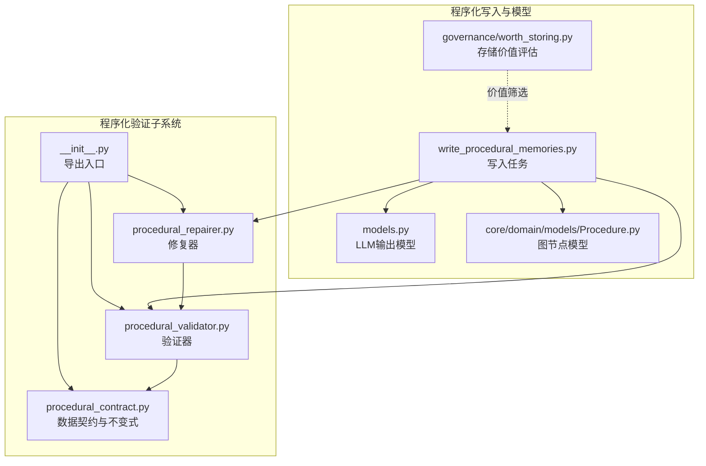
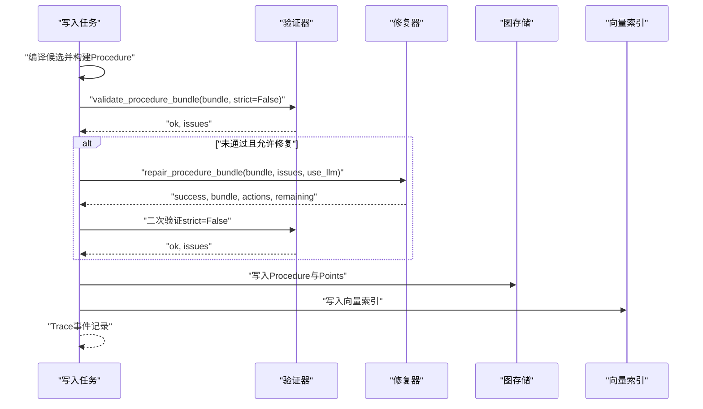
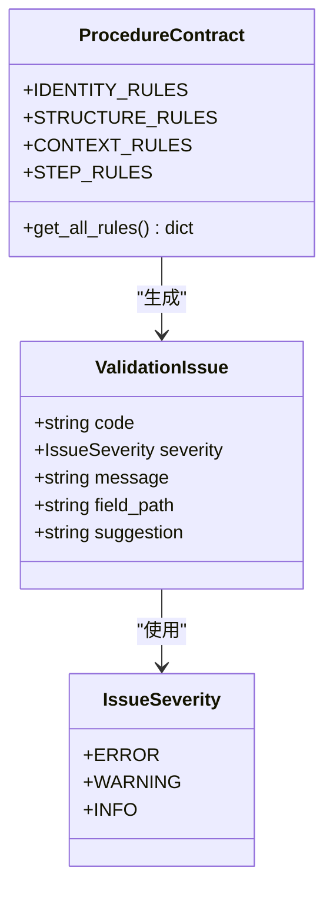
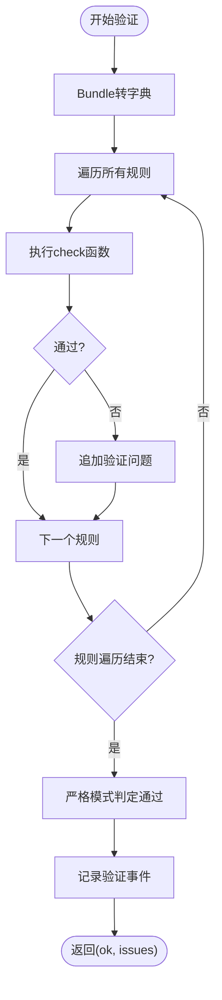
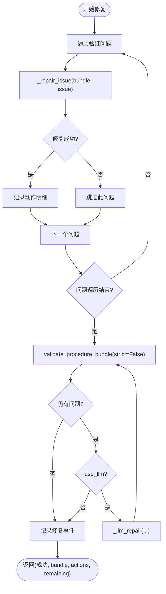
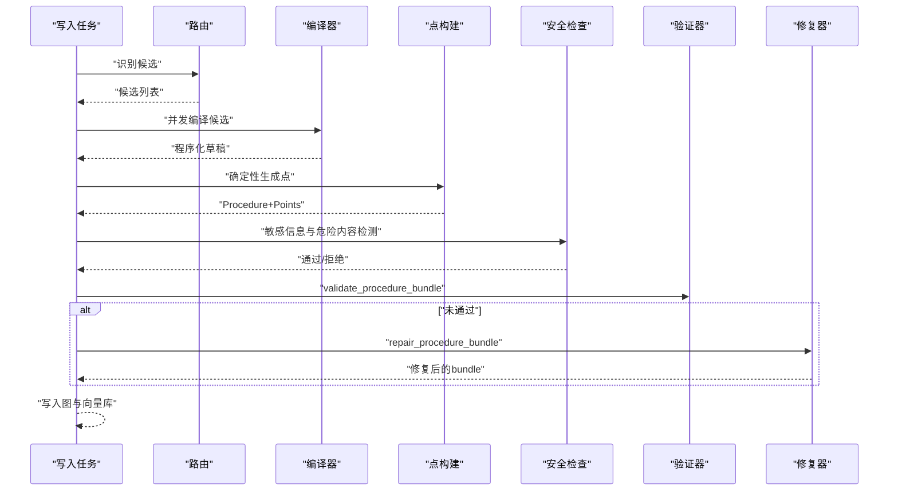
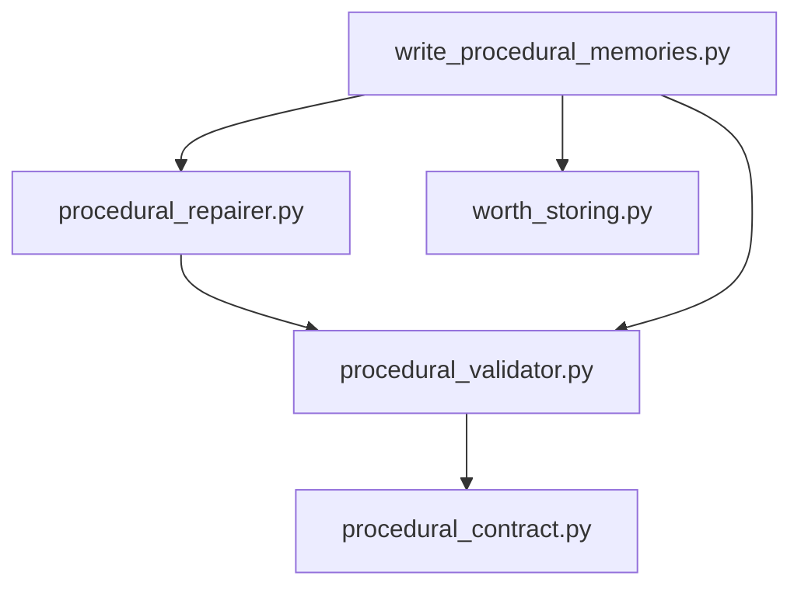

# 程序化验证

<cite>
**本文引用的文件**
- [m_flow/memory/procedural/validators/__init__.py](file://m_flow/memory/procedural/validators/__init__.py)
- [m_flow/memory/procedural/validators/procedural_contract.py](file://m_flow/memory/procedural/validators/procedural_contract.py)
- [m_flow/memory/procedural/validators/procedural_validator.py](file://m_flow/memory/procedural/validators/procedural_validator.py)
- [m_flow/memory/procedural/validators/procedural_repairer.py](file://m_flow/memory/procedural/validators/procedural_repairer.py)
- [m_flow/memory/procedural/write_procedural_memories.py](file://m_flow/memory/procedural/write_procedural_memories.py)
- [m_flow/memory/procedural/models.py](file://m_flow/memory/procedural/models.py)
- [m_flow/memory/procedural/governance/worth_storing.py](file://m_flow/memory/procedural/governance/worth_storing.py)
- [m_flow/core/domain/models/Procedure.py](file://m_flow/core/domain/models/Procedure.py)
</cite>

## 目录
1. [简介](#简介)
2. [项目结构](#项目结构)
3. [核心组件](#核心组件)
4. [架构总览](#架构总览)
5. [详细组件分析](#详细组件分析)
6. [依赖分析](#依赖分析)
7. [性能考虑](#性能考虑)
8. [故障排查指南](#故障排查指南)
9. [结论](#结论)
10. [附录](#附录)

## 简介
本文件面向“程序化验证”的技术文档，聚焦于程序化记忆（Procedure）的完整性检查与质量保证机制。内容涵盖：
- 程序化契约验证器：确保程序化知识符合预定义的数据契约与不变式。
- 程序化修复器：对格式错误、逻辑矛盾与不一致进行自动修复。
- 综合检查能力：语法、结构、上下文完整性与步骤顺序一致性。
- 失败处理流程：错误报告、修复建议与人工审核机制。
- 规则配置与扩展：支持按场景定制与扩展验证规则。
- 性能优化与批量验证最佳实践。

## 项目结构
程序化验证位于模块“m_flow/memory/procedural/validators”下，配套的程序化写入任务与模型位于同一目录层级，形成“写入-验证-修复-治理”的闭环。

图表来源
- [m_flow/memory/procedural/validators/procedural_contract.py:1-186](file://m_flow/memory/procedural/validators/procedural_contract.py#L1-L186)
- [m_flow/memory/procedural/validators/procedural_validator.py:1-219](file://m_flow/memory/procedural/validators/procedural_validator.py#L1-L219)
- [m_flow/memory/procedural/validators/procedural_repairer.py:1-281](file://m_flow/memory/procedural/validators/procedural_repairer.py#L1-L281)
- [m_flow/memory/procedural/write_procedural_memories.py:1-669](file://m_flow/memory/procedural/write_procedural_memories.py#L1-L669)
- [m_flow/memory/procedural/models.py:1-249](file://m_flow/memory/procedural/models.py#L1-L249)
- [m_flow/core/domain/models/Procedure.py:1-35](file://m_flow/core/domain/models/Procedure.py#L1-L35)
- [m_flow/memory/procedural/governance/worth_storing.py:1-244](file://m_flow/memory/procedural/governance/worth_storing.py#L1-L244)

章节来源
- [m_flow/memory/procedural/validators/__init__.py:1-32](file://m_flow/memory/procedural/validators/__init__.py#L1-L32)
- [m_flow/memory/procedural/validators/procedural_contract.py:1-186](file://m_flow/memory/procedural/validators/procedural_contract.py#L1-L186)
- [m_flow/memory/procedural/validators/procedural_validator.py:1-219](file://m_flow/memory/procedural/validators/procedural_validator.py#L1-L219)
- [m_flow/memory/procedural/validators/procedural_repairer.py:1-281](file://m_flow/memory/procedural/validators/procedural_repairer.py#L1-L281)
- [m_flow/memory/procedural/write_procedural_memories.py:1-669](file://m_flow/memory/procedural/write_procedural_memories.py#L1-L669)
- [m_flow/memory/procedural/models.py:1-249](file://m_flow/memory/procedural/models.py#L1-L249)
- [m_flow/core/domain/models/Procedure.py:1-35](file://m_flow/core/domain/models/Procedure.py#L1-L35)
- [m_flow/memory/procedural/governance/worth_storing.py:1-244](file://m_flow/memory/procedural/governance/worth_storing.py#L1-L244)

## 核心组件
- 数据契约与不变式（ProcedureContract）
  - 定义身份/版本、结构、上下文完整性、步骤顺序等不变式规则集，并统一导出校验问题类型与严重级别。
- 验证器（validate_procedure_bundle）
  - 将程序化包转换为字典后，遍历所有规则执行校验，收集问题并决定通过与否（严格模式下警告也视为失败）。
- 修复器（repair_procedure_bundle）
  - 基于验证问题逐项尝试修复，支持添加缺失包、设置默认值、重建锚文本、重排步骤索引等；支持二次验证与可选的LLM修复占位。
- 写入任务（write_procedural_memories）
  - 在编译完成后，结合点构建与安全检查，最终产出图节点列表；验证与修复作为质量保障环节嵌入其中。
- 价值评估（WorthEvaluator）
  - 对程序化知识进行存储价值评分与索引策略决策，辅助治理与资源控制。

章节来源
- [m_flow/memory/procedural/validators/procedural_contract.py:35-186](file://m_flow/memory/procedural/validators/procedural_contract.py#L35-L186)
- [m_flow/memory/procedural/validators/procedural_validator.py:83-147](file://m_flow/memory/procedural/validators/procedural_validator.py#L83-L147)
- [m_flow/memory/procedural/validators/procedural_repairer.py:42-96](file://m_flow/memory/procedural/validators/procedural_repairer.py#L42-L96)
- [m_flow/memory/procedural/write_procedural_memories.py:212-377](file://m_flow/memory/procedural/write_procedural_memories.py#L212-L377)
- [m_flow/memory/procedural/governance/worth_storing.py:78-188](file://m_flow/memory/procedural/governance/worth_storing.py#L78-L188)

## 架构总览
程序化验证贯穿“写入-验证-修复-治理”的主路径，形成闭环的质量保障体系。

图表来源
- [m_flow/memory/procedural/validators/procedural_validator.py:83-147](file://m_flow/memory/procedural/validators/procedural_validator.py#L83-L147)
- [m_flow/memory/procedural/validators/procedural_repairer.py:42-96](file://m_flow/memory/procedural/validators/procedural_repairer.py#L42-L96)
- [m_flow/memory/procedural/write_procedural_memories.py:420-509](file://m_flow/memory/procedural/write_procedural_memories.py#L420-L509)

## 详细组件分析

### 数据契约与不变式（ProcedureContract）
- 规则分类
  - 身份/版本：procedure_key/signature必填、版本为正整数、状态合法。
  - 结构：步骤包与上下文包必须存在；锚文本与检索文本建议存在。
  - 上下文完整性：When/Why/Boundary建议存在，缺失时提供补充建议。
  - 步骤顺序：步骤点索引无重复。
- 规则组织
  - 通过统一的规则聚合方法返回全部规则，便于验证器遍历执行。
- 问题建模
  - 使用统一的验证问题类型与严重级别，便于后续修复与治理。

图表来源
- [m_flow/memory/procedural/validators/procedural_contract.py:13-186](file://m_flow/memory/procedural/validators/procedural_contract.py#L13-L186)

章节来源
- [m_flow/memory/procedural/validators/procedural_contract.py:35-186](file://m_flow/memory/procedural/validators/procedural_contract.py#L35-L186)

### 验证器（validate_procedure_bundle）
- 输入输出
  - 输入：ProcedureBundle（程序化包）。
  - 输出：布尔通过标志与问题列表。
- 核心逻辑
  - 将Bundle转为字典，遍历所有规则调用check函数。
  - 异常捕获：规则执行异常记录为信息级问题，继续执行其他规则。
  - 通过判定：严格模式下警告也视为失败；否则仅ERROR视为失败。
  - 记录追踪：上报验证事件，包含bundle标识、问题数量与严重分布。

图表来源
- [m_flow/memory/procedural/validators/procedural_validator.py:83-147](file://m_flow/memory/procedural/validators/procedural_validator.py#L83-L147)

章节来源
- [m_flow/memory/procedural/validators/procedural_validator.py:83-147](file://m_flow/memory/procedural/validators/procedural_validator.py#L83-L147)

### 修复器（repair_procedure_bundle）
- 修复策略
  - 身份修复：生成procedure_key/signature、设置默认版本与状态。
  - 结构修复：创建缺失的步骤包/上下文包、重建锚文本、抽取检索文本。
  - 上下文完整性：补充When/Why/Boundary段落。
  - 步骤顺序：为步骤点分配1..N序列。
  - LLM修复：预留接口（当前返回空），用于复杂语义不一致场景。
- 修复流程
  - 遍历问题逐项修复，记录动作明细。
  - 二次验证，若仍存在问题且允许LLM修复，则尝试LLM修复并再次验证。
  - 记录修复事件，包含动作数量、剩余问题与动作类型分布。

图表来源
- [m_flow/memory/procedural/validators/procedural_repairer.py:42-96](file://m_flow/memory/procedural/validators/procedural_repairer.py#L42-L96)

章节来源
- [m_flow/memory/procedural/validators/procedural_repairer.py:42-96](file://m_flow/memory/procedural/validators/procedural_repairer.py#L42-L96)

### 写入任务与集成（write_procedural_memories）
- 写入流程
  - 路由：从输入内容识别程序化候选。
  - 编译：并发编译候选，构造程序化草稿。
  - 点构建：确定性生成上下文点与关键点，直接连接到Procedure。
  - 安全检查：敏感信息脱敏与危险内容检测。
  - 返回：Procedure与Points节点列表，供上层管道写入图与向量库。
- 验证与修复集成
  - 在编译完成后，可调用验证与修复流程，确保写入前的数据质量。
  - 价值评估（WorthEvaluator）可作为软门控，决定是否索引及索引级别。

图表来源
- [m_flow/memory/procedural/write_procedural_memories.py:212-509](file://m_flow/memory/procedural/write_procedural_memories.py#L212-L509)
- [m_flow/memory/procedural/validators/procedural_validator.py:83-147](file://m_flow/memory/procedural/validators/procedural_validator.py#L83-L147)
- [m_flow/memory/procedural/validators/procedural_repairer.py:42-96](file://m_flow/memory/procedural/validators/procedural_repairer.py#L42-L96)

章节来源
- [m_flow/memory/procedural/write_procedural_memories.py:212-509](file://m_flow/memory/procedural/write_procedural_memories.py#L212-L509)

### 价值评估与治理（WorthEvaluator）
- 评估维度
  - 负面信号：通用步骤过多、内容过短等扣分。
  - 正面信号：安全关键、组织特定、工具链特定、复杂度高等加分。
  - 步数与上下文完整性：进一步加分。
- 决策
  - 得分归一化至[0,1]，根据阈值决定是否索引与索引级别（full/summary_only/none）。
- 追踪
  - 记录评估事件，便于治理与审计。

章节来源
- [m_flow/memory/procedural/governance/worth_storing.py:78-188](file://m_flow/memory/procedural/governance/worth_storing.py#L78-L188)

## 依赖分析
- 组件内聚与耦合
  - 验证器与修复器共享数据契约与问题模型，耦合度低，便于独立演进。
  - 写入任务依赖验证与修复以保障质量，同时与价值评估形成软门控。
- 外部依赖
  - LLM服务用于路由与编译阶段的结构化抽取。
  - 图与向量引擎负责持久化与检索。

图表来源
- [m_flow/memory/procedural/validators/procedural_contract.py:1-186](file://m_flow/memory/procedural/validators/procedural_contract.py#L1-L186)
- [m_flow/memory/procedural/validators/procedural_validator.py:1-219](file://m_flow/memory/procedural/validators/procedural_validator.py#L1-L219)
- [m_flow/memory/procedural/validators/procedural_repairer.py:1-281](file://m_flow/memory/procedural/validators/procedural_repairer.py#L1-L281)
- [m_flow/memory/procedural/write_procedural_memories.py:1-669](file://m_flow/memory/procedural/write_procedural_memories.py#L1-L669)
- [m_flow/memory/procedural/governance/worth_storing.py:1-244](file://m_flow/memory/procedural/governance/worth_storing.py#L1-L244)

章节来源
- [m_flow/memory/procedural/validators/procedural_contract.py:1-186](file://m_flow/memory/procedural/validators/procedural_contract.py#L1-L186)
- [m_flow/memory/procedural/validators/procedural_validator.py:1-219](file://m_flow/memory/procedural/validators/procedural_validator.py#L1-L219)
- [m_flow/memory/procedural/validators/procedural_repairer.py:1-281](file://m_flow/memory/procedural/validators/procedural_repairer.py#L1-L281)
- [m_flow/memory/procedural/write_procedural_memories.py:1-669](file://m_flow/memory/procedural/write_procedural_memories.py#L1-L669)
- [m_flow/memory/procedural/governance/worth_storing.py:1-244](file://m_flow/memory/procedural/governance/worth_storing.py#L1-L244)

## 性能考虑
- 并发与限流
  - 编译阶段使用全局LLM信号量控制并发，避免资源争用导致的抖动。
- 批量处理
  - 写入任务支持批量候选编译与结果聚合，减少上下文切换开销。
- 确定性点构建
  - 步骤点与上下文点采用确定性算法，避免LLM生成带来的不确定性与重复计算。
- 索引策略
  - 价值评估决定索引级别，避免对低价值内容建立昂贵的向量索引。
- 追踪与可观测性
  - 验证与修复过程均记录事件，便于定位瓶颈与回归。

章节来源
- [m_flow/memory/procedural/write_procedural_memories.py:380-417](file://m_flow/memory/procedural/write_procedural_memories.py#L380-L417)
- [m_flow/memory/procedural/governance/worth_storing.py:177-188](file://m_flow/memory/procedural/governance/worth_storing.py#L177-L188)

## 故障排查指南
- 常见问题与定位
  - 身份/版本问题：检查procedure_key/signature与version字段，必要时通过修复器设置默认值。
  - 结构缺失：步骤包/上下文包缺失时，修复器会自动创建空包并提示补充内容。
  - 上下文不完整：When/Why/Boundary建议字段缺失，可通过修复器补充默认段落。
  - 步骤顺序冲突：重复索引将触发重排修复。
- 错误报告与修复建议
  - 验证器返回的ValidationIssue包含问题代码、严重级别、消息与修复建议，便于快速定位与修复。
- 人工审核机制
  - 对于复杂语义不一致或敏感内容，可启用LLM修复占位（当前预留），或在治理层进行人工复核与降级处理。
- 追踪与日志
  - 验证与修复事件包含bundle标识、问题统计与动作类型，便于审计与回溯。

章节来源
- [m_flow/memory/procedural/validators/procedural_contract.py:21-32](file://m_flow/memory/procedural/validators/procedural_contract.py#L21-L32)
- [m_flow/memory/procedural/validators/procedural_repairer.py:99-210](file://m_flow/memory/procedural/validators/procedural_repairer.py#L99-L210)

## 结论
程序化验证通过“契约定义—验证—修复—治理”的闭环，确保程序化记忆在写入前具备完整性与一致性。验证器提供全面的语法、结构与语义检查，修复器自动纠正常见问题，价值评估为索引与存储提供智能决策依据。配合并发控制与批量处理策略，可在保证质量的同时提升吞吐与稳定性。

## 附录
- 规则配置与扩展
  - 新增规则：在数据契约中添加新的规则条目，遵循check函数签名与严重级别定义。
  - 自定义修复：在修复器中新增对应问题类型的修复逻辑，并记录动作明细。
  - 严格模式：在需要强制零容忍的场景下启用严格模式，将警告也视为失败。
- 最佳实践
  - 在写入前统一调用验证与修复流程，确保入库数据质量。
  - 结合价值评估进行软门控，优先索引高价值内容。
  - 使用追踪事件监控验证与修复效果，持续优化规则与修复策略。