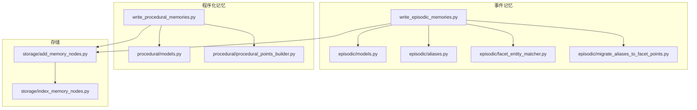
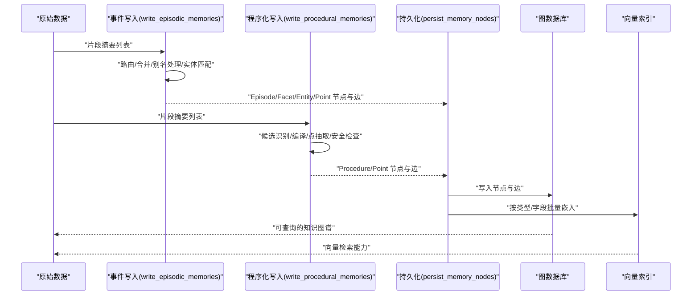
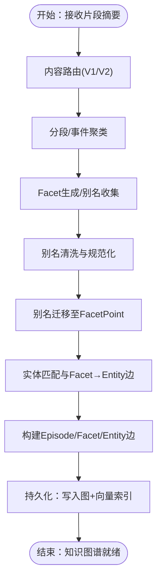
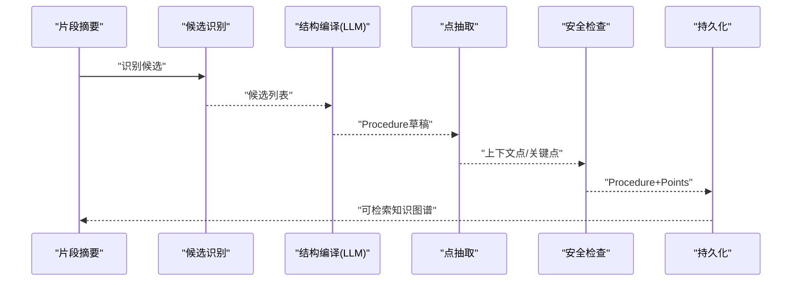
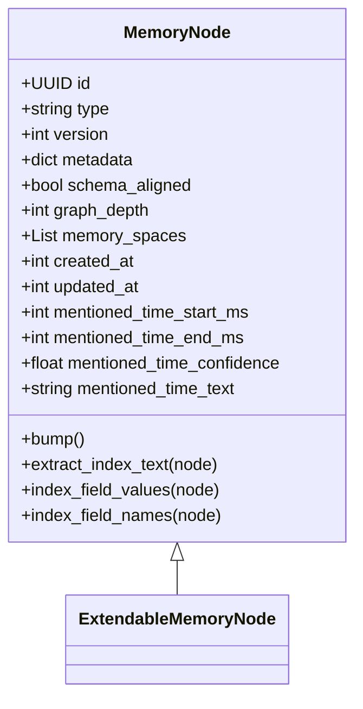
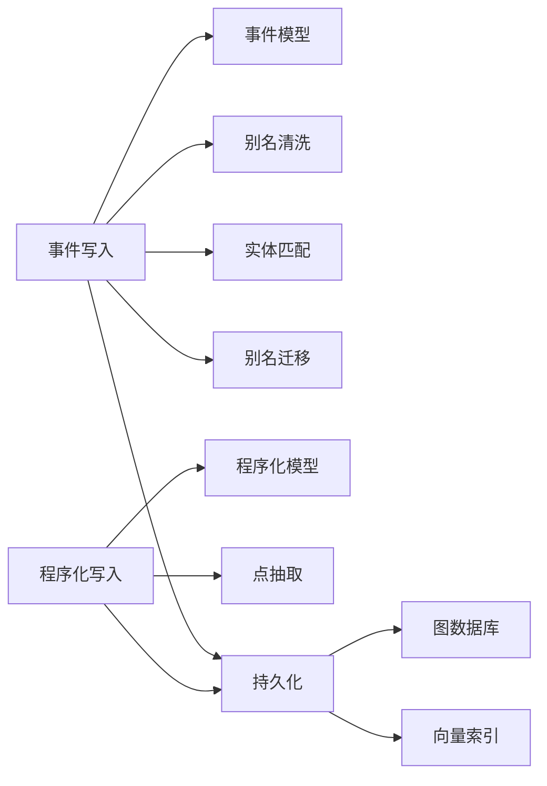
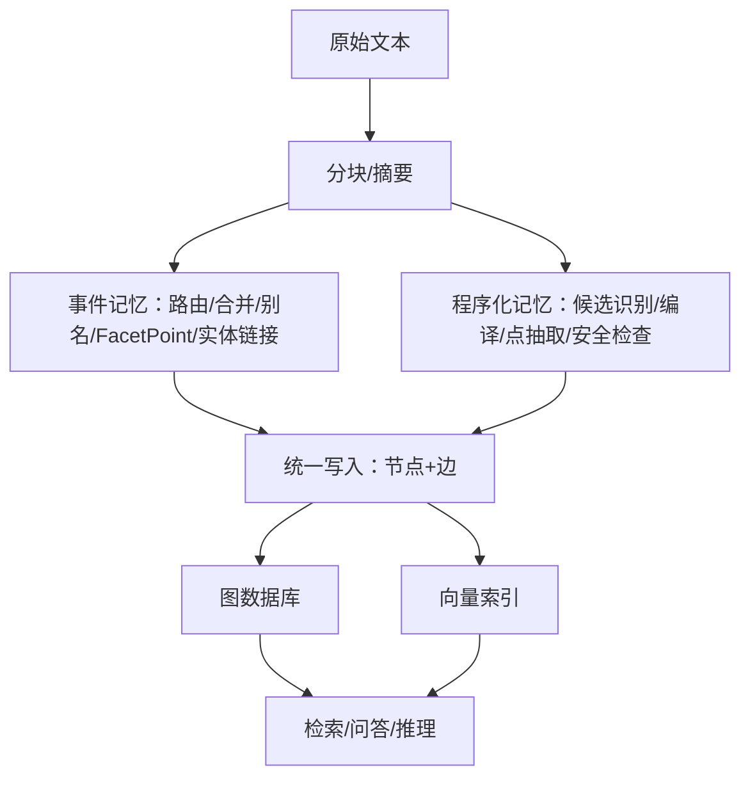

# 记忆系统架构

<cite>
**本文引用的文件**
- [MemoryNode.py](file://m_flow/core/models/MemoryNode.py)
- [ExtendableMemoryNode.py](file://m_flow/core/models/ExtendableMemoryNode.py)
- [models.py（事件记忆）](file://m_flow/memory/episodic/models.py)
- [aliases.py](file://m_flow/memory/episodic/aliases.py)
- [facet_entity_matcher.py](file://m_flow/memory/episodic/facet_entity_matcher.py)
- [migrate_aliases_to_facet_points.py](file://m_flow/memory/episodic/migrate_aliases_to_facet_points.py)
- [write_episodic_memories.py](file://m_flow/memory/episodic/write_episodic_memories.py)
- [models.py（程序化记忆）](file://m_flow/memory/procedural/models.py)
- [procedural_points_builder.py](file://m_flow/memory/procedural/procedural_points_builder.py)
- [write_procedural_memories.py](file://m_flow/memory/procedural/write_procedural_memories.py)
- [add_memory_nodes.py](file://m_flow/storage/add_memory_nodes.py)
- [index_memory_nodes.py](file://m_flow/storage/index_memory_nodes.py)
</cite>

## 目录
1. [引言](#引言)
2. [项目结构](#项目结构)
3. [核心组件](#核心组件)
4. [架构总览](#架构总览)
5. [详细组件分析](#详细组件分析)
6. [依赖分析](#依赖分析)
7. [性能考量](#性能考量)
8. [故障排查指南](#故障排查指南)
9. [结论](#结论)
10. [附录](#附录)

## 引言
本文件面向 M-flow 记忆系统，聚焦事件记忆（Episodic Memory）与程序化记忆（Procedural Memory）两大子系统，系统性阐述其设计原则、数据模型、处理流程与存储策略，并给出从原始数据到知识图谱的完整转换路径。文档同时覆盖别名管理与实体消解、向量索引与持久化、以及性能优化与扩展性建议。

## 项目结构
- 事件记忆模块位于 memory/episodic，涵盖路由、摘要、Facet/FacetPoint、实体匹配、别名迁移、写入与持久化等。
- 程序化记忆模块位于 memory/procedural，涵盖候选识别、编译、点抽取、安全检查与写入。
- 存储层位于 storage，负责图结构写入、向量索引与三元组嵌入。

图表来源
- [write_episodic_memories.py:178-663](file://m_flow/memory/episodic/write_episodic_memories.py#L178-L663)
- [write_procedural_memories.py:212-377](file://m_flow/memory/procedural/write_procedural_memories.py#L212-L377)
- [add_memory_nodes.py:220-261](file://m_flow/storage/add_memory_nodes.py#L220-L261)
- [index_memory_nodes.py:114-183](file://m_flow/storage/index_memory_nodes.py#L114-L183)

章节来源
- [write_episodic_memories.py:178-663](file://m_flow/memory/episodic/write_episodic_memories.py#L178-L663)
- [write_procedural_memories.py:212-377](file://m_flow/memory/procedural/write_procedural_memories.py#L212-L377)
- [add_memory_nodes.py:220-261](file://m_flow/storage/add_memory_nodes.py#L220-L261)
- [index_memory_nodes.py:114-183](file://m_flow/storage/index_memory_nodes.py#L114-L183)

## 核心组件
- MemoryNode 基类与版本控制
  - 提供统一的 UUID 标识、类型标注、版本号、时间戳、提及时间字段与嵌入辅助函数。
  - 支持通过 metadata.index_fields 定义参与向量化索引的字段集合。
- ExtendableMemoryNode 扩展基类
  - 面向应用自定义的节点类型，便于框架区分用户模型与内部模型，支持模式演进与校验。

章节来源
- [MemoryNode.py:27-106](file://m_flow/core/models/MemoryNode.py#L27-L106)
- [ExtendableMemoryNode.py:16-30](file://m_flow/core/models/ExtendableMemoryNode.py#L16-L30)

## 架构总览
事件记忆与程序化记忆均以“写入任务”为核心入口，产出 MemoryNode 列表，随后由统一的持久化管线完成图结构写入与向量索引，最终形成可检索的知识图谱。

图表来源
- [write_episodic_memories.py:178-663](file://m_flow/memory/episodic/write_episodic_memories.py#L178-L663)
- [write_procedural_memories.py:212-377](file://m_flow/memory/procedural/write_procedural_memories.py#L212-L377)
- [add_memory_nodes.py:220-261](file://m_flow/storage/add_memory_nodes.py#L220-L261)
- [index_memory_nodes.py:114-183](file://m_flow/storage/index_memory_nodes.py#L114-L183)

## 详细组件分析

### 事件记忆：Episodic Memory
- 数据模型与路由
  - 内容路由：支持 V1（按摘要路由类型）与 V2（按句子级分类）两种模式，V2 可将原子句也映射为 Episode，保证图结构完整性。
  - 分段与路由决策：对文档内多主题进行分段，结合实体与上下文信息决定新旧 Episode 合并或新建。
- Facet 与 FacetPoint
  - Facet 作为细粒度锚点，包含类型、检索短语、别名与描述；FacetPoint 用于将别名收敛为结构化细粒度点，提升召回与检索精度。
  - 别名迁移：将历史 Facet.aliases 迁移为 FacetPoint，保留少量同义词作为别名，其余转为信息点。
- 实体链接与消解
  - 使用精确文本匹配（带单词边界/CJK 特殊处理）将实体映射到对应 Facet，构建 Facet→Entity 边，支持跨文本的同一性推理。
- 别名管理
  - 别名清洗：过滤模板式、过短/过长、泛化词汇，去重并规范化，生成 aliases_text 参与索引。
- 写入与持久化
  - 统一写入：Episode/Facet/Entity/Point 与证据边、实体边等一次性提交，确保图结构一致性；随后进行节点与边的向量索引。

图表来源
- [write_episodic_memories.py:282-663](file://m_flow/memory/episodic/write_episodic_memories.py#L282-L663)
- [aliases.py:93-153](file://m_flow/memory/episodic/aliases.py#L93-L153)
- [migrate_aliases_to_facet_points.py:174-359](file://m_flow/memory/episodic/migrate_aliases_to_facet_points.py#L174-L359)
- [facet_entity_matcher.py:172-309](file://m_flow/memory/episodic/facet_entity_matcher.py#L172-L309)
- [add_memory_nodes.py:220-261](file://m_flow/storage/add_memory_nodes.py#L220-L261)

章节来源
- [models.py（事件记忆）:148-371](file://m_flow/memory/episodic/models.py#L148-L371)
- [aliases.py:67-153](file://m_flow/memory/episodic/aliases.py#L67-L153)
- [facet_entity_matcher.py:172-309](file://m_flow/memory/episodic/facet_entity_matcher.py#L172-L309)
- [migrate_aliases_to_facet_points.py:174-359](file://m_flow/memory/episodic/migrate_aliases_to_facet_points.py#L174-L359)
- [write_episodic_memories.py:178-663](file://m_flow/memory/episodic/write_episodic_memories.py#L178-L663)

### 程序化记忆：Procedural Memory
- 候选识别与编译
  - 候选识别：从 Episode 文本中识别可复用流程、偏好、习惯等候选，输出候选列表。
  - 结构编译：基于候选与源内容，LLM 输出结构化 Procedure 草案（标题、签名、检索短语、上下文包、要点包）。
- 点抽取与覆盖补全
  - 上下文点：从上下文字段中解析出 when/why/boundary/outcome/prereq/exception 等细粒度点。
  - 关键点：从要点文本中按行/编号解析步骤点，自动补全关键锚点，避免遗漏。
- 安全与溯源
  - 危险内容检测与敏感信息脱敏；记录来源引用与软门控元数据，便于审计与回溯。
- 写入与增量更新
  - 直接生成 Procedure→Point 的二层三元组，避免中间包节点；支持增量路由（合并/新建版本/跳过），维护版本关系。

图表来源
- [write_procedural_memories.py:212-377](file://m_flow/memory/procedural/write_procedural_memories.py#L212-L377)
- [procedural_points_builder.py:153-390](file://m_flow/memory/procedural/procedural_points_builder.py#L153-L390)
- [models.py（程序化记忆）:154-249](file://m_flow/memory/procedural/models.py#L154-L249)

章节来源
- [models.py（程序化记忆）:30-249](file://m_flow/memory/procedural/models.py#L30-L249)
- [procedural_points_builder.py:153-390](file://m_flow/memory/procedural/procedural_points_builder.py#L153-L390)
- [write_procedural_memories.py:212-669](file://m_flow/memory/procedural/write_procedural_memories.py#L212-L669)

### MemoryNode 基类与继承体系
- 设计要点
  - 统一标识与版本：UUID、type、version、created_at/updated_at。
  - 嵌入辅助：根据 metadata.index_fields 动态拼接索引文本，支持多字段组合嵌入。
  - 时间锚点：提及时间字段与置信度，贯穿事件与程序化记忆，支撑时序检索。
- 继承关系
  - MemoryNode 为基础，ExtendableMemoryNode 为应用扩展基类，二者共同构成领域节点的统一建模。

图表来源
- [MemoryNode.py:27-106](file://m_flow/core/models/MemoryNode.py#L27-L106)
- [ExtendableMemoryNode.py:16-30](file://m_flow/core/models/ExtendableMemoryNode.py#L16-L30)

章节来源
- [MemoryNode.py:27-106](file://m_flow/core/models/MemoryNode.py#L27-L106)
- [ExtendableMemoryNode.py:16-30](file://m_flow/core/models/ExtendableMemoryNode.py#L16-L30)

### 别名管理与实体消解
- 别名管理
  - 清洗规则：长度阈值、模板前缀、泛化词汇过滤；规范化比较（NFKC、小写、空白折叠）；去重与上限控制。
  - 输出：生成 aliases_text，参与向量索引，提升召回。
- 实体消解与链接
  - 匹配策略：针对单字符（数字/字母/汉字）采用严格边界匹配；多字符采用词边界或 CJK 子串匹配。
  - 边构建：将匹配结果转化为 Facet→Entity 边，统一使用专用边文本生成器，保证检索一致性。

章节来源
- [aliases.py:67-153](file://m_flow/memory/episodic/aliases.py#L67-L153)
- [facet_entity_matcher.py:172-309](file://m_flow/memory/episodic/facet_entity_matcher.py#L172-L309)

### 存储策略：内存与持久化
- 图结构写入
  - 输入校验：确保传入为 MemoryNode 列表。
  - 子图提取与去重：并行提取节点与边，全局去重，保证幂等。
  - 写入顺序：先写结构（节点+边），再做向量索引；即使向量索引失败，图结构仍可用。
- 向量索引
  - 分组批处理：按类型与索引字段分桶，惰性创建索引；并发受环境变量限制，避免压垮外部服务。
  - 三元组嵌入：可选地从图结构生成三元组并嵌入，增强检索表达力。

章节来源
- [add_memory_nodes.py:33-261](file://m_flow/storage/add_memory_nodes.py#L33-L261)
- [index_memory_nodes.py:114-183](file://m_flow/storage/index_memory_nodes.py#L114-L183)

## 依赖分析
- 事件记忆依赖
  - 路由与摘要：依赖 FragmentDigest 与路由配置。
  - Facet/FacetPoint：依赖 Episode/Facet/Entity/Point 等领域模型。
  - 实体匹配：依赖 Facet 描述与实体名称，使用正则边界匹配。
  - 别名迁移：依赖图引擎查询与边写入。
- 程序化记忆依赖
  - 候选识别与编译：依赖 LLMService 与结构化提示。
  - 点抽取：纯函数，无 LLM 依赖，稳定可重复。
  - 安全检查：统一的安全模块。
- 存储依赖
  - 图与向量适配器：通过 get_graph_provider/get_vector_provider 获取后端实例。
  - 并发控制：全局信号量与环境变量控制 LLM 与嵌入并发。

图表来源
- [write_episodic_memories.py:178-663](file://m_flow/memory/episodic/write_episodic_memories.py#L178-L663)
- [write_procedural_memories.py:212-377](file://m_flow/memory/procedural/write_procedural_memories.py#L212-L377)
- [add_memory_nodes.py:220-261](file://m_flow/storage/add_memory_nodes.py#L220-L261)

章节来源
- [write_episodic_memories.py:178-663](file://m_flow/memory/episodic/write_episodic_memories.py#L178-L663)
- [write_procedural_memories.py:212-377](file://m_flow/memory/procedural/write_procedural_memories.py#L212-L377)
- [add_memory_nodes.py:220-261](file://m_flow/storage/add_memory_nodes.py#L220-L261)

## 性能考量
- 并发与限流
  - LLM 并发：通过全局信号量限制，避免突发请求导致后端限流或失败。
  - 嵌入并发：通过环境变量控制批大小与并发度，保障外部嵌入服务稳定性。
- 写入顺序与幂等
  - 先结构后索引，确保图结构可用；子图提取与去重避免重复写入。
- 精确召回与覆盖补全
  - 别名清洗与 FacetPoint 迁移减少噪声；点抽取阶段的锚点提取与补全降低漏检。
- 时序传播
  - 在事件与程序化记忆中统一提取提及时间，贯穿节点与点，提升检索与排序质量。

## 故障排查指南
- 常见问题
  - LLM 并发超限：检查全局信号量与环境变量设置，适当降低并发。
  - 向量索引失败：关注日志中的批失败统计，确认后端服务状态与配额。
  - 别名迁移未生效：确认启用 FacetPoint 的开关与重新记忆流程。
  - 实体匹配误连：检查实体名称是否使用原始形式（精确匹配），调整边界规则。
- 排查步骤
  - 查看持久化阶段的图写入与向量索引日志，定位失败批次。
  - 对候选识别与编译阶段输出进行抽样验证，确认提示与响应结构。
  - 检查别名清洗与 FacetPoint 迁移统计，核对阈值与上限。

章节来源
- [index_memory_nodes.py:155-183](file://m_flow/storage/index_memory_nodes.py#L155-L183)
- [migrate_aliases_to_facet_points.py:324-359](file://m_flow/memory/episodic/migrate_aliases_to_facet_points.py#L324-L359)
- [write_procedural_memories.py:380-418](file://m_flow/memory/procedural/write_procedural_memories.py#L380-L418)

## 结论
M-flow 记忆系统通过统一的 MemoryNode 基类与清晰的事件/程序化记忆流水线，实现了从原始片段到知识图谱的高保真转换。事件记忆强调细粒度锚点与别名收敛、实体链接与路由合并；程序化记忆强调候选识别、结构编译与确定性点抽取。存储层以“先结构后索引”的策略确保可靠性，并通过并发与批处理优化吞吐。整体架构在可扩展性与可维护性上具备良好基础。

## 附录
- 关键流程图（概念示意）
