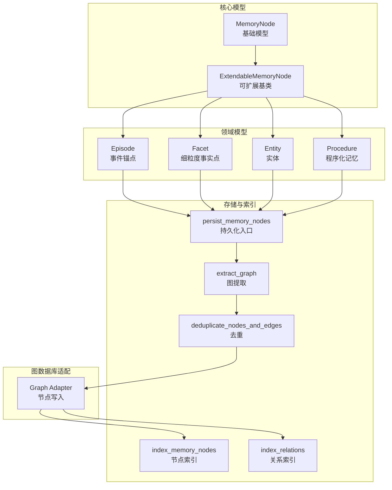
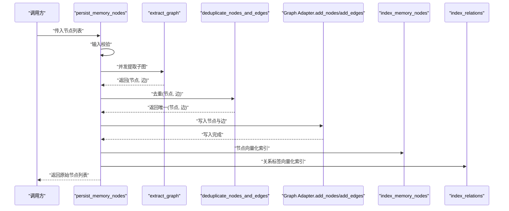
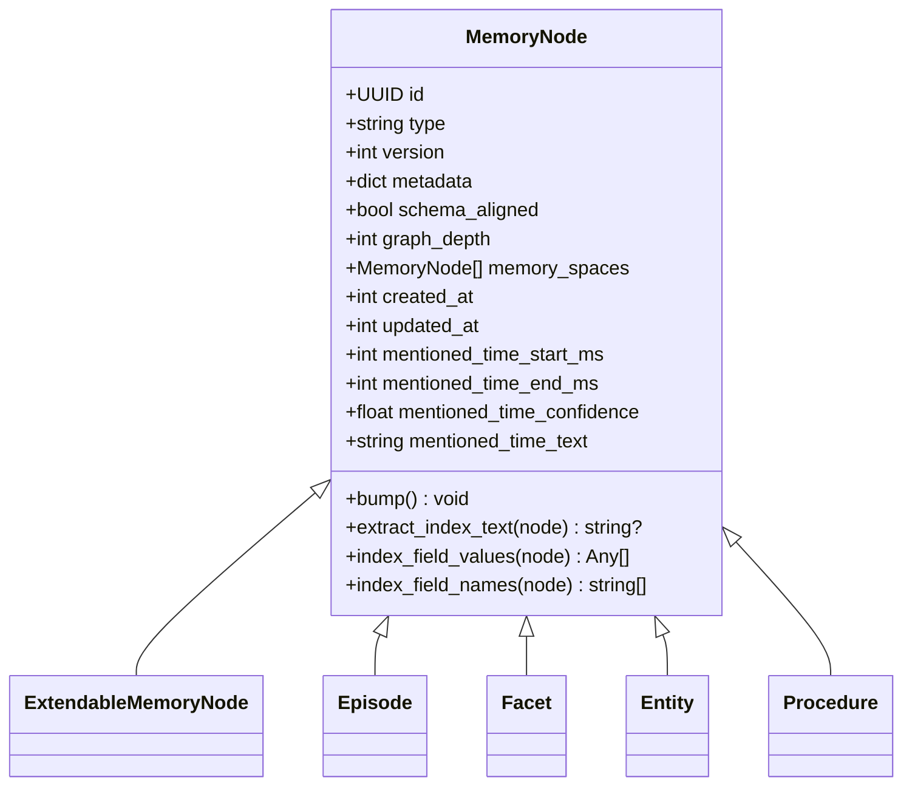
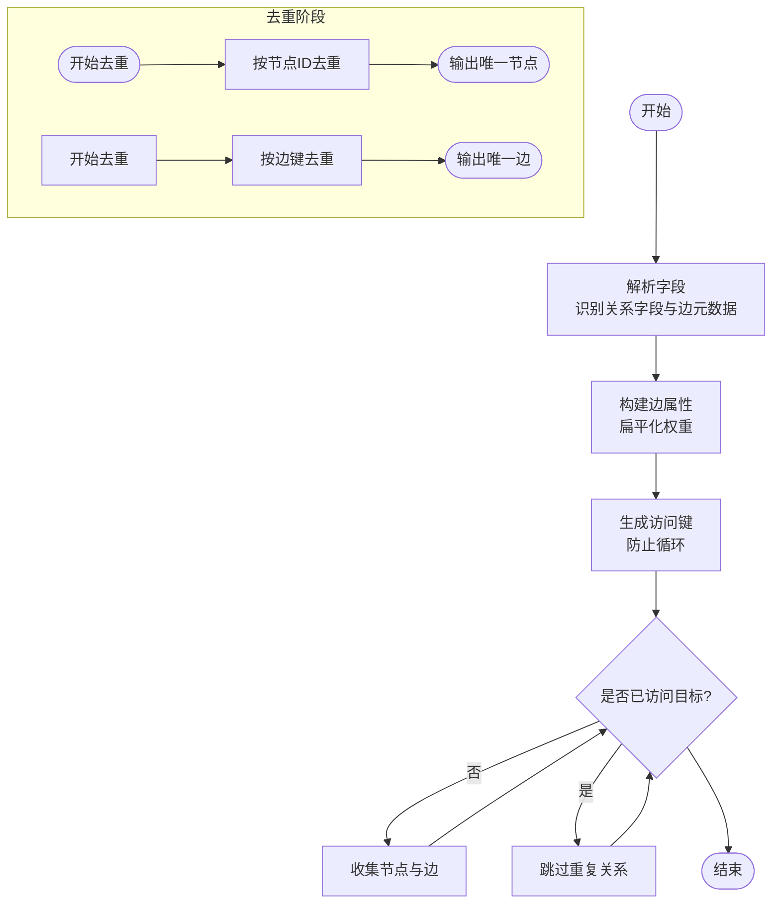
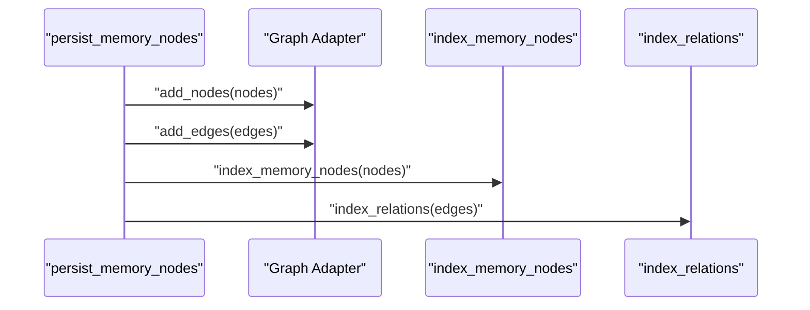
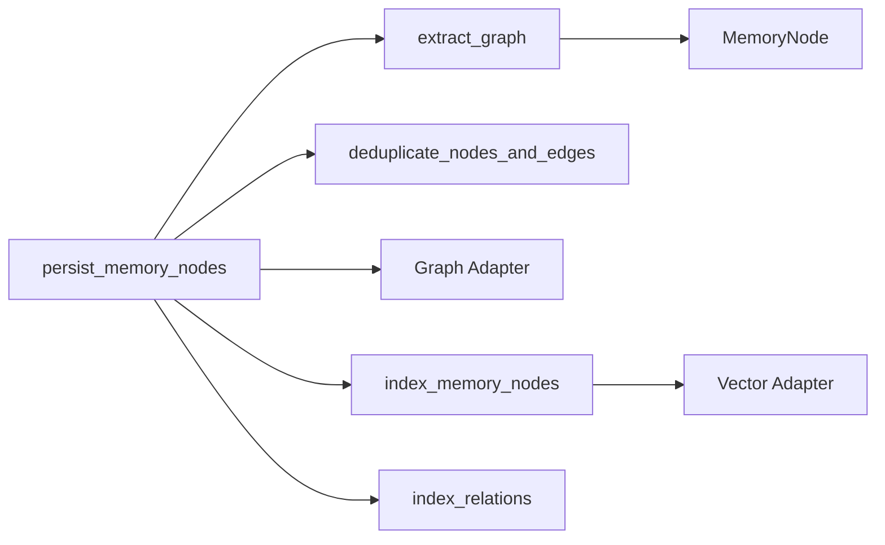

# 记忆节点管理系统

<cite>
**本文档引用的文件**
- [MemoryNode.py](file://m_flow/core/models/MemoryNode.py)
- [ExtendableMemoryNode.py](file://m_flow/core/models/ExtendableMemoryNode.py)
- [Episode.py](file://m_flow/core/domain/models/Episode.py)
- [Facet.py](file://m_flow/core/domain/models/Facet.py)
- [Entity.py](file://m_flow/core/domain/models/Entity.py)
- [Procedure.py](file://m_flow/core/domain/models/Procedure.py)
- [add_memory_nodes.py](file://m_flow/storage/add_memory_nodes.py)
- [index_memory_nodes.py](file://m_flow/storage/index_memory_nodes.py)
- [deduplicate_nodes_and_edges.py](file://m_flow/knowledge/graph_ops/utils/deduplicate_nodes_and_edges.py)
- [extract_graph.py](file://m_flow/knowledge/graph_ops/utils/extract_graph.py)
- [index_graph_links.py](file://m_flow/storage/index_graph_links.py)
- [adapter.py](file://m_flow/adapters/graph/kuzu/adapter.py)
</cite>

## 目录
1. [简介](#简介)
2. [项目结构](#项目结构)
3. [核心组件](#核心组件)
4. [架构总览](#架构总览)
5. [详细组件分析](#详细组件分析)
6. [依赖关系分析](#依赖关系分析)
7. [性能考虑](#性能考虑)
8. [故障排除指南](#故障排除指南)
9. [结论](#结论)

## 简介
本文件面向记忆节点管理系统，系统性阐述 MemoryNode 基础类与 ExtendableMemoryNode 扩展基类的设计理念与继承体系；详解 Episode（事件）、Facet（细粒度事实点）、Entity（实体）、Procedure（程序化记忆）等节点类型的特征与用途；梳理从创建、更新到删除的完整生命周期；总结去重机制以避免重复节点与边的创建；记录存储策略中内存缓存与持久化存储的协调方式；最后提供端到端的架构图与关键流程序列图，涵盖节点关系管理、事务处理与并发控制的实现要点。

## 项目结构
记忆节点管理涉及以下关键模块：
- 核心模型层：MemoryNode 基类与 ExtendableMemoryNode 扩展基类
- 领域模型层：Episode、Facet、Entity、Procedure 等具体节点类型
- 存储与索引层：节点与边的提取、去重、提交与向量化索引
- 图数据库适配层：节点写入与一致性保障
- 关系索引层：对关系标签进行统计与向量化

图表来源
- [MemoryNode.py:27-106](file://m_flow/core/models/MemoryNode.py#L27-L106)
- [ExtendableMemoryNode.py:16-30](file://m_flow/core/models/ExtendableMemoryNode.py#L16-L30)
- [Episode.py:15-105](file://m_flow/core/domain/models/Episode.py#L15-L105)
- [Facet.py:22-102](file://m_flow/core/domain/models/Facet.py#L22-L102)
- [Entity.py:10-62](file://m_flow/core/domain/models/Entity.py#L10-L62)
- [Procedure.py:22-108](file://m_flow/core/domain/models/Procedure.py#L22-L108)
- [add_memory_nodes.py:220-261](file://m_flow/storage/add_memory_nodes.py#L220-L261)
- [extract_graph.py:161-251](file://m_flow/knowledge/graph_ops/utils/extract_graph.py#L161-L251)
- [deduplicate_nodes_and_edges.py:10-33](file://m_flow/knowledge/graph_ops/utils/deduplicate_nodes_and_edges.py#L10-L33)
- [index_memory_nodes.py:114-184](file://m_flow/storage/index_memory_nodes.py#L114-L184)
- [index_graph_links.py:68-98](file://m_flow/storage/index_graph_links.py#L68-L98)
- [adapter.py:614-639](file://m_flow/adapters/graph/kuzu/adapter.py#L614-L639)

章节来源
- [MemoryNode.py:27-106](file://m_flow/core/models/MemoryNode.py#L27-L106)
- [ExtendableMemoryNode.py:16-30](file://m_flow/core/models/ExtendableMemoryNode.py#L16-L30)
- [Episode.py:15-105](file://m_flow/core/domain/models/Episode.py#L15-L105)
- [Facet.py:22-102](file://m_flow/core/domain/models/Facet.py#L22-L102)
- [Entity.py:10-62](file://m_flow/core/domain/models/Entity.py#L10-L62)
- [Procedure.py:22-108](file://m_flow/core/domain/models/Procedure.py#L22-L108)

## 核心组件
- MemoryNode 基类
  - 提供统一的版本号、时间戳、元数据与嵌入辅助方法
  - 自动填充 type 字段为子类名，支持按字段生成可嵌入文本
  - 版本推进时更新版本号与更新时间
- ExtendableMemoryNode 可扩展基类
  - 继承自 MemoryNode，作为用户自定义节点类型的基类
  - 用于区分用户模型与内部引擎模型，便于模式检查与序列化
- Episode 事件锚点
  - 作为粗粒度记忆的锚点，承载摘要与语义边
  - 支持 Facet 与 Entity 的富语义连接，以及证据块挂载与派生程序追踪
- Facet 细粒度事实点
  - 作为事件细节锚点，支持检索主键、别名回退召回与中间层语义字段
  - 可挂载证据块与细粒度点集合
- Entity 实体
  - 表示原子实体，支持规范化名称与跨事件链接
  - 通过 same_entity_as 边连接同一规范名的不同实例
- Procedure 程序化记忆
  - 顶层锚点，直接连接上下文点与关键步骤点
  - 仅索引摘要字段，支持版本管理与溯源引用

章节来源
- [MemoryNode.py:27-106](file://m_flow/core/models/MemoryNode.py#L27-L106)
- [ExtendableMemoryNode.py:16-30](file://m_flow/core/models/ExtendableMemoryNode.py#L16-L30)
- [Episode.py:15-105](file://m_flow/core/domain/models/Episode.py#L15-L105)
- [Facet.py:22-102](file://m_flow/core/domain/models/Facet.py#L22-L102)
- [Entity.py:10-62](file://m_flow/core/domain/models/Entity.py#L10-L62)
- [Procedure.py:22-108](file://m_flow/core/domain/models/Procedure.py#L22-L108)

## 架构总览
下图展示了从输入节点到最终向量化索引的完整流程，包括输入校验、图提取、去重、提交与索引刷新：

图表来源
- [add_memory_nodes.py:220-261](file://m_flow/storage/add_memory_nodes.py#L220-L261)
- [extract_graph.py:161-251](file://m_flow/knowledge/graph_ops/utils/extract_graph.py#L161-L251)
- [deduplicate_nodes_and_edges.py:10-33](file://m_flow/knowledge/graph_ops/utils/deduplicate_nodes_and_edges.py#L10-L33)
- [index_memory_nodes.py:114-184](file://m_flow/storage/index_memory_nodes.py#L114-L184)
- [index_graph_links.py:68-98](file://m_flow/storage/index_graph_links.py#L68-L98)
- [adapter.py:614-639](file://m_flow/adapters/graph/kuzu/adapter.py#L614-L639)

## 详细组件分析

### MemoryNode 与 ExtendableMemoryNode 类层次
- 设计要点
  - 使用 Pydantic 模型定义统一字段：id、type、version、metadata、schema_aligned、graph_depth、memory_spaces、时间戳等
  - 元数据 metadata 中的 index_fields 决定哪些字段参与向量化
  - 模型验证器在构造后自动设置 type 字段为子类名
  - 提供提取索引文本、索引字段值与名称的工具方法
  - bump() 方法用于版本推进与更新时间戳
- 继承体系
  - ExtendableMemoryNode 继承 MemoryNode，作为用户自定义节点类型的基类
  - Episode、Facet、Entity、Procedure 等具体节点类型继承自 MemoryNode 或其子类

图表来源
- [MemoryNode.py:27-106](file://m_flow/core/models/MemoryNode.py#L27-L106)
- [ExtendableMemoryNode.py:16-30](file://m_flow/core/models/ExtendableMemoryNode.py#L16-L30)
- [Episode.py:15-105](file://m_flow/core/domain/models/Episode.py#L15-L105)
- [Facet.py:22-102](file://m_flow/core/domain/models/Facet.py#L22-L102)
- [Entity.py:10-62](file://m_flow/core/domain/models/Entity.py#L10-L62)
- [Procedure.py:22-108](file://m_flow/core/domain/models/Procedure.py#L22-L108)

章节来源
- [MemoryNode.py:27-106](file://m_flow/core/models/MemoryNode.py#L27-L106)
- [ExtendableMemoryNode.py:16-30](file://m_flow/core/models/ExtendableMemoryNode.py#L16-L30)

### Episode（事件）节点
- 角色定位
  - 粗粒度记忆锚点，聚合多个内容片段的信息
  - 主要检索载体为摘要字段，支持与 Facet、Entity 的富语义边
- 关键属性
  - name、summary、signature、status、memory_type、dataset_id、display_only
  - has_facet、involves_entity、includes_chunk、derived_procedure
  - metadata 仅索引 summary
- 用途
  - 作为检索锚点与后续 RAG 精确证据检索的入口

章节来源
- [Episode.py:15-105](file://m_flow/core/domain/models/Episode.py#L15-L105)

### Facet（细粒度事实点）节点
- 角色定位
  - 事件细节锚点，用于精确检索与定位
- 关键属性
  - name、facet_type、search_text、aliases、aliases_text、description、display_only、dataset_id
  - anchor_text（中间层语义字段）
  - supported_by（证据边）、has_point（细粒度点集合）
  - metadata 索引 search_text 与 anchor_text
- 用途
  - 将事实点转化为可独立匹配、评分与链接的证据节点

章节来源
- [Facet.py:22-102](file://m_flow/core/domain/models/Facet.py#L22-L102)

### Entity（实体）节点
- 角色定位
  - 原子实体，支持规范化名称与跨事件链接
- 关键属性
  - name、is_a、description、canonical_name、memory_type
  - same_entity_as（跨事件同实体链接）
  - metadata 索引 name 与 canonical_name
- 用途
  - 跨事件实体发现与合并，提升检索一致性

章节来源
- [Entity.py:10-62](file://m_flow/core/domain/models/Entity.py#L10-L62)

### Procedure（程序化记忆）节点
- 角色定位
  - 可复用的方法/步骤/流程的顶层锚点
- 关键属性
  - name、summary、search_text、context_text、points_text、signature、version、status、confidence
  - source_refs、updated_at、write_decision、write_reason、evidence_refs
  - has_context_point、has_key_point、supersedes
  - metadata 仅索引 summary
- 用途
  - 支持检索三元组（Procedure → 边 → 点），直接连接上下文点与关键步骤点

章节来源
- [Procedure.py:22-108](file://m_flow/core/domain/models/Procedure.py#L22-L108)

### 图提取与去重流程
- 图提取 extract_graph
  - 解析节点字段，识别关系字段与边元数据
  - 构造边属性（含权重扁平化），生成边元组
  - 递归遍历，使用访问键防止循环
- 去重 deduplicate_nodes_and_edges
  - 基于节点 id 去重
  - 基于源-关系-目标三元组键去重边

图表来源
- [extract_graph.py:161-251](file://m_flow/knowledge/graph_ops/utils/extract_graph.py#L161-L251)
- [deduplicate_nodes_and_edges.py:10-33](file://m_flow/knowledge/graph_ops/utils/deduplicate_nodes_and_edges.py#L10-L33)

章节来源
- [extract_graph.py:161-251](file://m_flow/knowledge/graph_ops/utils/extract_graph.py#L161-L251)
- [deduplicate_nodes_and_edges.py:10-33](file://m_flow/knowledge/graph_ops/utils/deduplicate_nodes_and_edges.py#L10-L33)

### 存储与索引协调机制
- 节点持久化入口 persist_memory_nodes
  - 输入校验：确保参数为 MemoryNode 列表
  - 并发提取：对每个根节点异步提取子图并合并
  - 去重：统一去重节点与边
  - 提交顺序：先写入图结构（节点+边），再执行向量化索引
  - 可选三元组嵌入：基于边生成可嵌入三元组文本并索引
- 向量化索引 index_memory_nodes
  - 按类型与字段分组，延迟创建向量索引
  - 并发限制由环境变量控制，默认并发为 20
  - 失败批次记录日志但不中断整体流程
- 关系标签索引 index_relations
  - 聚合边标签并统计出现次数，生成 RelationType 节点
  - 对关系标签进行向量化索引

图表来源
- [add_memory_nodes.py:79-126](file://m_flow/storage/add_memory_nodes.py#L79-L126)
- [index_memory_nodes.py:114-184](file://m_flow/storage/index_memory_nodes.py#L114-L184)
- [index_graph_links.py:68-98](file://m_flow/storage/index_graph_links.py#L68-L98)
- [adapter.py:614-639](file://m_flow/adapters/graph/kuzu/adapter.py#L614-L639)

章节来源
- [add_memory_nodes.py:79-126](file://m_flow/storage/add_memory_nodes.py#L79-L126)
- [index_memory_nodes.py:114-184](file://m_flow/storage/index_memory_nodes.py#L114-L184)
- [index_graph_links.py:68-98](file://m_flow/storage/index_graph_links.py#L68-L98)
- [adapter.py:614-639](file://m_flow/adapters/graph/kuzu/adapter.py#L614-L639)

### 生命周期管理（创建、更新、删除）
- 创建
  - 节点构造时自动设置 type、id、时间戳与版本
  - 通过 persist_memory_nodes 完成图提取、去重与提交
- 更新
  - bump() 方法推进版本并更新时间戳
  - 通过相同 id 的节点再次写入实现更新（图适配器支持写冲突回退）
- 删除
  - 未在当前上下文中直接暴露显式删除接口，通常通过业务侧软删除或外部清理流程实现

章节来源
- [MemoryNode.py:102-106](file://m_flow/core/models/MemoryNode.py#L102-L106)
- [adapter.py:614-639](file://m_flow/adapters/graph/kuzu/adapter.py#L614-L639)

### 去重机制
- 节点去重
  - 基于节点 id 的字符串形式进行去重，首次出现优先
- 边去重
  - 基于“源节点|关系名|目标节点”的组合键进行去重，保证无向边一致性
- 关系循环检测
  - 在图提取过程中使用访问键跟踪已访问的关系，防止循环递归

章节来源
- [deduplicate_nodes_and_edges.py:10-33](file://m_flow/knowledge/graph_ops/utils/deduplicate_nodes_and_edges.py#L10-L33)
- [extract_graph.py:128-131](file://m_flow/knowledge/graph_ops/utils/extract_graph.py#L128-L131)

### 并发控制与事务处理
- 并发控制
  - 向量化索引使用信号量限制并发，默认并发为 20，可通过环境变量调整
  - 异步批量处理，失败批次记录错误但不影响其他批次
- 事务处理
  - 提交阶段严格顺序：先写结构（节点+边），再做向量化索引
  - 即使向量化失败，图结构仍保持完整，保证可查询性

章节来源
- [index_memory_nodes.py:33-39](file://m_flow/storage/index_memory_nodes.py#L33-L39)
- [index_memory_nodes.py:140-142](file://m_flow/storage/index_memory_nodes.py#L140-L142)
- [add_memory_nodes.py:94-125](file://m_flow/storage/add_memory_nodes.py#L94-L125)

## 依赖关系分析
- 组件耦合
  - 存储入口 persist_memory_nodes 依赖图提取、去重与索引模块
  - 图提取依赖节点模型与边元数据结构
  - 索引模块依赖向量适配器与环境配置
- 外部依赖
  - 图数据库适配器负责节点与边的写入
  - 向量数据库适配器负责嵌入与索引

图表来源
- [add_memory_nodes.py:220-261](file://m_flow/storage/add_memory_nodes.py#L220-L261)
- [extract_graph.py:161-251](file://m_flow/knowledge/graph_ops/utils/extract_graph.py#L161-L251)
- [deduplicate_nodes_and_edges.py:10-33](file://m_flow/knowledge/graph_ops/utils/deduplicate_nodes_and_edges.py#L10-L33)
- [index_memory_nodes.py:114-184](file://m_flow/storage/index_memory_nodes.py#L114-L184)
- [index_graph_links.py:68-98](file://m_flow/storage/index_graph_links.py#L68-L98)

## 性能考虑
- 并发与批处理
  - 通过环境变量控制嵌入并发度，避免外部服务过载
  - 批大小由向量引擎决定，分批处理提升吞吐
- 索引策略
  - 仅对 metadata 中声明的字段建立向量索引，减少索引开销
  - 关系标签独立索引，降低检索复杂度
- 写入顺序
  - 先结构后索引，确保即使索引失败也能查询已有结构

## 故障排除指南
- 输入校验异常
  - 当传入非列表或列表元素非 MemoryNode 实例时，抛出相应错误
- 索引失败
  - 向量化索引失败会记录错误日志，但不会中断整体流程
- 图适配器初始化失败
  - 关系标签索引在未提供边数据时会尝试从图引擎拉取，初始化失败会抛出运行时错误

章节来源
- [add_memory_nodes.py:33-40](file://m_flow/storage/add_memory_nodes.py#L33-L40)
- [index_memory_nodes.py:167-173](file://m_flow/storage/index_memory_nodes.py#L167-L173)
- [index_graph_links.py:87-94](file://m_flow/storage/index_graph_links.py#L87-L94)

## 结论
记忆节点管理系统以 MemoryNode 为核心，通过 ExtendableMemoryNode 提供可扩展的节点类型基类，结合 Episode、Facet、Entity、Procedure 等领域节点实现多层级知识图谱的构建。系统采用严格的输入校验、并发控制与提交顺序保障，确保在高并发场景下的稳定性与一致性。去重机制与访问键设计有效避免了重复节点与边的产生，并通过节点与关系的向量化索引提升了检索效率。整体架构清晰、模块职责明确，适合在大规模知识管理与检索场景中部署与演进。