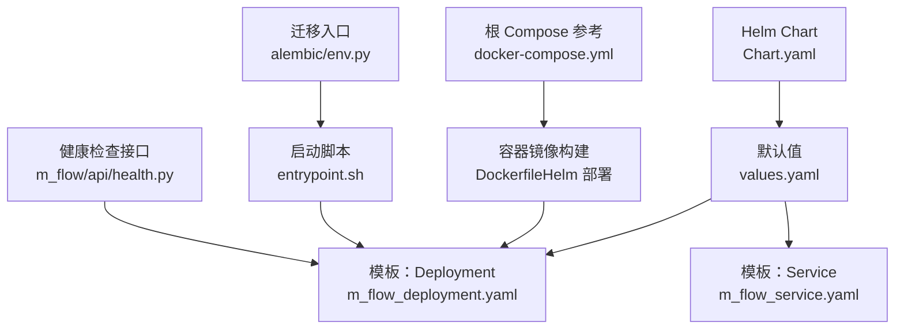
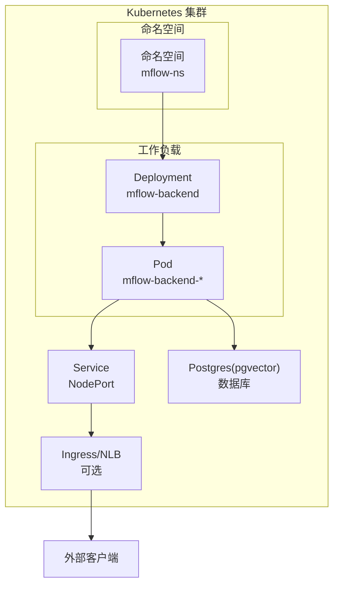
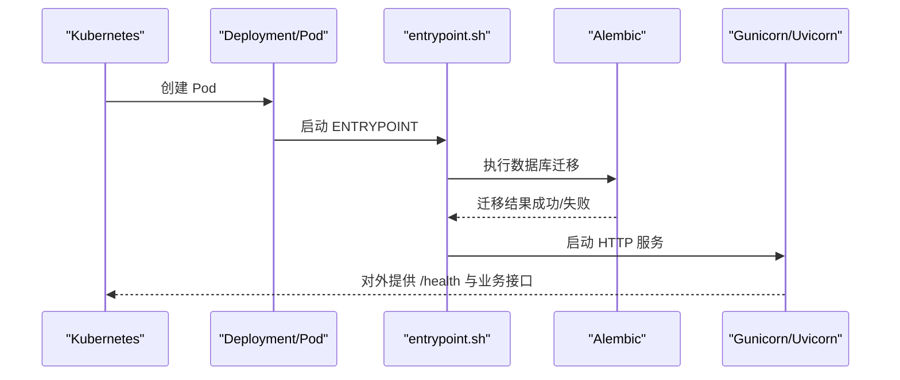
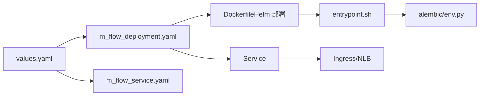

# Kubernetes 部署

<cite>
**本文引用的文件**
- [Chart.yaml](file://deployment/helm/Chart.yaml)
- [values.yaml](file://deployment/helm/values.yaml)
- [m_flow_deployment.yaml](file://deployment/helm/templates/m_flow_deployment.yaml)
- [m_flow_service.yaml](file://deployment/helm/templates/m_flow_service.yaml)
- [Dockerfile（Helm 部署）](file://deployment/helm/Dockerfile)
- [docker-compose-helm.yml](file://deployment/helm/docker-compose-helm.yml)
- [README.md（Helm 部署）](file://deployment/helm/README.md)
- [entrypoint.sh](file://entrypoint.sh)
- [docker-compose.yml](file://docker-compose.yml)
- [pyproject.toml](file://pyproject.toml)
- [env.py（迁移）](file://alembic/env.py)
- [health.py](file://m_flow/api/health.py)
</cite>

## 目录
1. [简介](#简介)
2. [项目结构](#项目结构)
3. [核心组件](#核心组件)
4. [架构总览](#架构总览)
5. [详细组件分析](#详细组件分析)
6. [依赖关系分析](#依赖关系分析)
7. [性能考量](#性能考量)
8. [故障排查指南](#故障排查指南)
9. [结论](#结论)
10. [附录](#附录)

## 简介
本指南面向在 Kubernetes 上部署 M-flow 的工程团队与平台工程师，基于仓库内现有的 Helm Chart 与容器镜像构建逻辑，系统性讲解 Helm Chart 结构与配置、Kubernetes 资源清单生成、命名空间与资源配额、Pod 调度策略、Ingress 外部访问、不同集群环境的部署策略、滚动更新与回滚、存储与数据库连接、服务网格与监控等主题。文档同时提供可操作的步骤、可视化图示与排障建议，帮助读者从零完成生产级部署。

## 项目结构
M-flow 的 Helm 部署位于 deployment/helm 目录，包含 Chart 元数据、默认参数、模板与说明文档；后端服务通过 entrypoint.sh 启动并执行数据库迁移；根目录 docker-compose.yml 提供多服务编排参考；pyproject.toml 定义了可选依赖与部署相关 extras。

**图表来源**
- [Chart.yaml:1-7](file://deployment/helm/Chart.yaml#L1-L7)
- [values.yaml:1-23](file://deployment/helm/values.yaml#L1-L23)
- [m_flow_deployment.yaml:1-33](file://deployment/helm/templates/m_flow_deployment.yaml#L1-L33)
- [m_flow_service.yaml:1-14](file://deployment/helm/templates/m_flow_service.yaml#L1-L14)
- [Dockerfile（Helm 部署）:1-38](file://deployment/helm/Dockerfile#L1-L38)
- [entrypoint.sh:1-79](file://entrypoint.sh#L1-L79)
- [docker-compose.yml:1-227](file://docker-compose.yml#L1-L227)
- [env.py（迁移）:1-64](file://alembic/env.py#L1-L64)
- [health.py:1-402](file://m_flow/api/health.py#L1-L402)

**章节来源**
- [Chart.yaml:1-7](file://deployment/helm/Chart.yaml#L1-L7)
- [values.yaml:1-23](file://deployment/helm/values.yaml#L1-L23)
- [m_flow_deployment.yaml:1-33](file://deployment/helm/templates/m_flow_deployment.yaml#L1-L33)
- [m_flow_service.yaml:1-14](file://deployment/helm/templates/m_flow_service.yaml#L1-L14)
- [Dockerfile（Helm 部署）:1-38](file://deployment/helm/Dockerfile#L1-L38)
- [entrypoint.sh:1-79](file://entrypoint.sh#L1-L79)
- [docker-compose.yml:1-227](file://docker-compose.yml#L1-L227)
- [env.py（迁移）:1-64](file://alembic/env.py#L1-L64)
- [health.py:1-402](file://m_flow/api/health.py#L1-L402)

## 核心组件
- Helm Chart 元数据与版本：定义 Chart 名称、类型、版本与应用版本，用于 Helm 包管理与升级。
- 默认参数 values.yaml：集中定义后端镜像、端口、环境变量、资源限制，以及数据库镜像、端口与存储大小。
- 模板资源：
  - Deployment：声明容器镜像、端口、环境变量、资源配额与标签选择器。
  - Service：暴露后端服务为 NodePort 类型，便于本地或边缘访问。
- 容器镜像构建：使用 Poetry 安装可选依赖，打包后端代码与迁移工具，入口脚本负责数据库迁移与进程启动。
- 健康检查：提供统一的 /health 探针，覆盖关系型数据库、向量库、图数据库、文件存储、LLM 与嵌入配置等。

**章节来源**
- [Chart.yaml:1-7](file://deployment/helm/Chart.yaml#L1-L7)
- [values.yaml:1-23](file://deployment/helm/values.yaml#L1-L23)
- [m_flow_deployment.yaml:1-33](file://deployment/helm/templates/m_flow_deployment.yaml#L1-L33)
- [m_flow_service.yaml:1-14](file://deployment/helm/templates/m_flow_service.yaml#L1-L14)
- [Dockerfile（Helm 部署）:1-38](file://deployment/helm/Dockerfile#L1-L38)
- [entrypoint.sh:1-79](file://entrypoint.sh#L1-L79)
- [health.py:1-402](file://m_flow/api/health.py#L1-L402)

## 架构总览
下图展示 Helm Chart 在 Kubernetes 中的运行时拓扑：Helm 将模板渲染为 Deployment 与 Service；Deployment 启动容器，容器内通过 entrypoint.sh 执行数据库迁移，随后由 Gunicorn/Uvicorn 提供 HTTP 服务；Service 暴露端口，Ingress/NLB 可进一步对外提供域名访问；数据库使用独立的 Postgres(pgvector) 容器或外部托管实例。

**图表来源**
- [m_flow_deployment.yaml:1-33](file://deployment/helm/templates/m_flow_deployment.yaml#L1-L33)
- [m_flow_service.yaml:1-14](file://deployment/helm/templates/m_flow_service.yaml#L1-L14)
- [values.yaml:1-23](file://deployment/helm/values.yaml#L1-L23)

## 详细组件分析

### Helm Chart 结构与配置
- Chart.yaml
  - 定义 Chart 名称、类型、版本与应用版本，确保升级与兼容性管理。
- values.yaml
  - 后端镜像、监听端口、环境变量（HOST、ENVIRONMENT、PYTHONPATH）、CPU/内存资源上限。
  - 数据库镜像、端口、PostgreSQL 用户名/密码/数据库名、持久化存储大小。
- 模板
  - Deployment：使用 values 渲染容器镜像、端口、环境变量与资源配额。
  - Service：NodePort 类型，映射到容器端口，便于集群外访问。

**章节来源**
- [Chart.yaml:1-7](file://deployment/helm/Chart.yaml#L1-L7)
- [values.yaml:1-23](file://deployment/helm/values.yaml#L1-L23)
- [m_flow_deployment.yaml:1-33](file://deployment/helm/templates/m_flow_deployment.yaml#L1-L33)
- [m_flow_service.yaml:1-14](file://deployment/helm/templates/m_flow_service.yaml#L1-L14)

### 容器镜像与启动流程
- Dockerfile（Helm 部署）
  - 使用 slim 基础镜像，安装编译依赖与 Poetry。
  - 通过 Poetry 安装可选 extras（如 postgres、neo4j、langchain、llama-index、huggingface、ollama、mistral、groq、deepeval、evals、posthog、codegraph、graphiti 等），并排除开发与文档目录。
  - 复制后端代码、迁移配置与入口脚本，设置 PYTHONPATH 与调试开关，ENTRYPOINT 指向入口脚本。
- 入口脚本 entrypoint.sh
  - 执行数据库迁移（Alembic 升级 head；若失败则尝试直接初始化）。
  - 根据环境变量选择进程启动方式：优先 Gunicorn（需 deploy 可选依赖），否则回退到 Uvicorn。
  - 支持本地/开发模式下的远程调试（debugpy）。
- 迁移入口 alembic/env.py
  - 解析数据库 DSN 并异步执行迁移，支持离线/在线模式。

**图表来源**
- [Dockerfile（Helm 部署）:1-38](file://deployment/helm/Dockerfile#L1-L38)
- [entrypoint.sh:1-79](file://entrypoint.sh#L1-L79)
- [env.py（迁移）:1-64](file://alembic/env.py#L1-L64)

**章节来源**
- [Dockerfile（Helm 部署）:1-38](file://deployment/helm/Dockerfile#L1-L38)
- [entrypoint.sh:1-79](file://entrypoint.sh#L1-L79)
- [env.py（迁移）:1-64](file://alembic/env.py#L1-L64)

### Kubernetes 资源清单（Deployment、Service、ConfigMap、Secret、PVC）
- Deployment
  - 容器镜像来自 values.backend.image，端口来自 values.backend.port。
  - 环境变量来自 values.backend.env（HOST、ENVIRONMENT、PYTHONPATH）。
  - 资源配额来自 values.backend.resources（CPU/内存）。
- Service
  - NodePort 类型，将 Service 端口映射到容器端口，便于集群外访问。
- ConfigMap（建议）
  - 当前模板未包含 ConfigMap；可在 values 中新增 configMaps 字段，并在 templates 中添加对应模板，用于注入非敏感配置。
- Secret（建议）
  - 当前模板未包含 Secret；可在 values 中新增 secrets 字段，并在 templates 中添加对应模板，用于注入数据库凭据、LLM 密钥等敏感信息。
- PersistentVolumeClaim（建议）
  - 当前数据库以容器内卷形式运行；若需持久化，可在 values 中新增 volumeClaims 字段，并在 templates 中添加 PVC 模板，挂载到数据库容器的数据目录。

**章节来源**
- [m_flow_deployment.yaml:1-33](file://deployment/helm/templates/m_flow_deployment.yaml#L1-L33)
- [m_flow_service.yaml:1-14](file://deployment/helm/templates/m_flow_service.yaml#L1-L14)
- [values.yaml:1-23](file://deployment/helm/values.yaml#L1-L23)

### 命名空间管理、资源配额与调度策略
- 命名空间
  - 建议为 M-flow 创建专用命名空间（例如 mflow-ns），并在该命名空间中部署所有资源，便于资源隔离与权限控制。
- 资源配额
  - 通过 values.backend.resources 设置 CPU/内存请求与限制，避免资源争抢。
- Pod 调度策略
  - 可在 Deployment 模板中增加 tolerations、nodeSelector、affinity 等字段，实现节点亲和/反亲和、污点容忍与区域调度。
  - 若数据库需要更高 IO 或网络性能，可单独为数据库 Pod 设置更高的资源配额与调度策略。

**章节来源**
- [m_flow_deployment.yaml:1-33](file://deployment/helm/templates/m_flow_deployment.yaml#L1-L33)
- [values.yaml:1-23](file://deployment/helm/values.yaml#L1-L23)

### Ingress 配置与外部访问
- 当前 Service 为 NodePort 类型，适合本地与边缘场景。
- 生产环境建议使用 Ingress 控制器（如 Nginx、ALB、Cloudflare 等），通过 Ingress 资源将域名映射到 Service。
- 可在 values 中新增 ingress 字段，并在 templates 中添加 Ingress 模板，配置 TLS、路径路由与会话保持等。

**章节来源**
- [m_flow_service.yaml:1-14](file://deployment/helm/templates/m_flow_service.yaml#L1-L14)

### 不同集群环境的部署策略
- Minikube
  - 使用 NodePort 暴露服务即可访问；可启用本地磁盘作为 StorageClass，满足开发测试需求。
- EKS/AKS/GKE
  - 使用 Ingress + Cloud Load Balancer/NLB 提供外部访问；结合云原生存储（如 EBS、Azure Disk、Persistent Disk）与 Secret Manager/Key Vault 管理密钥。
  - 通过 values.overrides 覆盖镜像仓库、镜像拉取策略、资源配额与调度策略，适配各云厂商的特性。

**章节来源**
- [README.md（Helm 部署）:1-36](file://deployment/helm/README.md#L1-L36)
- [values.yaml:1-23](file://deployment/helm/values.yaml#L1-L23)

### 滚动更新与回滚策略
- 滚动更新
  - 在 Deployment 中设置滚动更新策略（maxUnavailable、maxSurge），确保发布期间服务不中断。
- 回滚策略
  - 通过 Helm 升级历史与 rollback 实现快速回滚；建议在生产中开启金丝雀发布与蓝绿切换，降低风险。
- 健康检查
  - 利用 /health 探针（存活/就绪）与容器健康检查，确保滚动更新过程中的稳定性。

**章节来源**
- [m_flow_deployment.yaml:1-33](file://deployment/helm/templates/m_flow_deployment.yaml#L1-L33)
- [health.py:1-402](file://m_flow/api/health.py#L1-L402)

### 存储配置与数据库连接
- 数据库镜像与连接
  - 使用 pgvector 镜像，端口与凭据来自 values.database；可通过 Secret 注入数据库凭据。
- 持久化卷
  - 建议为数据库配置 PVC 与 StorageClass，避免 Pod 重启导致数据丢失。
- 迁移与初始化
  - 容器启动时自动执行 Alembic 迁移；若迁移失败，入口脚本提供直接初始化回退路径。

**章节来源**
- [values.yaml:1-23](file://deployment/helm/values.yaml#L1-L23)
- [Dockerfile（Helm 部署）:1-38](file://deployment/helm/Dockerfile#L1-L38)
- [entrypoint.sh:1-79](file://entrypoint.sh#L1-L79)
- [env.py（迁移）:1-64](file://alembic/env.py#L1-L64)

### 服务网格集成与监控
- 服务网格
  - 可在 Deployment 中添加 sidecar（如 Istio Envoy），并配置 mTLS、流量治理与可观测性策略。
- 监控与告警
  - 建议集成 Prometheus/Grafana 与日志栈（如 Loki/Fluent Bit），采集容器指标与日志。
  - 在 values 中新增 monitoring 字段，并在 templates 中添加 ServiceMonitor、PrometheusRule 等 CRD 模板。

**章节来源**
- [pyproject.toml:183-185](file://pyproject.toml#L183-L185)

## 依赖关系分析
Helm Chart 与后端服务的依赖关系如下：

**图表来源**
- [values.yaml:1-23](file://deployment/helm/values.yaml#L1-L23)
- [m_flow_deployment.yaml:1-33](file://deployment/helm/templates/m_flow_deployment.yaml#L1-L33)
- [m_flow_service.yaml:1-14](file://deployment/helm/templates/m_flow_service.yaml#L1-L14)
- [Dockerfile（Helm 部署）:1-38](file://deployment/helm/Dockerfile#L1-L38)
- [entrypoint.sh:1-79](file://entrypoint.sh#L1-L79)
- [env.py（迁移）:1-64](file://alembic/env.py#L1-L64)

**章节来源**
- [values.yaml:1-23](file://deployment/helm/values.yaml#L1-L23)
- [m_flow_deployment.yaml:1-33](file://deployment/helm/templates/m_flow_deployment.yaml#L1-L33)
- [m_flow_service.yaml:1-14](file://deployment/helm/templates/m_flow_service.yaml#L1-L14)
- [Dockerfile（Helm 部署）:1-38](file://deployment/helm/Dockerfile#L1-L38)
- [entrypoint.sh:1-79](file://entrypoint.sh#L1-L79)
- [env.py（迁移）:1-64](file://alembic/env.py#L1-L64)

## 性能考量
- 资源配额
  - 根据业务峰值合理设置 CPU/内存请求与限制，避免 OOM 与调度失败。
- 进程模型
  - 生产环境推荐使用 Gunicorn（需安装 deploy 可选依赖），提升并发处理能力；开发环境可回退到 Uvicorn。
- 数据库性能
  - 为数据库配置合适的存储类型与 IOPS；对高并发查询场景，考虑索引优化与连接池配置。
- 网络与延迟
  - 使用 Ingress/NLB 与就近可用区部署，减少跨区域延迟；对长连接场景，启用 keepalive 与连接复用。

## 故障排查指南
- 启动失败
  - 查看 Pod 日志与事件，确认镜像拉取、资源配额与环境变量是否正确。
- 数据库连接问题
  - 检查数据库 Secret、Service DNS 与端口连通性；确认迁移是否成功执行。
- 健康检查失败
  - 访问 /health 接口，根据返回的探针详情定位具体后端（关系型/向量/图/存储/LLM/嵌入）状态。
- 迁移异常
  - 若 Alembic 升级失败，入口脚本会尝试直接初始化；请检查数据库权限与表结构。

**章节来源**
- [health.py:1-402](file://m_flow/api/health.py#L1-L402)
- [entrypoint.sh:1-79](file://entrypoint.sh#L1-L79)
- [env.py（迁移）:1-64](file://alembic/env.py#L1-L64)

## 结论
本文基于仓库内的 Helm Chart 与容器构建逻辑，给出了在 Kubernetes 上部署 M-flow 的完整实践指南。通过规范的 Helm 参数、资源清单与启动流程，结合命名空间、Ingress、存储与监控的最佳实践，可实现从开发到生产的稳定交付。建议在生产环境中进一步完善 Secret 管理、PVC 持久化、服务网格与可观测性配置，并制定滚动更新与回滚预案。

## 附录
- 快速开始（Helm）
  - 安装：helm install m_flow ./deployment/helm
  - 验证：kubectl get pods
  - 卸载：helm uninstall m_flow
- Compose 参考
  - 根目录 docker-compose.yml 提供多服务编排示例，可作为本地联调与理解服务依赖的参考。

**章节来源**
- [README.md（Helm 部署）:1-36](file://deployment/helm/README.md#L1-L36)
- [docker-compose.yml:1-227](file://docker-compose.yml#L1-L227)