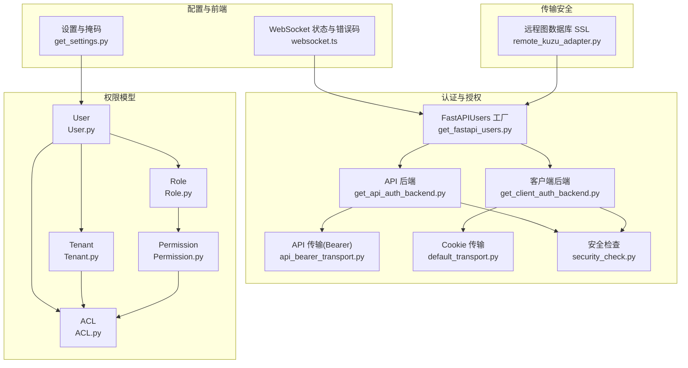
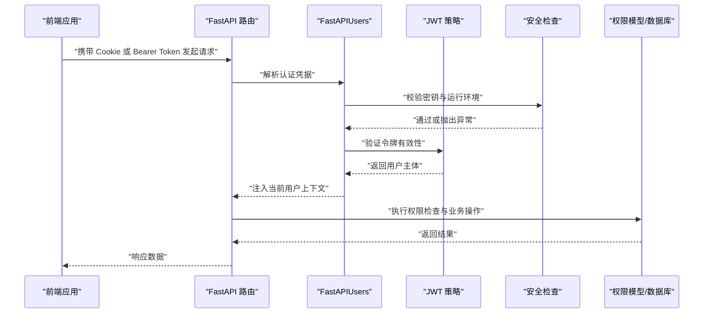
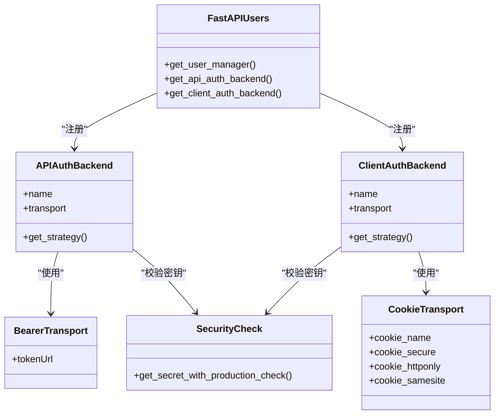
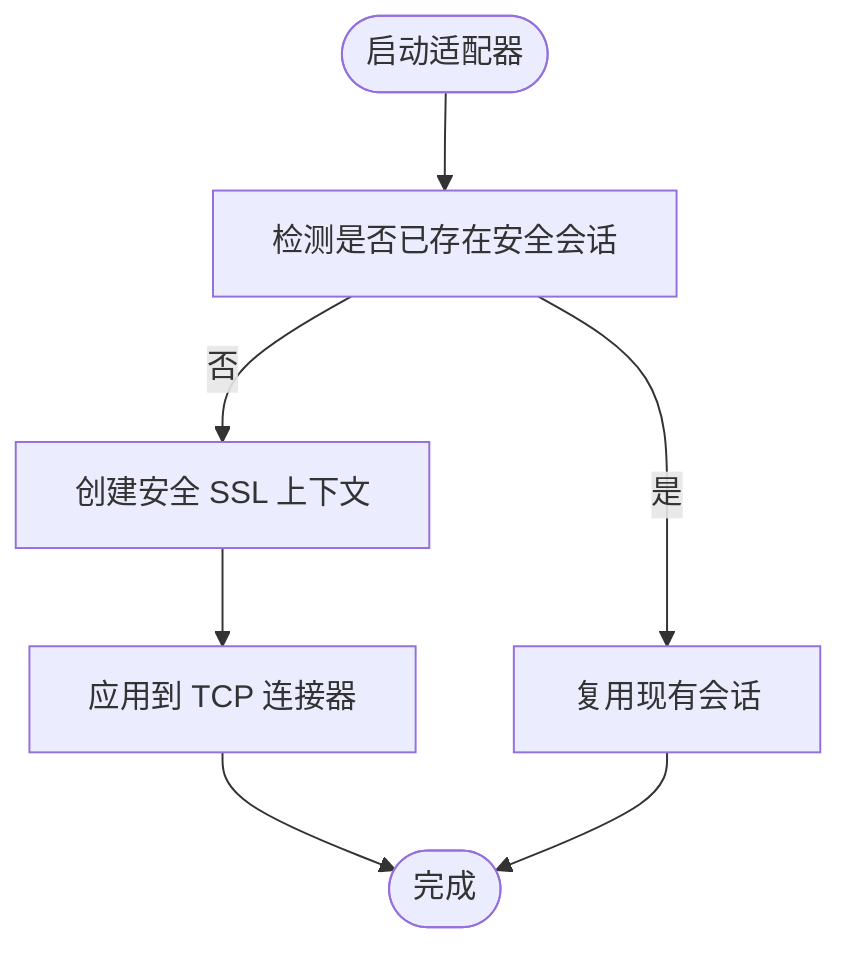
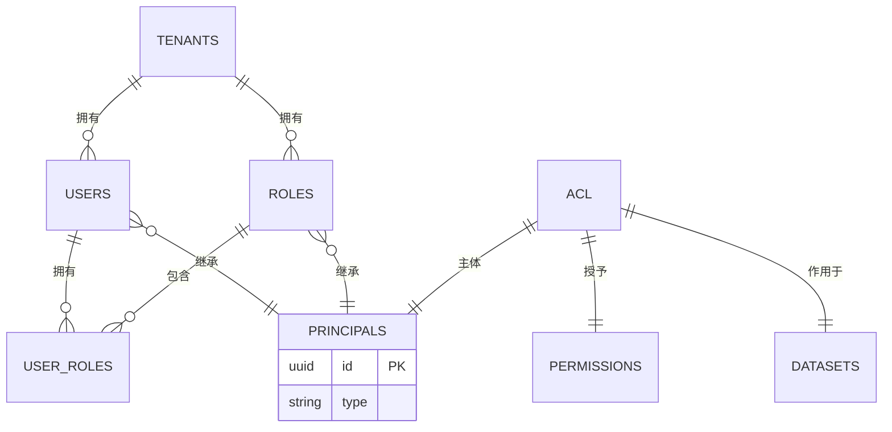
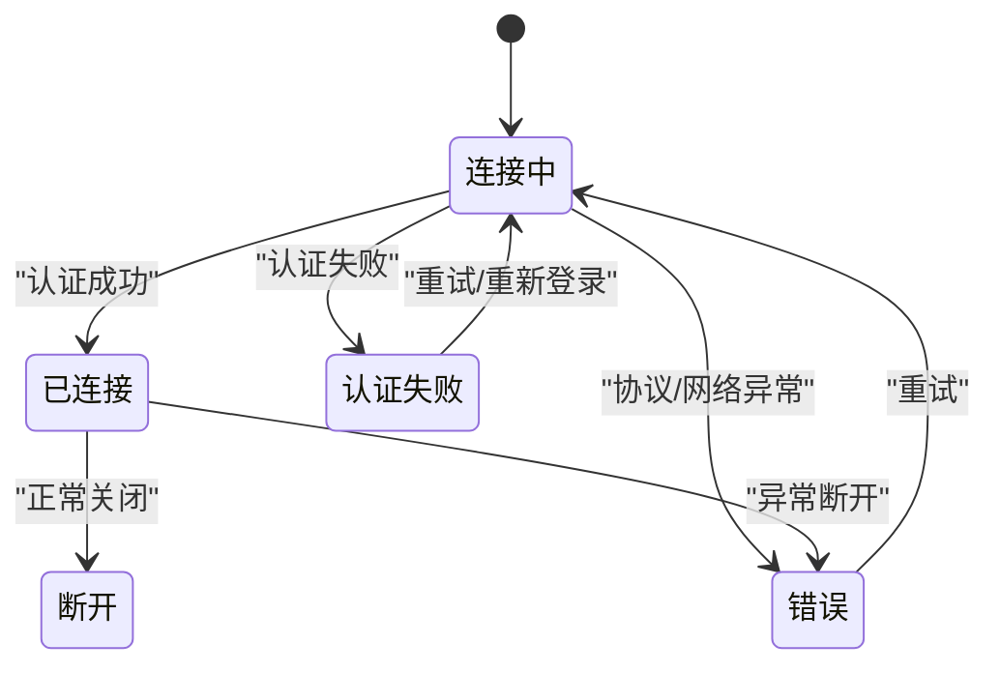
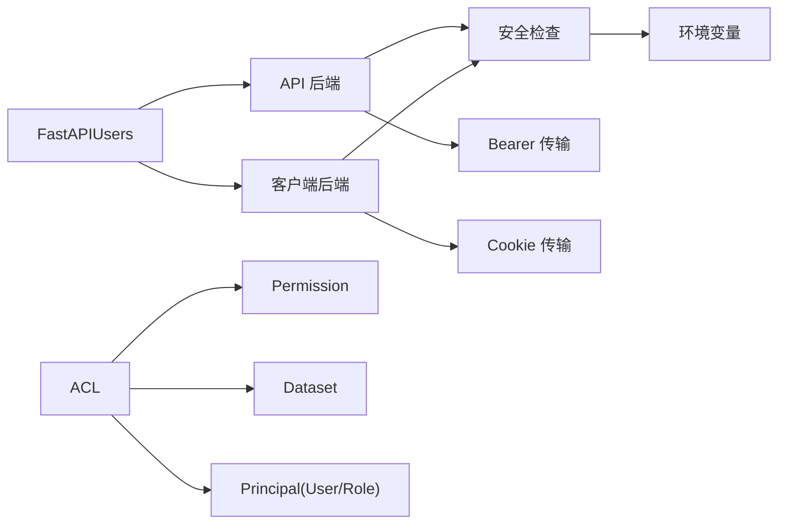

# 安全配置

<cite>
**本文引用的文件**
- [m_flow/auth/authentication/get_api_auth_backend.py](file://m_flow/auth/authentication/get_api_auth_backend.py)
- [m_flow/auth/authentication/get_client_auth_backend.py](file://m_flow/auth/authentication/get_client_auth_backend.py)
- [m_flow/auth/authentication/api_bearer/api_bearer_transport.py](file://m_flow/auth/authentication/api_bearer/api_bearer_transport.py)
- [m_flow/auth/authentication/default/default_transport.py](file://m_flow/auth/authentication/default/default_transport.py)
- [m_flow/auth/security_check.py](file://m_flow/auth/security_check.py)
- [m_flow/auth/get_fastapi_users.py](file://m_flow/auth/get_fastapi_users.py)
- [m_flow/auth/models/User.py](file://m_flow/auth/models/User.py)
- [m_flow/auth/models/Role.py](file://m_flow/auth/models/Role.py)
- [m_flow/auth/models/Tenant.py](file://m_flow/auth/models/Tenant.py)
- [m_flow/auth/models/Permission.py](file://m_flow/auth/models/Permission.py)
- [m_flow/auth/models/ACL.py](file://m_flow/auth/models/ACL.py)
- [m_flow/auth/permissions/methods/__init__.py](file://m_flow/auth/permissions/methods/__init__.py)
- [m_flow/auth/permissions/permission_types.py](file://m_flow/auth/permissions/permission_types.py)
- [m_flow/config/settings/get_settings.py](file://m_flow/config/settings/get_settings.py)
- [m_flow/adapters/graph/kuzu/remote_kuzu_adapter.py](file://m_flow/adapters/graph/kuzu/remote_kuzu_adapter.py)
- [m_flow-frontend/src/lib/api/websocket.ts](file://m_flow-frontend/src/lib/api/websocket.ts)
</cite>

## 目录
1. [简介](#简介)
2. [项目结构](#项目结构)
3. [核心组件](#核心组件)
4. [架构总览](#架构总览)
5. [详细组件分析](#详细组件分析)
6. [依赖分析](#依赖分析)
7. [性能考虑](#性能考虑)
8. [故障排查指南](#故障排查指南)
9. [结论](#结论)
10. [附录](#附录)

## 简介
本指南面向 M-flow 的安全配置与运维实践，围绕身份认证与授权（RBAC）、API 密钥与令牌管理、OAuth 集成建议、数据加密与传输安全、访问控制与权限管理、网络安全配置、安全审计与合规、敏感信息存储与轮换、漏洞扫描与修复流程以及安全事件响应与应急处理进行系统化说明。文档以仓库中现有实现为依据，结合可扩展的最佳实践，帮助读者建立可落地的安全基线。

## 项目结构
M-flow 的安全相关能力主要分布在以下模块：
- 认证与授权：FastAPI-Users 集成、JWT 策略、API 与客户端双后端、Cookie 传输、安全检查工具
- 权限模型：用户、角色、租户、权限、ACL 关系
- 配置与设置：敏感信息掩码与展示
- 传输安全：远程图数据库适配器的 SSL 上下文
- 前端连接：WebSocket 连接状态与错误码定义

**图表来源**
- [m_flow/auth/get_fastapi_users.py:22-48](file://m_flow/auth/get_fastapi_users.py#L22-L48)
- [m_flow/auth/authentication/get_api_auth_backend.py:22-45](file://m_flow/auth/authentication/get_api_auth_backend.py#L22-L45)
- [m_flow/auth/authentication/get_client_auth_backend.py:22-47](file://m_flow/auth/authentication/get_client_auth_backend.py#L22-L47)
- [m_flow/auth/authentication/api_bearer/api_bearer_transport.py:11-16](file://m_flow/auth/authentication/api_bearer/api_bearer_transport.py#L11-L16)
- [m_flow/auth/authentication/default/default_transport.py:30-36](file://m_flow/auth/authentication/default/default_transport.py#L30-L36)
- [m_flow/auth/security_check.py:19-80](file://m_flow/auth/security_check.py#L19-L80)
- [m_flow/auth/models/User.py:25-63](file://m_flow/auth/models/User.py#L25-L63)
- [m_flow/auth/models/Role.py:18-47](file://m_flow/auth/models/Role.py#L18-L47)
- [m_flow/auth/models/Tenant.py:24-73](file://m_flow/auth/models/Tenant.py#L24-L73)
- [m_flow/auth/models/Permission.py:20-30](file://m_flow/auth/models/Permission.py#L20-L30)
- [m_flow/auth/models/ACL.py:21-37](file://m_flow/auth/models/ACL.py#L21-L37)
- [m_flow/config/settings/get_settings.py:123-151](file://m_flow/config/settings/get_settings.py#L123-L151)
- [m_flow-frontend/src/lib/api/websocket.ts:37-65](file://m_flow-frontend/src/lib/api/websocket.ts#L37-L65)
- [m_flow/adapters/graph/kuzu/remote_kuzu_adapter.py:120-126](file://m_flow/adapters/graph/kuzu/remote_kuzu_adapter.py#L120-L126)

**章节来源**
- [m_flow/auth/get_fastapi_users.py:22-48](file://m_flow/auth/get_fastapi_users.py#L22-L48)
- [m_flow/auth/authentication/get_api_auth_backend.py:22-45](file://m_flow/auth/authentication/get_api_auth_backend.py#L22-L45)
- [m_flow/auth/authentication/get_client_auth_backend.py:22-47](file://m_flow/auth/authentication/get_client_auth_backend.py#L22-L47)
- [m_flow/auth/authentication/api_bearer/api_bearer_transport.py:11-16](file://m_flow/auth/authentication/api_bearer/api_bearer_transport.py#L11-L16)
- [m_flow/auth/authentication/default/default_transport.py:30-36](file://m_flow/auth/authentication/default/default_transport.py#L30-L36)
- [m_flow/auth/security_check.py:19-80](file://m_flow/auth/security_check.py#L19-L80)
- [m_flow/auth/models/User.py:25-63](file://m_flow/auth/models/User.py#L25-L63)
- [m_flow/auth/models/Role.py:18-47](file://m_flow/auth/models/Role.py#L18-L47)
- [m_flow/auth/models/Tenant.py:24-73](file://m_flow/auth/models/Tenant.py#L24-L73)
- [m_flow/auth/models/Permission.py:20-30](file://m_flow/auth/models/Permission.py#L20-L30)
- [m_flow/auth/models/ACL.py:21-37](file://m_flow/auth/models/ACL.py#L21-L37)
- [m_flow/config/settings/get_settings.py:123-151](file://m_flow/config/settings/get_settings.py#L123-L151)
- [m_flow-frontend/src/lib/api/websocket.ts:37-65](file://m_flow-frontend/src/lib/api/websocket.ts#L37-L65)
- [m_flow/adapters/graph/kuzu/remote_kuzu_adapter.py:120-126](file://m_flow/adapters/graph/kuzu/remote_kuzu_adapter.py#L120-L126)

## 核心组件
- 双后端认证体系：同时支持 API Bearer Token 与 Web Cookie 两种认证方式，分别用于服务到服务调用与浏览器会话管理。
- RBAC 权限模型：基于用户、角色、租户、权限与 ACL 的多层关系，实现细粒度的数据访问控制。
- 安全启动检查：在非开发环境强制要求配置关键密钥，避免默认密钥泄露风险。
- 传输安全：远程图数据库适配器使用安全 SSL 上下文，确保跨服务通信加密。
- 设置与敏感信息掩码：在管理界面中对敏感配置进行部分掩码显示，降低误泄露风险。

**章节来源**
- [m_flow/auth/get_fastapi_users.py:22-48](file://m_flow/auth/get_fastapi_users.py#L22-L48)
- [m_flow/auth/authentication/get_api_auth_backend.py:22-45](file://m_flow/auth/authentication/get_api_auth_backend.py#L22-L45)
- [m_flow/auth/authentication/get_client_auth_backend.py:22-47](file://m_flow/auth/authentication/get_client_auth_backend.py#L22-L47)
- [m_flow/auth/security_check.py:19-80](file://m_flow/auth/security_check.py#L19-L80)
- [m_flow/auth/models/User.py:25-63](file://m_flow/auth/models/User.py#L25-L63)
- [m_flow/auth/models/Role.py:18-47](file://m_flow/auth/models/Role.py#L18-L47)
- [m_flow/auth/models/Tenant.py:24-73](file://m_flow/auth/models/Tenant.py#L24-L73)
- [m_flow/auth/models/Permission.py:20-30](file://m_flow/auth/models/Permission.py#L20-L30)
- [m_flow/auth/models/ACL.py:21-37](file://m_flow/auth/models/ACL.py#L21-L37)
- [m_flow/adapters/graph/kuzu/remote_kuzu_adapter.py:120-126](file://m_flow/adapters/graph/kuzu/remote_kuzu_adapter.py#L120-L126)
- [m_flow/config/settings/get_settings.py:123-151](file://m_flow/config/settings/get_settings.py#L123-L151)

## 架构总览
下图展示了认证与授权的整体交互：前端通过 Cookie 或 Bearer Token 访问后端；后端使用 FastAPI-Users 管理用户生命周期与认证策略；权限检查贯穿数据访问路径；远程图数据库适配器在客户端侧启用 SSL 加密。

**图表来源**
- [m_flow/auth/get_fastapi_users.py:22-48](file://m_flow/auth/get_fastapi_users.py#L22-L48)
- [m_flow/auth/authentication/get_api_auth_backend.py:22-45](file://m_flow/auth/authentication/get_api_auth_backend.py#L22-L45)
- [m_flow/auth/authentication/get_client_auth_backend.py:22-47](file://m_flow/auth/authentication/get_client_auth_backend.py#L22-L47)
- [m_flow/auth/security_check.py:19-80](file://m_flow/auth/security_check.py#L19-L80)
- [m_flow/auth/models/ACL.py:21-37](file://m_flow/auth/models/ACL.py#L21-L37)

## 详细组件分析

### 身份认证与授权机制
- 双后端设计
  - API 后端：使用 Bearer 传输，令牌有效期较长，适用于服务间调用。
  - 客户端后端：使用 Cookie 传输，支持 SameSite/Lax、HttpOnly 等安全属性，默认不启用 HTTPS，生产需开启。
- JWT 策略与密钥管理
  - 使用统一的 JWT Secret 环境变量，非开发环境必须显式配置，否则启动即报错。
  - 提供启动时的安全检查函数，避免默认密钥在生产暴露。
- FastAPI-Users 集成
  - 工厂函数构建单例实例，注册 API 与客户端双后端，集中管理用户与认证。

**图表来源**
- [m_flow/auth/get_fastapi_users.py:22-48](file://m_flow/auth/get_fastapi_users.py#L22-L48)
- [m_flow/auth/authentication/get_api_auth_backend.py:22-45](file://m_flow/auth/authentication/get_api_auth_backend.py#L22-L45)
- [m_flow/auth/authentication/get_client_auth_backend.py:22-47](file://m_flow/auth/authentication/get_client_auth_backend.py#L22-L47)
- [m_flow/auth/authentication/api_bearer/api_bearer_transport.py:11-16](file://m_flow/auth/authentication/api_bearer/api_bearer_transport.py#L11-L16)
- [m_flow/auth/authentication/default/default_transport.py:30-36](file://m_flow/auth/authentication/default/default_transport.py#L30-L36)
- [m_flow/auth/security_check.py:19-80](file://m_flow/auth/security_check.py#L19-L80)

**章节来源**
- [m_flow/auth/get_fastapi_users.py:22-48](file://m_flow/auth/get_fastapi_users.py#L22-L48)
- [m_flow/auth/authentication/get_api_auth_backend.py:22-45](file://m_flow/auth/authentication/get_api_auth_backend.py#L22-L45)
- [m_flow/auth/authentication/get_client_auth_backend.py:22-47](file://m_flow/auth/authentication/get_client_auth_backend.py#L22-L47)
- [m_flow/auth/authentication/api_bearer/api_bearer_transport.py:11-16](file://m_flow/auth/authentication/api_bearer/api_bearer_transport.py#L11-L16)
- [m_flow/auth/authentication/default/default_transport.py:30-36](file://m_flow/auth/authentication/default/default_transport.py#L30-L36)
- [m_flow/auth/security_check.py:19-80](file://m_flow/auth/security_check.py#L19-L80)

### 数据加密与传输安全
- HTTPS 与 SSL
  - Cookie 传输默认未启用 HTTPS，生产环境应将 secure 属性设为 true，并配合反向代理或网关启用 TLS。
  - 远程图数据库适配器在客户端侧创建安全 SSL 上下文，确保与远端服务的加密通信。
- 建议
  - 在反向代理层统一终止 TLS，后端服务内部可使用 HTTP。
  - 对所有外部服务调用强制启用 TLS，并校验证书链与主机名。

**图表来源**
- [m_flow/adapters/graph/kuzu/remote_kuzu_adapter.py:120-126](file://m_flow/adapters/graph/kuzu/remote_kuzu_adapter.py#L120-L126)

**章节来源**
- [m_flow/auth/authentication/default/default_transport.py:30-36](file://m_flow/auth/authentication/default/default_transport.py#L30-L36)
- [m_flow/adapters/graph/kuzu/remote_kuzu_adapter.py:120-126](file://m_flow/adapters/graph/kuzu/remote_kuzu_adapter.py#L120-L126)

### 访问控制与权限管理（RBAC）
- 模型关系
  - 用户、角色、租户、权限、ACL 形成多对多与外键约束，支持按租户隔离与按数据集授权。
- 权限类型
  - 支持读、写、删、共享等基础权限类型，可扩展至更细粒度。
- 授权流程
  - 通过 ACL 将“主体（用户/角色）”与“权限”绑定到“数据集”，查询时先做权限校验再放行。

**图表来源**
- [m_flow/auth/models/User.py:25-63](file://m_flow/auth/models/User.py#L25-L63)
- [m_flow/auth/models/Role.py:18-47](file://m_flow/auth/models/Role.py#L18-L47)
- [m_flow/auth/models/Tenant.py:24-73](file://m_flow/auth/models/Tenant.py#L24-L73)
- [m_flow/auth/models/Permission.py:20-30](file://m_flow/auth/models/Permission.py#L20-L30)
- [m_flow/auth/models/ACL.py:21-37](file://m_flow/auth/models/ACL.py#L21-L37)

**章节来源**
- [m_flow/auth/models/User.py:25-63](file://m_flow/auth/models/User.py#L25-L63)
- [m_flow/auth/models/Role.py:18-47](file://m_flow/auth/models/Role.py#L18-L47)
- [m_flow/auth/models/Tenant.py:24-73](file://m_flow/auth/models/Tenant.py#L24-L73)
- [m_flow/auth/models/Permission.py:20-30](file://m_flow/auth/models/Permission.py#L20-L30)
- [m_flow/auth/models/ACL.py:21-37](file://m_flow/auth/models/ACL.py#L21-L37)
- [m_flow/auth/permissions/methods/__init__.py:9-35](file://m_flow/auth/permissions/methods/__init__.py#L9-L35)
- [m_flow/auth/permissions/permission_types.py](file://m_flow/auth/permissions/permission_types.py#L7)

### API 端点权限与数据访问控制
- 端点权限
  - 基于 FastAPI-Users 的路由装饰器与权限检查函数，对每个端点进行认证与授权。
- 数据访问控制
  - 在数据读取/写入前，通过“主体-权限-数据集”的 ACL 过滤，仅允许具备相应权限的用户访问目标数据集。
- 建议
  - 对高风险端点（删除、共享）采用更严格的权限与审计日志。
  - 引入最小权限原则，避免一次性授予过多权限。

**章节来源**
- [m_flow/auth/permissions/methods/__init__.py:9-35](file://m_flow/auth/permissions/methods/__init__.py#L9-L35)
- [m_flow/auth/models/ACL.py:21-37](file://m_flow/auth/models/ACL.py#L21-L37)

### 网络安全配置
- Cookie 安全属性
  - HttpOnly、SameSite=Lax、Domain=localhost；生产需根据部署域名调整并启用 Secure。
- 端口与服务暴露
  - 建议通过反向代理暴露 443/TLS，后端服务使用内网 HTTP；限制入站端口范围。
- 防火墙与隔离
  - 将数据库、缓存、图数据库与计算节点分段隔离，仅开放必要端口。

**章节来源**
- [m_flow/auth/authentication/default/default_transport.py:30-36](file://m_flow/auth/authentication/default/default_transport.py#L30-L36)

### 安全审计与合规
- 日志与追踪
  - 在认证失败、权限拒绝、敏感操作等关键事件记录审计日志。
- 合规检查清单
  - 密钥轮换、最小权限、传输加密、访问日志、定期渗透测试、第三方组件漏洞扫描。

[本节为通用指导，无需特定文件引用]

### 敏感信息的安全存储与管理
- 密钥与配置
  - 使用环境变量注入密钥；非开发环境必须配置，避免默认值。
  - 在管理界面中对敏感字段进行掩码展示，防止无意泄露。
- 凭据管理与轮换
  - 建立密钥轮换流程，更新后滚动重启服务，确保新旧密钥过渡期平滑。
- 建议
  - 使用密钥管理服务（KMS）或配置中心，启用访问控制与审计。

**章节来源**
- [m_flow/auth/security_check.py:19-80](file://m_flow/auth/security_check.py#L19-L80)
- [m_flow/config/settings/get_settings.py:111-117](file://m_flow/config/settings/get_settings.py#L111-L117)

### 安全漏洞扫描与修复流程
- 扫描
  - 代码静态分析（Secrets 暴露、硬编码密钥）、依赖漏洞扫描（SAST/DAST）、容器镜像扫描。
- 修复
  - 建立补丁发布流程，优先修复高危漏洞；对不可立即修复的问题制定缓解措施与时间表。
- 回归
  - 修复后回归测试与安全验证，确保功能与安全均稳定。

[本节为通用指导，无需特定文件引用]

### 安全事件响应与应急处理
- 响应流程
  - 事件发现 → 分类分级 → 隔离影响面 → 修复与回滚 → 复盘与改进。
- 前端 WebSocket 连接
  - 定义连接状态与错误码，便于前端感知认证失败等异常并提示用户重新登录。

**图表来源**
- [m_flow-frontend/src/lib/api/websocket.ts:37-65](file://m_flow-frontend/src/lib/api/websocket.ts#L37-L65)

**章节来源**
- [m_flow-frontend/src/lib/api/websocket.ts:37-65](file://m_flow-frontend/src/lib/api/websocket.ts#L37-L65)

## 依赖分析
- 组件耦合
  - FastAPI-Users 作为认证中枢，依赖两个认证后端；两个后端均依赖安全检查模块。
  - 权限模型通过关系映射形成清晰的依赖链，ACL 是权限生效的关键点。
- 外部依赖
  - FastAPI-Users、SQLAlchemy、aiohttp 等；需关注其安全公告与版本升级。
- 循环依赖
  - 当前结构未见循环导入；权限方法导出聚合在 __init__.py 中，便于上层统一引用。

**图表来源**
- [m_flow/auth/get_fastapi_users.py:22-48](file://m_flow/auth/get_fastapi_users.py#L22-L48)
- [m_flow/auth/authentication/get_api_auth_backend.py:22-45](file://m_flow/auth/authentication/get_api_auth_backend.py#L22-L45)
- [m_flow/auth/authentication/get_client_auth_backend.py:22-47](file://m_flow/auth/authentication/get_client_auth_backend.py#L22-L47)
- [m_flow/auth/security_check.py:19-80](file://m_flow/auth/security_check.py#L19-L80)
- [m_flow/auth/models/ACL.py:21-37](file://m_flow/auth/models/ACL.py#L21-L37)

**章节来源**
- [m_flow/auth/get_fastapi_users.py:22-48](file://m_flow/auth/get_fastapi_users.py#L22-L48)
- [m_flow/auth/models/ACL.py:21-37](file://m_flow/auth/models/ACL.py#L21-L37)

## 性能考虑
- 认证性能
  - 使用 LRU 缓存的后端工厂减少重复初始化成本；合理设置令牌有效期平衡安全与性能。
- 权限检查
  - 在高频查询路径中缓存权限结果，避免重复数据库查询；对热点数据集建立索引。
- 传输安全
  - SSL 握手开销较大，建议在反向代理层复用连接与会话；对长连接场景启用 ALPN 与会话复用。

[本节为通用指导，无需特定文件引用]

## 故障排查指南
- 启动时报密钥未配置
  - 现象：非开发环境启动即报错。
  - 处理：设置 JWT Secret 环境变量；确认运行环境变量正确。
- Cookie 无法持久化或跨域问题
  - 现象：登录后页面刷新丢失会话。
  - 处理：检查 Cookie 域名、Secure、SameSite 设置；确保前端与后端域名一致。
- 权限拒绝
  - 现象：访问数据集返回 403。
  - 处理：确认用户是否被授予相应 ACL；检查租户隔离与数据集归属。
- WebSocket 认证失败
  - 现象：连接状态为认证失败。
  - 处理：检查前端携带的令牌或 Cookie 是否有效；确认后端认证后端配置。

**章节来源**
- [m_flow/auth/security_check.py:65-79](file://m_flow/auth/security_check.py#L65-L79)
- [m_flow/auth/authentication/default/default_transport.py:30-36](file://m_flow/auth/authentication/default/default_transport.py#L30-L36)
- [m_flow-frontend/src/lib/api/websocket.ts:37-65](file://m_flow-frontend/src/lib/api/websocket.ts#L37-L65)

## 结论
M-flow 的安全基线已在认证与授权、RBAC 权限模型、启动安全检查与传输加密等方面形成完整闭环。建议在生产环境中补齐 HTTPS、严格的 Cookie 安全属性、完善的审计与合规流程，并建立密钥轮换与漏洞修复的标准化流程，持续提升整体安全水平。

## 附录
- OAuth 集成建议
  - 使用 FastAPI-Users 的 OAuth 后端扩展，结合自定义用户管理器实现第三方登录与用户同步。
- API 密钥配置
  - 为不同客户端颁发独立 API Key，结合速率限制与 IP 白名单，定期轮换与撤销。

[本节为通用指导，无需特定文件引用]