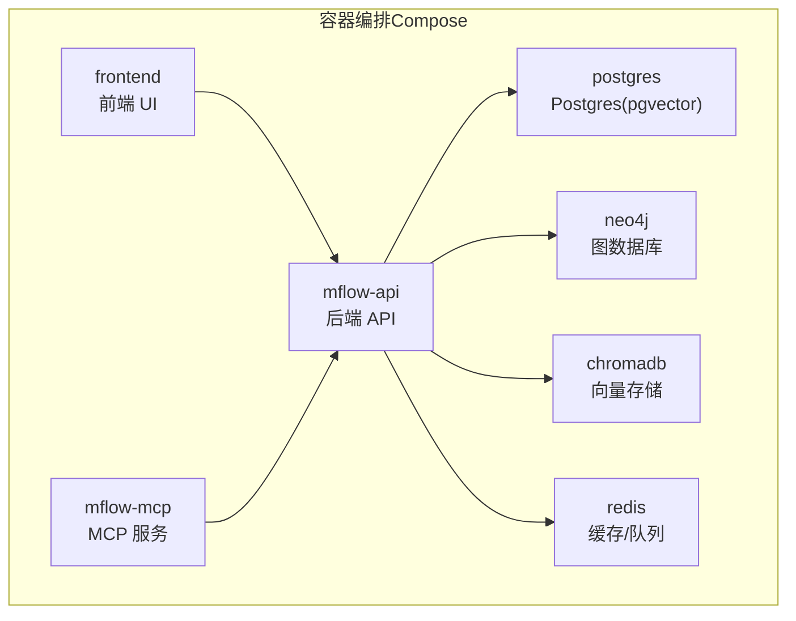
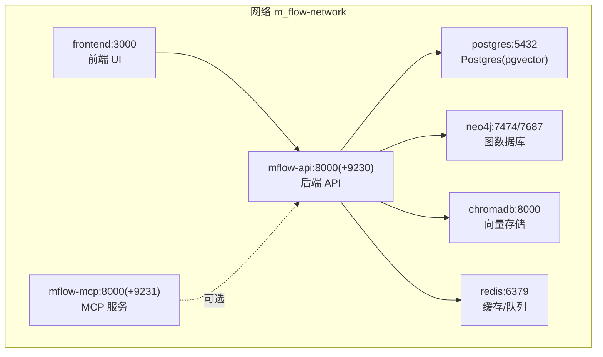
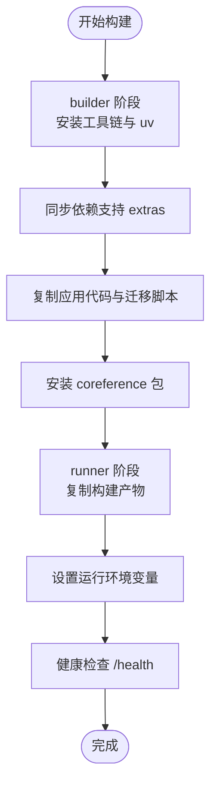
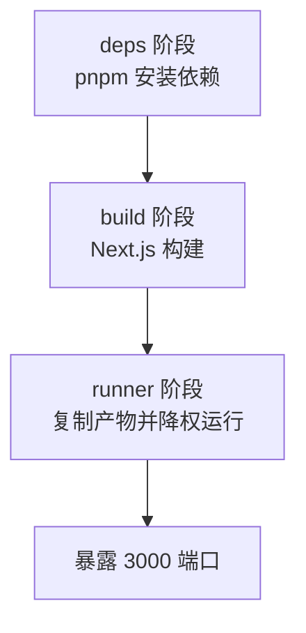
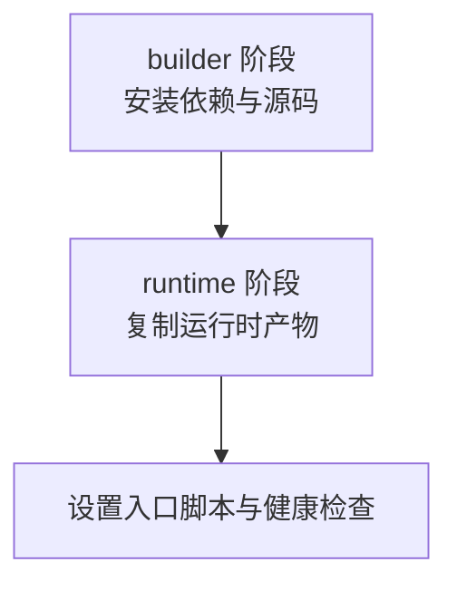
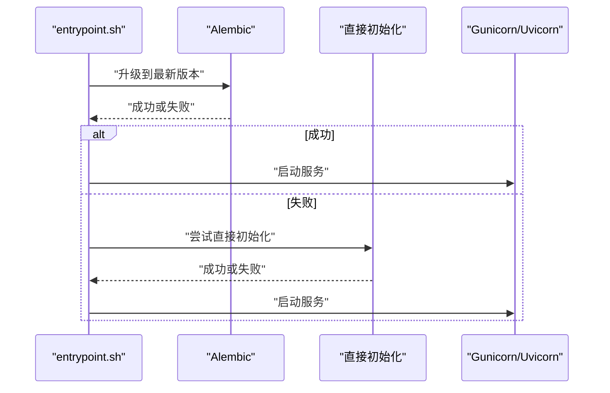
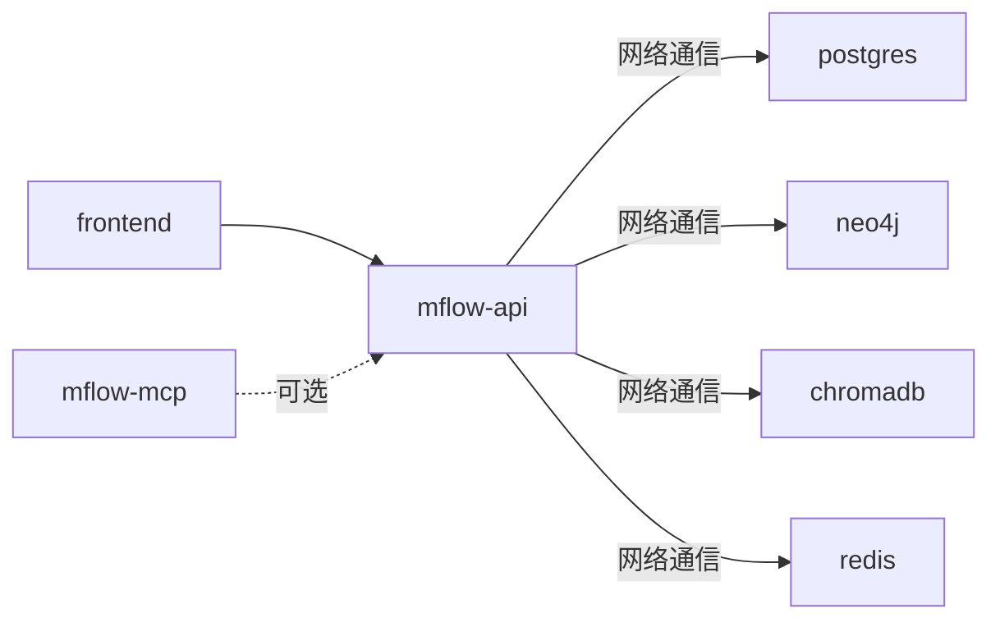
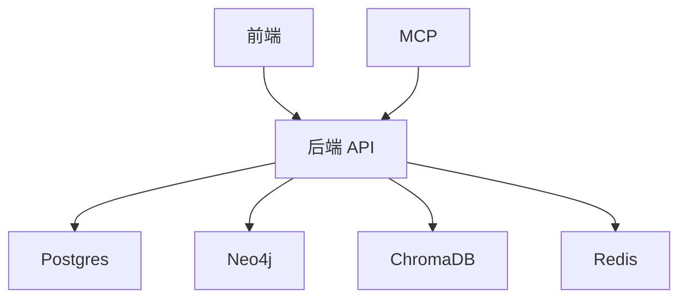

# 容器化部署

<cite>
**本文引用的文件**
- [Dockerfile（后端）](file://Dockerfile)
- [docker-compose.yml](file://docker-compose.yml)
- [entrypoint.sh（后端）](file://entrypoint.sh)
- [Dockerfile（前端）](file://m_flow-frontend/Dockerfile)
- [Dockerfile（MCP 服务）](file://m_flow-mcp/Dockerfile)
- [entrypoint.sh（MCP 服务）](file://m_flow-mcp/entrypoint.sh)
- [docker-compose-helm.yml（Helm 测试用 Compose）](file://deployment/helm/docker-compose-helm.yml)
- [Chart.yaml（Helm Chart 元数据）](file://deployment/helm/Chart.yaml)
- [values.yaml（Helm 值）](file://deployment/helm/values.yaml)
- [pyproject.toml（项目依赖与可选特性）](file://pyproject.toml)
</cite>

## 目录
1. [简介](#简介)
2. [项目结构](#项目结构)
3. [核心组件](#核心组件)
4. [架构总览](#架构总览)
5. [详细组件分析](#详细组件分析)
6. [依赖关系分析](#依赖关系分析)
7. [性能考量](#性能考量)
8. [故障排查指南](#故障排查指南)
9. [结论](#结论)
10. [附录](#附录)

## 简介
本指南面向希望在本地或生产环境中以容器方式部署 M-flow 的工程师与运维人员。内容覆盖：
- Docker 镜像构建：Dockerfile 的分阶段构建、多阶段优化与镜像体积优化策略
- docker-compose 编排：服务定义、网络、卷、环境变量与健康检查
- 容器间依赖与服务发现：通过自定义网络与服务名实现
- 不同部署场景：单机、开发、生产
- 安全配置：用户权限、资源限制、网络安全
- 监控与日志：最佳实践
- 调试与故障排查：远程调试、健康检查、日志定位

## 项目结构
M-flow 的容器化由三部分组成：
- 后端 API 服务：基于多阶段构建的 Python 应用，包含数据库迁移与启动流程
- 前端 UI：Next.js 多阶段构建，独立容器运行
- MCP 服务：模型上下文协议服务，独立容器运行

图表来源
- [docker-compose.yml:17-227](file://docker-compose.yml#L17-L227)

章节来源
- [docker-compose.yml:17-227](file://docker-compose.yml#L17-L227)

## 核心组件
- 后端镜像（Dockerfile）
  - 分两阶段：builder（安装工具链与依赖）、runner（仅运行时）
  - 使用 uv 管理依赖，支持动态 extras 构建
  - 运行时暴露 8000 端口，内置健康检查
- 前端镜像（Dockerfile）
  - 多阶段：deps、build、runner；最终以非 root 用户运行
  - 暴露 3000 端口，使用 standalone 构建产物
- MCP 镜像（Dockerfile）
  - 多阶段：builder（安装依赖与源码）、runtime（最小运行时）
  - 暴露 8000 端口，内置健康检查
- 启动脚本（entrypoint.sh）
  - 自动执行数据库迁移或初始化
  - 根据环境选择 Gunicorn 或 Uvicorn 启动
  - 支持 debugpy 远程调试（开发/本地）

章节来源
- [Dockerfile（后端）:6-90](file://Dockerfile#L6-L90)
- [Dockerfile（前端）:1-40](file://m_flow-frontend/Dockerfile#L1-L40)
- [Dockerfile（MCP 服务）:1-55](file://m_flow-mcp/Dockerfile#L1-L55)
- [entrypoint.sh（后端）:13-79](file://entrypoint.sh#L13-L79)
- [entrypoint.sh（MCP 服务）:15-39](file://m_flow-mcp/entrypoint.sh#L15-L39)

## 架构总览
下图展示容器编排中的服务关系、网络与端口映射。

图表来源
- [docker-compose.yml:17-227](file://docker-compose.yml#L17-L227)

章节来源
- [docker-compose.yml:17-227](file://docker-compose.yml#L17-L227)

## 详细组件分析

### 后端镜像构建（Dockerfile）
- 分阶段构建
  - builder 阶段：安装编译工具链与 uv，同步依赖（支持动态 extras），复制应用代码与迁移脚本，安装 coreference 包
  - runner 阶段：仅保留运行时依赖，拷贝构建产物，设置运行环境变量与健康检查
- 多阶段优化
  - 将编译工具链与依赖安装分离至 builder，避免污染运行时镜像
  - 使用缓存 mount 提升依赖安装速度
- 镜像体积优化
  - 使用 slim-bookworm 基础镜像
  - 仅复制必要文件与虚拟环境产物
  - 清理包管理器缓存
- 运行时配置
  - 暴露 8000 端口
  - 健康检查访问 /health
  - 通过 entrypoint.sh 执行迁移与启动

图表来源
- [Dockerfile（后端）:6-90](file://Dockerfile#L6-L90)

章节来源
- [Dockerfile（后端）:6-90](file://Dockerfile#L6-L90)

### 前端镜像构建（Dockerfile）
- 多阶段
  - deps：安装生产依赖（pnpm）
  - build：复用依赖构建 Next.js 应用
  - runner：仅复制运行所需产物，使用非 root 用户 mflow 运行
- 运行时
  - 暴露 3000 端口，使用 standalone server.js
  - 设置 HOSTNAME 与 PORT

图表来源
- [Dockerfile（前端）:6-40](file://m_flow-frontend/Dockerfile#L6-L40)

章节来源
- [Dockerfile（前端）:6-40](file://m_flow-frontend/Dockerfile#L6-L40)

### MCP 服务镜像构建（Dockerfile）
- 多阶段
  - builder：安装编译工具链，复制 m_flow-mcp 源码与 m_flow 源码，pip 安装
  - runtime：仅复制运行时产物，准备健康检查与入口脚本
- 运行时
  - 暴露 8000 端口，内置健康检查
  - 通过 entrypoint.sh 启动服务或测试客户端

图表来源
- [Dockerfile（MCP 服务）:4-55](file://m_flow-mcp/Dockerfile#L4-L55)

章节来源
- [Dockerfile（MCP 服务）:4-55](file://m_flow-mcp/Dockerfile#L4-L55)

### 启动流程与健康检查（entrypoint.sh）
- 数据库迁移
  - 优先执行 Alembic 升级；若失败则尝试直接初始化
  - 忽略“已存在”类错误（幂等）
- 服务器启动
  - 生产环境：Gunicorn（如可用），否则回退到 Uvicorn
  - 开发/本地：支持 debugpy 远程调试（端口 9230）
- 健康检查
  - 访问 /health 接口判断存活

图表来源
- [entrypoint.sh（后端）:13-79](file://entrypoint.sh#L13-L79)

章节来源
- [entrypoint.sh（后端）:13-79](file://entrypoint.sh#L13-L79)

### Compose 服务编排
- 服务定义
  - mflow-api：后端 API，支持资源限制、健康检查、调试端口映射
  - frontend：Next.js 前端，依赖后端
  - mflow-mcp：MCP 服务，可选启用，端口偏移避免冲突
  - 数据库与中间件：postgres、neo4j、chromadb、redis（按需启用）
- 网络与卷
  - 统一网络 m_flow-network，便于服务间通信
  - 数据持久化卷：neo4j_data、postgres_data、chromadb_data、redis_data
- 环境变量
  - HOST、ENVIRONMENT、LOG_LEVEL、DEBUG 等
  - 数据库连接信息可通过环境变量注入
- 依赖关系
  - frontend 显式 depends_on mflow-api
  - 其他服务通过网络与环境变量进行解耦

图表来源
- [docker-compose.yml:17-227](file://docker-compose.yml#L17-L227)

章节来源
- [docker-compose.yml:17-227](file://docker-compose.yml#L17-L227)

### 不同部署场景的 Compose 配置示例
- 单机部署（仅后端 API）
  - 使用默认 profile，无需额外服务
- 开发环境（后端 + 前端 + 数据库）
  - 使用 --profile ui 启动前端
  - 使用 --profile postgres/neo4j/chromadb/redis 启用对应基础设施
- 生产环境（后端 + 数据库）
  - 仅启用后端与数据库，禁用前端与 MCP
  - 在生产中建议使用 Helm 模板进行部署

章节来源
- [docker-compose.yml:1-10](file://docker-compose.yml#L1-L10)

### 安全配置
- 用户权限
  - 前端 runner 使用非 root 用户 mflow 运行
- 资源限制
  - Compose 中为各服务配置 CPU 与内存上限
- 网络安全
  - 通过自定义网络隔离服务
  - 仅暴露必要端口（8000、3000、5432、7474/7687、8001 等）
- 健康检查
  - 后端与 MCP 均配置健康检查，便于编排层自动重启与就绪探测

章节来源
- [Dockerfile（前端）:28-35](file://m_flow-frontend/Dockerfile#L28-L35)
- [docker-compose.yml:38-47](file://docker-compose.yml#L38-L47)
- [Dockerfile（MCP 服务）:50-51](file://m_flow-mcp/Dockerfile#L50-L51)

### 监控与日志收集
- 日志
  - 后端通过 PYTHONUNBUFFERED=1 输出实时日志
  - 健康检查使用 curl 命令，便于外部监控系统探测
- 观测性
  - 项目提供可选 monitoring 组件（见 pyproject.toml），可用于集成 Sentry、Langfuse 等
- 建议
  - 在生产中结合日志收集系统（如 Fluent Bit/Fluentd）统一采集容器日志
  - 对关键服务开启健康检查与存活探针

章节来源
- [entrypoint.sh（后端）:80-82](file://entrypoint.sh#L80-L82)
- [pyproject.toml:184-185](file://pyproject.toml#L184-L185)

### 调试与故障排查
- 远程调试
  - 后端：设置 DEBUG=true 并映射调试端口 9230
  - MCP：设置 DEBUG=true 并映射调试端口 9231
- 健康检查
  - 使用 compose 内置健康检查或 curl 命令验证 /health
- 日志定位
  - 查看容器日志输出，关注迁移阶段与启动阶段的日志
  - 若迁移失败，检查数据库连接与权限

章节来源
- [docker-compose.yml:30-35](file://docker-compose.yml#L30-L35)
- [docker-compose.yml:76-77](file://docker-compose.yml#L76-L77)
- [entrypoint.sh（后端）:68-78](file://entrypoint.sh#L68-L78)

## 依赖关系分析
- 服务内聚与耦合
  - 后端 API 是核心，依赖数据库、图数据库、向量存储与缓存
  - 前端通过网络访问后端 API
  - MCP 作为可选服务，与后端共享配置
- 外部依赖
  - 数据库：Postgres(pgvector)、Neo4j、ChromaDB、Redis
- 可能的循环依赖
  - 无直接循环依赖；通过网络与环境变量解耦

图表来源
- [docker-compose.yml:17-227](file://docker-compose.yml#L17-L227)

章节来源
- [docker-compose.yml:17-227](file://docker-compose.yml#L17-L227)

## 性能考量
- 镜像构建
  - 使用缓存 mount 与分层策略减少重复安装时间
  - slim 基础镜像降低镜像体积与扫描时间
- 运行时
  - 合理设置 CPU 与内存上限，避免资源争抢
  - 使用 Gunicorn 提升并发处理能力（在可用时）
- 存储
  - 为数据库与向量存储配置持久化卷，确保数据安全与性能

章节来源
- [Dockerfile（后端）:29-53](file://Dockerfile#L29-L53)
- [docker-compose.yml:38-47](file://docker-compose.yml#L38-L47)

## 故障排查指南
- 启动失败
  - 检查迁移日志与数据库连接
  - 确认环境变量与卷挂载正确
- 端口冲突
  - 修改映射端口或停止占用进程
- 资源不足
  - 调整 compose 中的资源限制
- 健康检查失败
  - 使用 curl 访问 /health 排查后端状态

章节来源
- [entrypoint.sh（后端）:13-35](file://entrypoint.sh#L13-L35)
- [docker-compose.yml:43-47](file://docker-compose.yml#L43-L47)

## 结论
通过多阶段 Dockerfile 与 Compose 编排，M-flow 实现了清晰的服务边界、可扩展的部署形态与良好的可观测性。建议在开发环境启用完整栈，在生产环境精简服务并配合 Helm 进行标准化部署。

## 附录
- Helm 部署参考
  - Helm Chart 元数据与 values 示例用于本地联调
  - 生产部署建议直接使用 Helm 模板而非 Compose

章节来源
- [Chart.yaml（Helm Chart 元数据）:1-7](file://deployment/helm/Chart.yaml#L1-L7)
- [values.yaml（Helm 值）:1-23](file://deployment/helm/values.yaml#L1-L23)
- [docker-compose-helm.yml（Helm 测试用 Compose）:1-42](file://deployment/helm/docker-compose-helm.yml#L1-L42)