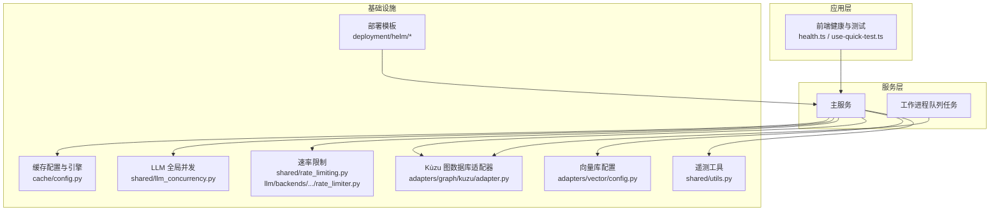
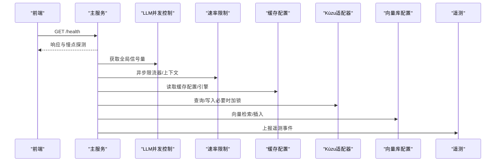
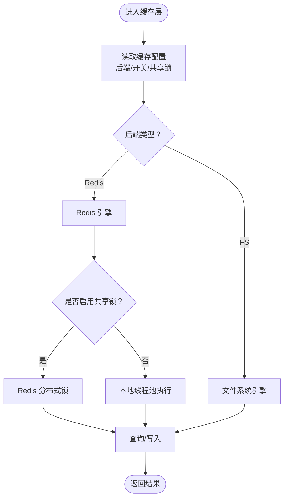
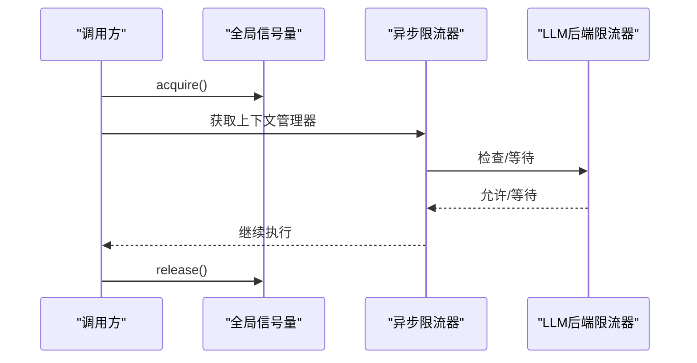
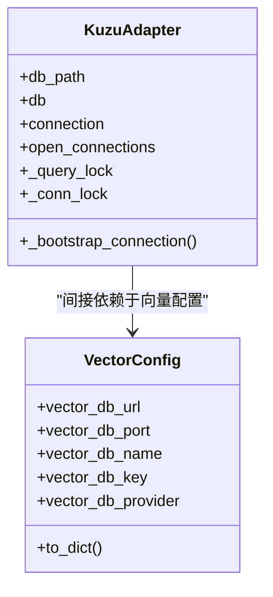
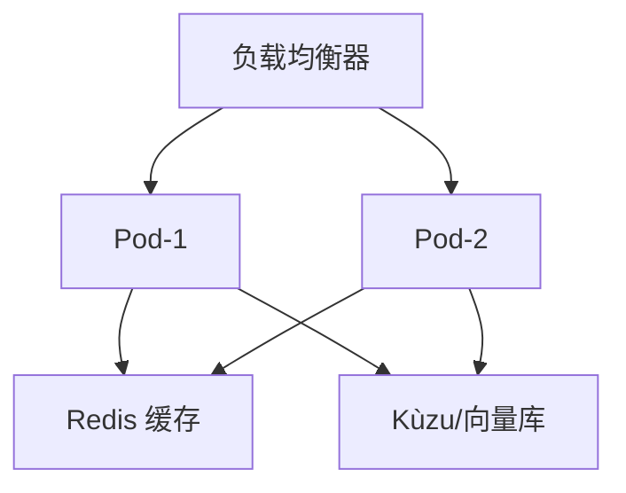
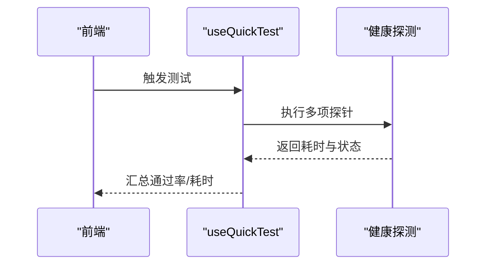
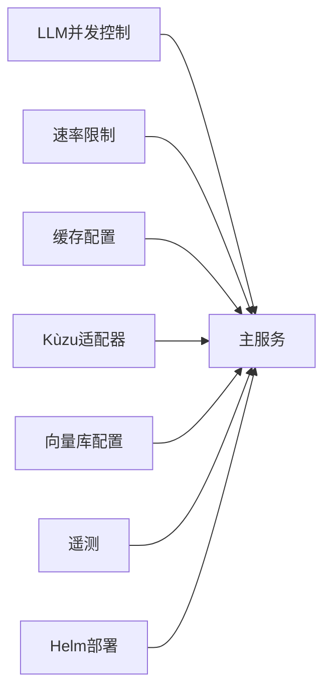

# 性能调优

<cite>
**本文引用的文件**   
- [m_flow/adapters/cache/config.py](file://m_flow/adapters/cache/config.py)
- [m_flow/shared/llm_concurrency.py](file://m_flow/shared/llm_concurrency.py)
- [m_flow/shared/rate_limiting.py](file://m_flow/shared/rate_limiting.py)
- [m_flow/llm/backends/litellm_instructor/llm/rate_limiter.py](file://m_flow/llm/backends/litellm_instructor/llm/rate_limiter.py)
- [m_flow/adapters/graph/kuzu/adapter.py](file://m_flow/adapters/graph/kuzu/adapter.py)
- [m_flow/shared/utils.py](file://m_flow/shared/utils.py)
- [m_flow/config/settings/get_settings.py](file://m_flow/config/settings/get_settings.py)
- [m_flow/adapters/vector/config.py](file://m_flow/adapters/vector/config.py)
- [m_flow/tests/unit/infrastructure/databases/test_cache_config.py](file://m_flow/tests/unit/infrastructure/databases/test_cache_config.py)
- [m_flow/tests/unit/infrastructure/test_rate_limiting_realistic.py](file://m_flow/tests/unit/infrastructure/test_rate_limiting_realistic.py)
- [m_flow/tests/unit/infrastructure/databases/cache/test_cache_config.py](file://m_flow/tests/unit/infrastructure/databases/cache/test_cache_config.py)
- [m_flow/eval/report.py](file://m_flow/eval/report.py)
- [mflow_workers/tasks/queued_add_memory_nodes.py](file://mflow_workers/tasks/queued_add_memory_nodes.py)
- [deployment/helm/templates/m_flow_deployment.yaml](file://deployment/helm/templates/m_flow_deployment.yaml)
- [deployment/helm/templates/m_flow_service.yaml](file://deployment/helm/templates/m_flow_service.yaml)
- [m_flow-frontend/src/lib/utils/health.ts](file://m_flow-frontend/src/lib/utils/health.ts)
- [m_flow-frontend/src/hooks/use-quick-test.ts](file://m_flow-frontend/src/hooks/use-quick-test.ts)
</cite>

## 目录
1. [简介](#简介)
2. [项目结构](#项目结构)
3. [核心组件](#核心组件)
4. [架构总览](#架构总览)
5. [详细组件分析](#详细组件分析)
6. [依赖分析](#依赖分析)
7. [性能考量](#性能考量)
8. [故障排查指南](#故障排查指南)
9. [结论](#结论)
10. [附录](#附录)

## 简介
本指南聚焦于 M-flow 的性能调优实践，围绕以下目标展开：系统性能监控指标识别与分析（响应时间、吞吐量、资源利用率、错误率）、缓存策略配置与优化（多层缓存、失效与命中率）、数据库性能调优（索引、查询、连接池）、LLM 并发与速率限制、内存与 GC 优化、网络延迟与 CDN、负载均衡与水平扩展、性能与基准测试流程、以及瓶颈识别与解决技巧。文档以仓库现有实现为依据，结合可操作的配置项与运行时行为，帮助读者在生产环境中稳定提升性能。

## 项目结构
M-flow 的性能相关能力主要分布在如下模块：
- 缓存子系统：适配器层提供 Redis 与文件系统两种后端，支持分布式锁与进程内缓存开关
- LLM 并发与限流：全局信号量控制并发，异步限流器与装饰器用于请求节流与自动重试
- 数据库与向量库：Kùzu 图数据库连接与锁、向量库配置（LanceDB/PGVector 等）
- 遥测与可视化：遥测上报、可视化服务器、前端健康探测与快速测试钩子
- 部署与扩缩容：Helm 模板定义副本数、CPU/内存资源限制
- 测试与评估：单元测试覆盖缓存配置与限流行为；评估报告统计失败样本与回归

图表来源
- [m_flow/adapters/cache/config.py:1-89](file://m_flow/adapters/cache/config.py#L1-L89)
- [m_flow/shared/llm_concurrency.py:1-46](file://m_flow/shared/llm_concurrency.py#L1-L46)
- [m_flow/shared/rate_limiting.py:1-59](file://m_flow/shared/rate_limiting.py#L1-L59)
- [m_flow/llm/backends/litellm_instructor/llm/rate_limiter.py:1-251](file://m_flow/llm/backends/litellm_instructor/llm/rate_limiter.py#L1-L251)
- [m_flow/adapters/graph/kuzu/adapter.py:150-1763](file://m_flow/adapters/graph/kuzu/adapter.py#L150-L1763)
- [m_flow/adapters/vector/config.py:1-77](file://m_flow/adapters/vector/config.py#L1-L77)
- [m_flow/shared/utils.py:1-226](file://m_flow/shared/utils.py#L1-L226)
- [deployment/helm/templates/m_flow_deployment.yaml:1-32](file://deployment/helm/templates/m_flow_deployment.yaml#L1-L32)
- [m_flow-frontend/src/lib/utils/health.ts:235-289](file://m_flow-frontend/src/lib/utils/health.ts#L235-L289)
- [mflow_workers/tasks/queued_add_memory_nodes.py:1-13](file://mflow_workers/tasks/queued_add_memory_nodes.py#L1-L13)

章节来源
- [m_flow/adapters/cache/config.py:1-89](file://m_flow/adapters/cache/config.py#L1-L89)
- [m_flow/shared/llm_concurrency.py:1-46](file://m_flow/shared/llm_concurrency.py#L1-L46)
- [m_flow/shared/rate_limiting.py:1-59](file://m_flow/shared/rate_limiting.py#L1-L59)
- [m_flow/llm/backends/litellm_instructor/llm/rate_limiter.py:1-251](file://m_flow/llm/backends/litellm_instructor/llm/rate_limiter.py#L1-L251)
- [m_flow/adapters/graph/kuzu/adapter.py:150-1763](file://m_flow/adapters/graph/kuzu/adapter.py#L150-L1763)
- [m_flow/adapters/vector/config.py:1-77](file://m_flow/adapters/vector/config.py#L1-L77)
- [m_flow/shared/utils.py:1-226](file://m_flow/shared/utils.py#L1-L226)
- [deployment/helm/templates/m_flow_deployment.yaml:1-32](file://deployment/helm/templates/m_flow_deployment.yaml#L1-L32)
- [m_flow-frontend/src/lib/utils/health.ts:235-289](file://m_flow-frontend/src/lib/utils/health.ts#L235-L289)
- [mflow_workers/tasks/queued_add_memory_nodes.py:1-13](file://mflow_workers/tasks/queued_add_memory_nodes.py#L1-L13)

## 核心组件
- 缓存配置与引擎
  - 支持 Redis 与文件系统两种后端，集中化配置项包括后端类型、全局开关、共享锁参数等
  - 提供进程级单例缓存配置读取，避免重复初始化
- LLM 并发控制
  - 全局信号量统一限制并发数量，受环境变量控制，默认值可调
- 速率限制
  - 异步限流器与上下文管理器，按配置启用/禁用
  - LLM 后端速率限制器支持移动窗口策略、指数退避与自动重试
- 数据库与向量库
  - Kùzu 连接与查询锁、跨进程锁（可选 Redis 分布式锁）
  - 向量库配置集中管理，支持 LanceDB/PGVector 等
- 遥测与可视化
  - 遥测上报（受环境变量控制），可视化服务器启动
- 前端健康与测试
  - 健康探测与慢点检测、快速测试汇总统计

章节来源
- [m_flow/adapters/cache/config.py:25-89](file://m_flow/adapters/cache/config.py#L25-L89)
- [m_flow/shared/llm_concurrency.py:15-46](file://m_flow/shared/llm_concurrency.py#L15-L46)
- [m_flow/shared/rate_limiting.py:21-59](file://m_flow/shared/rate_limiting.py#L21-L59)
- [m_flow/llm/backends/litellm_instructor/llm/rate_limiter.py:55-134](file://m_flow/llm/backends/litellm_instructor/llm/rate_limiter.py#L55-L134)
- [m_flow/adapters/graph/kuzu/adapter.py:150-1763](file://m_flow/adapters/graph/kuzu/adapter.py#L150-L1763)
- [m_flow/adapters/vector/config.py:26-77](file://m_flow/adapters/vector/config.py#L26-L77)
- [m_flow/shared/utils.py:66-102](file://m_flow/shared/utils.py#L66-L102)
- [m_flow-frontend/src/lib/utils/health.ts:235-289](file://m_flow-frontend/src/lib/utils/health.ts#L235-L289)

## 架构总览
下图展示性能相关关键路径：前端健康探测、主服务的并发与限流、缓存与数据库交互、遥测上报与部署资源约束。

图表来源
- [m_flow-frontend/src/lib/utils/health.ts:235-289](file://m_flow-frontend/src/lib/utils/health.ts#L235-L289)
- [m_flow/shared/llm_concurrency.py:15-46](file://m_flow/shared/llm_concurrency.py#L15-L46)
- [m_flow/shared/rate_limiting.py:21-59](file://m_flow/shared/rate_limiting.py#L21-L59)
- [m_flow/adapters/cache/config.py:25-89](file://m_flow/adapters/cache/config.py#L25-L89)
- [m_flow/adapters/graph/kuzu/adapter.py:150-1763](file://m_flow/adapters/graph/kuzu/adapter.py#L150-L1763)
- [m_flow/adapters/vector/config.py:26-77](file://m_flow/adapters/vector/config.py#L26-L77)
- [m_flow/shared/utils.py:66-102](file://m_flow/shared/utils.py#L66-L102)

## 详细组件分析

### 缓存策略与配置优化
- 多层缓存架构
  - 文件系统缓存适合单机/开发环境；Redis 缓存适合多实例共享场景
  - 可通过配置项切换后端，并启用/禁用全局缓存
- 分布式锁与共享锁
  - Kùzu 适配器支持基于 Redis 的分布式锁，或线程池执行器串行化查询
  - 锁过期与等待超时参数可调，平衡一致性与可用性
- 命中率优化
  - 通过合理的键空间设计、TTL 设置与失效策略减少抖动
  - 在高并发场景优先使用 Redis 后端，降低跨进程竞争

图表来源
- [m_flow/adapters/cache/config.py:25-89](file://m_flow/adapters/cache/config.py#L25-L89)
- [m_flow/adapters/graph/kuzu/adapter.py:150-1763](file://m_flow/adapters/graph/kuzu/adapter.py#L150-L1763)

章节来源
- [m_flow/adapters/cache/config.py:25-89](file://m_flow/adapters/cache/config.py#L25-L89)
- [m_flow/adapters/graph/kuzu/adapter.py:150-1763](file://m_flow/adapters/graph/kuzu/adapter.py#L150-L1763)
- [m_flow/tests/unit/infrastructure/databases/test_cache_config.py:92-117](file://m_flow/tests/unit/infrastructure/databases/test_cache_config.py#L92-L117)
- [m_flow/tests/unit/infrastructure/databases/cache/test_cache_config.py:97-117](file://m_flow/tests/unit/infrastructure/databases/cache/test_cache_config.py#L97-L117)

### LLM 并发控制与速率限制
- 全局并发控制
  - 通过全局信号量限制 LLM 并发数，受环境变量控制，避免资源争抢导致的尾延迟
- 速率限制
  - 异步限流器按配置启用/禁用，支持 LLM 与 Embedding 分别限速
  - LLM 后端速率限制器采用移动窗口策略，支持指数退避与自动重试
- 行为验证
  - 单元测试覆盖小窗口限流、默认每分钟 60 次的行为与批处理恢复

图表来源
- [m_flow/shared/llm_concurrency.py:15-46](file://m_flow/shared/llm_concurrency.py#L15-L46)
- [m_flow/shared/rate_limiting.py:21-59](file://m_flow/shared/rate_limiting.py#L21-L59)
- [m_flow/llm/backends/litellm_instructor/llm/rate_limiter.py:55-134](file://m_flow/llm/backends/litellm_instructor/llm/rate_limiter.py#L55-L134)

章节来源
- [m_flow/shared/llm_concurrency.py:15-46](file://m_flow/shared/llm_concurrency.py#L15-L46)
- [m_flow/shared/rate_limiting.py:21-59](file://m_flow/shared/rate_limiting.py#L21-L59)
- [m_flow/llm/backends/litellm_instructor/llm/rate_limiter.py:55-134](file://m_flow/llm/backends/litellm_instructor/llm/rate_limiter.py#L55-L134)
- [m_flow/tests/unit/infrastructure/test_rate_limiting_realistic.py:47-94](file://m_flow/tests/unit/infrastructure/test_rate_limiting_realistic.py#L47-L94)

### 数据库与向量库性能调优
- Kùzu 图数据库
  - 连接状态变更与查询执行使用锁保护，避免线程安全问题
  - 可选 Redis 分布式锁，跨进程共享锁，减少竞态
- 向量库配置
  - 集中管理连接参数与提供程序，支持 LanceDB/PGVector 等
  - 默认路径与绝对路径处理，确保稳定性

图表来源
- [m_flow/adapters/graph/kuzu/adapter.py:150-1763](file://m_flow/adapters/graph/kuzu/adapter.py#L150-L1763)
- [m_flow/adapters/vector/config.py:26-77](file://m_flow/adapters/vector/config.py#L26-L77)

章节来源
- [m_flow/adapters/graph/kuzu/adapter.py:150-1763](file://m_flow/adapters/graph/kuzu/adapter.py#L150-L1763)
- [m_flow/adapters/vector/config.py:26-77](file://m_flow/adapters/vector/config.py#L26-L77)

### 内存管理与垃圾回收优化
- 建议
  - 控制 LLM 并发上限，避免峰值内存占用过高
  - 对批量处理任务（如向量插入）分批提交，降低瞬时内存压力
  - 合理设置缓存 TTL，防止缓存膨胀
  - 使用异步限流与退避，避免突发流量导致 OOM
- 说明
  - 本节为通用指导，未直接分析具体源码文件

### 网络延迟优化与 CDN 配置
- 建议
  - 将静态资源置于就近 CDN，缩短首包时间
  - 对 LLM API 选择地理上更近的服务节点
  - 启用 HTTP/2 或更高版本，复用连接
- 说明
  - 本节为通用指导，未直接分析具体源码文件

### 负载均衡与水平扩展
- 副本与资源
  - Helm 模板支持设置副本数与 CPU/内存资源限制
  - Service 类型可按需调整（示例为 NodePort）
- 建议
  - 使用 Redis 作为共享缓存后端，保证多实例一致性
  - 通过队列任务（如工作进程）承载后台持久化，避免阻塞主服务

图表来源
- [deployment/helm/templates/m_flow_deployment.yaml:1-32](file://deployment/helm/templates/m_flow_deployment.yaml#L1-L32)
- [deployment/helm/templates/m_flow_service.yaml:1-13](file://deployment/helm/templates/m_flow_service.yaml#L1-L13)

章节来源
- [deployment/helm/templates/m_flow_deployment.yaml:1-32](file://deployment/helm/templates/m_flow_deployment.yaml#L1-L32)
- [deployment/helm/templates/m_flow_service.yaml:1-13](file://deployment/helm/templates/m_flow_service.yaml#L1-L13)
- [mflow_workers/tasks/queued_add_memory_nodes.py:1-13](file://mflow_workers/tasks/queued_add_memory_nodes.py#L1-L13)

### 性能测试与基准测试
- 前端健康与快速测试
  - 健康探测计算最慢探针，便于定位性能瓶颈
  - 快速测试汇总通过率、失败数、总耗时等指标
- 评估报告
  - 统计成功/失败案例、失败桶分布与与基线对比，辅助回归分析

图表来源
- [m_flow-frontend/src/lib/utils/health.ts:235-289](file://m_flow-frontend/src/lib/utils/health.ts#L235-L289)
- [m_flow-frontend/src/hooks/use-quick-test.ts:137-180](file://m_flow-frontend/src/hooks/use-quick-test.ts#L137-L180)
- [m_flow/eval/report.py:95-262](file://m_flow/eval/report.py#L95-L262)

章节来源
- [m_flow-frontend/src/lib/utils/health.ts:235-289](file://m_flow-frontend/src/lib/utils/health.ts#L235-L289)
- [m_flow-frontend/src/hooks/use-quick-test.ts:137-180](file://m_flow-frontend/src/hooks/use-quick-test.ts#L137-L180)
- [m_flow/eval/report.py:95-262](file://m_flow/eval/report.py#L95-L262)

## 依赖分析
- 组件耦合
  - LLM 并发控制与速率限制相互独立但共同作用于请求路径
  - 缓存配置影响所有读路径，Kùzu 适配器依赖缓存配置中的共享锁选项
  - 遥测工具与部署模板对性能观测与扩缩容有支撑作用
- 外部依赖
  - Redis 用于缓存与分布式锁
  - 向量库提供多种实现（LanceDB/PGVector 等）

图表来源
- [m_flow/shared/llm_concurrency.py:15-46](file://m_flow/shared/llm_concurrency.py#L15-L46)
- [m_flow/shared/rate_limiting.py:21-59](file://m_flow/shared/rate_limiting.py#L21-L59)
- [m_flow/adapters/cache/config.py:25-89](file://m_flow/adapters/cache/config.py#L25-L89)
- [m_flow/adapters/graph/kuzu/adapter.py:150-1763](file://m_flow/adapters/graph/kuzu/adapter.py#L150-L1763)
- [m_flow/adapters/vector/config.py:26-77](file://m_flow/adapters/vector/config.py#L26-L77)
- [m_flow/shared/utils.py:66-102](file://m_flow/shared/utils.py#L66-L102)
- [deployment/helm/templates/m_flow_deployment.yaml:1-32](file://deployment/helm/templates/m_flow_deployment.yaml#L1-L32)

章节来源
- [m_flow/shared/llm_concurrency.py:15-46](file://m_flow/shared/llm_concurrency.py#L15-L46)
- [m_flow/shared/rate_limiting.py:21-59](file://m_flow/shared/rate_limiting.py#L21-L59)
- [m_flow/adapters/cache/config.py:25-89](file://m_flow/adapters/cache/config.py#L25-L89)
- [m_flow/adapters/graph/kuzu/adapter.py:150-1763](file://m_flow/adapters/graph/kuzu/adapter.py#L150-L1763)
- [m_flow/adapters/vector/config.py:26-77](file://m_flow/adapters/vector/config.py#L26-L77)
- [m_flow/shared/utils.py:66-102](file://m_flow/shared/utils.py#L66-L102)
- [deployment/helm/templates/m_flow_deployment.yaml:1-32](file://deployment/helm/templates/m_flow_deployment.yaml#L1-L32)

## 性能考量
- 监控指标
  - 响应时间：前端健康探测与快速测试汇总的耗时
  - 吞吐量：单位时间内完成的请求数（可通过日志与遥测统计）
  - 资源利用率：CPU/内存/网络带宽，结合 Helm 资源限制观察
  - 错误率：评估报告中的失败桶与回归对比
- 缓存与数据库
  - 优先使用 Redis 缓存与共享锁，降低跨进程竞争
  - 合理设置 TTL 与失效策略，避免缓存击穿与雪崩
  - 对 Kùzu 查询加锁，避免并发写入冲突
- LLM 与网络
  - 控制并发上限，启用异步限流与自动重试
  - 选择就近的 LLM 服务节点，启用 CDN 加速静态资源

## 故障排查指南
- 缓存配置异常
  - 确认后端类型与认证信息正确；检查全局开关与共享锁参数
  - 单元测试覆盖了配置解析与布尔值处理，可参考断言逻辑
- 速率限制问题
  - 检查 LLM 配置中的启用标志与窗口参数；观察日志中的等待与重试
  - 使用单元测试中的批处理场景模拟恢复过程
- 健康与测试
  - 前端健康探测可定位最慢探针；快速测试汇总可发现异常波动
- 遥测与部署
  - 遥测在特定环境下会禁用；确认环境变量与端点配置
  - 部署模板中副本数与资源限制需与实际负载匹配

章节来源
- [m_flow/tests/unit/infrastructure/databases/test_cache_config.py:92-117](file://m_flow/tests/unit/infrastructure/databases/test_cache_config.py#L92-L117)
- [m_flow/tests/unit/infrastructure/databases/cache/test_cache_config.py:97-117](file://m_flow/tests/unit/infrastructure/databases/cache/test_cache_config.py#L97-L117)
- [m_flow/tests/unit/infrastructure/test_rate_limiting_realistic.py:47-94](file://m_flow/tests/unit/infrastructure/test_rate_limiting_realistic.py#L47-L94)
- [m_flow-frontend/src/lib/utils/health.ts:235-289](file://m_flow-frontend/src/lib/utils/health.ts#L235-L289)
- [m_flow-frontend/src/hooks/use-quick-test.ts:137-180](file://m_flow-frontend/src/hooks/use-quick-test.ts#L137-L180)
- [m_flow/shared/utils.py:66-102](file://m_flow/shared/utils.py#L66-L102)
- [deployment/helm/templates/m_flow_deployment.yaml:1-32](file://deployment/helm/templates/m_flow_deployment.yaml#L1-L32)

## 结论
通过对缓存、并发与限流、数据库与向量库、遥测与部署等关键环节的系统化调优，M-flow 可在高并发与复杂数据处理场景下保持稳定与高效。建议以监控指标为依据，结合单元测试与评估报告进行迭代优化，并根据业务规模合理配置副本与资源，持续压测与回归分析以保障性能质量。

## 附录
- 关键配置项与环境变量
  - 缓存后端、全局开关、共享锁参数
  - LLM 并发上限、速率限制启用与窗口
  - 向量库提供程序与连接参数
- 前端与评估工具
  - 健康探测与快速测试汇总
  - 评估报告失败桶与回归对比