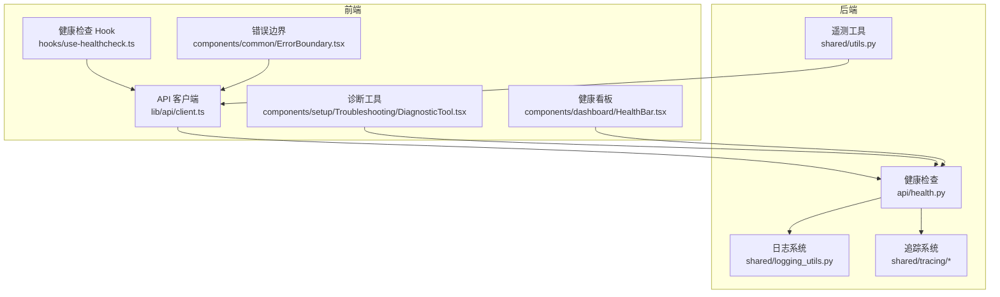
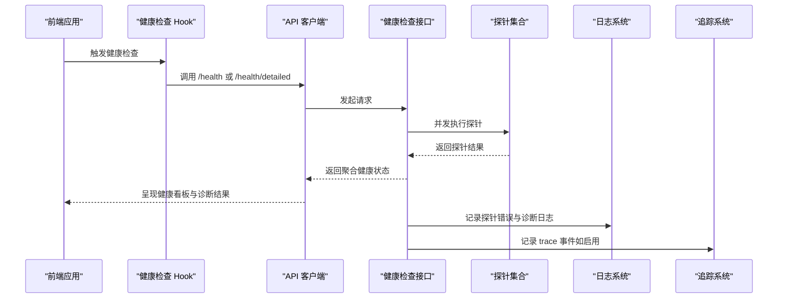
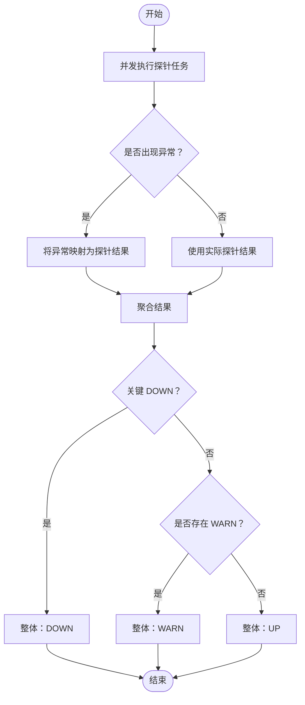
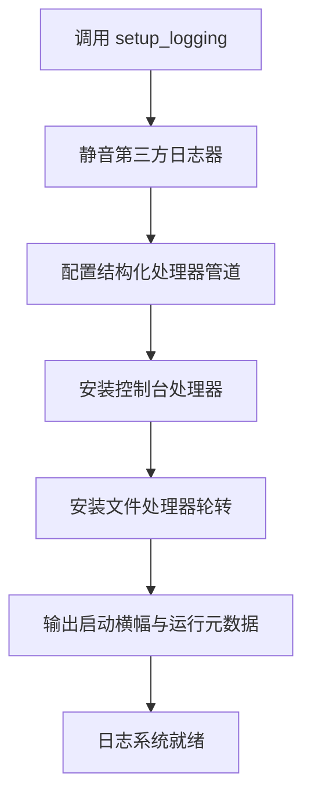
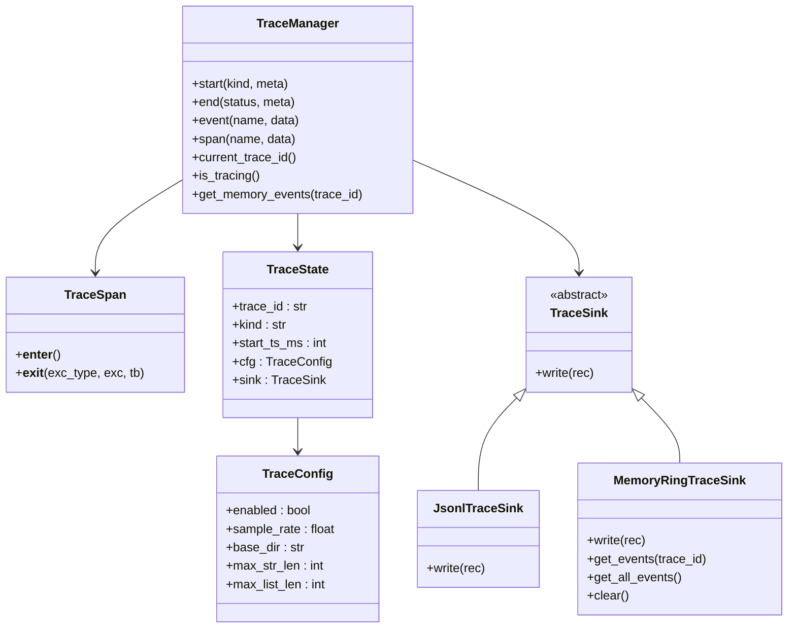
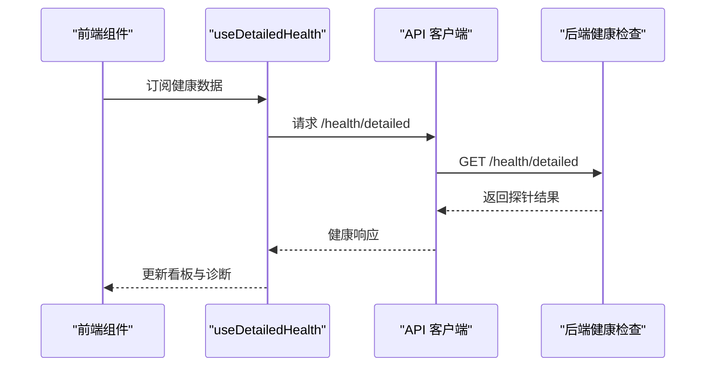
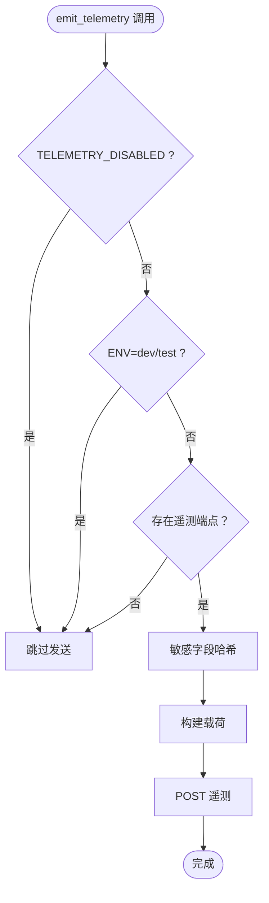
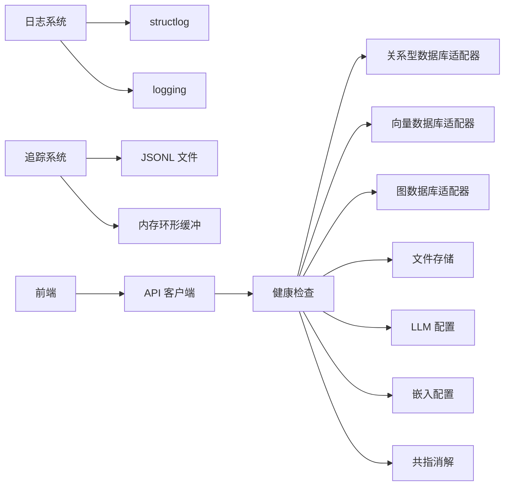

# 监控和日志

<cite>
**本文引用的文件**   
- [m_flow/api/health.py](file://m_flow/api/health.py)
- [m_flow/shared/logging_utils.py](file://m_flow/shared/logging_utils.py)
- [m_flow/shared/tracing/__init__.py](file://m_flow/shared/tracing/__init__.py)
- [m_flow/shared/tracing/manager.py](file://m_flow/shared/tracing/manager.py)
- [m_flow/shared/tracing/sinks.py](file://m_flow/shared/tracing/sinks.py)
- [m_flow/llm/backends/baml/baml_client/tracing.py](file://m_flow/llm/backends/baml/baml_client/tracing.py)
- [m_flow-frontend/src/hooks/use-healthcheck.ts](file://m_flow-frontend/src/hooks/use-healthcheck.ts)
- [m_flow-frontend/src/lib/api/client.ts](file://m_flow-frontend/src/lib/api/client.ts)
- [m_flow-frontend/src/components/dashboard/HealthBar.tsx](file://m_flow-frontend/src/components/dashboard/HealthBar.tsx)
- [m_flow-frontend/src/components/setup/Troubleshooting/DiagnosticTool.tsx](file://m_flow-frontend/src/components/setup/Troubleshooting/DiagnosticTool.tsx)
- [m_flow-frontend/src/components/common/ErrorBoundary.tsx](file://m_flow-frontend/src/components/common/ErrorBoundary.tsx)
- [m_flow/tests/test_telemetry.py](file://m_flow/tests/test_telemetry.py)
- [m_flow/shared/utils.py](file://m_flow/shared/utils.py)
- [m_flow/eval/__main__.py](file://m_flow/eval/__main__.py)
- [m_flow/api/v1/memorize/routers/get_memorize_router.py](file://m_flow/api/v1/memorize/routers/get_memorize_router.py)
- [m_flow-frontend/src/lib/api/websocket.ts](file://m_flow-frontend/src/lib/api/websocket.ts)
- [m_flow/config/settings/get_settings.py](file://m_flow/config/settings/get_settings.py)
</cite>

## 目录
1. [简介](#简介)
2. [项目结构](#项目结构)
3. [核心组件](#核心组件)
4. [架构总览](#架构总览)
5. [详细组件分析](#详细组件分析)
6. [依赖关系分析](#依赖关系分析)
7. [性能考量](#性能考量)
8. [故障排查指南](#故障排查指南)
9. [结论](#结论)
10. [附录](#附录)

## 简介
本指南面向 M-flow 的监控与日志体系，覆盖健康检查端点的配置与使用、分布式追踪（含 OpenTelemetry 集成思路）、日志采集与聚合策略、性能指标与告警、错误追踪与异常报告、运维仪表板搭建与可视化、以及日志分析与问题诊断方法。内容以仓库现有实现为基础，结合前端健康检查与诊断工具，帮助读者在生产环境中建立稳定可靠的可观测性能力。

## 项目结构
围绕监控与日志的关键模块分布如下：
- 后端健康检查与探针：m_flow/api/health.py 提供统一健康检查接口与多组件探针
- 日志系统：m_flow/shared/logging_utils.py 提供集中式日志初始化、结构化输出与轮转
- 分布式追踪：m_flow/shared/tracing/* 提供轻量级 TraceManager、Span 与事件写入
- 前端健康检查与诊断：m_flow-frontend/src/hooks/use-healthcheck.ts、client.ts、Dashboard 组件
- 遥测与分析：m_flow/shared/utils.py 中的遥测发送逻辑与测试用例
- 错误边界与异常报告：m_flow-frontend/src/components/common/ErrorBoundary.tsx
- 其他：评估报告中的 trace_id 使用用于调试定位

**图表来源**
- [m_flow/api/health.py:1-402](file://m_flow/api/health.py#L1-L402)
- [m_flow/shared/logging_utils.py:1-533](file://m_flow/shared/logging_utils.py#L1-L533)
- [m_flow/shared/tracing/__init__.py:1-51](file://m_flow/shared/tracing/__init__.py#L1-L51)
- [m_flow/shared/tracing/manager.py:1-280](file://m_flow/shared/tracing/manager.py#L1-L280)
- [m_flow/shared/tracing/sinks.py:1-110](file://m_flow/shared/tracing/sinks.py#L1-L110)
- [m_flow/shared/utils.py:66-86](file://m_flow/shared/utils.py#L66-L86)
- [m_flow-frontend/src/hooks/use-healthcheck.ts:68-117](file://m_flow-frontend/src/hooks/use-healthcheck.ts#L68-L117)
- [m_flow-frontend/src/lib/api/client.ts:212-254](file://m_flow-frontend/src/lib/api/client.ts#L212-L254)
- [m_flow-frontend/src/components/dashboard/HealthBar.tsx:83-125](file://m_flow-frontend/src/components/dashboard/HealthBar.tsx#L83-L125)
- [m_flow-frontend/src/components/setup/Troubleshooting/DiagnosticTool.tsx:289-369](file://m_flow-frontend/src/components/setup/Troubleshooting/DiagnosticTool.tsx#L289-L369)
- [m_flow-frontend/src/components/common/ErrorBoundary.tsx:42-131](file://m_flow-frontend/src/components/common/ErrorBoundary.tsx#L42-L131)

**章节来源**
- [m_flow/api/health.py:1-402](file://m_flow/api/health.py#L1-L402)
- [m_flow/shared/logging_utils.py:1-533](file://m_flow/shared/logging_utils.py#L1-L533)
- [m_flow/shared/tracing/__init__.py:1-51](file://m_flow/shared/tracing/__init__.py#L1-L51)
- [m_flow/shared/tracing/manager.py:1-280](file://m_flow/shared/tracing/manager.py#L1-L280)
- [m_flow/shared/tracing/sinks.py:1-110](file://m_flow/shared/tracing/sinks.py#L1-L110)
- [m_flow/shared/utils.py:66-86](file://m_flow/shared/utils.py#L66-L86)
- [m_flow-frontend/src/hooks/use-healthcheck.ts:68-117](file://m_flow-frontend/src/hooks/use-healthcheck.ts#L68-L117)
- [m_flow-frontend/src/lib/api/client.ts:212-254](file://m_flow-frontend/src/lib/api/client.ts#L212-L254)
- [m_flow-frontend/src/components/dashboard/HealthBar.tsx:83-125](file://m_flow-frontend/src/components/dashboard/HealthBar.tsx#L83-L125)
- [m_flow-frontend/src/components/setup/Troubleshooting/DiagnosticTool.tsx:289-369](file://m_flow-frontend/src/components/setup/Troubleshooting/DiagnosticTool.tsx#L289-L369)
- [m_flow-frontend/src/components/common/ErrorBoundary.tsx:42-131](file://m_flow-frontend/src/components/common/ErrorBoundary.tsx#L42-L131)

## 核心组件
- 健康检查端点与探针
  - 统一健康检查接口返回聚合状态与各组件探针结果，包含关系型数据库、向量库、图数据库、文件存储、LLM、嵌入服务、共指消解等探针
  - 探针并发执行，根据关键组件失败与警告状态推导整体健康度
- 日志系统
  - 结构化日志初始化、控制台彩色输出、纯文本文件轮转、异常增强、第三方噪声过滤、日志目录解析与清理
- 分布式追踪
  - TraceManager 提供 trace 生命周期管理、事件记录、自动计时 Span、采样与配置、内存环形缓冲与 JSONL 文件落盘
- 前端健康检查与诊断
  - 健康检查 Hook 与 API 客户端封装 /health 与 /health/detailed；Dashboard 展示服务状态与延迟；诊断工具基于探针结果进行分项检查
- 遥测与分析
  - 发送匿名遥测事件（受环境变量与开关控制），测试用例覆盖不同环境下的行为
- 错误边界
  - React 错误边界组件，捕获前端错误并提供复制错误信息的能力

**章节来源**
- [m_flow/api/health.py:341-384](file://m_flow/api/health.py#L341-L384)
- [m_flow/shared/logging_utils.py:340-519](file://m_flow/shared/logging_utils.py#L340-L519)
- [m_flow/shared/tracing/manager.py:107-280](file://m_flow/shared/tracing/manager.py#L107-L280)
- [m_flow/shared/tracing/sinks.py:27-110](file://m_flow/shared/tracing/sinks.py#L27-L110)
- [m_flow-frontend/src/hooks/use-healthcheck.ts:68-117](file://m_flow-frontend/src/hooks/use-healthcheck.ts#L68-L117)
- [m_flow-frontend/src/lib/api/client.ts:212-254](file://m_flow-frontend/src/lib/api/client.ts#L212-L254)
- [m_flow-frontend/src/components/dashboard/HealthBar.tsx:83-125](file://m_flow-frontend/src/components/dashboard/HealthBar.tsx#L83-L125)
- [m_flow-frontend/src/components/setup/Troubleshooting/DiagnosticTool.tsx:289-369](file://m_flow-frontend/src/components/setup/Troubleshooting/DiagnosticTool.tsx#L289-L369)
- [m_flow/shared/utils.py:66-86](file://m_flow/shared/utils.py#L66-L86)
- [m_flow/tests/test_telemetry.py:47-97](file://m_flow/tests/test_telemetry.py#L47-L97)
- [m_flow-frontend/src/components/common/ErrorBoundary.tsx:42-131](file://m_flow-frontend/src/components/common/ErrorBoundary.tsx#L42-L131)

## 架构总览
下图展示了从前端到后端的健康检查与诊断流程，以及日志与追踪在系统中的位置：

**图表来源**
- [m_flow-frontend/src/hooks/use-healthcheck.ts:68-117](file://m_flow-frontend/src/hooks/use-healthcheck.ts#L68-L117)
- [m_flow-frontend/src/lib/api/client.ts:212-254](file://m_flow-frontend/src/lib/api/client.ts#L212-L254)
- [m_flow/api/health.py:341-384](file://m_flow/api/health.py#L341-L384)
- [m_flow/shared/logging_utils.py:340-519](file://m_flow/shared/logging_utils.py#L340-L519)
- [m_flow/shared/tracing/manager.py:107-280](file://m_flow/shared/tracing/manager.py#L107-L280)

## 详细组件分析

### 健康检查端点与探针
- 接口职责
  - 提供统一健康检查入口，返回整体状态、构建版本、存活时间与探针明细
  - 支持“详细”模式，返回每个子系统的探针结果（含延迟与备注）
- 探针类型与关键性
  - 关键探针：关系型数据库、向量数据库、图数据库、文件存储
  - 非关键探针：LLM、嵌入服务、共指消解
- 并发与容错
  - 所有探针并发执行，异常会被转换为探针结果并参与聚合
- 聚合策略
  - 若存在关键组件 DOWN，则整体 DOWN；否则若存在 WARN 则整体 WARN；否则 UP

**图表来源**
- [m_flow/api/health.py:341-384](file://m_flow/api/health.py#L341-L384)

**章节来源**
- [m_flow/api/health.py:31-70](file://m_flow/api/health.py#L31-L70)
- [m_flow/api/health.py:77-310](file://m_flow/api/health.py#L77-L310)
- [m_flow/api/health.py:341-384](file://m_flow/api/health.py#L341-L384)

### 日志系统
- 初始化与处理器
  - 一次性初始化（setup_logging）：结构化日志管道、全局异常钩子、控制台彩色输出、文件轮转输出
  - 第三方噪声过滤器与静音策略，降低无关日志干扰
- 结构化日志与轮转
  - PlainFileHandler 自动区分结构化与普通日志，统一输出格式
  - 支持通过环境变量控制文件大小上限与保留数量
- 运行时元数据
  - 启动横幅记录运行时信息（Python 版本、structlog 版本、m_flow 版本、平台信息、数据库路径、配置摘要）

**图表来源**
- [m_flow/shared/logging_utils.py:340-519](file://m_flow/shared/logging_utils.py#L340-L519)

**章节来源**
- [m_flow/shared/logging_utils.py:118-182](file://m_flow/shared/logging_utils.py#L118-L182)
- [m_flow/shared/logging_utils.py:189-262](file://m_flow/shared/logging_utils.py#L189-L262)
- [m_flow/shared/logging_utils.py:269-316](file://m_flow/shared/logging_utils.py#L269-L316)
- [m_flow/shared/logging_utils.py:340-519](file://m_flow/shared/logging_utils.py#L340-L519)

### 分布式追踪系统
- TraceManager
  - 启停 trace、记录事件、自动计时 Span、采样与配置加载、内存环形缓冲与 JSONL 文件落盘
  - 事件数据安全裁剪，避免过大负载
- 环境变量配置
  - 开关、采样率、输出目录、字符串/列表长度限制
- 与 LLM 后端集成
  - BAML 生成的 tracing 模块导出 trace/set_tags/flush/on_log_event 等便捷函数，便于在 LLM 调用链中注入上下文

**图表来源**
- [m_flow/shared/tracing/manager.py:107-280](file://m_flow/shared/tracing/manager.py#L107-L280)
- [m_flow/shared/tracing/sinks.py:17-110](file://m_flow/shared/tracing/sinks.py#L17-L110)
- [m_flow/shared/tracing/__init__.py:1-51](file://m_flow/shared/tracing/__init__.py#L1-L51)
- [m_flow/llm/backends/baml/baml_client/tracing.py:1-26](file://m_flow/llm/backends/baml/baml_client/tracing.py#L1-L26)

**章节来源**
- [m_flow/shared/tracing/manager.py:25-53](file://m_flow/shared/tracing/manager.py#L25-L53)
- [m_flow/shared/tracing/manager.py:107-280](file://m_flow/shared/tracing/manager.py#L107-L280)
- [m_flow/shared/tracing/sinks.py:27-110](file://m_flow/shared/tracing/sinks.py#L27-L110)
- [m_flow/shared/tracing/__init__.py:28-32](file://m_flow/shared/tracing/__init__.py#L28-L32)
- [m_flow/llm/backends/baml/baml_client/tracing.py:1-26](file://m_flow/llm/backends/baml/baml_client/tracing.py#L1-L26)

### 前端健康检查与诊断
- 健康检查 Hook
  - useHealthCheck 与 useDetailedHealth 提供定时刷新、启用条件与过期时间等配置
- API 客户端
  - healthCheck 与 healthCheckDetailed 封装 /health 与 /health/detailed，返回健康状态与详细探针结果
- 仪表板与诊断工具
  - HealthBar 基于探针结果计算整体状态与平均延迟
  - 诊断工具按类别分组执行检查，依据探针结果判定通过/警告/失败

**图表来源**
- [m_flow-frontend/src/hooks/use-healthcheck.ts:68-117](file://m_flow-frontend/src/hooks/use-healthcheck.ts#L68-L117)
- [m_flow-frontend/src/lib/api/client.ts:212-254](file://m_flow-frontend/src/lib/api/client.ts#L212-L254)
- [m_flow/api/health.py:341-384](file://m_flow/api/health.py#L341-L384)
- [m_flow-frontend/src/components/dashboard/HealthBar.tsx:83-125](file://m_flow-frontend/src/components/dashboard/HealthBar.tsx#L83-L125)
- [m_flow-frontend/src/components/setup/Troubleshooting/DiagnosticTool.tsx:289-369](file://m_flow-frontend/src/components/setup/Troubleshooting/DiagnosticTool.tsx#L289-L369)

**章节来源**
- [m_flow-frontend/src/hooks/use-healthcheck.ts:68-117](file://m_flow-frontend/src/hooks/use-healthcheck.ts#L68-L117)
- [m_flow-frontend/src/lib/api/client.ts:212-254](file://m_flow-frontend/src/lib/api/client.ts#L212-L254)
- [m_flow-frontend/src/components/dashboard/HealthBar.tsx:83-125](file://m_flow-frontend/src/components/dashboard/HealthBar.tsx#L83-L125)
- [m_flow-frontend/src/components/setup/Troubleshooting/DiagnosticTool.tsx:289-369](file://m_flow-frontend/src/components/setup/Troubleshooting/DiagnosticTool.tsx#L289-L369)

### 遥测与分析
- 遥测发送
  - emit_telemetry 在非 dev/test 环境且未显式禁用时发送匿名遥测，对敏感字段进行哈希处理
- 环境控制
  - TELEMETRY_DISABLED 环境变量可禁用遥测；ENV=dev/test 时默认禁用
- 测试验证
  - 单元测试覆盖 prod 环境发送、禁用开关、dev 环境不发送等场景

**图表来源**
- [m_flow/shared/utils.py:66-86](file://m_flow/shared/utils.py#L66-L86)
- [m_flow/tests/test_telemetry.py:47-97](file://m_flow/tests/test_telemetry.py#L47-L97)

**章节来源**
- [m_flow/shared/utils.py:66-86](file://m_flow/shared/utils.py#L66-L86)
- [m_flow/tests/test_telemetry.py:47-97](file://m_flow/tests/test_telemetry.py#L47-L97)

### 错误边界与异常报告
- 错误边界
  - 捕获前端组件树中的错误，显示简洁提示与复制按钮，便于快速上报
- 异常报告
  - 评估报告中输出失败案例的 trace_id，便于后端日志与追踪定位

**章节来源**
- [m_flow-frontend/src/components/common/ErrorBoundary.tsx:42-131](file://m_flow-frontend/src/components/common/ErrorBoundary.tsx#L42-L131)
- [m_flow/eval/__main__.py:154-159](file://m_flow/eval/__main__.py#L154-L159)

### 进度订阅与 WebSocket 健康
- WebSocket URL 构建
  - 提供获取 WebSocket 基础地址与特定订阅路径的工具函数
- 认证与连接状态
  - 订阅路由中进行 JWT 认证，失败时关闭连接并返回策略违规码
- 健康相关
  - 通过订阅可观察工作流运行进度，辅助健康诊断

**章节来源**
- [m_flow-frontend/src/lib/api/websocket.ts:1-44](file://m_flow-frontend/src/lib/api/websocket.ts#L1-L44)
- [m_flow/api/v1/memorize/routers/get_memorize_router.py:276-311](file://m_flow/api/v1/memorize/routers/get_memorize_router.py#L276-L311)

## 依赖关系分析
- 健康检查对各适配器的依赖
  - 关系型数据库、向量数据库、图数据库、文件存储、LLM、嵌入服务、共指消解探针分别导入对应配置与适配器
- 日志系统对第三方库的依赖
  - structlog、logging、logging.handlers（RotatingFileHandler）
- 追踪系统对文件系统的依赖
  - JSONL 写入按日期分目录，内存环形缓冲作为兜底
- 前端对后端 API 的依赖
  - 通过 API 客户端访问 /health 与 /health/detailed，再由 Dashboard 与诊断工具消费

**图表来源**
- [m_flow/api/health.py:77-310](file://m_flow/api/health.py#L77-L310)
- [m_flow/shared/logging_utils.py:32-34](file://m_flow/shared/logging_utils.py#L32-L34)
- [m_flow/shared/tracing/sinks.py:34-65](file://m_flow/shared/tracing/sinks.py#L34-L65)
- [m_flow-frontend/src/lib/api/client.ts:212-254](file://m_flow-frontend/src/lib/api/client.ts#L212-L254)

**章节来源**
- [m_flow/api/health.py:77-310](file://m_flow/api/health.py#L77-L310)
- [m_flow/shared/logging_utils.py:32-34](file://m_flow/shared/logging_utils.py#L32-L34)
- [m_flow/shared/tracing/sinks.py:34-65](file://m_flow/shared/tracing/sinks.py#L34-L65)
- [m_flow-frontend/src/lib/api/client.ts:212-254](file://m_flow-frontend/src/lib/api/client.ts#L212-L254)

## 性能考量
- 健康检查并发与超时
  - 图数据库与长事务场景使用超时保护，避免阻塞 /health 接口
- 日志轮转与磁盘 IO
  - 文件大小与保留数量可通过环境变量配置，默认保留一定数量旧文件，CLI 模式下会清理过期日志
- 追踪采样与落盘
  - 通过采样率与内存环形缓冲平衡性能与可观测性；JSONL 按日期分目录减少锁竞争
- 前端刷新策略
  - 健康检查 Hook 支持可配置刷新间隔与缓存过期时间，避免过度轮询

**章节来源**
- [m_flow/api/health.py:123-172](file://m_flow/api/health.py#L123-L172)
- [m_flow/shared/logging_utils.py:199-202](file://m_flow/shared/logging_utils.py#L199-L202)
- [m_flow/shared/logging_utils.py:289-316](file://m_flow/shared/logging_utils.py#L289-L316)
- [m_flow/shared/tracing/manager.py:129-142](file://m_flow/shared/tracing/manager.py#L129-L142)
- [m_flow/shared/tracing/manager.py:267-280](file://m_flow/shared/tracing/manager.py#L267-L280)
- [m_flow-frontend/src/hooks/use-healthcheck.ts:85-106](file://m_flow-frontend/src/hooks/use-healthcheck.ts#L85-L106)

## 故障排查指南
- 健康检查诊断
  - 使用 /health/detailed 获取各组件探针结果，结合 HealthBar 与诊断工具快速定位 DOWN/WARN 组件
  - 对于图数据库超时或忙锁，探针会返回警告并说明原因
- 日志定位
  - 查看启动横幅与运行元数据，确认数据库路径与配置摘要
  - 检查文件处理器输出路径与轮转策略，必要时增大保留数量
- 追踪定位
  - 启用追踪后，结合 trace_id 与内存环形缓冲事件进行回溯
  - 评估报告中的 trace_id 可直接用于后端日志检索
- 前端错误
  - 使用错误边界复制错误信息，包含组件名与堆栈，便于快速反馈

**章节来源**
- [m_flow/api/health.py:341-384](file://m_flow/api/health.py#L341-L384)
- [m_flow-frontend/src/components/dashboard/HealthBar.tsx:83-125](file://m_flow-frontend/src/components/dashboard/HealthBar.tsx#L83-L125)
- [m_flow-frontend/src/components/setup/Troubleshooting/DiagnosticTool.tsx:289-369](file://m_flow-frontend/src/components/setup/Troubleshooting/DiagnosticTool.tsx#L289-L369)
- [m_flow/shared/logging_utils.py:480-519](file://m_flow/shared/logging_utils.py#L480-L519)
- [m_flow/shared/tracing/manager.py:144-190](file://m_flow/shared/tracing/manager.py#L144-L190)
- [m_flow/eval/__main__.py:154-159](file://m_flow/eval/__main__.py#L154-L159)
- [m_flow-frontend/src/components/common/ErrorBoundary.tsx:70-131](file://m_flow-frontend/src/components/common/ErrorBoundary.tsx#L70-L131)

## 结论
M-flow 的监控与日志体系以“统一健康检查 + 结构化日志 + 轻量追踪 + 前端诊断”为核心，既满足生产环境的可观测性需求，又保持较低的耦合与开销。通过合理的环境变量配置与前端仪表板，可以快速定位问题并持续优化系统稳定性。

## 附录
- 健康检查端点
  - GET /health：基础健康状态
  - GET /health/detailed：详细探针结果
- 追踪配置（环境变量）
  - MFLOW_TRACE_ENABLED：启用追踪
  - MFLOW_TRACE_SAMPLE_RATE：采样率
  - MFLOW_TRACE_DIR：追踪文件目录
  - MFLOW_TRACE_MAX_STR：最大字符串长度
  - MFLOW_TRACE_MAX_LIST：最大列表长度
- 日志配置（环境变量）
  - LOG_LEVEL：控制台日志级别
  - LOG_FILE_LEVEL：文件日志级别
  - LOG_FILE_NAME：日志文件名
  - LOG_FILE_MAX_BYTES：单文件最大字节
  - LOG_FILE_BACKUP_COUNT：保留文件数量
- 遥测配置（环境变量）
  - TELEMETRY_DISABLED：禁用遥测
  - ENV：开发/测试环境禁用遥测

**章节来源**
- [m_flow-frontend/src/lib/api/client.ts:212-254](file://m_flow-frontend/src/lib/api/client.ts#L212-L254)
- [m_flow/shared/tracing/__init__.py:28-32](file://m_flow/shared/tracing/__init__.py#L28-L32)
- [m_flow/shared/logging_utils.py:363-364](file://m_flow/shared/logging_utils.py#L363-L364)
- [m_flow/shared/logging_utils.py:199-202](file://m_flow/shared/logging_utils.py#L199-L202)
- [m_flow/shared/utils.py:74-77](file://m_flow/shared/utils.py#L74-L77)
- [m_flow/tests/test_telemetry.py:47-97](file://m_flow/tests/test_telemetry.py#L47-L97)