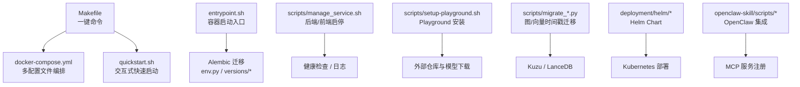
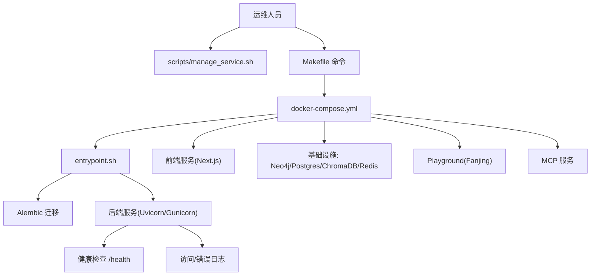
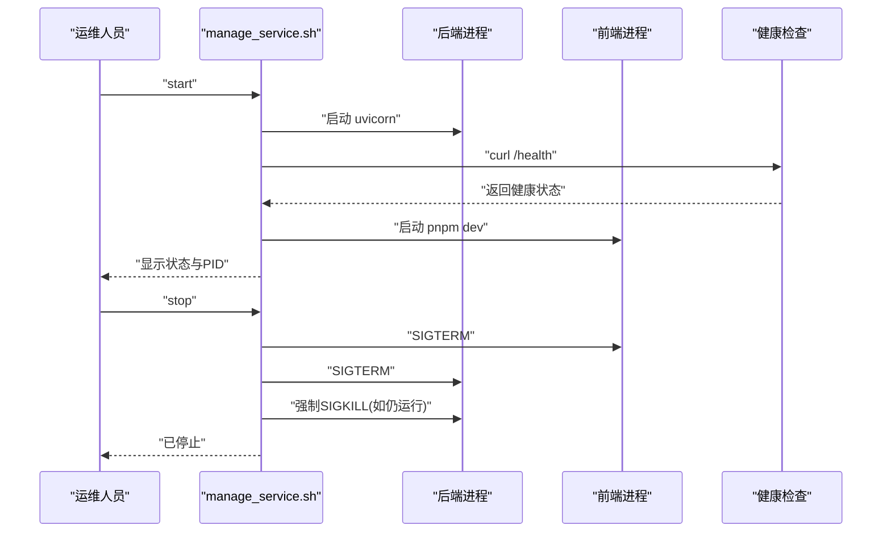
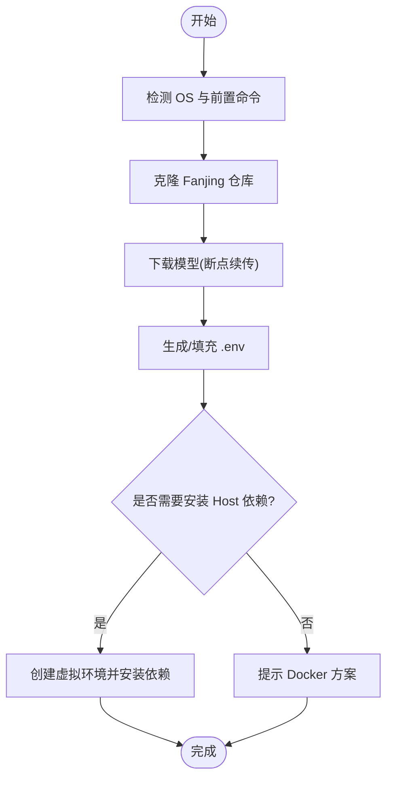
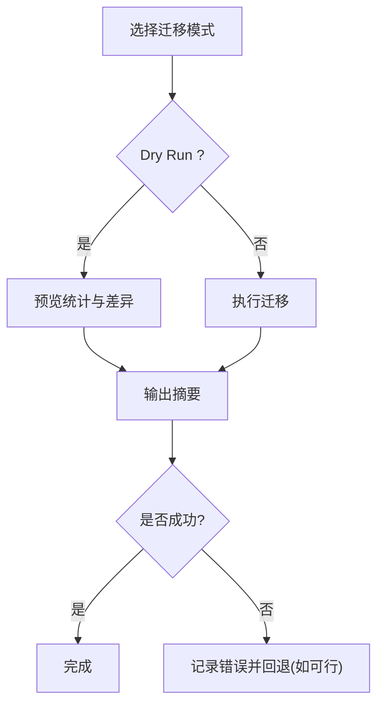
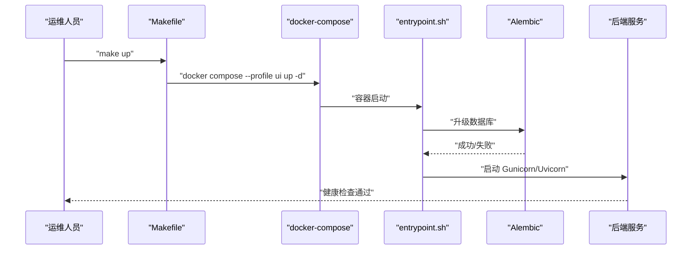
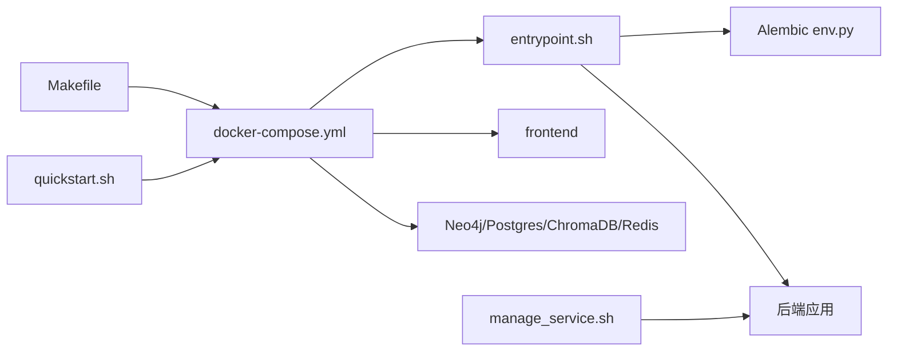

# 运维脚本和工具

<cite>
**本文引用的文件**
- [scripts/manage_service.sh](file://scripts/manage_service.sh)
- [scripts/setup-playground.sh](file://scripts/setup-playground.sh)
- [scripts/migrate_created_at.py](file://scripts/migrate_created_at.py)
- [scripts/migrate_lancedb_created_at.py](file://scripts/migrate_lancedb_created_at.py)
- [Makefile](file://Makefile)
- [docker-compose.yml](file://docker-compose.yml)
- [entrypoint.sh](file://entrypoint.sh)
- [quickstart.sh](file://quickstart.sh)
- [alembic/versions/92b3293baa66_mflow_initial_schema.py](file://alembic/versions/92b3293baa66_mflow_initial_schema.py)
- [alembic/env.py](file://alembic/env.py)
- [deployment/helm/values.yaml](file://deployment/helm/values.yaml)
- [deployment/helm/Chart.yaml](file://deployment/helm/Chart.yaml)
- [openclaw-skill/mflow-memory/scripts/setup.sh](file://openclaw-skill/mflow-memory/scripts/setup.sh)
- [openclaw-skill/mflow-memory/scripts/status.sh](file://openclaw-skill/mflow-memory/scripts/status.sh)
</cite>

## 目录
1. [简介](#简介)
2. [项目结构](#项目结构)
3. [核心组件](#核心组件)
4. [架构总览](#架构总览)
5. [详细组件分析](#详细组件分析)
6. [依赖分析](#依赖分析)
7. [性能考虑](#性能考虑)
8. [故障排查指南](#故障排查指南)
9. [结论](#结论)
10. [附录](#附录)

## 简介
本指南面向运维与平台工程团队，系统性梳理 M-flow 的运维脚本与工具，覆盖服务启停与状态检查、数据库迁移（含版本管理与回滚策略）、环境配置（开发/测试/生产）、备份与恢复（策略与演练）、性能调优（缓存、查询与资源分析）、CI/CD 集成与部署自动化，以及常见运维任务的脚本化最佳实践。读者无需深入代码即可高效完成日常运维工作。

## 项目结构
M-flow 的运维能力主要分布在以下位置：
- 顶层一键启动与编排：Makefile、docker-compose.yml、quickstart.sh、entrypoint.sh
- 服务管理脚本：scripts/manage_service.sh
- 环境与 Playground 设置：scripts/setup-playground.sh
- 数据库迁移与版本控制：alembic/*、scripts/migrate_*.py
- 平台即代码部署：deployment/helm/*
- OpenClaw 集成工具：openclaw-skill/mflow-memory/scripts/*

图表来源
- [Makefile:1-49](file://Makefile#L1-L49)
- [docker-compose.yml:1-227](file://docker-compose.yml#L1-L227)
- [entrypoint.sh:1-79](file://entrypoint.sh#L1-L79)
- [alembic/env.py:1-64](file://alembic/env.py#L1-L64)
- [alembic/versions/92b3293baa66_mflow_initial_schema.py:1-30](file://alembic/versions/92b3293baa66_mflow_initial_schema.py#L1-L30)
- [scripts/manage_service.sh:1-151](file://scripts/manage_service.sh#L1-L151)
- [scripts/setup-playground.sh:1-288](file://scripts/setup-playground.sh#L1-L288)
- [scripts/migrate_created_at.py:1-582](file://scripts/migrate_created_at.py#L1-L582)
- [scripts/migrate_lancedb_created_at.py:1-269](file://scripts/migrate_lancedb_created_at.py#L1-L269)
- [deployment/helm/values.yaml:1-23](file://deployment/helm/values.yaml#L1-L23)
- [deployment/helm/Chart.yaml:1-7](file://deployment/helm/Chart.yaml#L1-L7)
- [openclaw-skill/mflow-memory/scripts/setup.sh:1-154](file://openclaw-skill/mflow-memory/scripts/setup.sh#L1-L154)
- [openclaw-skill/mflow-memory/scripts/status.sh:1-18](file://openclaw-skill/mflow-memory/scripts/status.sh#L1-L18)

章节来源
- [Makefile:1-49](file://Makefile#L1-L49)
- [docker-compose.yml:1-227](file://docker-compose.yml#L1-L227)
- [entrypoint.sh:1-79](file://entrypoint.sh#L1-L79)

## 核心组件
- 服务管理脚本：统一管理后端与前端进程，支持 start/stop/restart/status，内置健康检查与日志定位。
- 环境配置脚本：一键安装 Playground 所需依赖与模型，生成/校验 .env，跨平台提示与自动检测。
- 数据库迁移：基于 Alembic 的关系型数据库迁移；针对图数据库与向量数据库的时间戳修复脚本。
- 编排与启动：Makefile 提供 up/down/build/logs/status/restart；docker-compose 支持多 profile 组合；entrypoint.sh 负责容器内初始化与启动。
- Helm 部署：Helm Chart 与 values.yaml 提供 Kubernetes 环境的标准化部署参数。
- OpenClaw 集成：一键拉起 MCP 服务并在 OpenClaw 中注册，便于本地 Agent 长期记忆能力接入。

章节来源
- [scripts/manage_service.sh:1-151](file://scripts/manage_service.sh#L1-L151)
- [scripts/setup-playground.sh:1-288](file://scripts/setup-playground.sh#L1-L288)
- [alembic/env.py:1-64](file://alembic/env.py#L1-L64)
- [alembic/versions/92b3293baa66_mflow_initial_schema.py:1-30](file://alembic/versions/92b3293baa66_mflow_initial_schema.py#L1-L30)
- [scripts/migrate_created_at.py:1-582](file://scripts/migrate_created_at.py#L1-L582)
- [scripts/migrate_lancedb_created_at.py:1-269](file://scripts/migrate_lancedb_created_at.py#L1-L269)
- [Makefile:1-49](file://Makefile#L1-L49)
- [docker-compose.yml:1-227](file://docker-compose.yml#L1-L227)
- [entrypoint.sh:1-79](file://entrypoint.sh#L1-L79)
- [deployment/helm/values.yaml:1-23](file://deployment/helm/values.yaml#L1-L23)
- [deployment/helm/Chart.yaml:1-7](file://deployment/helm/Chart.yaml#L1-L7)
- [openclaw-skill/mflow-memory/scripts/setup.sh:1-154](file://openclaw-skill/mflow-memory/scripts/setup.sh#L1-L154)
- [openclaw-skill/mflow-memory/scripts/status.sh:1-18](file://openclaw-skill/mflow-memory/scripts/status.sh#L1-L18)

## 架构总览
下图展示从用户到容器、再到数据库与外部服务的整体运维路径，涵盖启动、迁移、健康检查与日志采集等关键环节。

图表来源
- [scripts/manage_service.sh:1-151](file://scripts/manage_service.sh#L1-L151)
- [Makefile:1-49](file://Makefile#L1-L49)
- [docker-compose.yml:1-227](file://docker-compose.yml#L1-L227)
- [entrypoint.sh:1-79](file://entrypoint.sh#L1-L79)

## 详细组件分析

### 服务管理脚本：统一启停与状态检查
- 功能要点
  - 后端：通过 uvicorn 启动 FastAPI 应用，健康检查通过 /health 接口确认可用性。
  - 前端：在 m_flow-frontend 目录下以 pnpm dev 启动 Next.js，默认端口 3000。
  - 停止：先尝试优雅终止 SIGTERM，再强制 SIGKILL，确保进程退出。
  - 状态：分别查询后端/前端进程，输出 PID、URL、健康状态。
- 使用建议
  - 生产环境优先使用 docker-compose 管理，避免直接操作宿主机进程。
  - 开发调试时可单独管理后端或前端，减少启动时间。

图表来源
- [scripts/manage_service.sh:101-151](file://scripts/manage_service.sh#L101-L151)

章节来源
- [scripts/manage_service.sh:1-151](file://scripts/manage_service.sh#L1-L151)

### 环境配置脚本：Playground 一键安装
- 功能要点
  - 自动检测 OS 与前置命令（git、python3、curl），必要时提示安装。
  - 克隆 fanjing-face-recognition 仓库，支持拉取最新变更。
  - 下载人脸/语音识别模型，断点续传与完整性校验。
  - 生成/填充 .env，自动生成 FACE_API_KEY，提示设置 LLM_API_KEY。
  - 跨平台部署建议：Linux 可直接 Docker，其他系统建议混合部署（Host 上运行人脸识别，容器中运行 M-flow）。
- 使用建议
  - 首次运行建议使用 --yes 非交互模式进行自动化部署。
  - 模型下载失败时，按提示手动重试或检查网络代理。

图表来源
- [scripts/setup-playground.sh:67-288](file://scripts/setup-playground.sh#L67-L288)

章节来源
- [scripts/setup-playground.sh:1-288](file://scripts/setup-playground.sh#L1-L288)

### 数据库迁移：关系型与图/向量数据库
- 关系型数据库迁移（Alembic）
  - 环境：env.py 解析数据库连接，异步执行迁移。
  - 版本：初始版本锚定，后续迁移通过版本文件扩展。
  - 回滚：当前初始版本不支持降级，建议在生产前做好备份与灰度。
- 图数据库与向量数据库时间戳修复
  - Kuzu 时间戳修复：从节点 properties 中读取 created_at，更新节点列值；按 Episode/ContentFragment/Facet/FacetPoint 顺序迁移。
  - LanceDB 时间戳修复：从 Kuzu 读取 Episode 正确时间戳，批量更新 Episode_summary.payload.created_at。
- 使用建议
  - 建议先执行 --dry-run 预览，核对统计后再应用。
  - 在业务低峰期执行，确保数据一致性。

图表来源
- [scripts/migrate_created_at.py:473-582](file://scripts/migrate_created_at.py#L473-L582)
- [scripts/migrate_lancedb_created_at.py:201-269](file://scripts/migrate_lancedb_created_at.py#L201-L269)
- [alembic/env.py:18-64](file://alembic/env.py#L18-L64)
- [alembic/versions/92b3293baa66_mflow_initial_schema.py:24-30](file://alembic/versions/92b3293baa66_mflow_initial_schema.py#L24-L30)

章节来源
- [scripts/migrate_created_at.py:1-582](file://scripts/migrate_created_at.py#L1-L582)
- [scripts/migrate_lancedb_created_at.py:1-269](file://scripts/migrate_lancedb_created_at.py#L1-L269)
- [alembic/env.py:1-64](file://alembic/env.py#L1-L64)
- [alembic/versions/92b3293baa66_mflow_initial_schema.py:1-30](file://alembic/versions/92b3293baa66_mflow_initial_schema.py#L1-L30)

### 环境配置与启动：Makefile、docker-compose 与入口脚本
- Makefile
  - 提供 quickstart、up/down/build/logs/status/restart 等常用命令。
- docker-compose
  - 多 profile 组合：ui、mcp、neo4j、postgres、chromadb、redis、playground。
  - 健康检查：后端与 Playground 均配置健康检查，便于编排层监控。
- 容器入口脚本（entrypoint.sh）
  - 先执行 Alembic 升级，若失败则回退到直接初始化。
  - 根据环境变量选择 Gunicorn 或 Uvicorn 启动后端，支持远程调试。
- 快速启动（quickstart.sh）
  - 交互式选择部署模式（Docker/本地），自动配置 .env、等待健康、打开浏览器。
  - 支持自定义 Docker profile 组合。

图表来源
- [Makefile:10-27](file://Makefile#L10-L27)
- [docker-compose.yml:17-48](file://docker-compose.yml#L17-L48)
- [entrypoint.sh:13-35](file://entrypoint.sh#L13-L35)
- [entrypoint.sh:55-79](file://entrypoint.sh#L55-L79)

章节来源
- [Makefile:1-49](file://Makefile#L1-L49)
- [docker-compose.yml:1-227](file://docker-compose.yml#L1-L227)
- [entrypoint.sh:1-79](file://entrypoint.sh#L1-L79)
- [quickstart.sh:1-326](file://quickstart.sh#L1-L326)

### Helm 部署：标准化 Kubernetes 部署
- Chart 与 Values
  - Chart.yaml 描述应用元信息。
  - values.yaml 提供镜像、端口、环境变量与资源配额等默认值，支持覆盖。
- 使用建议
  - 在生产环境中通过 --set 或自定义 values.yaml 覆盖敏感参数与存储大小。
  - 结合 ingress 与 secrets 管理暴露方式与密钥。

章节来源
- [deployment/helm/Chart.yaml:1-7](file://deployment/helm/Chart.yaml#L1-L7)
- [deployment/helm/values.yaml:1-23](file://deployment/helm/values.yaml#L1-L23)

### OpenClaw 集成：MCP 服务一键部署与注册
- 功能要点
  - 一键拉取镜像、启动容器、端口探测、健康检查。
  - 自动写入 OpenClaw 配置文件，注册 MCP 服务器。
- 使用建议
  - 确保 LLM_API_KEY 已设置，否则无法加载知识抽取能力。
  - 如自动注入失败，按提示手动编辑 OpenClaw 配置。

章节来源
- [openclaw-skill/mflow-memory/scripts/setup.sh:1-154](file://openclaw-skill/mflow-memory/scripts/setup.sh#L1-L154)
- [openclaw-skill/mflow-memory/scripts/status.sh:1-18](file://openclaw-skill/mflow-memory/scripts/status.sh#L1-L18)

## 依赖分析
- 组件耦合
  - entrypoint.sh 依赖 Alembic 与应用初始化模块，负责容器内“先迁移后启动”的顺序。
  - docker-compose 将后端、前端与基础设施解耦为独立服务，通过网络互通。
  - scripts/manage_service.sh 与 Makefile/quickstart.sh 形成“本地/容器双栈”运维入口。
- 外部依赖
  - Docker/Compose、Python、Node.js（pnpm）、Git、curl。
  - Playground 依赖外部仓库与模型文件，需网络可达。

图表来源
- [entrypoint.sh:13-35](file://entrypoint.sh#L13-L35)
- [alembic/env.py:18-64](file://alembic/env.py#L18-L64)
- [docker-compose.yml:17-227](file://docker-compose.yml#L17-L227)
- [Makefile:10-27](file://Makefile#L10-L27)
- [quickstart.sh:219-245](file://quickstart.sh#L219-L245)
- [scripts/manage_service.sh:12-73](file://scripts/manage_service.sh#L12-L73)

章节来源
- [entrypoint.sh:1-79](file://entrypoint.sh#L1-L79)
- [alembic/env.py:1-64](file://alembic/env.py#L1-L64)
- [docker-compose.yml:1-227](file://docker-compose.yml#L1-L227)
- [Makefile:1-49](file://Makefile#L1-L49)
- [quickstart.sh:1-326](file://quickstart.sh#L1-L326)
- [scripts/manage_service.sh:1-151](file://scripts/manage_service.sh#L1-L151)

## 性能考虑
- 缓存优化
  - 使用 Redis 作为缓存层，结合容器编排中的 redis/redisinsight 服务，监控命中率与内存使用。
  - 建议在高并发场景下启用连接池与持久化（appendonly）。
- 数据库查询优化
  - 关系型数据库：合理索引、分页查询、避免 N+1 查询；在 Alembic 迁移中谨慎添加索引。
  - 图数据库：对高频过滤字段建立索引，合并 Cypher 查询，避免全表扫描。
  - 向量数据库：合理设置维度与索引类型，定期维护与重建索引。
- 资源使用分析
  - 通过 docker stats 或 Kubernetes 资源配额观察 CPU/内存占用，按需调整 limits。
  - 后端服务超时与 worker 数量需结合负载评估进行调优。

[本节为通用指导，无需特定文件来源]

## 故障排查指南
- 服务无法启动
  - 检查后端健康检查 /health 是否返回 200；查看容器日志与访问/错误日志。
  - 若使用 entrypoint.sh，关注 Alembic 升级是否失败并回退到直接初始化。
- 端口冲突
  - quickstart.sh 会检测 8000/3000 端口占用；根据提示释放或更换端口。
- Playground 无法访问
  - 确认模型下载完成且 .env 中 FACE_API_KEY 已正确生成；检查容器健康状态。
- 数据库迁移失败
  - 先执行 --dry-run 获取差异；核对数据库连接与权限；必要时回滚至上一个稳定版本（如适用）。
- OpenClaw 注册失败
  - 手动检查 ~/.openclaw/openclaw.json 是否存在并包含正确的 MCP 服务器地址。

章节来源
- [scripts/manage_service.sh:75-99](file://scripts/manage_service.sh#L75-L99)
- [entrypoint.sh:13-35](file://entrypoint.sh#L13-L35)
- [quickstart.sh:97-112](file://quickstart.sh#L97-L112)
- [scripts/setup-playground.sh:189-205](file://scripts/setup-playground.sh#L189-L205)
- [scripts/migrate_created_at.py:572-582](file://scripts/migrate_created_at.py#L572-L582)
- [openclaw-skill/mflow-memory/scripts/setup.sh:101-140](file://openclaw-skill/mflow-memory/scripts/setup.sh#L101-L140)

## 结论
通过上述运维脚本与工具，M-flow 实现了从本地开发到容器化部署、从单体服务到多数据库编排的全生命周期管理。建议在生产中结合 Helm/Kubernetes、CI/CD 流水线与监控告警体系，持续完善自动化与可观测性，保障系统的稳定性与可维护性。

[本节为总结性内容，无需特定文件来源]

## 附录
- 常用命令速查
  - 启动：make up 或 docker compose --profile ui up -d
  - 停止：make down 或 docker compose down
  - 查看状态：make status 或 docker compose ps
  - 查看日志：make logs 或 docker compose logs -f
  - 重启：make restart 或 docker compose restart
  - 一键启动（交互）：./quickstart.sh
  - 服务管理脚本：./scripts/manage_service.sh start|stop|restart|status
- 最佳实践
  - 生产环境使用 docker-compose 的 ui/profile 组合，配合健康检查与日志聚合。
  - 数据库迁移必须先 dry-run，核对统计后再执行；保留回滚方案与备份。
  - 缓存与数据库索引需随业务增长持续优化，定期巡检。
  - CI/CD 中加入自动化测试与部署流水线，结合 Helm/K8s 进行蓝绿/金丝雀发布。

[本节为通用附录，无需特定文件来源]