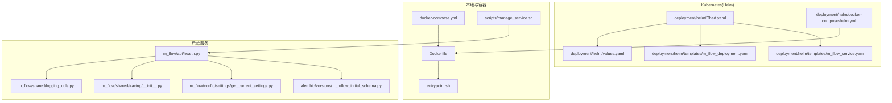
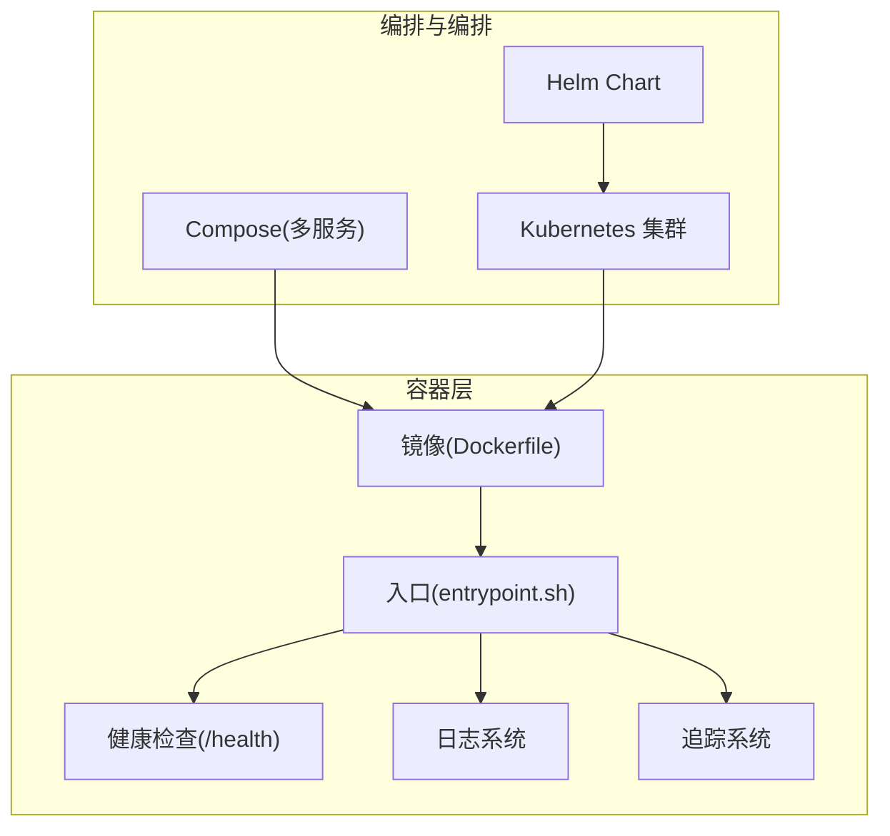
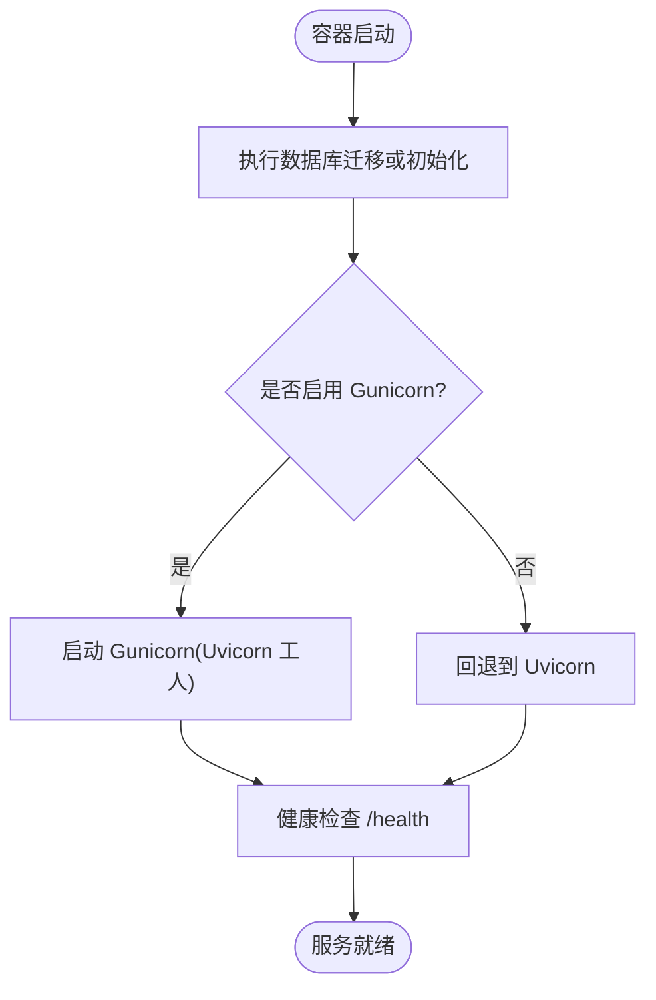
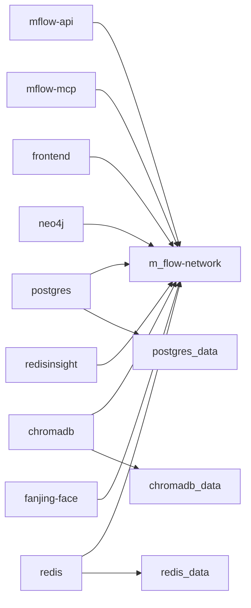
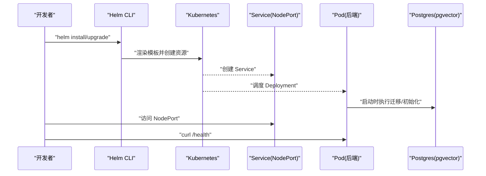
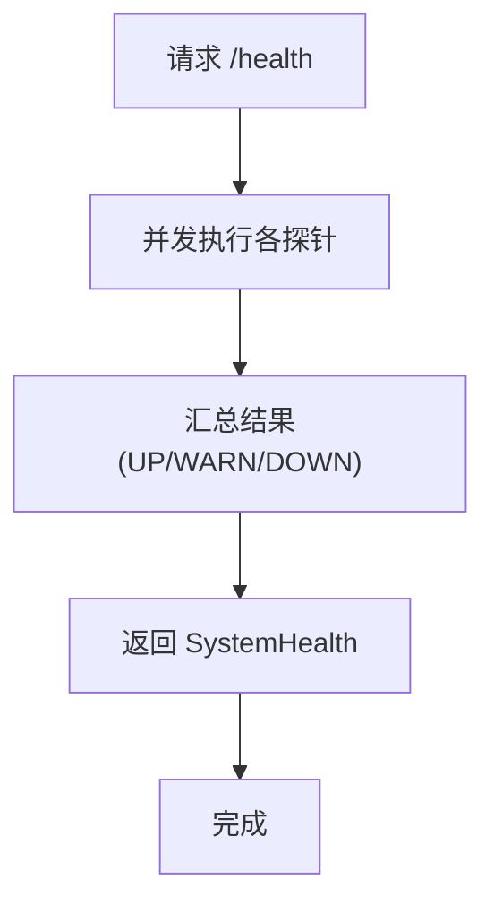
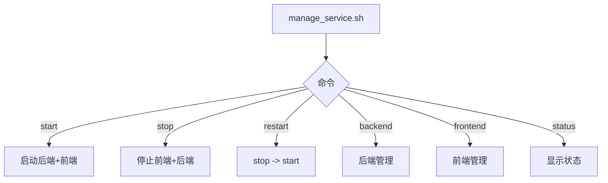
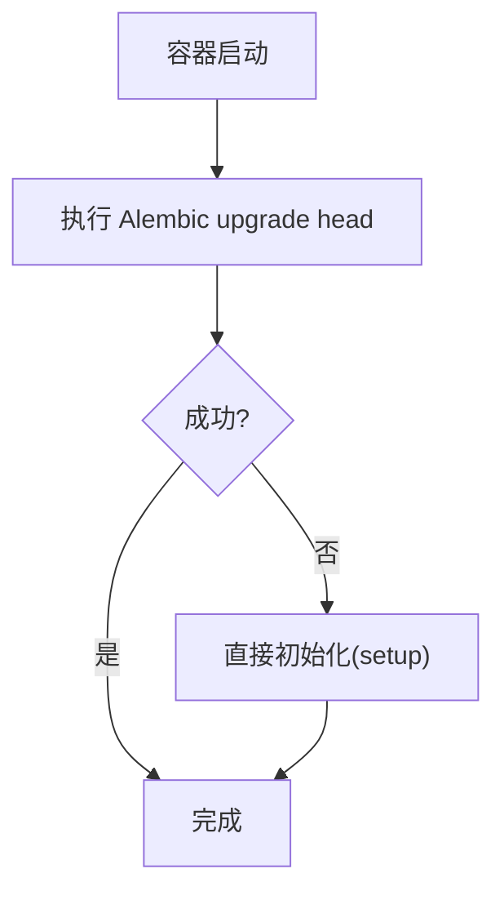
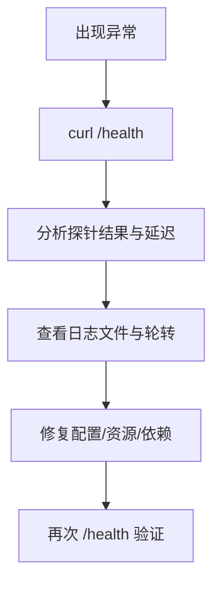
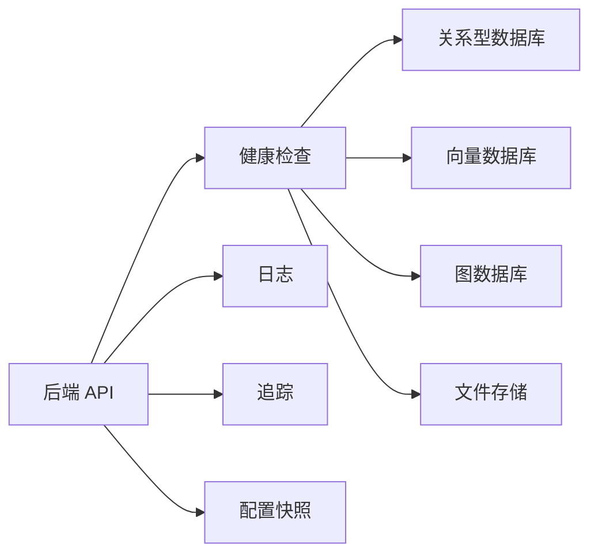

# 部署和运维

<cite>
**本文引用的文件**   
- [Dockerfile](file://Dockerfile)
- [docker-compose.yml](file://docker-compose.yml)
- [entrypoint.sh](file://entrypoint.sh)
- [deployment/helm/Chart.yaml](file://deployment/helm/Chart.yaml)
- [deployment/helm/values.yaml](file://deployment/helm/values.yaml)
- [deployment/helm/templates/m_flow_deployment.yaml](file://deployment/helm/templates/m_flow_deployment.yaml)
- [deployment/helm/templates/m_flow_service.yaml](file://deployment/helm/templates/m_flow_service.yaml)
- [deployment/helm/docker-compose-helm.yml](file://deployment/helm/docker-compose-helm.yml)
- [scripts/manage_service.sh](file://scripts/manage_service.sh)
- [m_flow/api/health.py](file://m_flow/api/health.py)
- [m_flow/config/settings/get_current_settings.py](file://m_flow/config/settings/get_current_settings.py)
- [m_flow/shared/logging_utils.py](file://m_flow/shared/logging_utils.py)
- [m_flow/shared/tracing/__init__.py](file://m_flow/shared/tracing/__init__.py)
- [alembic/versions/92b3293baa66_mflow_initial_schema.py](file://alembic/versions/92b3293baa66_mflow_initial_schema.py)
- [Makefile](file://Makefile)
- [quickstart.sh](file://quickstart.sh)
- [quickstart.ps1](file://quickstart.ps1)
</cite>

## 目录
1. [简介](#简介)
2. [项目结构](#项目结构)
3. [核心组件](#核心组件)
4. [架构总览](#架构总览)
5. [详细组件分析](#详细组件分析)
6. [依赖关系分析](#依赖关系分析)
7. [性能考虑](#性能考虑)
8. [故障排查指南](#故障排查指南)
9. [结论](#结论)
10. [附录](#附录)

## 简介
本指南面向 M-flow 的部署与运维团队，覆盖从本地开发到生产级 Kubernetes 部署的全生命周期管理。内容包括：
- Docker 容器化：镜像构建、运行时入口、健康检查与资源限制
- Kubernetes 部署：Helm Charts 使用、资源配置与服务发现
- 多环境配置：开发、测试、生产差异要点
- 监控与日志：健康检查、日志系统、可观察性（追踪）
- 运维脚本：启动、停止、重启、状态查询
- 数据库迁移与版本升级：Alembic 初始化与应用启动时初始化
- 安全配置：网络隔离、调试端口、访问控制开关
- 性能调优：资源分配、缓存策略、并发与超时
- 故障排查与应急响应：常见问题定位与处理步骤
- CI/CD 流水线：建议的流水线配置与自动化部署思路

## 项目结构
M-flow 提供了多套部署方式与工具链：
- 顶层 Dockerfile 与 docker-compose.yml 支持单机与多服务编排
- deployment/helm 提供 Helm Chart，用于 Kubernetes 部署
- scripts/manage_service.sh 提供本地服务管理脚本
- m_flow/api/health.py 提供统一健康检查接口与探针
- m_flow/shared/logging_utils.py 与 m_flow/shared/tracing/__init__.py 提供日志与追踪能力
- alembic/versions 下的初始迁移文件定义了数据库初始化策略

**图表来源**
- [docker-compose.yml:1-227](file://docker-compose.yml#L1-L227)
- [Dockerfile:1-90](file://Dockerfile#L1-L90)
- [entrypoint.sh:1-79](file://entrypoint.sh#L1-L79)
- [scripts/manage_service.sh:1-151](file://scripts/manage_service.sh#L1-L151)
- [deployment/helm/Chart.yaml:1-7](file://deployment/helm/Chart.yaml#L1-L7)
- [deployment/helm/values.yaml:1-23](file://deployment/helm/values.yaml#L1-L23)
- [deployment/helm/templates/m_flow_deployment.yaml:1-33](file://deployment/helm/templates/m_flow_deployment.yaml#L1-L33)
- [deployment/helm/templates/m_flow_service.yaml:1-14](file://deployment/helm/templates/m_flow_service.yaml#L1-L14)
- [deployment/helm/docker-compose-helm.yml:1-42](file://deployment/helm/docker-compose-helm.yml#L1-L42)
- [m_flow/api/health.py:1-402](file://m_flow/api/health.py#L1-L402)
- [m_flow/shared/logging_utils.py:1-533](file://m_flow/shared/logging_utils.py#L1-L533)
- [m_flow/shared/tracing/__init__.py:1-51](file://m_flow/shared/tracing/__init__.py#L1-L51)
- [m_flow/config/settings/get_current_settings.py:1-111](file://m_flow/config/settings/get_current_settings.py#L1-L111)
- [alembic/versions/92b3293baa66_mflow_initial_schema.py:1-30](file://alembic/versions/92b3293baa66_mflow_initial_schema.py#L1-L30)

**章节来源**
- [docker-compose.yml:1-227](file://docker-compose.yml#L1-L227)
- [Dockerfile:1-90](file://Dockerfile#L1-L90)
- [deployment/helm/Chart.yaml:1-7](file://deployment/helm/Chart.yaml#L1-L7)
- [deployment/helm/values.yaml:1-23](file://deployment/helm/values.yaml#L1-L23)
- [deployment/helm/templates/m_flow_deployment.yaml:1-33](file://deployment/helm/templates/m_flow_deployment.yaml#L1-L33)
- [deployment/helm/templates/m_flow_service.yaml:1-14](file://deployment/helm/templates/m_flow_service.yaml#L1-L14)
- [deployment/helm/docker-compose-helm.yml:1-42](file://deployment/helm/docker-compose-helm.yml#L1-L42)

## 核心组件
- 容器镜像与入口
  - 生产镜像采用两阶段构建，第一阶段安装依赖与应用代码，第二阶段仅保留运行时库，体积更小且更安全
  - 健康检查通过 curl 访问 /health 探测后端可用性
  - 入口脚本负责数据库迁移或直接初始化，并根据环境选择 Gunicorn 或 Uvicorn 启动服务
- Compose 编排
  - 支持按 profile 组合启动后端、前端、数据库与辅助服务
  - 提供健康检查、资源限制、调试端口映射等
- Helm 部署
  - Chart 定义应用元信息与版本
  - values.yaml 提供默认镜像、端口、环境变量与资源配额
  - 模板生成 Deployment 与 Service，支持 NodePort 暴露
- 健康检查与可观测性
  - /health 聚合探针：关系型数据库、向量库、图数据库、文件存储、LLM、嵌入、共指消解模块
  - 日志系统：集中式结构化日志、文件轮转、第三方噪声抑制
  - 追踪系统：可选的 TraceManager，支持采样与落盘

**章节来源**
- [Dockerfile:1-90](file://Dockerfile#L1-L90)
- [entrypoint.sh:1-79](file://entrypoint.sh#L1-L79)
- [docker-compose.yml:1-227](file://docker-compose.yml#L1-L227)
- [deployment/helm/Chart.yaml:1-7](file://deployment/helm/Chart.yaml#L1-L7)
- [deployment/helm/values.yaml:1-23](file://deployment/helm/values.yaml#L1-L23)
- [deployment/helm/templates/m_flow_deployment.yaml:1-33](file://deployment/helm/templates/m_flow_deployment.yaml#L1-L33)
- [deployment/helm/templates/m_flow_service.yaml:1-14](file://deployment/helm/templates/m_flow_service.yaml#L1-L14)
- [m_flow/api/health.py:1-402](file://m_flow/api/health.py#L1-L402)
- [m_flow/shared/logging_utils.py:1-533](file://m_flow/shared/logging_utils.py#L1-L533)
- [m_flow/shared/tracing/__init__.py:1-51](file://m_flow/shared/tracing/__init__.py#L1-L51)

## 架构总览
下图展示了从容器到 Kubernetes 的部署路径，以及健康检查与日志追踪在整体架构中的位置。

**图表来源**
- [Dockerfile:1-90](file://Dockerfile#L1-L90)
- [entrypoint.sh:1-79](file://entrypoint.sh#L1-L79)
- [docker-compose.yml:1-227](file://docker-compose.yml#L1-L227)
- [deployment/helm/Chart.yaml:1-7](file://deployment/helm/Chart.yaml#L1-L7)
- [m_flow/api/health.py:1-402](file://m_flow/api/health.py#L1-L402)
- [m_flow/shared/logging_utils.py:1-533](file://m_flow/shared/logging_utils.py#L1-L533)
- [m_flow/shared/tracing/__init__.py:1-51](file://m_flow/shared/tracing/__init__.py#L1-L51)

## 详细组件分析

### Docker 容器化与镜像构建
- 两阶段构建
  - 第一阶段使用 uv 安装依赖、同步 Alembic 与应用代码，安装 coreference 包以保证中文/英文共指功能
  - 第二阶段仅复制运行时产物，仅安装运行时所需系统库
- 运行时参数
  - 环境变量：HOST、ENVIRONMENT、PYTHONPATH
  - 健康检查：curl 访问 /health
  - 入口：entrypoint.sh 执行迁移或初始化，随后启动 Gunicorn/Uvicorn
- 资源与并发
  - 默认暴露 8000 端口
  - 可通过环境变量与调试端口进行开发调试

**图表来源**
- [entrypoint.sh:13-79](file://entrypoint.sh#L13-L79)
- [Dockerfile:86-87](file://Dockerfile#L86-L87)

**章节来源**
- [Dockerfile:1-90](file://Dockerfile#L1-L90)
- [entrypoint.sh:1-79](file://entrypoint.sh#L1-L79)

### Docker Compose 多服务编排
- 服务分组
  - mflow-api：后端 API，支持调试端口映射与健康检查
  - mflow-mcp：MCP 服务器（IDE 集成），可选 profile
  - frontend：Next.js 控制台前端（UI），可选 profile
  - neo4j、postgres、chromadb、redis、redisinsight：可选基础设施
  - fanjing-face：Playground 示例（人脸识别），可选 profile
- 网络与卷
  - 统一网络 m_flow-network
  - 数据持久化卷（如 postgres_data、chromadb_data、redis_data）
- 资源限制
  - 每个服务可配置 CPU 与内存上限

**图表来源**
- [docker-compose.yml:17-227](file://docker-compose.yml#L17-L227)

**章节来源**
- [docker-compose.yml:1-227](file://docker-compose.yml#L1-L227)

### Kubernetes 部署（Helm）
- Chart 元信息
  - 应用名称、版本、应用版本
- Values 默认值
  - 后端镜像、端口、环境变量（HOST、ENVIRONMENT、PYTHONPATH）
  - 资源配额（CPU、内存）
  - 数据库镜像、端口、凭据与存储大小
- 模板
  - Deployment：容器端口、环境变量、资源限制
  - Service：NodePort 暴露，选择器匹配 Deployment 标签
- 本地验证
  - docker-compose-helm.yml 提供与 Helm 对应的最小 Compose，便于本地联调

**图表来源**
- [deployment/helm/Chart.yaml:1-7](file://deployment/helm/Chart.yaml#L1-L7)
- [deployment/helm/values.yaml:1-23](file://deployment/helm/values.yaml#L1-L23)
- [deployment/helm/templates/m_flow_deployment.yaml:1-33](file://deployment/helm/templates/m_flow_deployment.yaml#L1-L33)
- [deployment/helm/templates/m_flow_service.yaml:1-14](file://deployment/helm/templates/m_flow_service.yaml#L1-L14)
- [deployment/helm/docker-compose-helm.yml:1-42](file://deployment/helm/docker-compose-helm.yml#L1-L42)

**章节来源**
- [deployment/helm/Chart.yaml:1-7](file://deployment/helm/Chart.yaml#L1-L7)
- [deployment/helm/values.yaml:1-23](file://deployment/helm/values.yaml#L1-L23)
- [deployment/helm/templates/m_flow_deployment.yaml:1-33](file://deployment/helm/templates/m_flow_deployment.yaml#L1-L33)
- [deployment/helm/templates/m_flow_service.yaml:1-14](file://deployment/helm/templates/m_flow_service.yaml#L1-L14)
- [deployment/helm/docker-compose-helm.yml:1-42](file://deployment/helm/docker-compose-helm.yml#L1-L42)

### 健康检查与可观测性
- 健康检查聚合
  - 关系型数据库、向量数据库、图数据库、文件存储、LLM、嵌入、共指消解模块
  - 图数据库探针对长时间占用锁的情况采用超时降级为警告
- 日志系统
  - 结构化日志、控制台彩色输出、文件轮转、第三方库噪声抑制
  - 日志目录解析与清理
- 追踪系统
  - 可选 TraceManager，支持采样率与落盘目录

**图表来源**
- [m_flow/api/health.py:341-384](file://m_flow/api/health.py#L341-L384)

**章节来源**
- [m_flow/api/health.py:1-402](file://m_flow/api/health.py#L1-L402)
- [m_flow/shared/logging_utils.py:1-533](file://m_flow/shared/logging_utils.py#L1-L533)
- [m_flow/shared/tracing/__init__.py:1-51](file://m_flow/shared/tracing/__init__.py#L1-L51)

### 运维脚本与本地管理
- 脚本功能
  - 启动/停止/重启后端与前端
  - 健康检查与进程状态查询
  - 日志文件位置与错误提示
- 使用场景
  - 开发调试、快速启停、状态巡检

**图表来源**
- [scripts/manage_service.sh:101-151](file://scripts/manage_service.sh#L101-L151)

**章节来源**
- [scripts/manage_service.sh:1-151](file://scripts/manage_service.sh#L1-L151)

### 数据库迁移与版本升级
- 初始迁移
  - 单一引导迁移，不实际变更模式，仅锚定修订图
- 启动时初始化
  - 入口脚本优先执行 Alembic 迁移；若失败则尝试直接初始化
  - 支持幂等：忽略“已存在”类错误
- 版本升级
  - 通过更新镜像与 Helm values 实现滚动升级
  - 建议在升级前备份数据卷与配置

**图表来源**
- [entrypoint.sh:13-35](file://entrypoint.sh#L13-L35)
- [alembic/versions/92b3293baa66_mflow_initial_schema.py:24-29](file://alembic/versions/92b3293baa66_mflow_initial_schema.py#L24-L29)

**章节来源**
- [entrypoint.sh:1-79](file://entrypoint.sh#L1-L79)
- [alembic/versions/92b3293baa66_mflow_initial_schema.py:1-30](file://alembic/versions/92b3293baa66_mflow_initial_schema.py#L1-L30)

### 多环境配置与差异
- 开发环境
  - ENVIRONMENT=local/dev，启用调试端口（9230/9231），日志级别较低
  - Compose 提供 UI、Neo4j、Postgres、ChromaDB、Redis 等可选服务
- 测试环境
  - 与开发类似，但资源配额与日志级别适中
- 生产环境
  - ENVIRONMENT=production，禁用调试端口，使用 Gunicorn，资源配额更严格
  - 使用 Helm Chart 在集群中部署，Service 类型可按需调整为 ClusterIP/LoadBalancer

**章节来源**
- [docker-compose.yml:12-47](file://docker-compose.yml#L12-L47)
- [deployment/helm/values.yaml:4-22](file://deployment/helm/values.yaml#L4-L22)
- [entrypoint.sh:68-78](file://entrypoint.sh#L68-L78)

### 安全配置
- 网络与访问控制
  - Compose 中的调试端口仅在开发时映射，生产关闭
  - 健康检查与 API 通过容器内服务暴露，外部访问由 Service/Ingress 控制
- SSL 与证书
  - 仓库未提供内置 SSL 配置；建议在 Ingress/反向代理层启用 TLS
- 访问控制
  - 后端支持多租户/用户隔离开关，可在配置中关闭以回退到单用户模式

**章节来源**
- [docker-compose.yml:30-36](file://docker-compose.yml#L30-L36)
- [entrypoint.sh:68-78](file://entrypoint.sh#L68-L78)
- [m_flow/shared/logging_utils.py:497-501](file://m_flow/shared/logging_utils.py#L497-L501)

### 性能调优
- 资源分配
  - Docker Compose 与 Helm values 提供 CPU/内存配额，按服务负载调整
- 并发与超时
  - 入口脚本使用 Gunicorn 工人模型，超时时间较长以适应长任务
  - 健康检查对图数据库采用超时避免阻塞
- 缓存策略
  - Redis 作为可选缓存层，配合 Compose profile 启用
- 负载均衡
  - Service 类型可改为 LoadBalancer 或通过 Ingress 实现外部流量接入

**章节来源**
- [entrypoint.sh:46-58](file://entrypoint.sh#L46-L58)
- [m_flow/api/health.py:130-168](file://m_flow/api/health.py#L130-L168)
- [docker-compose.yml:164-184](file://docker-compose.yml#L164-L184)
- [deployment/helm/values.yaml:11-13](file://deployment/helm/values.yaml#L11-L13)

### 故障排查手册
- 常见症状与定位
  - /health 返回 DOWN/WARN：查看对应探针结果与延迟，定位具体后端
  - 启动失败：检查日志文件位置与权限，确认数据库连接与迁移是否成功
  - 调试端口无响应：确认 ENVIRONMENT 与 DEBUG 设置
- 建议步骤
  - 使用 manage_service.sh status 查看进程与健康
  - 检查日志目录与文件轮转配置
  - 对图数据库超时问题，减少并发写入或增加资源

**图表来源**
- [scripts/manage_service.sh:75-99](file://scripts/manage_service.sh#L75-L99)
- [m_flow/api/health.py:341-384](file://m_flow/api/health.py#L341-L384)
- [m_flow/shared/logging_utils.py:269-287](file://m_flow/shared/logging_utils.py#L269-L287)

**章节来源**
- [scripts/manage_service.sh:1-151](file://scripts/manage_service.sh#L1-L151)
- [m_flow/api/health.py:1-402](file://m_flow/api/health.py#L1-L402)
- [m_flow/shared/logging_utils.py:1-533](file://m_flow/shared/logging_utils.py#L1-L533)

### CI/CD 流水线（建议）
- 建议流程
  - 代码提交触发构建：使用 Dockerfile 构建镜像并推送至镜像仓库
  - 测试：运行单元/集成测试
  - 部署：Helm 升级到目标环境（开发/测试/生产）
  - 回滚：若健康检查持续失败，回滚至上一稳定版本
- 自动化要点
  - 将 values.yaml 分环境管理，敏感配置通过 Secret/ConfigMap 注入
  - 使用 GitOps（如 ArgoCD）实现声明式部署与审计

[本节为通用实践说明，无需列出具体文件来源]

## 依赖关系分析
- 组件耦合
  - 后端服务依赖健康检查模块与日志/追踪模块
  - Compose 与 Helm 共享相同的镜像与环境变量约定
- 外部依赖
  - 数据库：Postgres(pgvector)、Neo4j、ChromaDB、Redis
  - LLM/嵌入：通过配置注入，不直接硬编码
- 循环依赖
  - 健康检查模块按需导入适配器，避免启动时副作用

**图表来源**
- [m_flow/api/health.py:77-310](file://m_flow/api/health.py#L77-L310)
- [m_flow/config/settings/get_current_settings.py:71-111](file://m_flow/config/settings/get_current_settings.py#L71-L111)
- [m_flow/shared/logging_utils.py:340-519](file://m_flow/shared/logging_utils.py#L340-L519)
- [m_flow/shared/tracing/__init__.py:28-32](file://m_flow/shared/tracing/__init__.py#L28-L32)

**章节来源**
- [m_flow/api/health.py:1-402](file://m_flow/api/health.py#L1-L402)
- [m_flow/config/settings/get_current_settings.py:1-111](file://m_flow/config/settings/get_current_settings.py#L1-L111)
- [m_flow/shared/logging_utils.py:1-533](file://m_flow/shared/logging_utils.py#L1-L533)
- [m_flow/shared/tracing/__init__.py:1-51](file://m_flow/shared/tracing/__init__.py#L1-L51)

## 性能考虑
- 资源规划
  - 根据负载调整 CPU/内存配额，避免 OOM 与频繁 GC
- 并发模型
  - Gunicorn 工人模型适合高并发请求；长任务注意超时设置
- 存储与缓存
  - 使用 Redis 缓存热点数据；数据库与向量库的索引与连接池需优化
- 网络与服务发现
  - 在 Kubernetes 中使用 Headless Service 或稳定的 DNS 名称进行服务发现

[本节为通用指导，无需列出具体文件来源]

## 故障排查指南
- 快速诊断
  - 使用 manage_service.sh status 获取后端/前端状态与健康
  - curl /health 获取探针详情与最慢探针定位
- 日志定位
  - 通过日志系统确定错误堆栈与异常类型
- 常见问题
  - 数据库迁移失败：检查凭据与网络；必要时回滚或手动初始化
  - 图数据库忙：降低写入并发或扩容资源

**章节来源**
- [scripts/manage_service.sh:75-99](file://scripts/manage_service.sh#L75-L99)
- [m_flow/api/health.py:341-384](file://m_flow/api/health.py#L341-L384)
- [m_flow/shared/logging_utils.py:407-417](file://m_flow/shared/logging_utils.py#L407-L417)

## 结论
本指南提供了从本地开发到 Kubernetes 生产部署的完整路径，涵盖容器化、编排、可观测性、运维脚本、迁移与安全等关键主题。建议在生产环境中结合 Helm 参数化与 GitOps 实现可审计、可回滚的自动化发布。

[本节为总结性内容，无需列出具体文件来源]

## 附录
- 快速开始
  - Linux/macOS：使用 quickstart.sh 启动
  - Windows：使用 quickstart.ps1 启动
  - Makefile 提供常用构建与运行目标
- 常用命令参考
  - docker compose up/down/rm
  - helm install/upgrade/uninstall
  - scripts/manage_service.sh start/stop/status

**章节来源**
- [quickstart.sh:1-200](file://quickstart.sh)
- [quickstart.ps1:1-200](file://quickstart.ps1)
- [Makefile:1-200](file://Makefile)