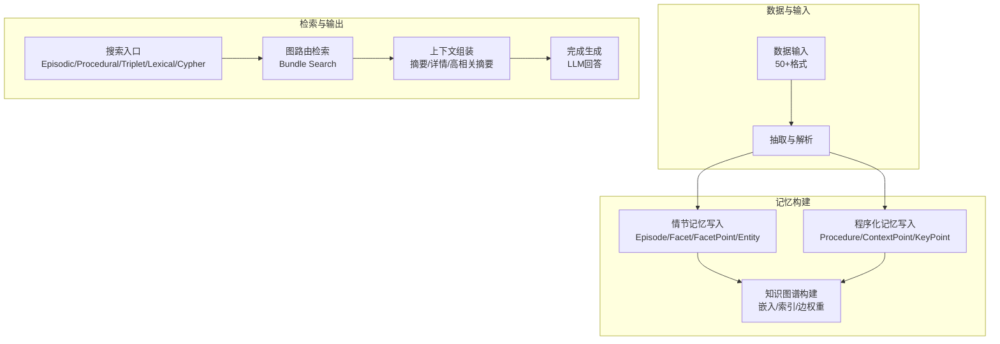
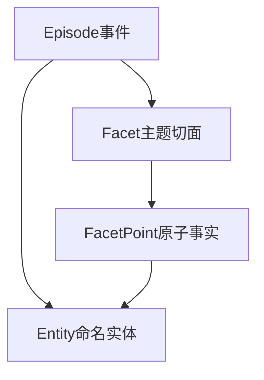
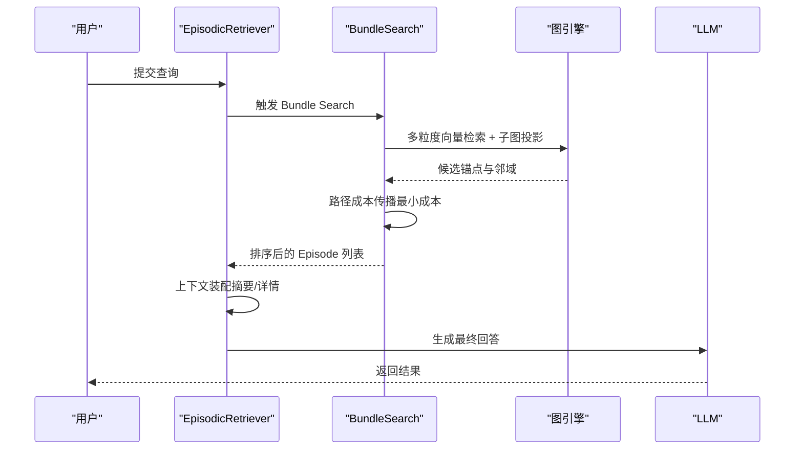
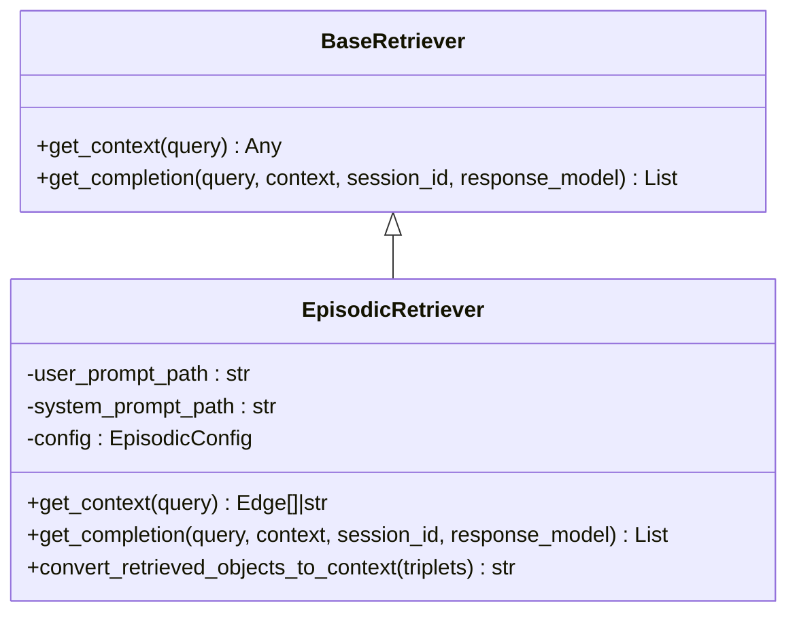
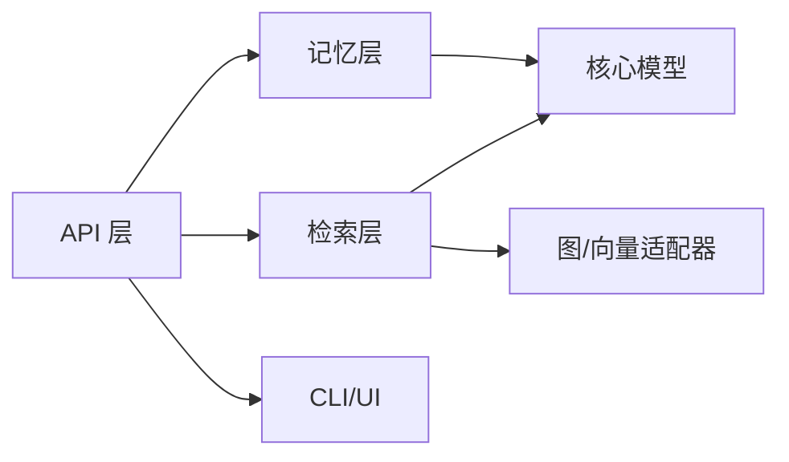

# 什么是 M-flow

<cite>
**本文引用的文件列表**
- [README.md](file://README.md)
- [RETRIEVAL_ARCHITECTURE.md](file://docs/RETRIEVAL_ARCHITECTURE.md)
- [__init__.py](file://m_flow/__init__.py)
- [models.py（记忆节点）](file://m_flow/core/models/MemoryNode.py)
- [models.py（情节记忆）](file://m_flow/memory/episodic/models.py)
- [models.py（程序化记忆）](file://m_flow/memory/procedural/models.py)
- [base_retriever.py](file://m_flow/retrieval/base_retriever.py)
- [episodic_retriever.py](file://m_flow/retrieval/episodic_retriever.py)
- [simple_example.py](file://examples/python/simple_example.py)
- [agentic_reasoning_procurement_example.py](file://examples/python/agentic_reasoning_procurement_example.py)
- [multimedia_example.py](file://examples/python/multimedia_example.py)
</cite>

## 目录
1. [引言](#引言)
2. [项目结构](#项目结构)
3. [核心组件](#核心组件)
4. [架构总览](#架构总览)
5. [详细组件分析](#详细组件分析)
6. [依赖关系分析](#依赖关系分析)
7. [性能考量](#性能考量)
8. [故障排查指南](#故障排查指南)
9. [结论](#结论)
10. [附录](#附录)

## 引言
M-flow 是一个以“认知记忆系统”为理念的人工智能知识记忆引擎，它在检索范式上与传统 RAG 系统存在根本差异：不是“相似度匹配”，而是“路径成本推理”。M-flow 将知识组织为四层锥形图（Episode、Facet、FacetPoint、Entity），通过“图路由检索”而非向量相似度，将查询锚定到最合适的粒度层级，并沿语义加权边传播证据，最终以“最强证据链”的路径成本对 Episode 进行评分与排序。

- 核心理念
  - 相似度只是候选匹配；M-flow 的关键在于“锚定粒度 + 图路由 + 路径成本最小化”。
  - “相关性不是分数，是路径”：一条强证据链足以证明相关，无需平均多个弱路径。
- 与传统 RAG 的区别
  - 传统 RAG：向量检索 + 结构辅助（如社区/实体），但最终仍以相似度为主导。
  - M-flow：图即评分器，锚点命中后由图拓扑与语义边共同决定最终相关性。

**章节来源**
- [README.md: 25-182:25-182](file://README.md#L25-L182)
- [RETRIEVAL_ARCHITECTURE.md: 1-137:1-137](file://docs/RETRIEVAL_ARCHITECTURE.md#L1-L137)

## 项目结构
M-flow 的核心模块围绕“记忆构建（episodic/procedural）+ 检索（图路由 Bundle Search）+ API/CLI/UI”展开，采用分层设计：数据输入 → 抽取与解析 → 记忆构建（知识图谱）→ 搜索（图路由检索）→ 完成生成。

**图表来源**
- [README.md: 328-365:328-365](file://README.md#L328-L365)

**章节来源**
- [README.md: 328-365:328-365](file://README.md#L328-L365)

## 核心组件
- 记忆节点模型
  - 统一的 MemoryNode 基类，支持版本化、时间戳、向量化索引字段提取等能力，作为所有图节点的基类。
- 情节记忆模型
  - Episode/Facet/FacetPoint/Entity 的结构化输出模式，支撑“锥形图”存储与检索。
- 程序化记忆模型
  - Procedure 及其上下文点（when/why/boundary/outcome/prereq/exception）与关键点（steps/preferences/persona/habits），用于抽象可复用的知识。
- 检索器接口
  - BaseRetriever 抽象了检索与完成生成的统一接口，EpisodicRetriever 实现了基于 Bundle Search 的情节检索。

**章节来源**
- [models.py（记忆节点）: 27-106:27-106](file://m_flow/core/models/MemoryNode.py#L27-L106)
- [models.py（情节记忆）: 197-548:197-548](file://m_flow/memory/episodic/models.py#L197-L548)
- [models.py（程序化记忆）: 154-249:154-249](file://m_flow/memory/procedural/models.py#L154-L249)
- [base_retriever.py: 11-61:11-61](file://m_flow/retrieval/base_retriever.py#L11-L61)
- [episodic_retriever.py: 130-448:130-448](file://m_flow/retrieval/episodic_retriever.py#L130-L448)

## 架构总览
M-flow 的检索架构以“图路由 Bundle Search”为核心，强调以下设计突破：
- 锚定粒度：查询命中最细粒度锚点（Entity/FacetPoint），再向下汇聚到 Episode。
- 边语义化：每条边携带自然语言描述并参与检索，成为“语义过滤器”。
- 路径成本：从锚点出发，沿边传播时累加边相关性成本与跃迁惩罚，取“最小成本路径”评分 Episode。
- 自适应置信：按不同粒度集合的命中强度动态分配权重，优先可靠路径。
- 惩罚直击：直接命中 Episode 摘要施加额外惩罚，避免“泛化噪音”。

**图表来源**
- [RETRIEVAL_ARCHITECTURE.md: 15-137:15-137](file://docs/RETRIEVAL_ARCHITECTURE.md#L15-L137)

**章节来源**
- [RETRIEVAL_ARCHITECTURE.md: 15-137:15-137](file://docs/RETRIEVAL_ARCHITECTURE.md#L15-L137)

## 详细组件分析

### 四层锥形图结构与设计理念
- 层级角色
  - Episode：边界化的语义焦点（事件/决策/流程），召回落地点。
  - Facet：Episode 的一个维度或主题切面。
  - FacetPoint：从 Facet 派生的原子断言/事实。
  - Entity：跨 Episode 的命名实体，充当桥接。
- 设计要点
  - 锥形方向反直觉：查询从“尖端”（细粒度）进入，目标在“底部”（Episode）。
  - 边承载语义：边文本参与向量化与检索，成为路径成本的一部分。
  - 最小成本：只要存在一条强链，Episode 即被召回，体现人类记忆“单点触发”的特点。

**图表来源**
- [README.md: 74-127:74-127](file://README.md#L74-L127)
- [RETRIEVAL_ARCHITECTURE.md: 21-43:21-43](file://docs/RETRIEVAL_ARCHITECTURE.md#L21-L43)

**章节来源**
- [README.md: 74-127:74-127](file://README.md#L74-L127)
- [RETRIEVAL_ARCHITECTURE.md: 21-43:21-43](file://docs/RETRIEVAL_ARCHITECTURE.md#L21-L43)

### 图路由检索（Bundle Search）的工作原理
- 多粒度候选：查询同时在实体、主题、原子事实、事件摘要等多集合中检索，获取候选锚点。
- 子图投影：将候选锚点及其邻域投影到知识图谱，形成可传播的拓扑结构。
- 成本传播：对每个 Episode 计算从各锚点出发的所有路径成本，取最小值作为评分。
- 输出装配：根据显示模式（摘要/详情/高度相关摘要）装配上下文，再交给 LLM 生成答案。

**图表来源**
- [episodic_retriever.py: 130-317:130-317](file://m_flow/retrieval/episodic_retriever.py#L130-L317)
- [RETRIEVAL_ARCHITECTURE.md: 44-124:44-124](file://docs/RETRIEVAL_ARCHITECTURE.md#L44-L124)

**章节来源**
- [episodic_retriever.py: 130-317:130-317](file://m_flow/retrieval/episodic_retriever.py#L130-L317)
- [RETRIEVAL_ARCHITECTURE.md: 44-124:44-124](file://docs/RETRIEVAL_ARCHITECTURE.md#L44-L124)

### 相关性不是分数而是路径
- 传统 RAG：以向量距离衡量相似度，可能被“看起来相关”误导。
- M-flow：以“路径成本最小化”衡量相关性，一条强链即可胜出，避免噪声干扰。
- 适配人类记忆：如同“想起一个人会联想到某件事”，M-flow 以证据链驱动召回。

**图表来源**
- [README.md: 51-68:51-68](file://README.md#L51-L68)

**章节来源**
- [README.md: 51-68:51-68](file://README.md#L51-L68)

### 检索器接口与实现
- BaseRetriever
  - 统一定义 get_context 与 get_completion，便于扩展不同检索策略。
- EpisodicRetriever
  - 基于 Bundle Search 的情节检索器，支持摘要/详情/高度相关摘要三种显示模式，自动注入 Episode 时间信息，支持会话缓存与摘要生成。

**图表来源**
- [base_retriever.py: 11-61:11-61](file://m_flow/retrieval/base_retriever.py#L11-L61)
- [episodic_retriever.py: 130-448:130-448](file://m_flow/retrieval/episodic_retriever.py#L130-L448)

**章节来源**
- [base_retriever.py: 11-61:11-61](file://m_flow/retrieval/base_retriever.py#L11-L61)
- [episodic_retriever.py: 130-448:130-448](file://m_flow/retrieval/episodic_retriever.py#L130-L448)

### 实际应用场景与示例

- 快速开始与基础检索
  - 示例展示了从添加文本、构建知识图谱到检索的完整流程，适合初学者快速上手。
  - 关键路径参考：[simple_example.py: 21-51:21-51](file://examples/python/simple_example.py#L21-L51)

- 多域采购代理推理
  - 将供应商目录、采购历史、政策规则分别注入不同数据集，通过检索进行跨域推理与决策支持。
  - 关键路径参考：[agentic_reasoning_procurement_example.py: 31-76:31-76](file://examples/python/agentic_reasoning_procurement_example.py#L31-L76)

- 多媒体内容检索
  - 支持音频/图像等多媒体文件的解析与知识图谱构建，随后进行自然语言查询与摘要检索。
  - 关键路径参考：[multimedia_example.py: 20-50:20-50](file://examples/python/multimedia_example.py#L20-L50)

**章节来源**
- [simple_example.py: 21-51:21-51](file://examples/python/simple_example.py#L21-L51)
- [agentic_reasoning_procurement_example.py: 31-76:31-76](file://examples/python/agentic_reasoning_procurement_example.py#L31-L76)
- [multimedia_example.py: 20-50:20-50](file://examples/python/multimedia_example.py#L20-L50)

## 依赖关系分析
- 模块耦合
  - 检索层（retrieval）依赖图适配器（adapters/graph）与提示词（llm/prompts）。
  - 记忆层（memory/episodic、memory/procedural）依赖核心模型（core/models）与抽取/解析（ingestion）。
  - API 层（api.v1）对外暴露 add/memorize/search/query 等操作，供 CLI/UI 使用。
- 外部依赖
  - 向量数据库（Chroma/Pinecone/LanceDB/pgvector）、图数据库（Neo4j/Kùzu/Neptune）、缓存（Redis/FSCache）等通过适配器接入。
- 潜在循环依赖
  - 当前结构以“领域模型（core）→ 记忆（memory）→ 检索（retrieval）→ API/CLI/UI”单向依赖为主，未见明显循环。

**图表来源**
- [README.md: 347-365:347-365](file://README.md#L347-L365)
- [__init__.py: 21-56:21-56](file://m_flow/__init__.py#L21-L56)

**章节来源**
- [README.md: 347-365:347-365](file://README.md#L347-L365)
- [__init__.py: 21-56:21-56](file://m_flow/__init__.py#L21-L56)

## 性能考量
- 多粒度并行检索：在多个集合上并行检索，提高命中率与召回质量。
- 自适应置信：根据各粒度集合的命中强度动态调整权重，减少低质量路径的影响。
- 惩罚直击：对直接命中 Episode 摘要施加惩罚，避免宽泛匹配主导排序。
- 边语义过滤：不相关的边会显著增加路径成本，有效抑制噪声。
- 显示模式优化：摘要模式返回简洁上下文，详情模式返回更丰富的边文本，满足不同场景需求。

**章节来源**
- [RETRIEVAL_ARCHITECTURE.md: 113-137:113-137](file://docs/RETRIEVAL_ARCHITECTURE.md#L113-L137)
- [episodic_retriever.py: 204-250:204-250](file://m_flow/retrieval/episodic_retriever.py#L204-L250)

## 故障排查指南
- 知识图为空
  - 现象：检索返回空结果或警告“知识图无数据”。
  - 处理：确认已执行 add 与 memorize，检查数据是否成功入库。
  - 参考：[episodic_retriever.py: 197-201:197-201](file://m_flow/retrieval/episodic_retriever.py#L197-L201)
- 会话缓存与摘要
  - 现象：重复对话导致上下文冗余。
  - 处理：启用会话缓存与摘要生成，减少重复内容传输。
  - 参考：[episodic_retriever.py: 281-316:281-316](file://m_flow/retrieval/episodic_retriever.py#L281-L316)
- 显示模式异常
  - 现象：摘要模式未返回预期文本。
  - 处理：检查 display_mode 设置与 edge_text 注入逻辑。
  - 参考：[episodic_retriever.py: 319-404:319-404](file://m_flow/retrieval/episodic_retriever.py#L319-L404)

**章节来源**
- [episodic_retriever.py: 197-201:197-201](file://m_flow/retrieval/episodic_retriever.py#L197-L201)
- [episodic_retriever.py: 281-316:281-316](file://m_flow/retrieval/episodic_retriever.py#L281-L316)
- [episodic_retriever.py: 319-404:319-404](file://m_flow/retrieval/episodic_retriever.py#L319-L404)

## 结论
M-flow 通过“锥形图 + 图路由 + 路径成本最小化”的检索范式，实现了“相关性是路径”的认知记忆系统。它不仅在多粒度检索上具备自适应能力，还能通过边语义与惩罚机制有效抑制噪声，使检索结果更贴近真实语义关联。对于初学者，建议从简单示例入手，逐步理解“锚定粒度 → 图路由 → 路径成本”的核心流程；对于有经验的开发者，可基于 EpisodicRetriever 扩展更多检索模式，并结合多数据库适配器实现生产级部署。

## 附录
- 快速开始与安装
  - 参考：[README.md: 274-327:274-327](file://README.md#L274-L327)
- 项目布局与模块职责
  - 参考：[README.md: 344-365:344-365](file://README.md#L344-L365)
- 核心 API 入口
  - 参考：[__init__.py: 21-56:21-56](file://m_flow/__init__.py#L21-L56)