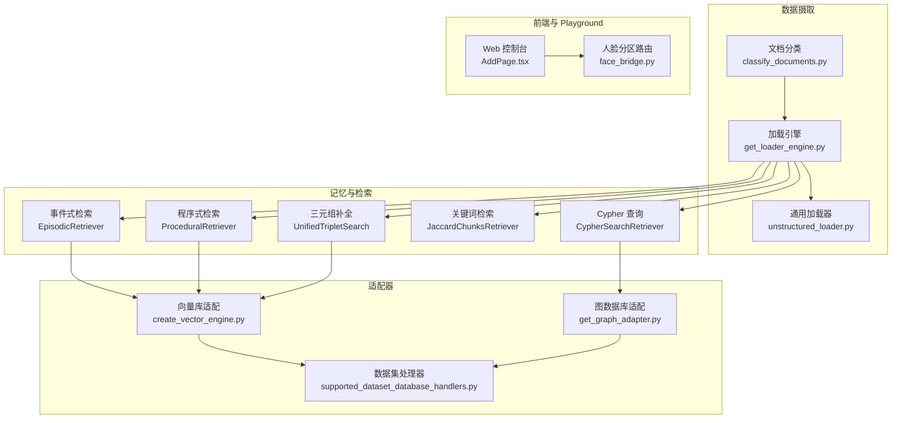
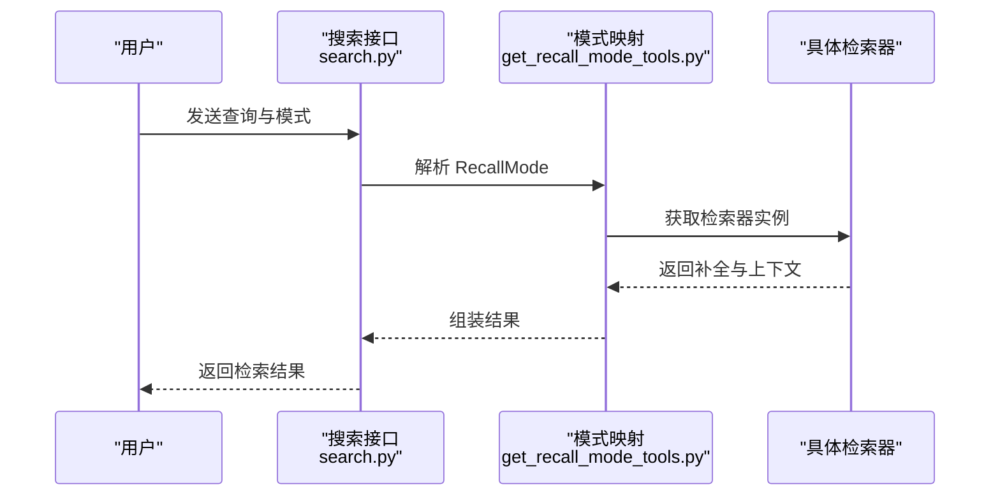
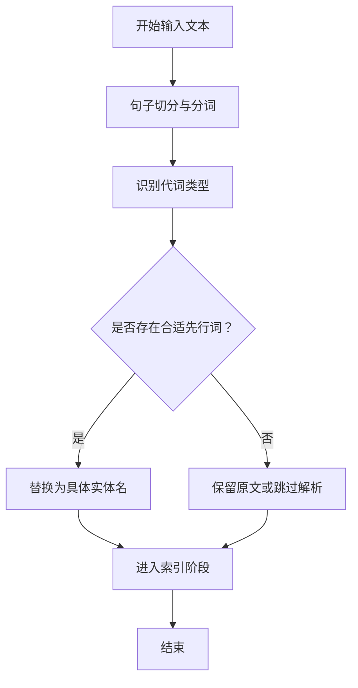
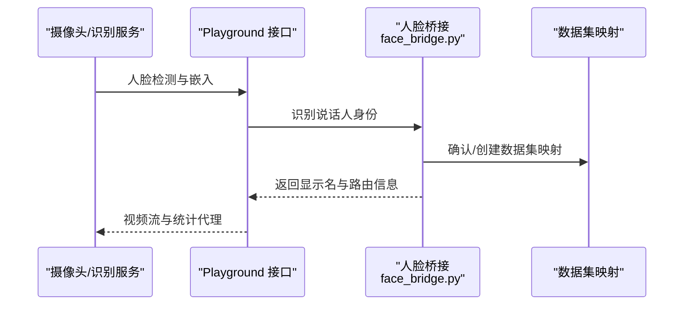
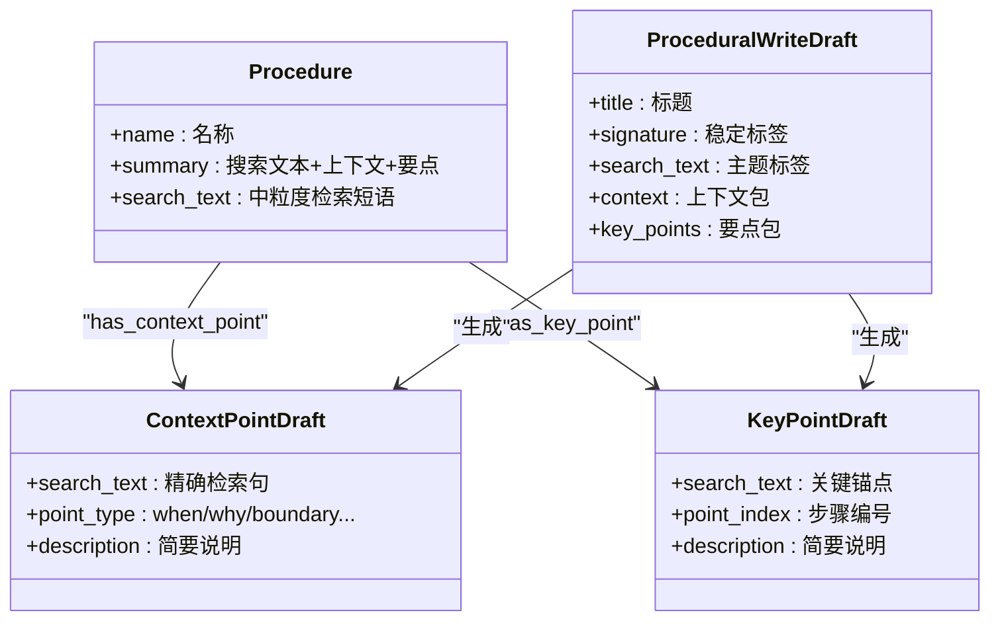
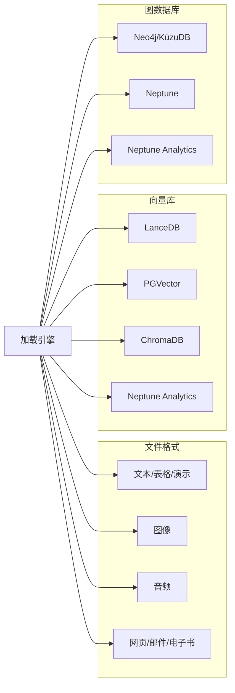
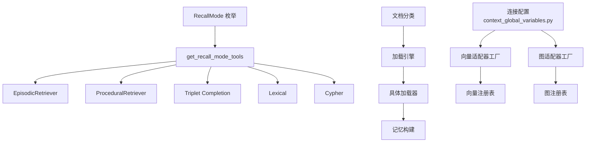

# 功能特性

<cite>
**本文引用的文件**
- [README.md](file://README.md)
- [RETRIEVAL_ARCHITECTURE.md](file://docs/RETRIEVAL_ARCHITECTURE.md)
- [get_recall_mode_tools.py](file://m_flow/search/methods/get_recall_mode_tools.py)
- [search.py](file://m_flow/api/v1/search/search.py)
- [RecallMode.py](file://m_flow/search/types/RecallMode.py)
- [coreference.py](file://coreference/coreference_module/coreference.py)
- [README.md](file://coreference/README.md)
- [get_playground_router.py](file://m_flow/api/v1/playground/routers/get_playground_router.py)
- [face_bridge.py](file://m_flow/api/v1/playground/face_bridge.py)
- [__init__.py](file://m_flow/memory/procedural/__init__.py)
- [models.py](file://m_flow/memory/procedural/models.py)
- [Procedure.py](file://m_flow/core/domain/models/Procedure.py)
- [unstructured_loader.py](file://m_flow/shared/loaders/external/unstructured_loader.py)
- [classify_documents.py](file://m_flow/ingestion/documents/classify_documents.py)
- [supported_databases.py](file://m_flow/adapters/vector/supported_databases.py)
- [supported_databases.py](file://m_flow/adapters/graph/supported_databases.py)
- [create_vector_engine.py](file://m_flow/adapters/vector/create_vector_engine.py)
- [get_graph_adapter.py](file://m_flow/adapters/graph/get_graph_adapter.py)
- [supported_dataset_database_handlers.py](file://m_flow/adapters/dataset_database_handler/supported_dataset_database_handlers.py)
- [context_global_variables.py](file://m_flow/context_global_variables.py)
- [get_loader_engine.py](file://m_flow/shared/loaders/get_loader_engine.py)
- [use_loader.py](file://m_flow/shared/loaders/use_loader.py)
- [file-validation.ts](file://m_flow-frontend/src/lib/file-validation.ts)
- [AddPage.tsx](file://m_flow-frontend/src/components/memorize/AddPage.tsx)
</cite>

## 目录
1. [简介](#简介)
2. [项目结构](#项目结构)
3. [核心组件](#核心组件)
4. [架构总览](#架构总览)
5. [详细组件分析](#详细组件分析)
6. [依赖关系分析](#依赖关系分析)
7. [性能考量](#性能考量)
8. [故障排查指南](#故障排查指南)
9. [结论](#结论)
10. [附录](#附录)

## 简介
本文件面向使用者与开发者，系统化梳理 M-flow 的五大检索模式、共指消解、人脸感知记忆分区、程序化记忆、多格式文件支持与多数据库适配能力，并给出典型应用场景与使用建议，帮助快速上手并最大化发挥系统能力。

## 项目结构
M-flow 采用分层清晰的模块化组织：数据摄取与预处理、知识抽取与记忆构建、检索与推理、适配器与前端控制台。核心能力分布如下：
- 数据摄取与预处理：文档分类、文本/图像/音频解析、统一加载引擎
- 记忆体系：事件式（Episodic）与程序式（Procedural）双轨
- 检索子系统：Episodic、Procedural、Triplet Completion、Lexical、Cypher
- 适配器层：向量库、图数据库、缓存、数据集隔离处理器
- 前端与 Playground：可视化配置、交互式聊天与人脸分区路由

**图表来源**
- [classify_documents.py:93-106](file://m_flow/ingestion/documents/classify_documents.py#L93-L106)
- [unstructured_loader.py:49-91](file://m_flow/shared/loaders/external/unstructured_loader.py#L49-L91)
- [get_loader_engine.py:17-35](file://m_flow/shared/loaders/get_loader_engine.py#L17-L35)
- [get_recall_mode_tools.py:17-125](file://m_flow/search/methods/get_recall_mode_tools.py#L17-L125)
- [create_vector_engine.py:15-50](file://m_flow/adapters/vector/create_vector_engine.py#L15-L50)
- [get_graph_adapter.py:81-115](file://m_flow/adapters/graph/get_graph_adapter.py#L81-L115)
- [supported_dataset_database_handlers.py:17-30](file://m_flow/adapters/dataset_database_handler/supported_dataset_database_handlers.py#L17-L30)
- [AddPage.tsx:510-541](file://m_flow-frontend/src/components/memorize/AddPage.tsx#L510-L541)
- [face_bridge.py:75-311](file://m_flow/api/v1/playground/face_bridge.py#L75-L311)

**章节来源**
- [README.md:344-365](file://README.md#L344-L365)
- [classify_documents.py:93-106](file://m_flow/ingestion/documents/classify_documents.py#L93-L106)
- [unstructured_loader.py:49-91](file://m_flow/shared/loaders/external/unstructured_loader.py#L49-L91)
- [get_loader_engine.py:17-35](file://m_flow/shared/loaders/get_loader_engine.py#L17-L35)

## 核心组件
- 检索模式与工具映射：通过检索模式枚举选择对应检索器，统一编排完成“补全 + 上下文”两阶段输出。
- 共指消解：在数据摄取阶段解析代词，将指称替换为具体实体，避免检索期出现锚点缺失。
- 人脸感知记忆分区：Playground 通过外部人脸识别服务识别说话人，自动建立/映射到专属数据集，实现按人记忆隔离与路由。
- 程序化记忆：从内容中抽象可复用的流程与偏好，形成 Procedure 及其细粒度 ContextPoint/KeyPoint，支持检索、版本与治理。
- 多格式文件支持：基于统一加载引擎与文档分类，覆盖文本、表格、演示、图像、音频、网页、电子书等。
- 多数据库适配：向量库与图数据库均以注册表方式扩展，支持本地与云厂商方案。

**章节来源**
- [get_recall_mode_tools.py:17-125](file://m_flow/search/methods/get_recall_mode_tools.py#L17-L125)
- [RecallMode.py:10-28](file://m_flow/search/types/RecallMode.py#L10-L28)
- [coreference.py:1-1546](file://coreference/coreference_module/coreference.py#L1-L1546)
- [README.md:103-142](file://coreference/README.md#L103-L142)
- [face_bridge.py:75-311](file://m_flow/api/v1/playground/face_bridge.py#L75-L311)
- [get_playground_router.py:503-567](file://m_flow/api/v1/playground/routers/get_playground_router.py#L503-L567)
- [__init__.py:1-43](file://m_flow/memory/procedural/__init__.py#L1-L43)
- [models.py:154-249](file://m_flow/memory/procedural/models.py#L154-L249)
- [Procedure.py:22-35](file://m_flow/core/domain/models/Procedure.py#L22-L35)
- [unstructured_loader.py:49-91](file://m_flow/shared/loaders/external/unstructured_loader.py#L49-L91)
- [classify_documents.py:28-65](file://m_flow/ingestion/documents/classify_documents.py#L28-L65)
- [supported_databases.py:1-8](file://m_flow/adapters/vector/supported_databases.py#L1-L8)
- [supported_databases.py:1-8](file://m_flow/adapters/graph/supported_databases.py#L1-L8)
- [create_vector_engine.py:15-50](file://m_flow/adapters/vector/create_vector_engine.py#L15-L50)
- [get_graph_adapter.py:81-115](file://m_flow/adapters/graph/get_graph_adapter.py#L81-L115)

## 架构总览
M-flow 的检索以“图引导的捆绑包搜索”为核心：查询先经多粒度向量召回，再投影入知识图，沿语义加权边传播成本，最终以 Episode 为单位评分排序。边缘携带自然语言描述，成为路径成本的重要过滤因子；最小化策略确保“一条强链即可相关”。

**图表来源**
- [RETRIEVAL_ARCHITECTURE.md:44-82](file://docs/RETRIEVAL_ARCHITECTURE.md#L44-L82)
- [RETRIEVAL_ARCHITECTURE.md:83-98](file://docs/RETRIEVAL_ARCHITECTURE.md#L83-L98)
- [RETRIEVAL_ARCHITECTURE.md:113-124](file://docs/RETRIEVAL_ARCHITECTURE.md#L113-L124)

**章节来源**
- [README.md:184-217](file://README.md#L184-L217)
- [RETRIEVAL_ARCHITECTURE.md:15-137](file://docs/RETRIEVAL_ARCHITECTURE.md#L15-L137)

## 详细组件分析

### 五大检索模式详解与适用场景
- Episodic（事件式）
  - 特点：以知识图的“倒锥体”拓扑为基础，锚点越精细（实体/片段点）路径成本越低；优先从尖部向基部传播，Episode 为返回单元。
  - 适用：事件回溯、情境记忆、跨文档实体桥接、需要强证据链支撑的答案。
  - API 使用：默认检索模式，适合大多数问答与分析。
  - 参考：检索器注册与参数装配见检索工具构造。

- Procedural（程序式）
  - 特点：针对可复用流程与偏好，Procedure 作为锚点，通过 ContextPoint/KeyPoint 细粒度检索；强调“何时/为何/边界/前置/异常”等上下文与步骤要点。
  - 适用：工作流检索、操作手册、团队规范、个人习惯与偏好固化。
  - 参考：程序式写入与模型定义位于程序式模块。

- Triplet Completion（三元组补全）
  - 特点：向量召回后对图中三元组进行重排与补全，适合定制化与二次开发。
  - 适用：需要结合图结构进行推理的场景，或对检索结果进行二次加工。
  - 参考：检索工具映射包含该模式。

- Lexical（关键词/字面匹配）
  - 特点：基于词法相似度的块级检索，适合精确术语匹配与停用词敏感查找。
  - 适用：法规条款定位、技术术语核对、严格关键字检索。
  - 参考：检索工具映射包含该模式。

- Cypher（图数据库原生查询）
  - 特点：直接执行 Cypher 语法，适合高级用户进行特定图遍历与复杂关系查询。
  - 适用：图分析、审计追踪、关系挖掘、自定义报表。
  - 参考：检索工具映射包含该模式。

**图表来源**
- [search.py:176-210](file://m_flow/api/v1/search/search.py#L176-L210)
- [get_recall_mode_tools.py:17-125](file://m_flow/search/methods/get_recall_mode_tools.py#L17-L125)
- [RecallMode.py:10-28](file://m_flow/search/types/RecallMode.py#L10-L28)

**章节来源**
- [search.py:176-210](file://m_flow/api/v1/search/search.py#L176-L210)
- [get_recall_mode_tools.py:17-125](file://m_flow/search/methods/get_recall_mode_tools.py#L17-L125)
- [RecallMode.py:10-28](file://m_flow/search/types/RecallMode.py#L10-L28)

### 共指消解：数据摄取阶段的指称规范化
- 在对话或多轮文本中，系统维护会话级实体跟踪，识别代词并解析为具体先行词，保证后续索引与检索锚点完整。
- 优势：避免“Turn 2 中的‘她’无法锚定到实体 Maria”的情况，确保跨句证据可被检索。
- 参考：核心消解逻辑与不解析情形（第一人称、反射代词、泛指等）。

**图表来源**
- [coreference.py:1-1546](file://coreference/coreference_module/coreference.py#L1-L1546)
- [README.md:103-142](file://coreference/README.md#L103-L142)

**章节来源**
- [README.md:188-203](file://README.md#L188-L203)
- [coreference.py:1-1546](file://coreference/coreference_module/coreference.py#L1-L1546)
- [README.md:103-142](file://coreference/README.md#L103-L142)

### 人脸感知记忆分区：基于生物特征的身份隔离与自动路由
- Playground 集成外部人脸识别服务，实时识别人脸并生成注册 ID，自动为每个人创建专属数据集映射。
- 支持重命名、状态代理、视频流签名访问等能力，实现“谁在说话，就路由到谁的记忆”。
- 场景：多人会议记录、多用户协作知识库、隐私隔离的个人助理。

**图表来源**
- [get_playground_router.py:503-567](file://m_flow/api/v1/playground/routers/get_playground_router.py#L503-L567)
- [face_bridge.py:75-311](file://m_flow/api/v1/playground/face_bridge.py#L75-L311)

**章节来源**
- [README.md:204-211](file://README.md#L204-L211)
- [get_playground_router.py:503-567](file://m_flow/api/v1/playground/routers/get_playground_router.py#L503-L567)
- [face_bridge.py:75-311](file://m_flow/api/v1/playground/face_bridge.py#L75-L311)

### 程序化记忆：抽象模式与可复用工作流
- 写入阶段：由 LLM 抽象 Procedure（流程）与 Preference（偏好），产出摘要与细粒度要点草稿。
- 检索阶段：Procedure 作为锚点，通过 ContextPoint/KeyPoint 与边文本形成三元检索结构，支持版本管理与合并决策。
- 设计原则：上下文与流程强关联、要点可检索、存储质量优先、增量更新与安全门控。

**图表来源**
- [Procedure.py:22-35](file://m_flow/core/domain/models/Procedure.py#L22-L35)
- [models.py:154-249](file://m_flow/memory/procedural/models.py#L154-L249)

**章节来源**
- [README.md:212-217](file://README.md#L212-L217)
- [__init__.py:1-43](file://m_flow/memory/procedural/__init__.py#L1-L43)
- [models.py:154-249](file://m_flow/memory/procedural/models.py#L154-L249)
- [Procedure.py:22-35](file://m_flow/core/domain/models/Procedure.py#L22-L35)

### 文件格式与多数据库适配：兼容性与扩展性
- 文件格式支持
  - 文本类：PDF、TXT、CSV 等
  - 办公类：DOCX、XLSX、PPTX 等
  - 图像类：PNG/JPG/WebP 等
  - 音频类：MP3/AAC/WAV 等
  - 网页与邮件：HTML、RFC822
  - 电子书：EPUB
  - 前端 UI 展示支持约 10+ 常见扩展名，部分格式需额外依赖包。
- 数据库适配
  - 向量库：PGVector、ChromaDB、LanceDB、Neptune Analytics 等（可通过注册表扩展）
  - 图数据库：Neo4j、KùzuDB、Neptune、Neptune Analytics（含混合模式）
  - 数据集隔离：按用户/租户/数据集维度隔离存储与连接信息
- 加载引擎与注册
  - 统一加载接口与注册机制，支持动态扩展自定义加载器

**图表来源**
- [classify_documents.py:28-65](file://m_flow/ingestion/documents/classify_documents.py#L28-L65)
- [unstructured_loader.py:49-91](file://m_flow/shared/loaders/external/unstructured_loader.py#L49-L91)
- [file-validation.ts:11-33](file://m_flow-frontend/src/lib/file-validation.ts#L11-L33)
- [AddPage.tsx:510-541](file://m_flow-frontend/src/components/memorize/AddPage.tsx#L510-L541)
- [supported_databases.py:1-8](file://m_flow/adapters/vector/supported_databases.py#L1-L8)
- [supported_databases.py:1-8](file://m_flow/adapters/graph/supported_databases.py#L1-L8)
- [create_vector_engine.py:15-50](file://m_flow/adapters/vector/create_vector_engine.py#L15-L50)
- [get_graph_adapter.py:81-115](file://m_flow/adapters/graph/get_graph_adapter.py#L81-L115)
- [supported_dataset_database_handlers.py:17-30](file://m_flow/adapters/dataset_database_handler/supported_dataset_database_handlers.py#L17-L30)
- [context_global_variables.py:144-183](file://m_flow/context_global_variables.py#L144-L183)
- [get_loader_engine.py:17-35](file://m_flow/shared/loaders/get_loader_engine.py#L17-L35)
- [use_loader.py:16-35](file://m_flow/shared/loaders/use_loader.py#L16-L35)

**章节来源**
- [README.md:264-269](file://README.md#L264-L269)
- [classify_documents.py:28-65](file://m_flow/ingestion/documents/classify_documents.py#L28-L65)
- [unstructured_loader.py:49-91](file://m_flow/shared/loaders/external/unstructured_loader.py#L49-L91)
- [file-validation.ts:11-33](file://m_flow-frontend/src/lib/file-validation.ts#L11-L33)
- [AddPage.tsx:510-541](file://m_flow-frontend/src/components/memorize/AddPage.tsx#L510-L541)
- [supported_databases.py:1-8](file://m_flow/adapters/vector/supported_databases.py#L1-L8)
- [supported_databases.py:1-8](file://m_flow/adapters/graph/supported_databases.py#L1-L8)
- [create_vector_engine.py:15-50](file://m_flow/adapters/vector/create_vector_engine.py#L15-L50)
- [get_graph_adapter.py:81-115](file://m_flow/adapters/graph/get_graph_adapter.py#L81-L115)
- [supported_dataset_database_handlers.py:17-30](file://m_flow/adapters/dataset_database_handler/supported_dataset_database_handlers.py#L17-L30)
- [context_global_variables.py:144-183](file://m_flow/context_global_variables.py#L144-L183)
- [get_loader_engine.py:17-35](file://m_flow/shared/loaders/get_loader_engine.py#L17-L35)
- [use_loader.py:16-35](file://m_flow/shared/loaders/use_loader.py#L16-L35)

## 依赖关系分析
- 检索模式到检索器的映射：通过枚举与工厂函数将模式与具体检索器绑定，便于扩展新模式。
- 加载引擎与文档分类：统一入口负责根据扩展名/MIME 选择加载器，再进入 Typed Document 流程。
- 适配器注册与连接：向量/图数据库与数据集处理器均以注册表方式集中管理，支持按用户/数据集动态切换连接信息。
- 前端与 Playground：UI 展示支持格式清单与上传限制，Playground 通过桥接服务与人脸识别服务协同。

**图表来源**
- [RecallMode.py:10-28](file://m_flow/search/types/RecallMode.py#L10-L28)
- [get_recall_mode_tools.py:17-125](file://m_flow/search/methods/get_recall_mode_tools.py#L17-L125)
- [classify_documents.py:93-106](file://m_flow/ingestion/documents/classify_documents.py#L93-L106)
- [get_loader_engine.py:17-35](file://m_flow/shared/loaders/get_loader_engine.py#L17-L35)
- [context_global_variables.py:144-183](file://m_flow/context_global_variables.py#L144-L183)
- [create_vector_engine.py:15-50](file://m_flow/adapters/vector/create_vector_engine.py#L15-L50)
- [get_graph_adapter.py:81-115](file://m_flow/adapters/graph/get_graph_adapter.py#L81-L115)

**章节来源**
- [get_recall_mode_tools.py:17-125](file://m_flow/search/methods/get_recall_mode_tools.py#L17-L125)
- [classify_documents.py:93-106](file://m_flow/ingestion/documents/classify_documents.py#L93-L106)
- [context_global_variables.py:144-183](file://m_flow/context_global_variables.py#L144-L183)

## 性能考量
- 多粒度向量召回与图传播：通过“锚点越精细、路径成本越低”的设计，减少宽泛匹配带来的噪声；最小化策略确保强链优先。
- 边语义参与成本：边文本向量化参与评分，无效连接会被高成本阻断，降低结构噪声影响。
- 自适应置信权重：按不同集合的命中强度与区分度动态分配权重，提升检索稳健性。
- 并行与缓存：加载引擎与检索工具支持并行执行与缓存，降低重复开销。

[本节为通用指导，无需列出具体文件来源]

## 故障排查指南
- 检索模式未生效
  - 检查模式枚举是否正确传入，确认检索工具映射已注册对应模式。
  - 参考：检索模式与工具映射、搜索接口注释。
- 代词无法锚定
  - 确认共指消解配置与会话状态正常；检查不解析情形（如第一人称、反射代词等）。
  - 参考：共指消解实现与不解析列表。
- 人脸分区未创建/路由失败
  - 检查人脸识别服务可用性与 API Key；确认 Playground 路由接口返回成功。
  - 参考：Playground 路由与人脸桥接。
- 文件格式无法解析
  - 确认扩展名/MIME 映射存在；必要时安装额外依赖包；检查加载引擎注册。
  - 参考：文档分类映射、加载器注册与前端支持清单。
- 数据库连接异常
  - 核对环境变量与连接信息；确认数据集处理器与适配器注册表包含目标提供商。
  - 参考：连接配置、适配器工厂与注册表。

**章节来源**
- [search.py:176-210](file://m_flow/api/v1/search/search.py#L176-L210)
- [get_recall_mode_tools.py:17-125](file://m_flow/search/methods/get_recall_mode_tools.py#L17-L125)
- [coreference.py:1-1546](file://coreference/coreference_module/coreference.py#L1-L1546)
- [README.md:103-142](file://coreference/README.md#L103-L142)
- [get_playground_router.py:503-567](file://m_flow/api/v1/playground/routers/get_playground_router.py#L503-L567)
- [face_bridge.py:75-311](file://m_flow/api/v1/playground/face_bridge.py#L75-L311)
- [classify_documents.py:28-65](file://m_flow/ingestion/documents/classify_documents.py#L28-L65)
- [get_loader_engine.py:17-35](file://m_flow/shared/loaders/get_loader_engine.py#L17-L35)
- [file-validation.ts:11-33](file://m_flow-frontend/src/lib/file-validation.ts#L11-L33)
- [context_global_variables.py:144-183](file://m_flow/context_global_variables.py#L144-L183)
- [create_vector_engine.py:15-50](file://m_flow/adapters/vector/create_vector_engine.py#L15-L50)
- [get_graph_adapter.py:81-115](file://m_flow/adapters/graph/get_graph_adapter.py#L81-L115)

## 结论
M-flow 将“图引导的捆绑包搜索”作为检索范式，结合事件式与程序式双轨记忆、共指消解、人脸分区路由与强大的多格式/多数据库适配能力，形成从数据摄取到检索推理的完整闭环。通过合理选择检索模式与配置适配器，可在复杂问答、流程检索、跨文档实体桥接与多用户协作等场景中获得稳定且高质量的结果。

[本节为总结性内容，无需列出具体文件来源]

## 附录
- 快速开始与示例脚本可参考仓库根目录说明与 examples 目录中的示例。
- Playground 与人脸识别服务的部署与配置详见根目录说明与前端设置向导。

[本节为概览性内容，无需列出具体文件来源]