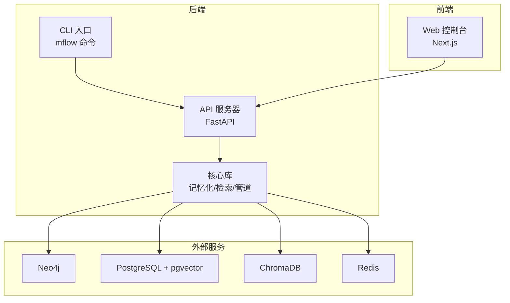
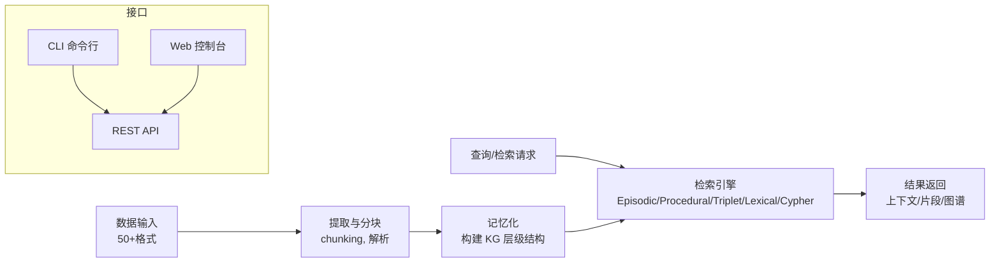
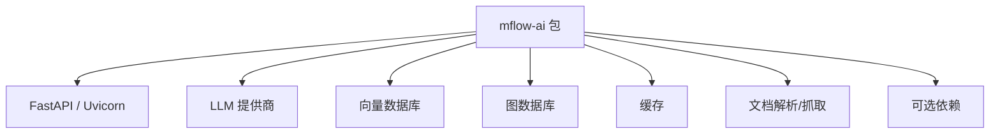

# 快速开始

<cite>
**本文引用的文件**
- [README.md](file://README.md)
- [pyproject.toml](file://pyproject.toml)
- [quickstart.sh](file://quickstart.sh)
- [quickstart.ps1](file://quickstart.ps1)
- [docker-compose.yml](file://docker-compose.yml)
- [m_flow/cli/app.py](file://m_flow/cli/app.py)
- [m_flow/__main__.py](file://m_flow/__main__.py)
- [m_flow/cli/commands/add_command.py](file://m_flow/cli/commands/add_command.py)
- [m_flow/cli/commands/search_command.py](file://m_flow/cli/commands/search_command.py)
- [m_flow/cli/commands/memorize_command.py](file://m_flow/cli/commands/memorize_command.py)
- [m_flow/api/client.py](file://m_flow/api/client.py)
- [examples/python/simple_example.py](file://examples/python/simple_example.py)
- [examples/python/m_flow_simple_document_demo.py](file://examples/python/m_flow_simple_document_demo.py)
</cite>

## 目录
1. [简介](#简介)
2. [项目结构](#项目结构)
3. [核心组件](#核心组件)
4. [架构总览](#架构总览)
5. [详细组件解析](#详细组件解析)
6. [依赖关系分析](#依赖关系分析)
7. [性能与资源建议](#性能与资源建议)
8. [故障排除指南](#故障排除指南)
9. [结论](#结论)
10. [附录](#附录)

## 简介
本指南面向首次接触 M-flow 的用户，帮助你在最短时间内完成安装与运行，体验“持久记忆 + 图谱检索”的核心能力。你将学会三种安装方式（Docker 一键安装、pip 安装、源码安装）、环境变量与 API 密钥配置、基础的添加记忆、记忆化与查询操作、CLI 常用命令以及 Web 控制台的启动与使用，并掌握常见问题的排查方法。

## 项目结构
M-flow 采用模块化分层设计，核心目录与职责概览如下：
- m_flow：后端核心库与 API（FastAPI），包含数据处理、记忆化、检索、管道、适配器等子系统
- m_flow-frontend：Next.js Web 控制台
- m_flow-mcp：MCP（模型上下文协议）服务，用于 IDE 集成
- mflow_workers：分布式执行辅助（可选）
- examples：示例脚本，涵盖文档处理、简单演示等
- deployment/docker-compose：多数据库与服务编排（Neo4j、PostgreSQL/pgvector、ChromaDB、Redis 等）

图表来源
- [docker-compose.yml:17-227](file://docker-compose.yml#L17-L227)
- [m_flow/api/client.py:268-337](file://m_flow/api/client.py#L268-L337)

章节来源
- [README.md:344-365](file://README.md#L344-L365)

## 核心组件
- 后端 API（FastAPI）：提供健康检查、认证、数据添加、记忆化、检索、图谱管理、权限、用户、维护等路由
- CLI：提供 add、memorize、search、config、UI 启动等命令
- Web 控制台：基于 Next.js 的本地 UI，便于可视化与交互
- 记忆化管线：从原始数据到知识图谱的分层结构（Episode/Facet/FacetPoint/Entity）
- 检索引擎：支持多种检索模式（Episodic、Procedural、Triplet Completion、Lexical、Cypher）

章节来源
- [m_flow/api/client.py:268-337](file://m_flow/api/client.py#L268-L337)
- [m_flow/cli/app.py:71-91](file://m_flow/cli/app.py#L71-L91)
- [README.md:274-273](file://README.md#L274-L273)

## 架构总览
下图展示了从数据输入到检索输出的端到端流程，以及 API、CLI、Web 控制台与数据库之间的关系。

图表来源
- [README.md:328-342](file://README.md#L328-L342)
- [m_flow/api/client.py:268-337](file://m_flow/api/client.py#L268-L337)

## 详细组件解析

### 安装方式一：Docker 一键安装（推荐）
适用场景
- 快速体验全栈（后端 + 前端 + 可选数据库）
- 跨平台（Linux/macOS/Windows）
- 需要多数据库或缓存时

安装步骤
1. 克隆仓库并进入目录
2. 运行一键脚本（Linux/macOS 使用 quickstart.sh；Windows 使用 quickstart.ps1）
3. 脚本会自动检测环境、创建 .env、提示输入 LLM API Key、选择部署模式并启动服务
4. 默认访问地址：前端 http://localhost:3000，API http://localhost:8000，API 文档 http://localhost:8000/docs

注意
- 若已有 .env，脚本会询问是否覆盖
- 如需自定义数据库（Neo4j/PostgreSQL/pgvector/ChromaDB/Redis），可在脚本中选择相应配置文件或使用自定义 profile

章节来源
- [README.md:276-283](file://README.md#L276-L283)
- [quickstart.sh:114-188](file://quickstart.sh#L114-L188)
- [quickstart.ps1:101-162](file://quickstart.ps1#L101-L162)
- [docker-compose.yml:1-227](file://docker-compose.yml#L1-L227)

### 安装方式二：pip 安装
适用场景
- 已有 Python 环境（3.10+），希望以包形式安装并直接使用
- 开发者或集成者需要在现有项目中引入 M-flow

安装步骤
1. 安装包：pip install mflow-ai（或 uv pip install mflow-ai）
2. 设置 LLM API Key 环境变量（例如 LLM_API_KEY）
3. 在 Python 中导入并使用（见下一节“基本使用”）

章节来源
- [README.md:285-291](file://README.md#L285-L291)
- [pyproject.toml:1-73](file://pyproject.toml#L1-L73)

### 安装方式三：源码安装
适用场景
- 需要对源码进行二次开发或贡献
- 需要最新未发布的特性

安装步骤
1. 克隆仓库并进入目录
2. 可选：使用 uv 进行同步安装（uv sync --dev --all-extras --reinstall）
3. 可选：可编辑安装（pip install -e .）

章节来源
- [README.md:292-297](file://README.md#L292-L297)
- [README.md:367-378](file://README.md#L367-L378)

### 环境配置与 API 密钥设置
通用步骤
- 复制模板文件：cp .env.template .env（Windows 使用复制命令）
- 编辑 .env 文件，填写 LLM API Key 与 Provider、Model 等
- 可选：根据需求开启特定数据库/缓存（Neo4j、PostgreSQL/pgvector、ChromaDB、Redis 等）

一键脚本会自动处理上述步骤并提示输入 API Key，同时允许选择 LLM Provider 与 Model。

章节来源
- [README.md:427-428](file://README.md#L427-L428)
- [quickstart.sh:148-188](file://quickstart.sh#L148-L188)
- [quickstart.ps1:127-162](file://quickstart.ps1#L127-L162)

### 基本使用：添加记忆、记忆化与查询
以下示例展示最小工作流：添加文本 → 记忆化 → 查询。

- Python 示例（异步）
  - 清理历史数据
  - 添加样本文本
  - 执行记忆化
  - 使用检索模式查询并打印结果

- 文档示例（处理本地文档）
  - 读取示例文档路径
  - 添加 → 记忆化 → 多次查询

章节来源
- [examples/python/simple_example.py:21-46](file://examples/python/simple_example.py#L21-L46)
- [examples/python/m_flow_simple_document_demo.py:12-35](file://examples/python/m_flow_simple_document_demo.py#L12-L35)

### CLI 工具基础用法
- 启动本地 UI：mflow -ui（同时启动后端、前端、MCP）
- 添加数据：mflow add "<你的文本>" 或 mflow add /path/to/file
- 记忆化：mflow memorize（可指定数据集、分块策略、内容类型、后台运行等）
- 搜索：mflow search "<你的问题>" --query-type EPISODIC（支持多种检索模式）

章节来源
- [m_flow/cli/app.py:120-144](file://m_flow/cli/app.py#L120-L144)
- [m_flow/cli/commands/add_command.py:51-76](file://m_flow/cli/commands/add_command.py#L51-L76)
- [m_flow/cli/commands/memorize_command.py:34-66](file://m_flow/cli/commands/memorize_command.py#L34-L66)
- [m_flow/cli/commands/search_command.py:78-114](file://m_flow/cli/commands/search_command.py#L78-L114)
- [README.md:319-326](file://README.md#L319-L326)

### Web 控制台启动与使用
- 一键启动：mflow -ui（默认监听前端 3000、后端 8000、MCP 8001）
- 访问 http://localhost:3000 查看控制台
- 控制台提供数据添加、检索、知识图谱可视化、配置向导等功能

章节来源
- [m_flow/cli/app.py:152-223](file://m_flow/cli/app.py#L152-L223)
- [m_flow/api/client.py:345-360](file://m_flow/api/client.py#L345-L360)

## 依赖关系分析
- 包依赖：FastAPI、Uvicorn、SQLAlchemy、Alembic、LLM 提供商（OpenAI、Anthropic、Gemini、Groq、Mistral、Ollama 等）、向量数据库（LanceDB、ChromaDB、pgvector、Milvus、Pinecone）、图数据库（Neo4j、Kùzu、Neptune）、缓存（Redis）、文档解析（unstructured、Docling、Playwright、BeautifulSoup 等）
- 可选依赖：Playground（中文指称消解）、LangChain、LlamaIndex、监控（Sentry、Langfuse）、AWS 存储等
- CLI 入口：mflow 命令由 pyproject.toml 中的入口点注册

图表来源
- [pyproject.toml:29-191](file://pyproject.toml#L29-L191)
- [m_flow/cli/app.py:222-223](file://m_flow/cli/app.py#L222-L223)

章节来源
- [pyproject.toml:1-323](file://pyproject.toml#L1-L323)
- [m_flow/cli/app.py:222-223](file://m_flow/cli/app.py#L222-L223)

## 性能与资源建议
- CPU/内存：后端容器默认限制 4 核 CPU、8GB 内存；如需更高吞吐，可按需调整 docker-compose 中的资源限制
- 数据库：根据数据规模与并发选择合适的图/向量数据库；生产环境建议使用独立数据库实例
- 模型与分块：合理设置 chunk_size 与 chunker 策略，避免过小导致检索碎片过多，过大影响上下文质量
- 并发与后台：大规模数据建议使用 --background 运行记忆化，避免阻塞 CLI

章节来源
- [docker-compose.yml:38-47](file://docker-compose.yml#L38-L47)

## 故障排除指南
常见问题与解决思路
- 端口占用
  - 现象：启动失败或健康检查超时
  - 处理：确认 8000（后端）、3000（前端）、8001（MCP）未被占用；必要时释放或修改映射
- Docker 无法连接
  - 现象：容器启动但 UI 无法访问
  - 处理：检查 Docker 守护进程状态；确认网络与端口映射；Windows/macOS 下注意 host.docker.internal 映射
- API Key 未配置
  - 现象：检索报错或无法调用 LLM
  - 处理：在 .env 中设置 LLM_API_KEY 与 LLM_PROVIDER/LLM_MODEL；重新加载环境
- 健康检查失败
  - 现象：/health 返回非 200
  - 处理：查看后端日志；检查数据库连接、缓存可用性；必要时缩短健康检查超时
- CLI 启动 UI 失败
  - 现象：mflow -ui 报错
  - 处理：确认 Docker 可用且已拉取镜像；查看日志并重试；必要时手动启动后端与前端

章节来源
- [quickstart.sh:97-112](file://quickstart.sh#L97-L112)
- [quickstart.ps1:87-99](file://quickstart.ps1#L87-L99)
- [m_flow/api/client.py:211-244](file://m_flow/api/client.py#L211-L244)
- [m_flow/cli/app.py:152-223](file://m_flow/cli/app.py#L152-L223)

## 结论
通过本指南，你可以快速完成 M-flow 的安装与运行，掌握添加记忆、记忆化与查询的基础流程，并能使用 CLI 与 Web 控制台进行日常操作。建议在体验完基础功能后，逐步探索不同检索模式、数据库适配与高级配置，以满足更复杂的业务场景。

## 附录

### 快速命令清单
- 一键安装与启动：./quickstart.sh 或 .\quickstart.ps1
- 启动本地 UI：mflow -ui
- 添加数据：mflow add "<文本>"
- 记忆化：mflow memorize
- 检索：mflow search "<问题>" --query-type EPISODIC

章节来源
- [README.md:276-283](file://README.md#L276-L283)
- [README.md:319-326](file://README.md#L319-L326)
- [m_flow/cli/app.py:120-144](file://m_flow/cli/app.py#L120-L144)