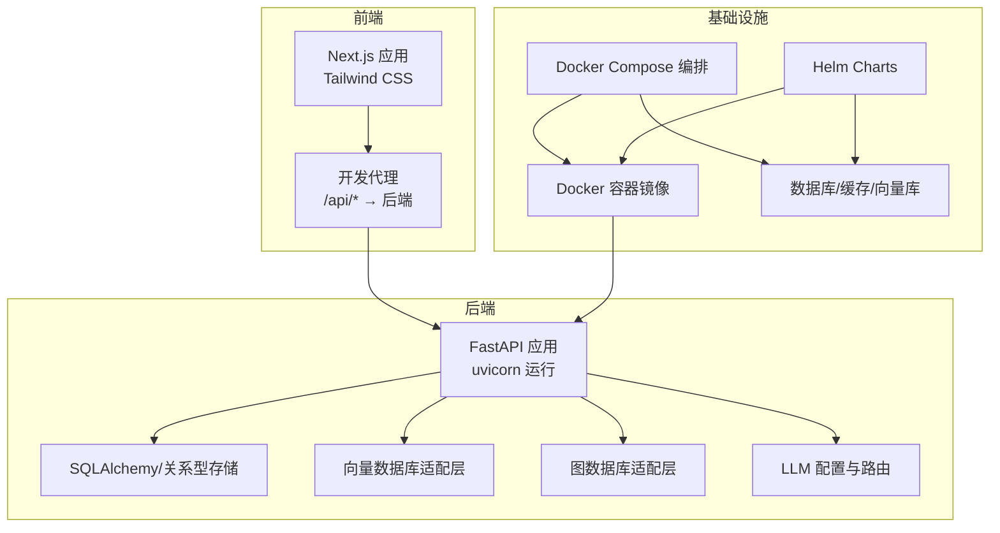
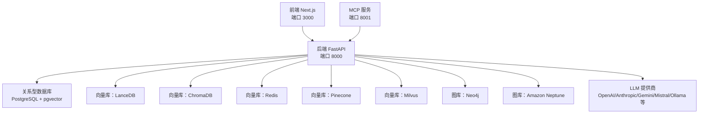
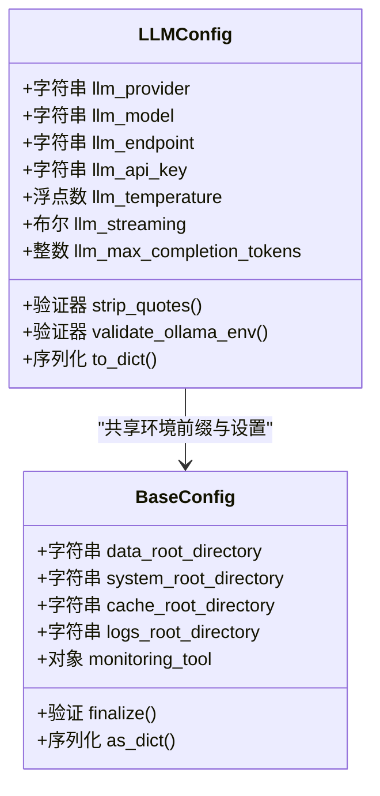
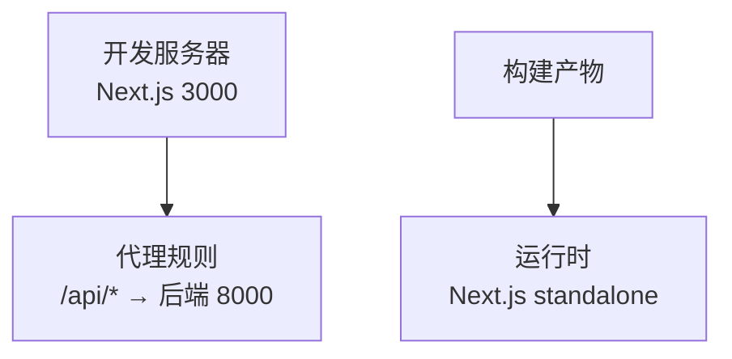
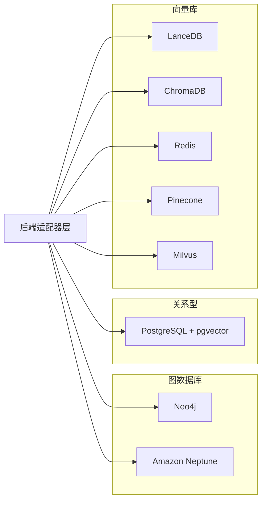
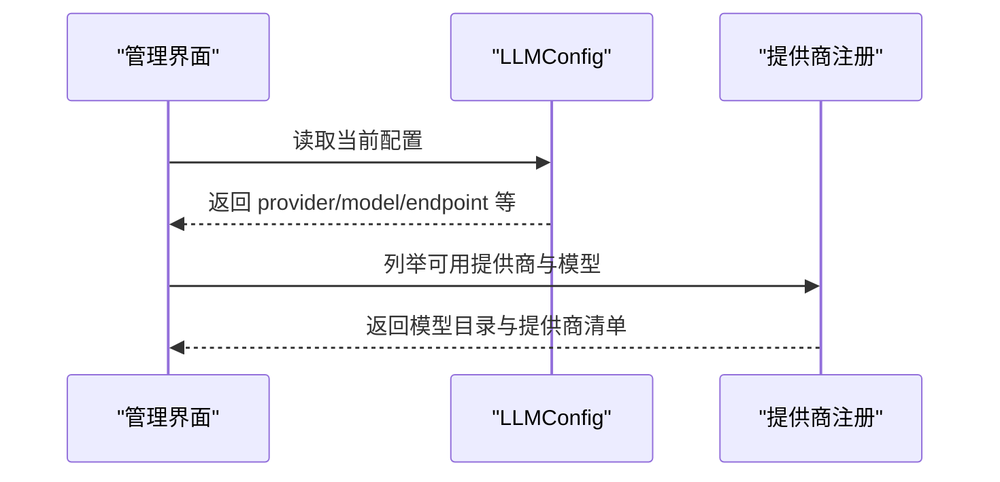
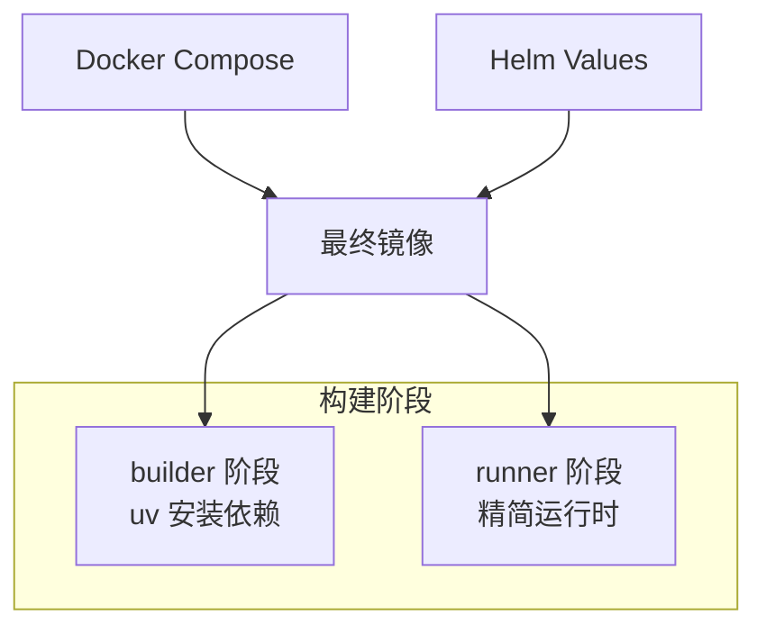

# 技术栈

<cite>
**本文引用的文件**
- [pyproject.toml](file://pyproject.toml)
- [Dockerfile](file://Dockerfile)
- [docker-compose.yml](file://docker-compose.yml)
- [m_flow-frontend/package.json](file://m_flow-frontend/package.json)
- [m_flow-frontend/next.config.mjs](file://m_flow-frontend/next.config.mjs)
- [deployment/helm/values.yaml](file://deployment/helm/values.yaml)
- [m_flow/config/settings/get_settings.py](file://m_flow/config/settings/get_settings.py)
- [m_flow/llm/config.py](file://m_flow/llm/config.py)
- [m_flow/base_config.py](file://m_flow/base_config.py)
- [m_flow/adapters/graph/supported_databases.py](file://m_flow/adapters/graph/supported_databases.py)
- [m_flow/adapters/vector/supported_databases.py](file://m_flow/adapters/vector/supported_databases.py)
- [m_flow/adapters/vector/pgvector/__init__.py](file://m_flow/adapters/vector/pgvector/__init__.py)
- [m_flow/adapters/graph/neo4j_driver/__init__.py](file://m_flow/adapters/graph/neo4j_driver/__init__.py)
- [m_flow/adapters/relational/sqlalchemy/__init__.py](file://m_flow/adapters/relational/sqlalchemy/__init__.py)
</cite>

## 目录
1. [简介](#简介)
2. [项目结构](#项目结构)
3. [核心组件](#核心组件)
4. [架构总览](#架构总览)
5. [详细组件分析](#详细组件分析)
6. [依赖关系与版本兼容性](#依赖关系与版本兼容性)
7. [性能考量](#性能考量)
8. [故障排查指南](#故障排查指南)
9. [结论](#结论)
10. [附录](#附录)

## 简介
本文件系统性梳理 M-flow 的技术栈，覆盖后端（Python 3.10+、FastAPI、Uvicorn、SQLAlchemy）、前端（Next.js、React、Tailwind CSS）、数据库适配器（Neo4j、Amazon Neptune、KùzuDB、LanceDB、PostgreSQL/pgvector、ChromaDB、Pinecone、Milvus 等）、LLM 提供商（OpenAI、Anthropic、Gemini、Mistral、Ollama 等）、容器化与部署（Docker、Docker Compose、Helm Charts）以及版本兼容性与依赖关系。旨在帮助开发者与运维人员快速理解并高效搭建与扩展 M-flow。

## 项目结构
M-flow 采用多模块分层组织：后端主工程、前端工程、MCP 服务、工作进程、示例与测试等。后端通过 FastAPI 提供 API，容器化打包，Compose 统一编排；前端基于 Next.js，开发时通过代理转发到后端；Helm Chart 支持 Kubernetes 部署。

图表来源
- [Dockerfile:1-90](file://Dockerfile#L1-L90)
- [docker-compose.yml:1-227](file://docker-compose.yml#L1-L227)
- [m_flow-frontend/next.config.mjs:1-29](file://m_flow-frontend/next.config.mjs#L1-L29)

章节来源
- [Dockerfile:1-90](file://Dockerfile#L1-L90)
- [docker-compose.yml:1-227](file://docker-compose.yml#L1-L227)
- [m_flow-frontend/next.config.mjs:1-29](file://m_flow-frontend/next.config.mjs#L1-L29)

## 核心组件
- 后端运行时与框架
  - Python 版本要求：>=3.10（推荐 3.11/3.12）
  - Web 框架：FastAPI（>=0.115.0,<1.0.0）
  - ASGI 服务器：Uvicorn（>=0.32.0,<1.0.0）
  - 异步 HTTP 客户端：aiohttp（>=3.10.0,<4.0.0）
- 数据与存储
  - ORM/SQL：SQLAlchemy（>=2.0.30,<3.0.0）
  - 迁移工具：Alembic（>=1.13.0,<2）
  - 关系型驱动：asyncpg（>=0.29.0,<1.0.0），psycopg2/psycopg2-binary（>=2.9.9,<3）
  - 向量数据库：LanceDB（>=0.22.0,<1.0.0）、ChromaDB（>=0.5,<0.7）、Redis（>=5.0.0,<8.0.0）、Pinecone（>=5.0）、Milvus（>=2.4）
  - 图数据库：Neo4j（>=5.27.0,<6）、Amazon Neptune（langchain_aws>=0.2.20）
  - 本地嵌入：fastembed（<=0.8.0）、onnxruntime（<=1.22.1）
- 大语言模型与结构化输出
  - LLM 路由与抽象：LiteLLM（>=1.75.0）
  - 结构化输出：instructor（>=1.8.0,<2.0.0）
  - Tokenizer：tiktoken（>=0.7.0,<1.0.0）
  - OpenAI SDK：openai（>=1.80.0）
  - 其他提供商：Anthropic、Gemini、Groq、Mistral、Ollama、Cohere、DeepSeek/Qwen/Doubao（通过 LiteLLM 路由）
- 前端
  - 框架：Next.js 14.2.3（React 18）
  - UI 与状态：Radix UI、Zustand、TanStack React Query
  - 样式：Tailwind CSS 3.4.1
  - 测试与开发：Vitest、Playwright、ESLint、TypeScript
- 工具与可观测性
  - 重试与限流：tenacity、aiolimiter、limits
  - 日志与结构化日志：structlog
  - 可观测性：Sentry（可选）、Langfuse（可选）

章节来源
- [pyproject.toml:8-73](file://pyproject.toml#L8-L73)
- [pyproject.toml:82-191](file://pyproject.toml#L82-L191)
- [m_flow-frontend/package.json:1-65](file://m_flow-frontend/package.json#L1-L65)

## 架构总览
下图展示后端、前端与外部数据库/向量库的交互关系，以及容器化与编排入口。

图表来源
- [docker-compose.yml:17-227](file://docker-compose.yml#L17-L227)
- [pyproject.toml:82-124](file://pyproject.toml#L82-L124)
- [m_flow-frontend/next.config.mjs:8-28](file://m_flow-frontend/next.config.mjs#L8-L28)

## 详细组件分析

### 后端技术栈与运行时
- Python 与包管理
  - 使用 uv 作为包管理器，构建阶段与运行阶段分离，提升镜像体积与启动速度。
  - 推荐 Python 3.11/3.12，满足 >=3.10 的最低要求。
- Web 与 API
  - FastAPI 提供类型安全的异步接口；uvicorn 作为生产级 ASGI 服务器。
  - aiohttp 用于需要同步 HTTP 客户端的场景。
- 数据与存储
  - SQLAlchemy 2.x 作为 ORM；Alembic 管理迁移；asyncpg/psycopg2 用于 PostgreSQL。
  - LanceDB、ChromaDB、Redis、Pinecone、Milvus 作为向量存储后端。
  - Neo4j、Amazon Neptune 作为图数据库后端。
- LLM 与结构化输出
  - LiteLLM 统一路由不同提供商；instructor/tiktoken 提供结构化输出与分词能力。
  - 支持 OpenAI、Anthropic、Gemini、Mistral、Ollama 等，其他如 Groq、Cohere、DeepSeek/Qwen/Doubao 通过 LiteLLM 路由。

图表来源
- [m_flow/llm/config.py:38-209](file://m_flow/llm/config.py#L38-L209)
- [m_flow/base_config.py:47-121](file://m_flow/base_config.py#L47-L121)

章节来源
- [pyproject.toml:8-73](file://pyproject.toml#L8-L73)
- [pyproject.toml:82-124](file://pyproject.toml#L82-L124)
- [m_flow/llm/config.py:38-209](file://m_flow/llm/config.py#L38-L209)
- [m_flow/base_config.py:47-121](file://m_flow/base_config.py#L47-L121)

### 前端技术栈与配置
- 框架与生态
  - Next.js 14.2.3，React 18，Tailwind CSS 3.4.1，Radix UI 组件体系，Zustand 状态管理，TanStack React Query 数据获取。
- 开发体验
  - Vitest、Playwright、ESLint、TypeScript；开发代理将 /api/* 请求转发至后端（默认 http://localhost:8000）。
- 构建与运行
  - 输出模式为 standalone，便于容器内直接运行。

图表来源
- [m_flow-frontend/next.config.mjs:8-28](file://m_flow-frontend/next.config.mjs#L8-L28)
- [m_flow-frontend/package.json:1-65](file://m_flow-frontend/package.json#L1-L65)

章节来源
- [m_flow-frontend/package.json:1-65](file://m_flow-frontend/package.json#L1-L65)
- [m_flow-frontend/next.config.mjs:1-29](file://m_flow-frontend/next.config.mjs#L1-L29)

### 数据库适配器支持
- 图数据库
  - Neo4j：通过 neo4j>=5.27.0,<6 驱动接入。
  - Amazon Neptune：通过 langchain_aws>=0.2.20 支持。
  - 注册表：图数据库适配器注册表位于 adapters/graph/supported_databases.py。
- 关系型数据库
  - PostgreSQL + pgvector：psycopg2/psycopg2-binary、pgvector、asyncpg。
  - SQLAlchemy 适配层位于 adapters/relational/sqlalchemy。
- 向量数据库
  - LanceDB：lancedb>=0.22.0,<1.0.0。
  - ChromaDB：chromadb>=0.5,<0.7。
  - Redis：redis>=5.0.0,<8.0.0。
  - Pinecone：pinecone>=5.0。
  - Milvus：pymilvus>=2.4。
  - 注册表：向量数据库适配器注册表位于 adapters/vector/supported_databases.py。
- 示例与入口
  - pgvector 适配器导出 create_db_and_tables 作为初始化入口。
  - Neo4j 适配器入口位于 adapters/graph/neo4j_driver/__init__.py。

图表来源
- [pyproject.toml:99-124](file://pyproject.toml#L99-L124)
- [m_flow/adapters/graph/supported_databases.py:1-8](file://m_flow/adapters/graph/supported_databases.py#L1-L8)
- [m_flow/adapters/vector/supported_databases.py:1-8](file://m_flow/adapters/vector/supported_databases.py#L1-L8)
- [m_flow/adapters/vector/pgvector/__init__.py:1-14](file://m_flow/adapters/vector/pgvector/__init__.py#L1-L14)
- [m_flow/adapters/graph/neo4j_driver/__init__.py:1-1](file://m_flow/adapters/graph/neo4j_driver/__init__.py#L1-L1)

章节来源
- [pyproject.toml:99-124](file://pyproject.toml#L99-L124)
- [m_flow/adapters/graph/supported_databases.py:1-8](file://m_flow/adapters/graph/supported_databases.py#L1-L8)
- [m_flow/adapters/vector/supported_databases.py:1-8](file://m_flow/adapters/vector/supported_databases.py#L1-L8)
- [m_flow/adapters/vector/pgvector/__init__.py:1-14](file://m_flow/adapters/vector/pgvector/__init__.py#L1-L14)
- [m_flow/adapters/graph/neo4j_driver/__init__.py:1-1](file://m_flow/adapters/graph/neo4j_driver/__init__.py#L1-L1)

### LLM 提供商集成
- 支持列表
  - OpenAI、Anthropic、Gemini、Mistral、Ollama、Groq、Cohere、DeepSeek、Qwen、Doubao（通过 LiteLLM 路由）。
- 配置与模型目录
  - LLMConfig 提供统一字段（provider/model/endpoint/api_key/version/temperature/streaming 等）。
  - 支持结构化输出（instructor）与 BAML（可选）。
  - 设置页面返回可用提供商与模型目录（部分简化示例）。

图表来源
- [m_flow/llm/config.py:38-209](file://m_flow/llm/config.py#L38-L209)
- [m_flow/config/settings/get_settings.py:27-105](file://m_flow/config/settings/get_settings.py#L27-L105)

章节来源
- [pyproject.toml:82-97](file://pyproject.toml#L82-L97)
- [m_flow/llm/config.py:38-209](file://m_flow/llm/config.py#L38-L209)
- [m_flow/config/settings/get_settings.py:27-105](file://m_flow/config/settings/get_settings.py#L27-L105)

### 容器化与部署
- Docker 镜像
  - 两阶段构建：builder（uv + 依赖安装）→ runner（精简 Python 基础镜像）。
  - 支持通过 --extra 动态启用可选依赖（如 postgres、neo4j、ollama、mistral、anthropic、langchain 等）。
  - 健康检查指向 /health。
- Docker Compose
  - 默认启动后端（8000），可按 profile 启动前端（3000）、Neo4j、Postgres、MCP、Playground 等。
  - 前端通过 depends_on 依赖后端；网络与卷统一管理。
- Helm Charts
  - values.yaml 定义后端镜像、端口、资源限制，以及数据库镜像、端口与存储。

图表来源
- [Dockerfile:1-90](file://Dockerfile#L1-L90)
- [docker-compose.yml:1-227](file://docker-compose.yml#L1-L227)
- [deployment/helm/values.yaml:1-23](file://deployment/helm/values.yaml#L1-L23)

章节来源
- [Dockerfile:1-90](file://Dockerfile#L1-L90)
- [docker-compose.yml:1-227](file://docker-compose.yml#L1-L227)
- [deployment/helm/values.yaml:1-23](file://deployment/helm/values.yaml#L1-L23)

## 依赖关系与版本兼容性
- Python 版本
  - 最低要求：>=3.10；推荐 3.11/3.12；构建环境使用 Python 3.12。
- 后端依赖
  - FastAPI、uvicorn、aiohttp、SQLAlchemy、Alembic、LanceDB、Kùzu、pgvector、ChromaDB、Pinecone、Milvus、Neo4j、langchain_aws、LiteLLM、instructor、tiktoken、OpenAI 等。
- 前端依赖
  - Next.js 14.2.3、React 18、Tailwind CSS 3.4.1、Radix UI、Zustand、TanStack React Query 等。
- 可选依赖组
  - LLM 提供商：anthropic、gemini、groq、mistral、ollama、cohere、deepseek、qwen、doubao（通过 LiteLLM 路由）。
  - 图数据库：neo4j、neptune、graphiti。
  - 关系型数据库：postgres/postgres-binary + pgvector + asyncpg。
  - 向量库：chromadb、redis、pinecone、milvus。
  - 文档解析与抓取：lxml、unstructured、tavily、beautifulsoup4、playwright、protego、APScheduler、docling、dlt。
  - 观测性：sentry-sdk、langfuse、posthog。
  - 部署与分布式：gunicorn、modal、s3fs。
  - 开发与质量：pytest、coverage、mypy、ruff、pre-commit、mkdocs、deptry、debugpy 等。

章节来源
- [pyproject.toml:8-73](file://pyproject.toml#L8-L73)
- [pyproject.toml:82-191](file://pyproject.toml#L82-L191)
- [m_flow-frontend/package.json:1-65](file://m_flow-frontend/package.json#L1-L65)

## 性能考量
- 容器与运行时
  - 两阶段构建减少镜像体积；健康检查确保服务可用；资源限制在 Compose/Helm 中可调。
- 数据库与向量检索
  - 选择合适的向量库与索引策略；PostgreSQL + pgvector 适合中等规模与 SQL 集成需求；LanceDB/ChromaDB/Redis/Pinecone/Milvus 适合不同场景的高并发检索。
- LLM 调用
  - 合理设置温度、最大补全长度与流式输出；开启速率限制与重试策略以提升稳定性。
- 前端性能
  - Next.js standalone 输出减少运行时开销；Tailwind CSS 按需引入；组件库与状态管理避免过度渲染。

## 故障排查指南
- 健康检查失败
  - 检查后端 /health 是否可达；确认端口映射与容器日志。
- 数据库连接问题
  - 确认数据库镜像版本与凭据；检查网络与卷挂载；PostgreSQL + pgvector 需要正确初始化。
- LLM 配置错误
  - 校验 api_key、endpoint、model、api_version 等字段；Ollama 需要成组的环境变量。
- 前端无法访问后端
  - 确认 Next.js 代理配置（MFLOW_BACKEND_URL）与后端端口一致。
- 可观测性
  - 如启用 Sentry/Langfuse，检查密钥与网络连通性。

章节来源
- [Dockerfile:86-87](file://Dockerfile#L86-L87)
- [docker-compose.yml:43-47](file://docker-compose.yml#L43-L47)
- [m_flow/llm/config.py:111-127](file://m_flow/llm/config.py#L111-L127)
- [m_flow-frontend/next.config.mjs:8-28](file://m_flow-frontend/next.config.mjs#L8-L28)

## 结论
M-flow 采用现代化、模块化的技术栈：后端以 FastAPI + Uvicorn 为核心，结合 SQLAlchemy 与多种数据库适配器；前端以 Next.js 为基础，配合 Tailwind CSS 实现高效开发；通过 Docker 与 Compose/Helm 实现一致的本地与云部署体验。LLM 层通过 LiteLLM 提供统一路由，覆盖主流提供商与本地推理（Ollama）。该技术栈在可扩展性、可观测性与易维护性方面具备良好平衡，适合从原型到生产的多场景应用。

## 附录
- 关键路径参考
  - 后端依赖与可选组：[pyproject.toml:8-73](file://pyproject.toml#L8-L73)、[pyproject.toml:82-191](file://pyproject.toml#L82-L191)
  - 前端依赖与脚本：[m_flow-frontend/package.json:1-65](file://m_flow-frontend/package.json#L1-L65)
  - 容器镜像与健康检查：[Dockerfile:1-90](file://Dockerfile#L1-L90)
  - Compose 编排与服务：[docker-compose.yml:1-227](file://docker-compose.yml#L1-L227)
  - Helm 值与资源：[deployment/helm/values.yaml:1-23](file://deployment/helm/values.yaml#L1-L23)
  - LLM 配置与模型目录：[m_flow/llm/config.py:38-209](file://m_flow/llm/config.py#L38-L209)、[m_flow/config/settings/get_settings.py:27-105](file://m_flow/config/settings/get_settings.py#L27-L105)
  - 基础配置与可观测性：[m_flow/base_config.py:47-121](file://m_flow/base_config.py#L47-L121)
  - 适配器注册表：[m_flow/adapters/graph/supported_databases.py:1-8](file://m_flow/adapters/graph/supported_databases.py#L1-L8)、[m_flow/adapters/vector/supported_databases.py:1-8](file://m_flow/adapters/vector/supported_databases.py#L1-L8)
  - 示例入口：[m_flow/adapters/vector/pgvector/__init__.py:1-14](file://m_flow/adapters/vector/pgvector/__init__.py#L1-L14)、[m_flow/adapters/graph/neo4j_driver/__init__.py:1-1](file://m_flow/adapters/graph/neo4j_driver/__init__.py#L1-L1)