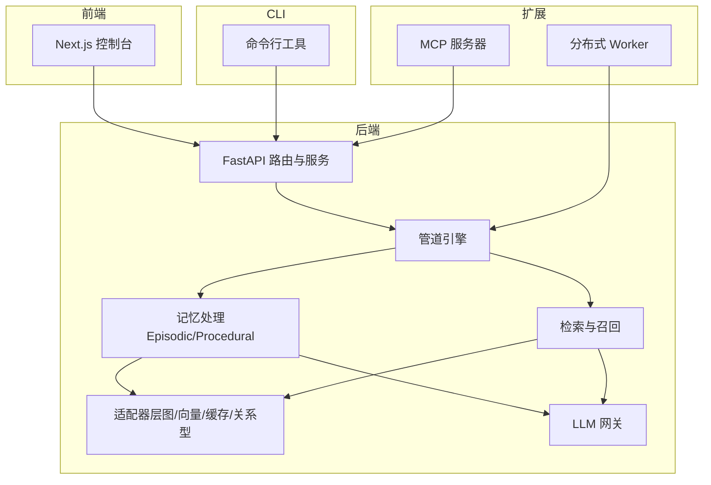
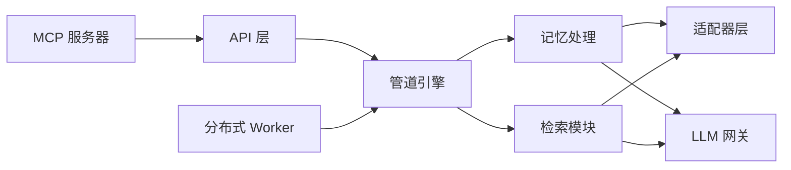

# 架构概览

<cite>
**本文引用的文件**
- [README.md](file://README.md)
- [__main__.py](file://m_flow/__main__.py)
- [app.py](file://m_flow/cli/app.py)
- [__init__.py](file://m_flow/api/v1/__init__.py)
- [server.py](file://m_flow-mcp/src/server.py)
- [app.py](file://mflow_workers/app.py)
- [get_graph_adapter.py](file://m_flow/adapters/graph/get_graph_adapter.py)
- [get_vector_adapter.py](file://m_flow/adapters/vector/get_vector_adapter.py)
- [__init__.py](file://m_flow/pipeline/__init__.py)
- [__init__.py](file://m_flow/memory/episodic/__init__.py)
- [__init__.py](file://m_flow/retrieval/__init__.py)
- [get_current_settings.py](file://m_flow/config/settings/get_current_settings.py)
- [__init__.py](file://m_flow/shared/context/__init__.py)
- [__init__.py](file://m_flow/core/domain/models/__init__.py)
- [LLMGateway.py](file://m_flow/llm/LLMGateway.py)
</cite>

## 目录
1. [简介](#简介)
2. [项目结构](#项目结构)
3. [核心组件](#核心组件)
4. [架构总览](#架构总览)
5. [详细组件分析](#详细组件分析)
6. [依赖分析](#依赖分析)
7. [性能考虑](#性能考虑)
8. [故障排除指南](#故障排除指南)
9. [结论](#结论)
10. [附录](#附录)

## 简介
本文件面向 M-flow 项目的架构概览，系统性阐述全栈架构设计，包括后端 FastAPI 服务、前端 Next.js 控制台、CLI 工具与分布式任务处理系统的协作关系；解释从“数据输入、提取、记忆、搜索”的完整数据流；明确 API 层、业务逻辑层、数据访问层的分层职责；介绍 MCP 服务器、Worker 系统等扩展组件的作用；并强调适配器模式在数据库与 LLM 集成中的应用，以及管道系统在数据处理中的关键作用。

## 项目结构
M-flow 采用多仓库协同的工程布局：
- m_flow：核心 Python 库与后端 API（FastAPI）
- m_flow-frontend：Next.js Web 控制台
- m_flow-mcp：Model Context Protocol 服务器
- mflow_workers：分布式执行辅助（Modal Workers）
- examples/docs/scripts：示例、文档与脚本

图表来源
- [README.md](file://README.md)
- [__main__.py](file://m_flow/__main__.py)
- [app.py](file://m_flow/cli/app.py)
- [__init__.py](file://m_flow/api/v1/__init__.py)
- [server.py](file://m_flow-mcp/src/server.py)
- [app.py](file://mflow_workers/app.py)

章节来源
- [README.md](file://README.md)
- [__main__.py](file://m_flow/__main__.py)
- [app.py](file://m_flow/cli/app.py)
- [__init__.py](file://m_flow/api/v1/__init__.py)
- [server.py](file://m_flow-mcp/src/server.py)
- [app.py](file://mflow_workers/app.py)

## 核心组件
- API 层（FastAPI）：提供统一的 REST 接口，承载路由、认证、权限与维护接口。
- 业务逻辑层：包含记忆处理（Episodic/Procedural）、检索与召回、流程编排与执行。
- 数据访问层：通过适配器模式对接多种图数据库、向量数据库、关系型数据库与缓存。
- LLM 层：统一 LLM 网关，支持不同后端（LiteLLM/Instructor、BAML）。
- 扩展组件：CLI 工具、MCP 服务器、分布式 Worker。

章节来源
- [__init__.py](file://m_flow/api/v1/__init__.py)
- [get_graph_adapter.py](file://m_flow/adapters/graph/get_graph_adapter.py)
- [get_vector_adapter.py](file://m_flow/adapters/vector/get_vector_adapter.py)
- [LLMGateway.py](file://m_flow/llm/LLMGateway.py)
- [__init__.py](file://m_flow/pipeline/__init__.py)
- [__init__.py](file://m_flow/memory/episodic/__init__.py)
- [__init__.py](file://m_flow/retrieval/__init__.py)

## 架构总览
M-flow 的数据流遵循“输入→提取→记忆→搜索”的闭环：数据经 CLI/前端/API 进入，通过管道与记忆模块进行结构化与图谱构建，随后在检索阶段结合图与向量能力进行路径成本评分与多粒度召回。

图表来源
- [README.md](file://README.md)
- [__init__.py](file://m_flow/pipeline/__init__.py)
- [__init__.py](file://m_flow/memory/episodic/__init__.py)
- [__init__.py](file://m_flow/retrieval/__init__.py)

## 详细组件分析

### 后端 API 层（FastAPI）
- 路由组织：按功能域拆分（add、memorize、search、ingest、pipeline 等），v1 作为主要版本入口。
- 维护接口：提供系统级维护能力，便于运维与诊断。
- 与前端/CLI 协作：统一对外接口，支撑控制台与命令行工具。

章节来源
- [__init__.py](file://m_flow/api/v1/__init__.py)

### CLI 工具
- 命令发现与延迟加载：减少启动开销，按需导入具体命令类。
- UI 启动：一键启动后端、前端与 MCP，统一端口管理与信号处理。
- 错误与调试：统一异常捕获、文档链接与调试开关。

章节来源
- [app.py](file://m_flow/cli/app.py)
- [__main__.py](file://m_flow/__main__.py)

### MCP 服务器
- 传输模式：支持 stdio、SSE、HTTP。
- 工具集：memorize、search、list_data、delete、prune、save_interaction、memorize_status 等。
- 任务追踪：后台任务注册与状态查询，避免静默失败。
- 与后端集成：通过客户端桥接后端 API，实现远程/本地两种模式。

章节来源
- [server.py](file://m_flow-mcp/src/server.py)

### 分布式 Worker
- 应用容器：Modal App 容器化封装，提供可靠消息投递、自动重试与死信队列。
- 任务类型：节点/边持久化、内存节点保存等排队任务。

章节来源
- [app.py](file://mflow_workers/app.py)

### 适配器层（数据库与 LLM）
- 图数据库适配：Kùzu、Neo4j、Amazon Neptune/Analytics 等，工厂方法按配置解析。
- 向量数据库适配：工厂方法根据上下文配置创建引擎。
- 关系型数据库适配：SQLAlchemy 封装，异步会话与迁移工具。
- 缓存适配：文件系统与 Redis 等缓存实现。
- LLM 网关：统一结构化抽取、文本补全、音频转录与图像描述，支持 BAML 与 LiteLLM/Instructor 后端切换。

章节来源
- [get_graph_adapter.py](file://m_flow/adapters/graph/get_graph_adapter.py)
- [get_vector_adapter.py](file://m_flow/adapters/vector/get_vector_adapter.py)
- [get_current_settings.py](file://m_flow/config/settings/get_current_settings.py)
- [LLMGateway.py](file://m_flow/llm/LLMGateway.py)

### 管道系统（Pipeline）
- 组合式阶段：Stage 抽象、任务执行、并行执行与工作流编排。
- 运行时上下文：通过上下文变量与显式参数传递状态，避免深层参数传递。
- 与 Worker 协同：分布式执行与消息队列，保障可靠性。

章节来源
- [__init__.py](file://m_flow/pipeline/__init__.py)
- [__init__.py](file://m_flow/shared/context/__init__.py)
- [app.py](file://mflow_workers/app.py)

### 记忆处理（Episodic/Procedural）
- Episodic：四层锥体图（Episode/Facet/FacetPoint/Entity）结构化存储与路由。
- Procedural：抽象流程与规则的记忆化，支持治理、身份、版本与安全。
- 内容路由与质量增强：句子级分类、别名合并、语义去重与大小检查。

章节来源
- [__init__.py](file://m_flow/memory/episodic/__init__.py)
- [__init__.py](file://m_flow/core/domain/models/__init__.py)

### 检索与召回
- 基础检索器：Lexical、Triplet Completion、Cypher、Graph 路由等。
- 记忆编排器：对 Episodic/Procedural 结果进行组合、建议与注入。
- 查询构建与格式化：针对不同模式生成查询与展示卡片。

章节来源
- [__init__.py](file://m_flow/retrieval/__init__.py)

## 依赖分析
- 分层解耦：API 层仅负责请求接入与调度，业务逻辑与数据访问通过适配器隔离。
- 适配器模式：数据库与 LLM 的后端可插拔，通过工厂方法与配置解析动态绑定。
- 管道与上下文：通过上下文变量与显式参数在流水线中传递状态，降低耦合。
- 扩展组件：MCP 与 Worker 作为独立进程，通过 API/消息队列与后端交互。

图表来源
- [get_graph_adapter.py](file://m_flow/adapters/graph/get_graph_adapter.py)
- [get_vector_adapter.py](file://m_flow/adapters/vector/get_vector_adapter.py)
- [LLMGateway.py](file://m_flow/llm/LLMGateway.py)
- [__init__.py](file://m_flow/pipeline/__init__.py)
- [server.py](file://m_flow-mcp/src/server.py)
- [app.py](file://mflow_workers/app.py)

## 性能考虑
- 异步与并发：管道与 LLM 调用采用异步与重试策略，提升吞吐与稳定性。
- 缓存与索引：向量与图数据库的索引与缓存策略直接影响检索性能。
- 任务分发：分布式 Worker 支持后台任务的可靠投递与重试，避免阻塞主流程。
- 配置快照：统一配置读取与 URL 构造，减少重复初始化成本。

## 故障排除指南
- MCP 任务状态查询：通过 memorize_status 获取后台任务最终结果，避免静默失败。
- HTTP 模式 prune 限制：API 模式下 prune 受权限与运行中管道限制，需正确设置管理员令牌与等待冷却。
- LLM 重试与限流：网关内置指数退避与速率限制，注意模型可用性与配额。
- CLI 调试：开启 --debug 输出完整堆栈，便于定位问题。

章节来源
- [server.py](file://m_flow-mcp/src/server.py)
- [LLMGateway.py](file://m_flow/llm/LLMGateway.py)

## 结论
M-flow 通过清晰的分层架构与适配器模式，实现了数据库与 LLM 的高可插拔性；通过管道系统与上下文管理，确保了复杂数据处理流程的可控与可观测；通过 MCP 与分布式 Worker，扩展了外部集成与大规模执行能力。整体设计兼顾准确性与可维护性，适用于企业级知识记忆与检索场景。

## 附录
- 快速启动与部署：参考根目录 README 的一键安装与 Docker Compose 使用说明。
- 开发与测试：提供开发环境搭建、测试运行与代码规范指引。

章节来源
- [README.md](file://README.md)