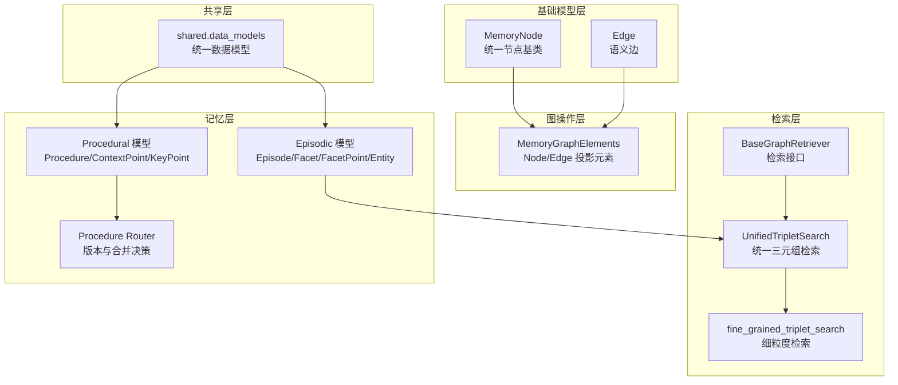
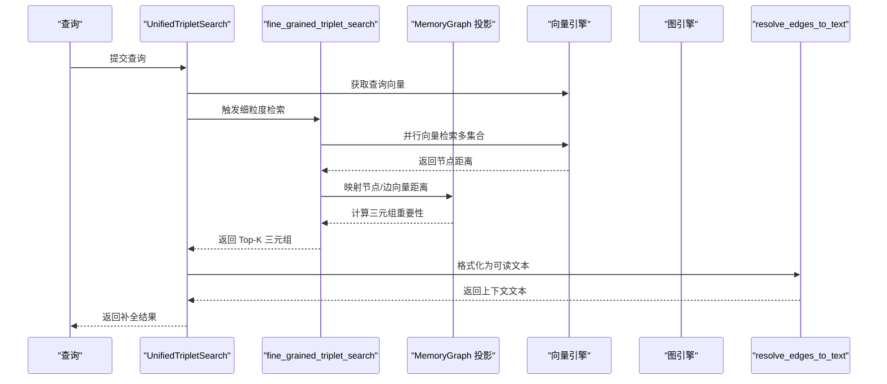
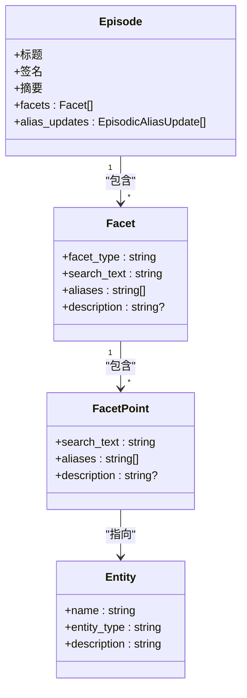
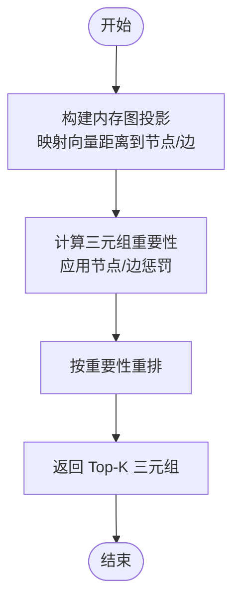
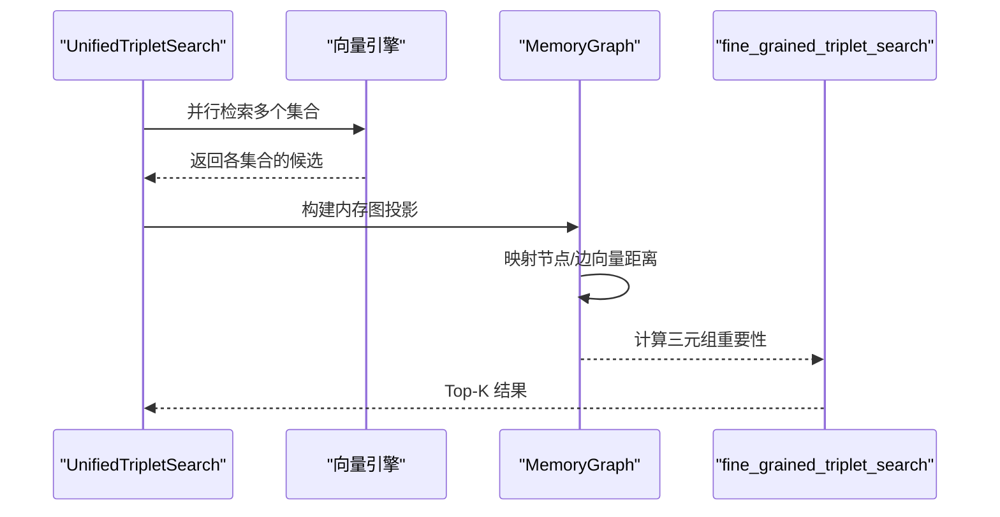
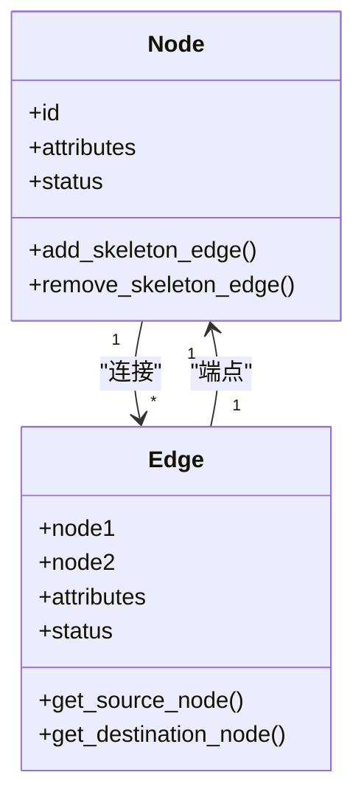
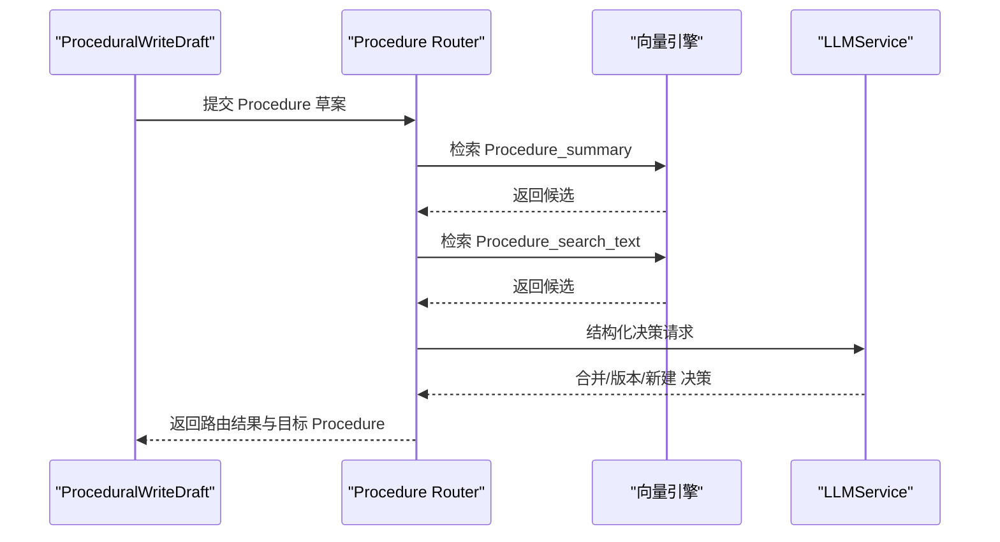
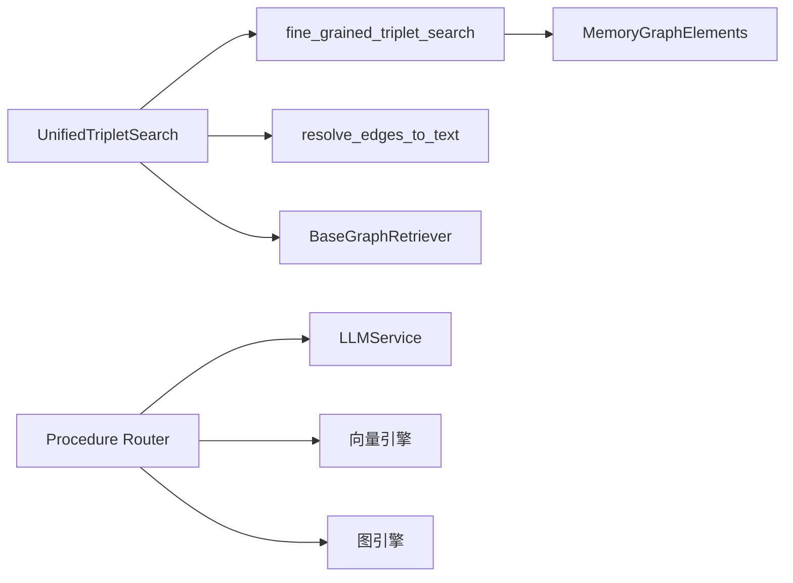

# 核心概念

<cite>
**本文引用的文件**
- [m_flow/core/models/MemoryNode.py](file://m_flow/core/models/MemoryNode.py)
- [m_flow/core/models/Edge.py](file://m_flow/core/models/Edge.py)
- [m_flow/knowledge/graph_ops/m_flow_graph/MemoryGraphElements.py](file://m_flow/knowledge/graph_ops/m_flow_graph/MemoryGraphElements.py)
- [m_flow/retrieval/base_graph_retriever.py](file://m_flow/retrieval/base_graph_retriever.py)
- [m_flow/retrieval/unified_triplet_search.py](file://m_flow/retrieval/unified_triplet_search.py)
- [m_flow/retrieval/utils/fine_grained_triplet_search.py](file://m_flow/retrieval/utils/fine_grained_triplet_search.py)
- [m_flow/knowledge/graph_ops/utils/resolve_edges_to_text.py](file://m_flow/knowledge/graph_ops/utils/resolve_edges_to_text.py)
- [m_flow/memory/episodic/models.py](file://m_flow/memory/episodic/models.py)
- [m_flow/memory/procedural/models.py](file://m_flow/memory/procedural/models.py)
- [m_flow/memory/procedural/procedure_router.py](file://m_flow/memory/procedural/procedure_router.py)
- [m_flow/shared/data_models.py](file://m_flow/shared/data_models.py)
</cite>

## 目录
1. [引言](#引言)
2. [项目结构](#项目结构)
3. [核心组件](#核心组件)
4. [架构总览](#架构总览)
5. [详细组件分析](#详细组件分析)
6. [依赖分析](#依赖分析)
7. [性能考量](#性能考量)
8. [故障排查指南](#故障排查指南)
9. [结论](#结论)
10. [附录](#附录)

## 引言
本篇“核心概念”旨在系统化阐释 M-flow 的知识图谱与检索体系：四层锥形图结构（Episode、Facet、FacetPoint、Entity）的层次关系与职责边界；图路由检索的工作原理（Typed Edges 与路径成本计算）；统一多粒度检索的协同机制；以及“语义边作为一等公民”的设计思想与“受控传播”的检索策略。文中提供可视化图表与示例路径，帮助读者从高层到细节全面掌握 M-flow 的设计理念。

## 项目结构
围绕“知识抽取—记忆锚定—检索生成”的主干流程，M-flow 在以下模块形成清晰分层：
- 基础模型层：统一的节点与边模型，支撑所有记忆类型
- 图操作层：内存投影、边/节点属性与状态管理
- 检索层：统一三元组检索、细粒度搜索、上下文格式化
- 记忆层：事件式 Episodic 与过程式 Procedural 的写入与路由
- 共享层：跨模块通用的数据模型与分类

**图表来源**
- [m_flow/core/models/MemoryNode.py:27-106](file://m_flow/core/models/MemoryNode.py#L27-L106)
- [m_flow/core/models/Edge.py:8-36](file://m_flow/core/models/Edge.py#L8-L36)
- [m_flow/knowledge/graph_ops/m_flow_graph/MemoryGraphElements.py:23-195](file://m_flow/knowledge/graph_ops/m_flow_graph/MemoryGraphElements.py#L23-L195)
- [m_flow/retrieval/base_graph_retriever.py:13-63](file://m_flow/retrieval/base_graph_retriever.py#L13-L63)
- [m_flow/retrieval/unified_triplet_search.py:29-306](file://m_flow/retrieval/unified_triplet_search.py#L29-L306)
- [m_flow/retrieval/utils/fine_grained_triplet_search.py:108-327](file://m_flow/retrieval/utils/fine_grained_triplet_search.py#L108-L327)
- [m_flow/memory/episodic/models.py:197-371](file://m_flow/memory/episodic/models.py#L197-L371)
- [m_flow/memory/procedural/models.py:154-210](file://m_flow/memory/procedural/models.py#L154-L210)
- [m_flow/memory/procedural/procedure_router.py:261-322](file://m_flow/memory/procedural/procedure_router.py#L261-L322)
- [m_flow/shared/data_models.py:171-225](file://m_flow/shared/data_models.py#L171-L225)

**章节来源**
- [m_flow/core/models/MemoryNode.py:27-106](file://m_flow/core/models/MemoryNode.py#L27-L106)
- [m_flow/core/models/Edge.py:8-36](file://m_flow/core/models/Edge.py#L8-L36)
- [m_flow/knowledge/graph_ops/m_flow_graph/MemoryGraphElements.py:23-195](file://m_flow/knowledge/graph_ops/m_flow_graph/MemoryGraphElements.py#L23-L195)
- [m_flow/retrieval/base_graph_retriever.py:13-63](file://m_flow/retrieval/base_graph_retriever.py#L13-L63)
- [m_flow/retrieval/unified_triplet_search.py:29-306](file://m_flow/retrieval/unified_triplet_search.py#L29-L306)
- [m_flow/retrieval/utils/fine_grained_triplet_search.py:108-327](file://m_flow/retrieval/utils/fine_grained_triplet_search.py#L108-L327)
- [m_flow/memory/episodic/models.py:197-371](file://m_flow/memory/episodic/models.py#L197-L371)
- [m_flow/memory/procedural/models.py:154-210](file://m_flow/memory/procedural/models.py#L154-L210)
- [m_flow/memory/procedural/procedure_router.py:261-322](file://m_flow/memory/procedural/procedure_router.py#L261-L322)
- [m_flow/shared/data_models.py:171-225](file://m_flow/shared/data_models.py#L171-L225)

## 核心组件
- 统一节点与边模型
  - 节点：具备类型、版本、元数据、向量字段索引能力，支持嵌入文本提取与版本推进
  - 边：承载权重、关系类型、属性与可选的边文本，默认从关系类型回填边文本
- 内存图元素
  - Node/Edge 为轻量对象，内置状态位向量用于多维/多租户过滤；支持骨架邻接与边管理
- 检索接口与统一三元组检索
  - BaseGraphRetriever 定义检索与补全的统一接口
  - UnifiedTripletSearch 自动发现向量集合，执行细粒度三元组检索，并可生成基于图上下文的补全
- 细粒度检索与投影
  - fine_grained_triplet_search 构建内存片段，映射向量距离到图节点/边，计算三元组重要性并重排
- 上下文格式化
  - resolve_edges_to_text 将边投影为人类可读文本，包含节点标题、内容与连接关系

**章节来源**
- [m_flow/core/models/MemoryNode.py:27-106](file://m_flow/core/models/MemoryNode.py#L27-L106)
- [m_flow/core/models/Edge.py:8-36](file://m_flow/core/models/Edge.py#L8-L36)
- [m_flow/knowledge/graph_ops/m_flow_graph/MemoryGraphElements.py:23-195](file://m_flow/knowledge/graph_ops/m_flow_graph/MemoryGraphElements.py#L23-L195)
- [m_flow/retrieval/base_graph_retriever.py:13-63](file://m_flow/retrieval/base_graph_retriever.py#L13-L63)
- [m_flow/retrieval/unified_triplet_search.py:29-306](file://m_flow/retrieval/unified_triplet_search.py#L29-L306)
- [m_flow/retrieval/utils/fine_grained_triplet_search.py:108-327](file://m_flow/retrieval/utils/fine_grained_triplet_search.py#L108-L327)
- [m_flow/knowledge/graph_ops/utils/resolve_edges_to_text.py:180-202](file://m_flow/knowledge/graph_ops/utils/resolve_edges_to_text.py#L180-L202)

## 架构总览
M-flow 的检索链路以“Typed Edges + 路径成本”为核心，结合统一多粒度检索与“语义边作为一等公民”的设计，实现可控、可解释、高精度的知识定位。

**图表来源**
- [m_flow/retrieval/unified_triplet_search.py:123-154](file://m_flow/retrieval/unified_triplet_search.py#L123-L154)
- [m_flow/retrieval/utils/fine_grained_triplet_search.py:108-327](file://m_flow/retrieval/utils/fine_grained_triplet_search.py#L108-L327)
- [m_flow/knowledge/graph_ops/utils/resolve_edges_to_text.py:180-202](file://m_flow/knowledge/graph_ops/utils/resolve_edges_to_text.py#L180-L202)

## 详细组件分析

### 四层锥形图结构：Episode、Facet、FacetPoint、Entity
- Episode（粗粒度锚点）
  - 作用：对一段内容进行主题化聚合，作为检索与展示的高层单元
  - 关键点：标题、签名、摘要、关联 Facet 列表、别名更新
- Facet（细节锚点）
  - 作用：在 Episode 内部进一步细化主题维度，作为精确定位的锚点
  - 关键点：facet_type、search_text、别名、描述
- FacetPoint（细粒度事实点）
  - 作用：在 Facet 下提取具体事实/声明，提供最细粒度的召回锚点
  - 关键点：search_text（短小精悍）、别名、可选解释
- Entity（实体）
  - 作用：与 FacetPoint 对应的事实载体，参与 Episode 的实体选择与描述
  - 关键点：名称、类型、上下文描述

**图表来源**
- [m_flow/memory/episodic/models.py:197-371](file://m_flow/memory/episodic/models.py#L197-L371)
- [m_flow/memory/procedural/models.py:154-210](file://m_flow/memory/procedural/models.py#L154-L210)

**章节来源**
- [m_flow/memory/episodic/models.py:197-371](file://m_flow/memory/episodic/models.py#L197-L371)
- [m_flow/memory/procedural/models.py:154-210](file://m_flow/memory/procedural/models.py#L154-L210)

### 图路由检索：Typed Edges 与路径成本
- Typed Edges（语义边）
  - Edge 模型承载关系类型、权重、属性与边文本，是检索与排序的“一等公民”
  - 默认从关系类型回填边文本，便于检索与展示
- 路径成本与投影
  - MemoryGraphElements 中的 Node/Edge 带有状态位向量与默认惩罚项，用于在投影阶段对未命中的节点/边施加成本
  - fine_grained_triplet_search 将向量距离映射到图元素，计算三元组重要性并重排
- 受控传播
  - 通过“骨架邻接”与“状态位”控制传播范围，避免随机游走，确保检索聚焦于相关子图

**图表来源**
- [m_flow/knowledge/graph_ops/m_flow_graph/MemoryGraphElements.py:23-195](file://m_flow/knowledge/graph_ops/m_flow_graph/MemoryGraphElements.py#L23-L195)
- [m_flow/retrieval/utils/fine_grained_triplet_search.py:273-316](file://m_flow/retrieval/utils/fine_grained_triplet_search.py#L273-L316)

**章节来源**
- [m_flow/core/models/Edge.py:8-36](file://m_flow/core/models/Edge.py#L8-L36)
- [m_flow/knowledge/graph_ops/m_flow_graph/MemoryGraphElements.py:23-195](file://m_flow/knowledge/graph_ops/m_flow_graph/MemoryGraphElements.py#L23-L195)
- [m_flow/retrieval/utils/fine_grained_triplet_search.py:273-316](file://m_flow/retrieval/utils/fine_grained_triplet_search.py#L273-L316)

### 统一多粒度检索：在同一个图中协同工作
- 集合自动发现
  - UnifiedTripletSearch 自动枚举所有 MemoryNode 子类的 index_fields，构造向量集合命名规则，实现“按字段自动索引”
- 多粒度协同
  - 检索同时覆盖 Episode 摘要、Entity 名称、关系类型等多粒度锚点，形成互补
  - 通过“宽搜 + 精排”策略，先在多个集合中广泛召回，再在内存图上重排
- 时间增强
  - 解析查询中的时间信息，对命中节点/边施加时间奖励，提升时序相关检索的准确性

**图表来源**
- [m_flow/retrieval/unified_triplet_search.py:100-121](file://m_flow/retrieval/unified_triplet_search.py#L100-L121)
- [m_flow/retrieval/utils/fine_grained_triplet_search.py:215-316](file://m_flow/retrieval/utils/fine_grained_triplet_search.py#L215-L316)

**章节来源**
- [m_flow/retrieval/unified_triplet_search.py:100-121](file://m_flow/retrieval/unified_triplet_search.py#L100-L121)
- [m_flow/retrieval/utils/fine_grained_triplet_search.py:215-316](file://m_flow/retrieval/utils/fine_grained_triplet_search.py#L215-L316)

### 语义边作为一等公民与受控传播
- 设计思想
  - 将关系视为可检索、可排序、可解释的信号，而非仅作拓扑连接
  - 通过 Edge 属性（如权重、关系类型、边文本）表达语义强度与方向
- 受控传播
  - 使用 Node/Edge 的状态位与骨架邻接，限定传播范围
  - 在投影阶段对未命中元素施加惩罚，使最终排序更偏向“被检索到的路径”

**图表来源**
- [m_flow/knowledge/graph_ops/m_flow_graph/MemoryGraphElements.py:23-195](file://m_flow/knowledge/graph_ops/m_flow_graph/MemoryGraphElements.py#L23-L195)

**章节来源**
- [m_flow/knowledge/graph_ops/m_flow_graph/MemoryGraphElements.py:23-195](file://m_flow/knowledge/graph_ops/m_flow_graph/MemoryGraphElements.py#L23-L195)

### 过程式记忆路由与版本管理
- 路由目标
  - 在新增 Procedure 时，自动检索相似 Procedure，决定“合并更新/新建版本/全新 Procedure”
- 决策流程
  - 向量检索 Procedure_summary 与 Procedure_search_text，得到候选列表
  - LLM 基于候选与新 Procedure 的对比，输出合并决策与目标 Procedure
- 版本演进
  - 保留旧版本，通过“supersedes”边建立版本追溯
  - 支持内容合并与摘要重建，保持检索一致性

**图表来源**
- [m_flow/memory/procedural/procedure_router.py:261-322](file://m_flow/memory/procedural/procedure_router.py#L261-L322)
- [m_flow/memory/procedural/models.py:154-210](file://m_flow/memory/procedural/models.py#L154-L210)

**章节来源**
- [m_flow/memory/procedural/procedure_router.py:261-322](file://m_flow/memory/procedural/procedure_router.py#L261-L322)
- [m_flow/memory/procedural/models.py:154-210](file://m_flow/memory/procedural/models.py#L154-L210)

## 依赖分析
- 组件耦合
  - UnifiedTripletSearch 依赖 BaseGraphRetriever 接口，确保检索行为一致
  - fine_grained_triplet_search 依赖 MemoryGraphElements 与向量引擎，负责投影与重排
  - resolve_edges_to_text 依赖 MemoryGraphElements 的边信息，负责上下文格式化
- 外部依赖
  - 向量引擎与图引擎通过适配器注入，支持多种后端
  - LLMService 用于结构化决策（Procedure 路由）

**图表来源**
- [m_flow/retrieval/unified_triplet_search.py:29-306](file://m_flow/retrieval/unified_triplet_search.py#L29-L306)
- [m_flow/retrieval/utils/fine_grained_triplet_search.py:108-327](file://m_flow/retrieval/utils/fine_grained_triplet_search.py#L108-L327)
- [m_flow/knowledge/graph_ops/utils/resolve_edges_to_text.py:180-202](file://m_flow/knowledge/graph_ops/utils/resolve_edges_to_text.py#L180-L202)
- [m_flow/retrieval/base_graph_retriever.py:13-63](file://m_flow/retrieval/base_graph_retriever.py#L13-L63)
- [m_flow/memory/procedural/procedure_router.py:261-322](file://m_flow/memory/procedural/procedure_router.py#L261-L322)

**章节来源**
- [m_flow/retrieval/unified_triplet_search.py:29-306](file://m_flow/retrieval/unified_triplet_search.py#L29-L306)
- [m_flow/retrieval/utils/fine_grained_triplet_search.py:108-327](file://m_flow/retrieval/utils/fine_grained_triplet_search.py#L108-L327)
- [m_flow/knowledge/graph_ops/utils/resolve_edges_to_text.py:180-202](file://m_flow/knowledge/graph_ops/utils/resolve_edges_to_text.py#L180-L202)
- [m_flow/retrieval/base_graph_retriever.py:13-63](file://m_flow/retrieval/base_graph_retriever.py#L13-L63)
- [m_flow/memory/procedural/procedure_router.py:261-322](file://m_flow/memory/procedural/procedure_router.py#L261-L322)

## 性能考量
- 向量检索并行化
  - 对多个集合并发调用向量引擎，缩短整体等待时间
- 宽搜精排
  - 先以较大 top_k 搜索，再在内存图上重排，兼顾召回与排序质量
- 投影阶段的成本控制
  - 未命中的节点/边施加惩罚，减少无关传播，降低排序噪声
- 时间增强
  - 仅在查询包含明确时间时启用，避免对非时序场景引入额外开销

[本节为通用性能讨论，不直接分析具体文件]

## 故障排查指南
- 查询为空或返回空
  - 检查图是否为空、集合是否存在、向量引擎初始化是否成功
  - 参考：统一检索与细粒度检索的空结果处理
- 向量集合缺失
  - 确认 MemoryNode 的 metadata.index_fields 是否正确配置，集合命名是否符合“类名_字段名”
- 时间增强无效
  - 确认所用向量引擎是否支持 where_filter；否则会忽略 memory_type_filter
- Procedure 路由失败
  - 检查向量检索候选数量与阈值设置；必要时回退到启发式策略

**章节来源**
- [m_flow/retrieval/unified_triplet_search.py:141-149](file://m_flow/retrieval/unified_triplet_search.py#L141-L149)
- [m_flow/retrieval/utils/fine_grained_triplet_search.py:318-327](file://m_flow/retrieval/utils/fine_grained_triplet_search.py#L318-L327)
- [m_flow/memory/procedural/procedure_router.py:251-259](file://m_flow/memory/procedural/procedure_router.py#L251-L259)

## 结论
M-flow 通过“四层锥形图结构 + Typed Edges + 受控传播”的组合，实现了从粗粒度 Episode 到细粒度 FacetPoint 的多层级定位；借助统一多粒度检索与语义边的一等公民地位，达成精确、可控、可解释的知识检索与生成。过程式记忆的路由与版本管理进一步保证了知识库的持续演进与稳定性。

[本节为总结性内容，不直接分析具体文件]

## 附录
- 示例路径参考（不展示代码内容，仅提供定位）
  - 统一检索入口：[m_flow/retrieval/unified_triplet_search.py:123-154](file://m_flow/retrieval/unified_triplet_search.py#L123-L154)
  - 细粒度检索实现：[m_flow/retrieval/utils/fine_grained_triplet_search.py:108-327](file://m_flow/retrieval/utils/fine_grained_triplet_search.py#L108-L327)
  - 上下文格式化：[m_flow/knowledge/graph_ops/utils/resolve_edges_to_text.py:180-202](file://m_flow/knowledge/graph_ops/utils/resolve_edges_to_text.py#L180-L202)
  - Episode/Facet/FacetPoint/Entity 模型：[m_flow/memory/episodic/models.py:197-371](file://m_flow/memory/episodic/models.py#L197-L371)
  - Procedure/ContextPoint/KeyPoint 模型：[m_flow/memory/procedural/models.py:154-210](file://m_flow/memory/procedural/models.py#L154-L210)
  - Procedure 路由与版本管理：[m_flow/memory/procedural/procedure_router.py:261-322](file://m_flow/memory/procedural/procedure_router.py#L261-L322)

[本节为附录性内容，不直接分析具体文件]