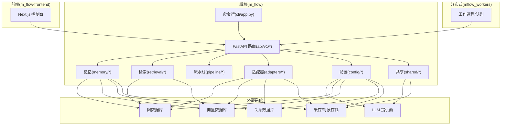
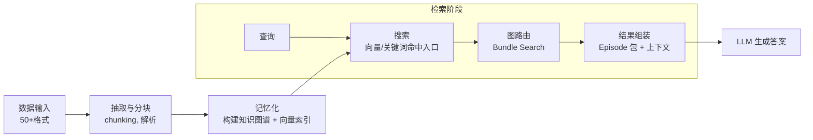
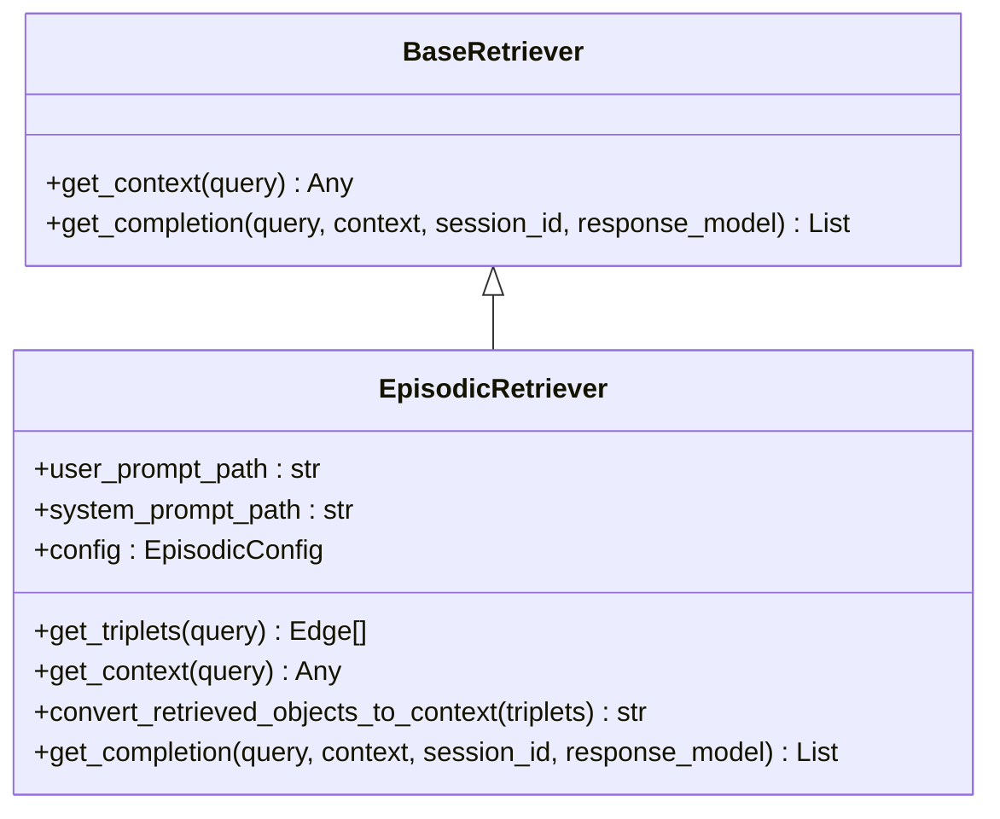
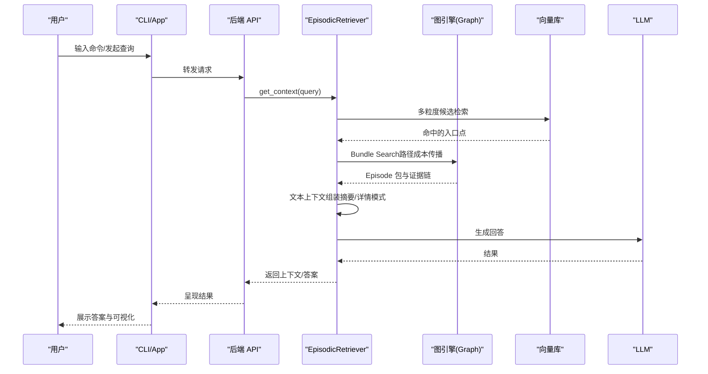
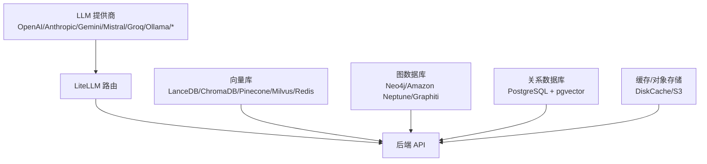

# 项目概述

<cite>
**本文引用的文件**
- [README.md](file://README.md)
- [__main__.py](file://m_flow/__main__.py)
- [base_config.py](file://m_flow/base_config.py)
- [version.py](file://m_flow/version.py)
- [models.py](file://m_flow/memory/episodic/models.py)
- [episodic_retriever.py](file://m_flow/retrieval/episodic_retriever.py)
- [app.py](file://m_flow/cli/app.py)
- [supported_databases.py](file://m_flow/adapters/vector/supported_databases.py)
- [supported_databases.py](file://m_flow/adapters/graph/supported_databases.py)
- [pyproject.toml](file://pyproject.toml)
- [get_settings.py](file://m_flow/config/settings/get_settings.py)
- [config.py](file://m_flow/llm/config.py)
- [base_retriever.py](file://m_flow/retrieval/base_retriever.py)
</cite>

## 目录
1. [引言](#引言)
2. [项目结构](#项目结构)
3. [核心组件](#核心组件)
4. [架构总览](#架构总览)
5. [详细组件分析](#详细组件分析)
6. [依赖关系分析](#依赖关系分析)
7. [性能考量](#性能考量)
8. [故障排查指南](#故障排查指南)
9. [结论](#结论)
10. [附录](#附录)

## 引言
M-flow 是一个面向真实应用的人工智能知识记忆系统，其核心愿景是“以认知记忆的方式组织知识”，在检索阶段由“图路由”替代“相似度匹配”，实现“路径成本驱动”的证据链评分。项目通过四层锥形图结构（Episode、Facet、FacetPoint、Entity）对知识进行分层建模，并在检索时以“锚定粒度”进入图谱，再沿语义加权边传播，最终返回由最强证据链支撑的知识包（Episode bundle）。相较传统 RAG 的向量相似度主导方式，M-flow 的优势在于：以图为核心评分引擎，强调“路径成本最小化”的一致性证据链，从而提升相关性与可解释性。

项目提供全栈能力：
- 后端：基于 FastAPI 的服务，提供检索、记忆、数据管理等接口
- 前端：Next.js 构建的 Web 控制台，支持交互式检索与可视化
- CLI：命令行工具，便于本地开发与自动化
- 分布式执行：支持 Modal 等平台的任务分发与持久化
- 多数据库适配：图数据库、向量库、关系型数据库、缓存等
- LLM 集成：通过 LiteLLM 统一路由，兼容 OpenAI、Anthropic、Gemini、Mistral、Groq、Ollama 等多家供应商

## 项目结构
从仓库布局可见，项目采用“按功能域划分”的模块化组织方式，核心目录与职责如下：
- m_flow：核心库与 API（api、cli、adapters、core、memory、retrieval、pipeline、auth、shared 等）
- m_flow-frontend：Next.js Web 控制台
- m_flow-mcp：Model Context Protocol 服务器
- mflow_workers：分布式执行辅助（Modal、队列、工作进程）
- examples/docs/scripts：示例、文档与脚本
- deployment：容器化与 Helm 部署模板

图表来源
- [pyproject.toml:30-73](file://pyproject.toml#L30-L73)
- [app.py:120-144](file://m_flow/cli/app.py#L120-L144)
- [base_config.py:47-103](file://m_flow/base_config.py#L47-L103)

章节来源
- [README.md:344-365](file://README.md#L344-L365)
- [pyproject.toml:1-323](file://pyproject.toml#L1-L323)

## 核心组件
- 四层锥形图结构（Episode/Facet/FacetPoint/Entity）
  - Episode：有边界的主题事件或流程，作为检索与回答的“知识包”
  - Facet：Episode 的一个主题切面（如“性能目标”）
  - FacetPoint：从 Facet 派生的原子断言或事实（如“P99 小于 500ms”）
  - Entity：命名实体（人、工具、指标），跨 Episode 连接
- 图路由检索（Bundle Search）
  - 查询先在多粒度上通过向量/关键词命中入口点，随后在图中按“路径成本”传播，最终以 Episode 为单位返回
- 多粒度统一检索
  - 不同粒度节点均可作为入口，系统自动选择最匹配的锚点并返回上层 Episode 包
- 语义边优先信号
  - 边上的自然语言描述（edge_text）参与检索与评分，使连接本身成为一阶信号
- 受控传播
  - 每次跳跃扩展上下文但增加成本，仅低代价、强一致的路径存活
- 自适应抗噪
  - 对宽泛匹配施加惩罚，结果由查询自适应调整重要性

章节来源
- [README.md:74-182](file://README.md#L74-L182)
- [models.py:148-321](file://m_flow/memory/episodic/models.py#L148-L321)
- [episodic_retriever.py:130-182](file://m_flow/retrieval/episodic_retriever.py#L130-L182)

## 架构总览
下图展示了从数据输入到检索输出的端到端流程，以及与外部系统的交互：

图表来源
- [README.md:328-342](file://README.md#L328-L342)
- [episodic_retriever.py:168-182](file://m_flow/retrieval/episodic_retriever.py#L168-L182)

## 详细组件分析

### 记忆与检索核心类关系

图表来源
- [base_retriever.py:11-61](file://m_flow/retrieval/base_retriever.py#L11-L61)
- [episodic_retriever.py:130-317](file://m_flow/retrieval/episodic_retriever.py#L130-L317)

章节来源
- [base_retriever.py:11-61](file://m_flow/retrieval/base_retriever.py#L11-L61)
- [episodic_retriever.py:130-317](file://m_flow/retrieval/episodic_retriever.py#L130-L317)

### 检索流程（序列图）

图表来源
- [episodic_retriever.py:168-317](file://m_flow/retrieval/episodic_retriever.py#L168-L317)
- [app.py:231-271](file://m_flow/cli/app.py#L231-L271)

章节来源
- [episodic_retriever.py:168-317](file://m_flow/retrieval/episodic_retriever.py#L168-L317)
- [app.py:231-271](file://m_flow/cli/app.py#L231-L271)

### 四层锥形图结构（流程图）

图表来源
- [README.md:74-117](file://README.md#L74-L117)
- [models.py:148-235](file://m_flow/memory/episodic/models.py#L148-L235)

章节来源
- [README.md:74-117](file://README.md#L74-L117)
- [models.py:148-235](file://m_flow/memory/episodic/models.py#L148-L235)

## 依赖关系分析
- 技术栈概览
  - Web 与 API：FastAPI、Uvicorn、WebSockets、aiohttp
  - LLM 与提示：OpenAI、LiteLLM、Instructor、tiktoken
  - 数据与存储：SQLAlchemy、Alembic、LanceDB、Kùzu、PyLance、DiskCache
  - 文档处理：PyPDF、Jinja2、filetype
  - 可观测性：tenacity、aiolimiter、limits、structlog
  - 工具：python-dotenv、typing_extensions、python-magic-bin
- LLM 提供商集成
  - 通过 LiteLLM 统一路由，支持 OpenAI、Anthropic、Gemini、Mistral、Groq、Ollama、HuggingFace、Cohere、DeepSeek、Qwen、Doubao 等
- 数据库适配器
  - 图数据库：Neo4j、Amazon Neptune、Graphiti
  - 关系数据库：PostgreSQL + pgvector（含二进制驱动）
  - 向量库：LanceDB、ChromaDB、Redis、Pinecone、Milvus
  - 缓存与对象存储：DiskCache、S3（通过环境变量与路径推断）

图表来源
- [pyproject.toml:38-147](file://pyproject.toml#L38-L147)
- [get_settings.py:70-105](file://m_flow/config/settings/get_settings.py#L70-L105)
- [config.py:38-93](file://m_flow/llm/config.py#L38-L93)

章节来源
- [pyproject.toml:38-147](file://pyproject.toml#L38-L147)
- [get_settings.py:70-105](file://m_flow/config/settings/get_settings.py#L70-L105)
- [config.py:38-93](file://m_flow/llm/config.py#L38-L93)

## 性能考量
- 检索路径成本控制
  - 通过“受控传播”限制每次跳跃的成本，避免无序游走，提高检索稳定性与准确性
- 多粒度入口与自适应
  - 宽泛匹配被惩罚，窄粒度入口优先，结合查询动态调整节点/边权重
- 缓存与会话历史
  - 支持会话级对话历史缓存与摘要缓存，减少重复计算
- 并行与异步
  - 检索与 LLM 生成使用异步并发，提升吞吐

章节来源
- [README.md:168-182](file://README.md#L168-L182)
- [episodic_retriever.py:281-316](file://m_flow/retrieval/episodic_retriever.py#L281-L316)

## 故障排查指南
- 版本与启动
  - 使用命令行入口运行包：[__main__.py:10-18](file://m_flow/__main__.py#L10-L18)
  - 获取版本信息：[version.py:16-47](file://m_flow/version.py#L16-L47)
- 配置与密钥
  - LLM 配置加载与校验：[config.py:38-209](file://m_flow/llm/config.py#L38-L209)
  - 设置读取与 UI 显示：[get_settings.py:123-151](file://m_flow/config/settings/get_settings.py#L123-L151)
- 基础路径与可观测性
  - 数据/系统/缓存/日志根目录与 Langfuse 集成：[base_config.py:47-121](file://m_flow/base_config.py#L47-L121)
- CLI 行为
  - 子命令注册与 UI 启动逻辑：[app.py:71-224](file://m_flow/cli/app.py#L71-L224)

章节来源
- [__main__.py:10-18](file://m_flow/__main__.py#L10-L18)
- [version.py:16-47](file://m_flow/version.py#L16-L47)
- [config.py:38-209](file://m_flow/llm/config.py#L38-L209)
- [get_settings.py:123-151](file://m_flow/config/settings/get_settings.py#L123-L151)
- [base_config.py:47-121](file://m_flow/base_config.py#L47-L121)
- [app.py:71-224](file://m_flow/cli/app.py#L71-L224)

## 结论
M-flow 通过“图路由检索”和“四层锥形图结构”，将传统 RAG 的“相似度匹配”升级为“路径成本优化”，在多粒度统一检索与语义边优先信号的加持下，显著提升了检索的相关性与可解释性。项目在工程层面提供了完善的全栈能力与多数据库/LLM生态集成，适合在需要长期记忆、复杂推理与可解释问答的场景中落地。

## 附录
- 快速开始与一键部署
  - Docker 一键启动与本地安装参考：[README.md:274-327](file://README.md#L274-L327)
- 示例与基准
  - 示例脚本与评测方法参考：[README.md:218-257](file://README.md#L218-L257)
- 项目布局与模块职责
  - 项目结构概览：[README.md:344-365](file://README.md#L344-L365)